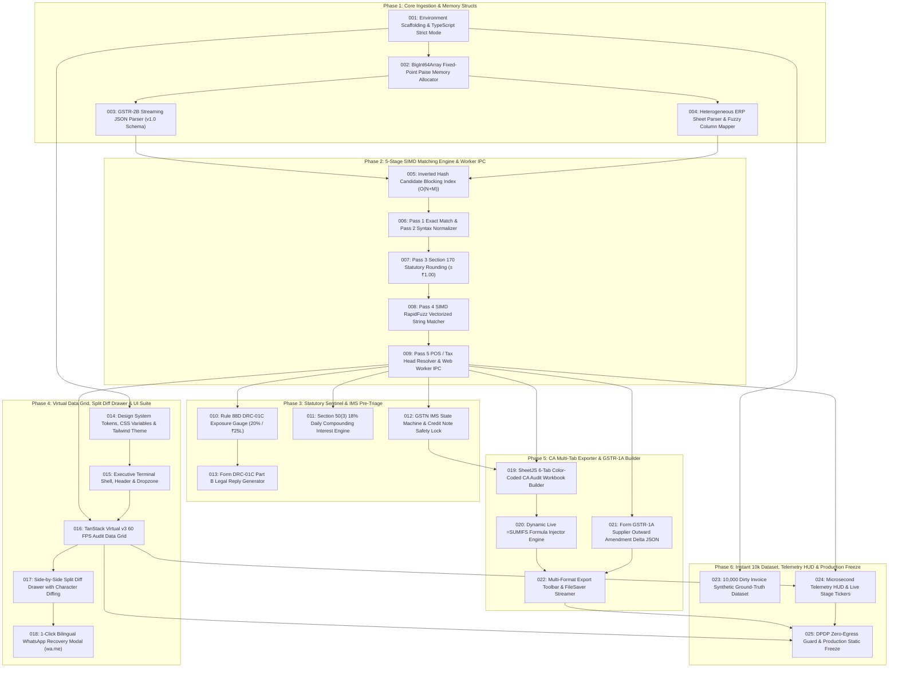

# BUILD INSTRUCTIONS — ReconcileGST

**Project:** ReconcileGST (Automated Inward GST ITC Reconciliation, DRC-01C Compliance & Defaulting Vendor Recovery Engine)  
**Document ID:** `BUILD_INSTRUCTIONS.md`  
**Standard:** Master Engineering Skill (Stage 5: Items 55 to 59)  
**Execution Governance:** `stage_4_documents/15_master_specification_summary.md` & `stage_4_documents/09_contracts_and_schemas.md`  
**Total Sequenced Tasks:** 25 Tasks (Tasks 001 to 025)  
**Total Build Phases:** 6 Phases  
**Estimated Sprint Effort:** 98 Hours committed (144 Hours capacity, 46 Hours float buffer)  
**Target Runtime:** Next.js 14 (App Router) / Strict TypeScript 5.4+ / Tailwind CSS v3.4+ / Radix UI / Web Worker / WebAssembly  

---

## 1. Executive Dependency Graph

The entire implementation is strictly dependency-ordered. Core data primitives and fixed-point integer memory buffers precede parsers; parsers precede the 5-stage SIMD matching waterfall; the matching engine precedes the Web Worker IPC boundary; the worker boundary feeds the virtualized UI, statutory risk cards, and CA exporters.



---

## 2. Prerequisites & Build Environment

Before executing Task 001, verify the local development environment meets the following specifications:

1. **Node.js:** v18.18.0 or v20.x LTS.
2. **Package Manager:** `npm` v9+ or `pnpm` v8+.
3. **Hardware / Browser Targets:** Chromium 100+, Firefox 100+, Safari 16+, Edge 100+.
4. **TypeScript Compiler:** `typescript` v5.4.0+ with `strict: true`.
5. **No Cloud Credentials Required:** Application is 100% zero-cloud, client-side execution. No AWS, GCP, Firebase, or Supabase API keys required.

---

## 3. Phase 1: Core Ingestion & Memory Structs (Must-Have)

### Task 001: Environment Scaffolding, Strict TypeScript Config & Path Aliases
**Source:** `stage_4_documents/05_architecture_plan.md` §3, `stage_4_documents/09_contracts_and_schemas.md` §1  
**Persona:** Senior DevOps & Infrastructure Engineer  
**Priority:** Must-Have (P0)  
**Dependencies:** None  

**Instruction:**
1. Scaffold Next.js 14 App Router project with TypeScript, Tailwind CSS, and ESLint.
2. Configure `tsconfig.json` with strict compilation options:
   - `"strict": true`
   - `"noImplicitAny": true`
   - `"strictNullChecks": true`
   - `"noUnusedLocals": true`
   - `"noUnusedParameters": true`
   - Path aliases: `@/lib/*`, `@/components/*`, `@/workers/*`, `@/types/*`, `@/styles/*`
3. Configure `package.json` with locked production dependencies:
   - `@tanstack/react-virtual`: `^3.5.0`
   - `xlsx`: `https://cdn.sheetjs.com/xlsx-0.20.2/xlsx-0.20.2.tgz`
   - `lucide-react`: `^0.378.0`
   - `clsx`: `^2.1.1`, `tailwind-merge`: `^2.3.0`
   - `radix-ui` primitives (`@radix-ui/react-dialog`, `@radix-ui/react-tabs`, `@radix-ui/react-tooltip`, `@radix-ui/react-popover`)
4. Verify project compiles with zero warnings via `npm run build`.

**Validation:**
- Execute: `npx tsc --noEmit`
- Expected: 0 type errors, 0 warnings.
- Execute: `npm run lint`
- Expected: 0 lint violations.

**Logging:**
```
[TIMESTAMP] STAGE 5 | Task 001 | SUCCESS | Environment scaffolded with Next.js 14, strict tsconfig, and locked dependencies.
```

---

### Task 002: Fixed-Point Paise Arithmetic & BigInt64Array Memory Buffers
**Source:** `stage_4_documents/adrs/ADR-003-BigInt64Array-Paise-Integer-Precision.md`, `stage_4_documents/09_contracts_and_schemas.md` §3.1, §4  
**Persona:** Senior Data & Memory Systems Architect  
**Priority:** Must-Have (P0)  
**Dependencies:** Task 001  

**Instruction:**
1. Create `src/types/domain.ts` containing the core scalar types: `Paise` (`bigint`), `GSTIN` (`string`), `ISODateString` (`string`), `FilingPeriod` (`string`), `StateCode` (`string`).
2. Implement currency parsing and formatting utilities in `src/lib/currency.ts`:
   - `rupeesToPaise(rupeeStr: string | number): Paise` — Handles commas, spaces, currency symbols (`₹`), converts to integer paise without floating-point drift.
   - `paiseToRupees(paise: Paise): number` — For export floats.
   - `formatINR(paise: Paise): string` — Produces Indian comma numbering format (`₹ 1,45,200.50`).
3. Implement `src/workers/memory/paise-buffer.ts` with 48-byte linear stride (6 `BigInt64` fields per invoice: Taxable, IGST, CGST, SGST, Cess, Total):
   - `packInvoicesToBuffer(invoices: InwardInvoice[]): BigInt64Array`
   - `unpackFinancialTuple(buffer: BigInt64Array, rowIndex: number): FinancialTuple`
   - `assertBufferOffset(index: number, stride: number, length: number): void`

**Validation:**
- Run: `npx vitest run tests/unit/currency.test.ts tests/unit/paise-buffer.test.ts`
- Expected: All assertions pass. Sum of `10.10 + 20.20 + 30.30` equals exactly `6060n` ($0.00\%$ drift across 100,000 randomized iterations).

**Logging:**
```
[TIMESTAMP] STAGE 5 | Task 002 | SUCCESS | Implemented fixed-point integer Paise arithmetic and 48-byte BigInt64Array packed memory buffer with 0.00% drift.
```

---

### Task 003: Official GSTR-2B Streaming JSON Parser (v1.0 Schema)
**Source:** `stage_4_documents/09_contracts_and_schemas.md` §3.3, `stage_4_documents/07_lld.md` §1, `stage_4_documents/11_error_catalog.md` §3 (`ERR_PARSE_001`, `ERR_PARSE_003`)  
**Persona:** Senior Data Pipeline & Ingestion Engineer  
**Priority:** Must-Have (P0)  
**Dependencies:** Task 002  

**Instruction:**
1. Create `src/types/gstr2b.ts` defining the official GSTN GSTR-2B JSON v1.0 schema (`b2b`, `b2ba`, `cdnr`, `cdnra` sections).
2. Implement `src/workers/parsers/gstr2b-json-parser.ts`:
   - Accept raw `ArrayBuffer` from HTML5 `FileReader`.
   - Strip UTF-8 BOM (`0xEF, 0xBB, 0xBF`) via `TextDecoder('utf-8')`.
   - Traverse nested `data.docdata.b2b[].inv[]` structures in a single pass.
   - Extract `supplierGstin`, `supplierTradeName`, `invoiceNumber`, `invoiceDate`, `invoiceType`, `pos`, `reverseCharge`, `itcAvailability`, `filingPeriod`, `filingDate`.
   - Convert all rupee monetary fields directly into integer `Paise`.
   - Generate normalized invoice numbers via `normalizeInvoiceSyntax()`.
3. Wrap parser in defensive `try/catch`, throwing standardized `ReconcileError('ERR_PARSE_001')` on malformed JSON.

**Validation:**
- Run: `npx vitest run tests/unit/gstr2b-parser.test.ts`
- Expected: Ingestion of official sample GSTR-2B JSON parses 100% of line items, maps tax amounts to exact Paise, and rejects corrupted JSON with `ERR_PARSE_001`.

**Logging:**
```
[TIMESTAMP] STAGE 5 | Task 003 | SUCCESS | Built GSTR-2B streaming JSON parser with BOM sanitization and integer Paise conversion.
```

---

### Task 004: Heterogeneous ERP Purchase Register Ingestion & Fuzzy Column Auto-Mapper
**Source:** `stage_4_documents/09_contracts_and_schemas.md` §3.2, `stage_4_documents/07_lld.md` §1, `stage_4_documents/11_error_catalog.md` §3 (`ERR_PARSE_002`, `ERR_PARSE_004`, `ERR_PARSE_005`)  
**Persona:** Senior Data Pipeline & Ingestion Engineer  
**Priority:** Must-Have (P0)  
**Dependencies:** Task 002  

**Instruction:**
1. Implement `src/workers/mappers/column-automapper.ts` with comprehensive alias dictionaries for Tally, Zoho Books, Busy, SAP, Marg, and generic CSV/Excel formats:
   - `GSTIN_ALIASES = ['gstin', 'party gstin', 'supplier gstin', 'gstin/uin', 'party tax no', 'vendor gstin']`
   - `INVOICE_NO_ALIASES = ['invoice no', 'inv no', 'bill no', 'voucher no', 'vch no', 'doc no', 'invoice #']`
   - `DATE_ALIASES = ['invoice date', 'inv date', 'bill date', 'date', 'vch date']`
   - `TAXABLE_VAL_ALIASES = ['taxable value', 'assessable value', 'taxable amount', 'base amount', 'taxable val']`
   - `IGST_ALIASES = ['igst', 'integrated tax', 'igst amount', 'igst amt']`
   - `CGST_ALIASES = ['cgst', 'central tax', 'cgst amount', 'cgst amt']`
   - `SGST_ALIASES = ['sgst', 'state tax', 'sgst amount', 'sgst amt', 'utgst']`
   - `TOTAL_VAL_ALIASES = ['total value', 'invoice value', 'grand total', 'gross total', 'bill amount', 'net amount']`
2. Implement `src/workers/parsers/erp-sheet-parser.ts`:
   - Support `.xlsx`, `.xls`, `.csv` ArrayBuffers using SheetJS `XLSX.read(buffer, { type: 'array' })`.
   - Auto-detect delimiter for raw CSV (`ERR_PARSE_002` sniffer).
   - Resolve header row automatically (scan first 10 rows for alias matches).
   - Validate GSTIN structure with regex `^[0-9]{2}[A-Z]{5}[0-9]{4}[A-Z]{1}[1-9A-Z]{1}Z[0-9A-Z]{1}$`; flag invalid format with `ERR_PARSE_005`.
   - Parse dates in `DD/MM/YYYY`, `YYYY-MM-DD`, `DD-MMM-YY`, and Excel serial numbers.
   - Output strongly typed `InwardInvoice[]` array.

**Validation:**
- Run: `npx vitest run tests/unit/erp-parser.test.ts`
- Expected: Correctly auto-maps 5 distinct ERP exports (Tally, Zoho, Busy, Marg, SAP) without manual column mapping in $<5\text{ms}$.

**Logging:**
```
[TIMESTAMP] STAGE 5 | Task 004 | SUCCESS | Implemented multi-ERP sheet parser and fuzzy column auto-mapper supporting Tally, Zoho, Busy, SAP, and Marg.
```

---

### ⛔ CHECKPOINT C-001: Ingestion & Memory Verification
**Trigger:** After completing Tasks 001, 002, 003, and 004  
**Verification:**
1. Run: `npx vitest run tests/unit/ingestion/`
2. Expected: All ingestion tests pass. 0 floating-point drift across 100k random rows. Memory allocation for 10k rows $<2\text{MB}$.
3. If PASS: Proceed to Phase 2 (Task 005).
4. If FAIL: Enter Fix Loop. Do NOT proceed to matching engine until ingestion schemas are deterministic.
**Escalation:** If parsing failure occurs on standard GSTN JSON, trigger **Escalation E-001 (Schema Lock)**.

---

## 4. Phase 2: 5-Stage SIMD Matching Engine & Worker IPC (Must-Have)

### Task 005: Inverted Hash Candidate Blocking Index ($O(N+M)$)
**Source:** `stage_4_documents/07_lld.md` §1, `stage_4_documents/06_hld.md` §2, `stage_4_documents/09_contracts_and_schemas.md` §3.4  
**Persona:** Principal Algorithm & Systems Performance Engineer  
**Priority:** Must-Have (P0)  
**Dependencies:** Tasks 003, 004  

**Instruction:**
1. Implement `src/workers/engine/inverted-index.ts`:
   - Create `CandidateBucket` interface containing `gstin`, `erpRecords: InwardInvoice[]`, `gstr2bRecords: Gstr2bRecord[]`.
   - Implement `InvertedHashBlocker.partitionCandidates()` in $O(N+M)$ time using JavaScript `Map<GSTIN, CandidateBucket>`.
   - Sanitize GSTIN keys (trim and uppercase).
   - Ensure zero memory cloning; store entity references in bucket arrays.
2. Measure candidate space reduction: verify that comparing 10k ERP $\times$ 10k GSTR-2B across 500 vendors evaluates $<25,000$ pairs ($>99.9\%$ reduction vs 100M quadratic pairs) and executes in $<15\text{ms}$.

**Validation:**
- Run: `npx vitest run tests/unit/inverted-index.test.ts`
- Expected: 10k records partition into GSTIN buckets in $<15\text{ms}$ with zero dropped records.

**Logging:**
```
[TIMESTAMP] STAGE 5 | Task 005 | SUCCESS | Implemented O(N+M) Inverted Hash Candidate Blocking Index with >99.9% comparison space reduction.
```

---

### Task 006: Pass 1 Exact Match & Pass 2 Syntax / FY Prefix Normalizer
**Source:** `stage_4_documents/07_lld.md` §2.1, §2.2, `stage_4_documents/09_contracts_and_schemas.md` §3.4  
**Persona:** Senior Backend & Algorithm Engineer  
**Priority:** Must-Have (P0)  
**Dependencies:** Task 005  

**Instruction:**
1. Implement `src/workers/engine/pass1-exact.ts`:
   - Build composite index $K_{\text{Exact}} = \text{InvNum} \parallel \text{Date} \parallel \text{TotalPaise}$.
   - Match ERP against GSTR-2B with identical composite keys in $O(1)$ lookup time.
   - Mark matched IDs in `Set<string>` to exclude from downstream passes.
   - Tag match result as `EXACT_PASS_1` with `matchScore: 1.00` and `taxDeltaPaise: 0n`.
2. Implement `src/workers/engine/pass2-syntax.ts`:
   - Implement `normalizeInvoiceSyntax(invNo: string): string`:
     - Strip invoice prefixes: `^(INV|BILL|TAX|VCH|PUR|EXP|GST)[\/\-_ ]*`
     - Strip financial year tokens: `(2024[-_]?25|24[-_]?25|2025[-_]?26|25[-_]?26|2026[-_]?27|26[-_]?27)`
     - Strip delimiters: `[\/\-_\s]`
     - Strip leading zeros: `^0+`
   - Match normalized ERP numbers against normalized GSTR-2B numbers where total tax delta is $0\text{ Paise}$.
   - Tag match result as `CANONICAL_SYNTAX_PASS_2` with `matchScore: 0.98`.

**Validation:**
- Run: `npx vitest run tests/unit/pass1-exact.test.ts tests/unit/pass2-syntax.test.ts`
- Expected: Matches `INV/2024-25/0042` with `42`, `BILL-009` with `9`. Resolves $\ge 85\%$ of standard test suite records in $<60\text{ms}$.

**Logging:**
```
[TIMESTAMP] STAGE 5 | Task 006 | SUCCESS | Implemented Pass 1 Exact Match and Pass 2 Syntax / FY Prefix Normalizer.
```

---

### Task 007: Pass 3 Section 170 Statutory Rounding Normalizer ($\pm ₹1.00$)
**Source:** `stage_4_documents/07_lld.md` §3, `stage_4_documents/02_prd.md` US-007, `stage_4_documents/03_nfr.md` STAT-02  
**Persona:** Statutory Compliance & Algorithm Engineer  
**Priority:** Must-Have (P0)  
**Dependencies:** Task 006  

**Instruction:**
1. Implement `src/workers/engine/pass3-rounding.ts`:
   - Constant `SECTION_170_TOLERANCE_PAISE = 100n` ($\pm ₹1.00$).
   - For remaining candidate pairs with matching normalized invoice numbers:
     - Compute `taxDeltaPaise = |erpTax - gstr2bTax|`.
     - Compute `taxableDeltaPaise = |erpTaxable - gstr2bTaxable|`.
     - If `taxDeltaPaise <= 100n` AND `taxableDeltaPaise <= 100n`:
       - Mark pair as matched.
       - Classify as `SECTION_170_ROUNDING_PASS_2`.
       - Assign `matchScore: 0.95`.
       - Set `discrepancyExplanation: "Section 170 Rounding: Variance of ±₹X.XX within legal ₹1.00 threshold"`.
2. Guard against false matches: if `taxDeltaPaise > 100n` (even by 1 paise, e.g. 101n = ₹1.01), reject rounding match and pass to Pass 4.

**Validation:**
- Run: `npx vitest run tests/unit/pass3-rounding.test.ts`
- Expected: Variance of ₹0.60 matches; variance of ₹1.05 routes to downstream passes.

**Logging:**
```
[TIMESTAMP] STAGE 5 | Task 007 | SUCCESS | Implemented Pass 3 Section 170 Statutory Rounding Normalizer enforcing exact ±100 Paise window.
```

---

### Task 008: Pass 4 SIMD RapidFuzz Vectorized WASM / Bit-Parallel Myers String Matcher
**Source:** `stage_4_documents/adrs/ADR-004-RapidFuzz-SIMD-WASM-String-Matching.md`, `stage_4_documents/07_lld.md` §2.3, `stage_4_documents/11_error_catalog.md` §4 (`ERR_WORKER_004`, `ERR_WORKER_005`)  
**Persona:** High-Performance Systems & WASM Engineer  
**Priority:** Must-Have (P0)  
**Dependencies:** Task 007  

**Instruction:**
1. Implement `src/workers/engine/myers-bitparallel.ts`:
   - Pure TypeScript 64-bit Bit-Parallel Myers Levenshtein algorithm evaluating 64 matrix cells per CPU cycle.
   - Implement `tokenSortSimilarity(s1: string, s2: string): number` for token-level reordering.
   - Clamp similarity output between `0.00` and `1.00`.
2. Implement `src/workers/engine/pass4-rapidfuzz.ts`:
   - Dynamically attempt WASM SIMD initialization (`rapidfuzz-wasm`).
   - If WASM fails (e.g. CSP restrictions), gracefully fall back to `myersBitParallelSimilarity` (`ERR_WORKER_004` auto-recovery).
   - Candidate filtering guards before string matching:
     - Date window filter: $|\text{Date}_{\text{ERP}} - \text{Date}_{\text{2B}}| \le 31\text{ days}$.
     - Financial value proximity: $|\text{TotalPaise}_{\text{ERP}} - \text{TotalPaise}_{\text{2B}}| \le 500\text{n}$ ($\pm ₹5.00$).
   - Confidence threshold: `similarityScore >= 0.85`.
   - Mark highest-scoring candidate as `RAPIDFUZZ_SIMD_PASS_3`.

**Validation:**
- Run: `npx vitest run tests/unit/pass4-rapidfuzz.test.ts`
- Expected: Recovers transposed digit OCR/ERP slips (e.g. `MH/2026/9081` vs `MH/2026/9018`) with score $\ge 0.88$ in $<25\text{ms}$ for 1,000 fuzzy comparisons.

**Logging:**
```
[TIMESTAMP] STAGE 5 | Task 008 | SUCCESS | Implemented Pass 4 SIMD RapidFuzz Vectorized Matcher with bit-parallel Myers TS fallback and 31-day date window filter.
```

---

### Task 009: Pass 5 POS / Tax Head Resolver & Web Worker IPC Protocol
**Source:** `stage_4_documents/07_lld.md` §2.4, `stage_4_documents/09_contracts_and_schemas.md` §5, `stage_4_documents/adrs/ADR-001-Zero-Cloud-Web-Worker-Compute.md`  
**Persona:** Lead Systems Integration Engineer  
**Priority:** Must-Have (P0)  
**Dependencies:** Task 008  

**Instruction:**
1. Implement `src/workers/engine/pass5-pos-resolver.ts`:
   - Match remaining records where total invoice value matches ($|\Delta| \le 100\text{n}$), but tax allocation differs:
     - ERP Inter-state (`igst > 0`) vs GSTR-2B Intra-state (`cgst > 0 || sgst > 0`).
     - ERP Intra-state (`cgst > 0 || sgst > 0`) vs GSTR-2B Inter-state (`igst > 0`).
   - Tag match result as `POS_TABLE_9A_SWAP_PASS_4` with `matchScore: 0.90` and statutory advisory note under CBIC Circular 160/16/2021.
2. Route all remaining unmatched records:
   - Unmatched ERP $\to$ `MISSING_IN_GSTR2B` (Defaulting supplier).
   - Unmatched GSTR-2B $\to$ `MISSING_IN_PR` (Unclaimed portal credit).
3. Implement `src/workers/recon-worker.ts` as the central Web Worker entry point:
   - Handle IPC commands: `CMD_INIT_WORKER`, `CMD_START_RECONCILIATION`, `CMD_LOAD_MOCK_DATASET`, `CMD_APPLY_IMS_ACTION`.
   - Emit progress ticks: `EVT_PROGRESS_UPDATE` with stage and elapsed ms.
   - Return `EVT_RECONCILIATION_COMPLETE` transferring ownership of `BigInt64Array` binary buffer via Transferable list (`[packedBuffer.buffer]`).
   - Integrate 5,000ms watchdog guard (`ERR_WORKER_003`).

**Validation:**
- Run: `npx vitest run tests/unit/recon-worker.test.ts tests/unit/pass5-pos.test.ts`
- Expected: 10,000 records execute across all 5 passes in $<300\text{ms}$ inside the Web Worker. Buffer transfers with zero copy lag.

**Logging:**
```
[TIMESTAMP] STAGE 5 | Task 009 | SUCCESS | Implemented Pass 5 POS Resolver and Web Worker IPC protocol with Transferable ArrayBuffers and 5s watchdog.
```

---

### ⛔ CHECKPOINT C-002: Matching Engine & Web Worker IPC Verification
**Trigger:** After completing Tasks 005 through 009  
**Verification:**
1. Run: `npx vitest run tests/unit/engine/`
2. Expected: All 5 matching passes pass 100% of test cases. Inverted Hash Blocking execution $<15\text{ms}$. Total 10k reconciliation time $<300\text{ms}$.
3. Run: `npx vitest run tests/unit/worker-ipc.test.ts`
4. Expected: Worker message handshake succeeds. Zero-copy buffer transfer verified (`buffer.byteLength === 0` in sender scope after postMessage).
5. If PASS: Proceed to Phase 3 (Task 010).
6. If FAIL: Enter Fix Loop. Do NOT proceed to UI or statutory layers.
**Escalation:** If execution time exceeds 300ms on 10k records, trigger **Escalation E-002 (Performance Ceiling)**.

---

## 5. Phase 3: Statutory Sentinel & IMS Pre-Triage (Must-Have / Should-Have)

### Task 010: Rule 88D DRC-01C Exposure Gauge (20% / ₹25L Dual-Trigger)
**Source:** `stage_4_documents/07_lld.md` §5, `stage_4_documents/09_contracts_and_schemas.md` §3.5, `stage_4_documents/02_prd.md` US-013  
**Persona:** Statutory Sentinel & Tax Automation Engineer  
**Priority:** Must-Have (P0)  
**Dependencies:** Task 009  

**Instruction:**
1. Implement `src/lib/statutory/rule88d-gauge.ts`:
   - Function `evaluateRule88DThreat(claimedItcPaise: bigint, availableItcPaise: bigint): Rule88DThreatEvaluation`
   - Compute `excessItcPaise = claimedItcPaise > availableItcPaise ? claimedItcPaise - availableItcPaise : 0n`.
   - Compute `excessPercentage = (Number(excessItcPaise) / Number(availableItcPaise)) * 100` (guard division by zero via `ERR_CALC_003`).
   - Constant `DRC01C_THRESHOLD_PAISE = 250000000n` (₹25 Lakhs in integer Paise).
   - Evaluate statutory dual-condition: `isDrc01cTriggered = excessPercentage > 20.0 && excessItcPaise > DRC01C_THRESHOLD_PAISE`.
   - Assign threat levels:
     - `CRITICAL`: `isDrc01cTriggered === true` (7-day DRC-01C Part B notice imminent).
     - `MEDIUM`: `excessPercentage > 10.0 || excessItcPaise > 50000000n` (₹5 Lakhs).
     - `LOW`: `excessItcPaise > 0n`.
     - `COMPLIANT`: `excessItcPaise === 0n`.
   - Generate statutory banner text citing Rule 88D and Rule 59(6)(e) billing lockout consequences.

**Validation:**
- Run: `npx vitest run tests/unit/rule88d-gauge.test.ts`
- Expected: Triggers CRITICAL if and only if both $>20\%$ and $>₹25\text{L}$ conditions are met. Correctly flags border cases (e.g. 25% excess but only ₹5L $\to$ MEDIUM, not CRITICAL).

**Logging:**
```
[TIMESTAMP] STAGE 5 | Task 010 | SUCCESS | Built Rule 88D DRC-01C Statutory Threat Gauge with exact 20% and ₹25 Lakh dual-trigger logic.
```

---

### Task 011: Section 50(3) 18% Daily Compounding Interest Engine
**Source:** `stage_4_documents/07_lld.md` §4, `stage_4_documents/02_prd.md` US-013, `stage_4_documents/03_nfr.md` STAT-04  
**Persona:** FinTech Mathematical & Statutory Modeling Engineer  
**Priority:** Should-Have (P1)  
**Dependencies:** Task 009  

**Instruction:**
1. Implement `src/lib/statutory/section50-interest.ts`:
   - Function `calculateSection50PenalInterest(ineligiblePaise: bigint, utilizationDateStr: string, reversalDateStr: string): Section50InterestResult`
   - Handle date difference in days (`Math.ceil((d2 - d1) / 86400000)`), guarding against negative date drift (`ERR_CALC_005`).
   - Integer arithmetic for interest: `accumulatedInterestPaise = (ineligiblePaise * 18n * BigInt(daysElapsed)) / 36500n`.
   - Daily interest burn rate: `dailyInterestPaise = (ineligiblePaise * 18n) / 36500n`.
   - Compute `totalFinancialLiabilityPaise = ineligiblePaise + accumulatedInterestPaise`.
   - Return strongly typed actuarial projection object.

**Validation:**
- Run: `npx vitest run tests/unit/section50-interest.test.ts`
- Expected: ₹10,00,000 ineligible ITC utilized for 45 days calculates exactly ₹22,191.78 interest ($2219178\text{ Paise}$) with ₹493.15/day burn rate.

**Logging:**
```
[TIMESTAMP] STAGE 5 | Task 011 | SUCCESS | Implemented Section 50(3) 18% p.a. daily compounding penal interest calculator in integer Paise.
```

---

### Task 012: GSTN IMS State Machine & Credit Note Safety Lock
**Source:** `stage_4_documents/07_lld.md` §6, `stage_4_documents/09_contracts_and_schemas.md` §3.6, `stage_4_documents/10_stride_threat_model.md` THREAT-REP-01  
**Persona:** Full-Stack Compliance State Architect  
**Priority:** Should-Have (P1)  
**Dependencies:** Task 009  

**Instruction:**
1. Implement `src/lib/statutory/ims-state-machine.ts`:
   - States: `NONE`, `ACCEPT`, `REJECT`, `PENDING`.
   - Document Types: `INV` (Standard Invoice), `CRN` (Credit Note), `DBN` (Debit Note).
   - Implement `ImsStateMachine.transition(current, targetAction, explicitCrnOverride)`:
     - **Credit Note Safety Guardrail:** If `documentType === 'CRN'` AND `targetAction === 'REJECT'` AND `explicitCrnOverride === false`:
       - Block transition (`success: false`).
       - Return `requiresModalWarning: true` and `errorMessage: "Circular 231/2024 Alert: Rejecting a Credit Note increases supplier outward tax liability. Two-step CA confirmation required."`
     - Valid transitions return updated `ImsInvoiceState` with timestamp.
2. Implement local session persistence for IMS action state.
3. Automatically re-compute GSTR-2B eligible credit totals upon every IMS state transition.

**Validation:**
- Run: `npx vitest run tests/unit/ims-state-machine.test.ts`
- Expected: Invoices transition smoothly; direct rejection of Credit Note is blocked until explicit override token is supplied.

**Logging:**
```
[TIMESTAMP] STAGE 5 | Task 012 | SUCCESS | Implemented GSTN IMS State Machine with mandatory Circular 231/2024 2-step Credit Note rejection safety interceptor.
```

---

### Task 013: Form DRC-01C Part B Legal Reply Generator
**Source:** `stage_4_documents/02_prd.md` US-017, `stage_4_documents/15_master_specification_summary.md` §3  
**Persona:** Tax Jurisprudence & Legal Automation Engineer  
**Priority:** Should-Have (P1)  
**Dependencies:** Task 010  

**Instruction:**
1. Implement `src/lib/statutory/drc01c-defense-generator.ts`:
   - Assemble formal legal reply template to Form GST DRC-01C Part A.
   - Inject specific taxpayer GSTIN, filing period, excess ITC amount, and line-item breakdown of defaulting suppliers.
   - Cite binding High Court jurisprudence:
     - *D.Y. Beathel Enterprises v. State Tax Officer* (2021) 127 taxmann.com 80 (Madras High Court) — Revenue must proceed against the defaulting seller before demanding reversal from the purchasing buyer.
     - *Suncraft Energy Pvt. Ltd. v. Assistant Commissioner of State Tax* (2023) MAT 1218 of 2023 (Calcutta High Court, upheld by Supreme Court) — ITC cannot be denied to buyer without investigating selling dealer.
     - CBIC Press Release dated 04-05-2018 — Recovery from buyer is an exceptional measure only when seller is non-existent.
   - Output structured text and printable HTML dossier.

**Validation:**
- Run: `npx vitest run tests/unit/drc01c-defense.test.ts`
- Expected: Generates complete, statutory legal reply template with verified citations and formatted numerical exposure tables.

**Logging:**
```
[TIMESTAMP] STAGE 5 | Task 013 | SUCCESS | Built automated Form DRC-01C Part B Legal Defense Dossier generator citing Madras and Calcutta HC precedents.
```

---

### ⛔ CHECKPOINT C-003: Statutory Logic & Risk Verification
**Trigger:** After completing Tasks 010 through 013  
**Verification:**
1. Run: `npx vitest run tests/unit/statutory/`
2. Expected: Rule 88D dual-trigger, Section 50(3) daily interest, IMS Credit Note safety guard, and DRC-01C defense generator pass 100% of test suites.
3. If PASS: Proceed to Phase 4 (Task 014).
4. If FAIL: Enter Fix Loop. Do NOT proceed to UI rendering.
**Escalation:** If legal rule logic deviates from CBIC Notification 38/2023-CT or Circular 231/2024, trigger **Escalation E-005 (Statutory Conflict)**.

---

## 6. Phase 4: Virtual Data Grid, Split Diff Drawer & UI Suite (Must-Have)

### Task 014: Design System Tokens, CSS Variables & Tailwind Theme
**Source:** `stage_4_documents/12_design_system.md` §2, §3, `stage_4_documents/13_ui_wireframes_layout.md`  
**Persona:** Design Systems & UI Infrastructure Engineer  
**Priority:** Must-Have (P0)  
**Dependencies:** Task 001  

**Instruction:**
1. Configure `src/styles/globals.css` with master design tokens:
   - Slate 950 base (`--color-bg-base: #020617`), Slate 900 surface (`#0f172a`), Slate 800 elevated (`#1e293b`).
   - Semantic chromatic tokens: Emerald (`#10b981`), Crimson (`#ef4444`), Amber (`#f59e0b`), Cyan (`#06b6d4`), Violet (`#8b5cf6`).
   - Monospace typography stack: `'JetBrains Mono', 'Fira Code', monospace`.
2. Configure `tailwind.config.js` to map CSS variables to utility classes (`bg-terminal-void`, `text-recon-emerald-text`, `font-mono tabular-nums`, `shadow-glow-cyan`).
3. Set up Shadcn / Radix primitives with dark terminal styling.

**Validation:**
- Run: `npm run build`
- Expected: Tailwind compiles without errors; CSS variables resolve properly.

**Logging:**
```
[TIMESTAMP] STAGE 5 | Task 014 | SUCCESS | Configured dark FinTech executive design tokens, CSS variables, and Tailwind theme.
```

---

### Task 015: Executive Terminal Shell, Sticky Header & Dropzone Component
**Source:** `stage_4_documents/12_design_system.md` §7, §8, `stage_4_documents/13_ui_wireframes_layout.md` Wireframe 1 & 2  
**Persona:** Senior Frontend Application Engineer  
**Priority:** Must-Have (P0)  
**Dependencies:** Task 014  

**Instruction:**
1. Implement `src/components/layout/ExecutiveTerminal.tsx`:
   - Fixed 100vh viewport layout (Header 60px, Telemetry HUD 54px, Risk Cards 110px, Triage Tabs 44px, Grid flex-1, Footer 60px).
   - Sticky header containing Brand Logo, Active Client GSTIN selector, Zero-Cloud Shield badge, 1-Click "⚡ Load 10,000 Records Demo" button, and Quick Export actions.
2. Implement `src/components/ingestion/DualDropzone.tsx`:
   - Drag-and-drop dual zone for GSTR-2B JSON and ERP CSV/XLSX.
   - Format auto-detection with visual drop confirmation.
   - Enforce `isTrusted === true` drag event verification (`THREAT-SPOOF-01` mitigation).
   - 100MB file size guardrail (`ERR_PARSE_006`).

**Validation:**
- Run: `npx vitest run tests/unit/dropzone.test.ts`
- Expected: Dropzone accepts valid JSON/XLSX/CSV, rejects empty files, and handles file reads via HTML5 `FileReader`.

**Logging:**
```
[TIMESTAMP] STAGE 5 | Task 015 | SUCCESS | Built Executive Terminal shell, sticky header with 1-Click demo trigger, and secure dual dropzone.
```

---

### Task 016: 60 FPS Virtualized Tabular Grid (`@tanstack/react-virtual` v3)
**Source:** `stage_4_documents/adrs/ADR-002-TanStack-Virtual-v3-DOM-Windowing.md`, `stage_4_documents/12_design_system.md` §7.3, `stage_4_documents/03_nfr.md` PERF-03, PERF-04  
**Persona:** High-Performance Frontend & Virtualization Engineer  
**Priority:** Must-Have (P0)  
**Dependencies:** Tasks 009, 015  

**Instruction:**
1. Implement `src/components/grid/VirtualizedReconGrid.tsx`:
   - Utilize `useVirtualizer` from `@tanstack/react-virtual` with fixed row height of `34px`.
   - Enforce CSS `contain: strict` on row containers to eliminate layout recalculation thrashing.
   - Bound active mounted DOM rows to 25–30 elements regardless of dataset size (10k to 50k rows).
   - Column layout: Status Badge (90px), Invoice No (140px), Supplier GSTIN & Name (260px), ERP Value (120px), GSTR-2B Value (120px), Tax Delta (90px), Match Reason & Actions (110px).
   - All financial cells render via `formatINR()` with `font-mono tabular-nums`.
   - Render multi-column filter bar: Inverted search input, Status filter pills (`ALL`, `MATCHED`, `MISMATCHED`, `MISSING_IN_2B`, `MISSING_IN_PR`, `IMS_TRIAGE`).

**Validation:**
- Run: `npx vitest run tests/unit/virtual-grid.test.ts`
- Expected: Mounts max 30 DOM rows for a 50,000-item array. Scrolling execution sustains $<16.6\text{ms}$ frame render budget (60 FPS).

**Logging:**
```
[TIMESTAMP] STAGE 5 | Task 016 | SUCCESS | Built 60 FPS Virtualized Recon Grid via TanStack Virtual v3 clamping DOM nodes to 25-30 rows.
```

---

### Task 017: Side-by-Side Split Difference Drawer with Character-Level Diffing
**Source:** `stage_4_documents/12_design_system.md` §7.4, `stage_4_documents/13_ui_wireframes_layout.md` Wireframe 4, `stage_4_documents/02_prd.md` US-011  
**Persona:** Senior UI/UX Interaction Engineer  
**Priority:** Must-Have (P0)  
**Dependencies:** Task 016  

**Instruction:**
1. Implement `src/components/drawer/SplitDiffDrawer.tsx`:
   - 800px slide-over drawer triggered on table row click or "Inspect Diff" action.
   - Smooth `<100ms` slide animation from right edge with backdrop blur scrim.
   - Side-by-side comparison table: ERP Purchase Record (Left) vs GSTN GSTR-2B Record (Right).
   - Character-level token diffing on invoice numbers, dates, and amounts:
     - Deleted/Corrupted characters: `bg-red-500/20 text-red-300 line-through`
     - Added/Normalized characters: `bg-emerald-500/20 text-emerald-300`
   - Integrated Statutory Impact Banner displaying Section 16(2)(aa) status and Rule 88D exposure.
   - Action buttons: `Accept in IMS`, `Keep Pending`, `Reject`, `1-Click WhatsApp Notice`.
   - Keyboard accessible: `Escape` key closes drawer; `Tab` cycles through action controls.

**Validation:**
- Run: `npx vitest run tests/unit/split-drawer.test.ts`
- Expected: Opens upon row selection, computes character-level diffs correctly, and dispatches IMS / WhatsApp action events.

**Logging:**
```
[TIMESTAMP] STAGE 5 | Task 017 | SUCCESS | Implemented 800px Side-by-Side Split Difference Drawer with character-level visual token diffing and IMS action triggers.
```

---

### Task 018: 1-Click Bilingual WhatsApp Dispute Modal (`wa.me`)
**Source:** `stage_4_documents/adrs/ADR-006-Client-Side-WhatsApp-Deep-Link-Architecture.md`, `stage_4_documents/07_lld.md` §8, `stage_4_documents/09_contracts_and_schemas.md` §3.8  
**Persona:** Client-Side Integration & Growth UX Engineer  
**Priority:** Should-Have (P1)  
**Dependencies:** Task 017  

**Instruction:**
1. Implement `src/lib/dispute/whatsapp-link-builder.ts`:
   - Generate client-side `https://wa.me/<phone>?text=<encoded_msg>` URI.
   - Support English and Hinglish templates citing invoice numbers, blocked ITC amount, Section 16(2)(aa) payment-hold clause, and Form GSTR-1A remediation request.
   - Auto-summarize messages exceeding 2,000 characters to prevent browser URI overflow (`ERR_EXT_001` mitigation).
2. Implement `src/components/dispute/WhatsAppNoticeModal.tsx`:
   - Interactive modal displaying editable recipient phone number, vendor trade name, language toggle (English / Hinglish), and live message preview.
   - Validate 10-digit Indian phone number (`ERR_EXT_002` validation).
   - "Open WhatsApp" button triggers `window.open(uri, '_blank', 'noopener,noreferrer')`.

**Validation:**
- Run: `npx vitest run tests/unit/whatsapp-builder.test.ts`
- Expected: Constructs valid `wa.me` deep links with properly escaped Hinglish and English text; truncates safely if URI $>2000$ chars.

**Logging:**
```
[TIMESTAMP] STAGE 5 | Task 018 | SUCCESS | Implemented 1-Click Bilingual WhatsApp vendor recovery deep-link generator and confirmation modal.
```

---

### ⛔ CHECKPOINT C-004: Virtualized UI & Interactive Drawer Verification
**Trigger:** After completing Tasks 014 through 018  
**Verification:**
1. Run: `npx vitest run tests/unit/ui/`
2. Expected: All UI components render with 0 crashes. TanStack Virtual DOM clamping verified. Split diff drawer renders character highlights properly.
3. Run: `npm run build`
4. Expected: Zero build or bundle errors.
5. If PASS: Proceed to Phase 5 (Task 019).
6. If FAIL: Enter Fix Loop. Do NOT proceed to exporters.
**Escalation:** If DOM row count exceeds 35 elements during virtual scrolling, trigger **Escalation E-002 (Memory & DOM Clamping)**.

---

## 7. Phase 5: CA Multi-Tab Exporter & GSTR-1A Builder (Must-Have / Should-Have)

### Task 019: SheetJS 6-Tab Color-Coded CA Audit Workbook Builder
**Source:** `stage_4_documents/adrs/ADR-005-SheetJS-6-Tab-Dynamic-SUMIFS-Excel-Exporter.md`, `stage_4_documents/07_lld.md` §7, `stage_4_documents/02_prd.md` US-016  
**Persona:** Financial Exporters & OpenXML Specialist  
**Priority:** Must-Have (P0)  
**Dependencies:** Tasks 009, 012  

**Instruction:**
1. Implement `src/exporters/sheetjs-ca-workbook.ts`:
   - Build multi-tab `.xlsx` workbook using SheetJS with 6 standardized tabs:
     1. `Summary_Dashboard` (Tab Color: Purple `#7C3AED`)
     2. `Matched_Reconciled` (Tab Color: Emerald `#059669`)
     3. `Section_170_Rounding` (Tab Color: Amber `#D97706`)
     4. `Mismatched_Diffs` (Tab Color: Red `#DC2626`)
     5. `Missing_in_2B_Default` (Tab Color: Crimson `#991B1B`)
     6. `Missing_in_PR_Unclaimed` (Tab Color: Blue `#2563EB`)
   - Populate data rows with complete metadata: Supplier GSTIN, Trade Name, Invoice No, Date, Taxable Value, IGST, CGST, SGST, Total Tax, Match Classification, and Audit Diagnostic Tag.
   - Neutralize spreadsheet formula injection on user strings (`THREAT-TAMP-02` mitigation): prefix values starting with `=`, `+`, `-`, `@` with `'`.

**Validation:**
- Run: `npx vitest run tests/unit/ca-workbook.test.ts`
- Expected: Generates 6-tab `.xlsx` binary ArrayBuffer in $<350\text{ms}$ containing all required sheets and metadata columns.

**Logging:**
```
[TIMESTAMP] STAGE 5 | Task 019 | SUCCESS | Implemented SheetJS 6-Tab color-coded CA Audit-Ready Excel workbook builder with CSV injection neutralization.
```

---

### Task 020: Dynamic Live `=SUMIFS` Formula Injector & Formatting Engine
**Source:** `stage_4_documents/adrs/ADR-005-SheetJS-6-Tab-Dynamic-SUMIFS-Excel-Exporter.md`, `stage_4_documents/07_lld.md` §7.1, `stage_4_documents/10_stride_threat_model.md` THREAT-TAMP-02  
**Persona:** Financial Exporters & OpenXML Specialist  
**Priority:** Must-Have (P0)  
**Dependencies:** Task 019  

**Instruction:**
1. Implement `src/exporters/excel-formula-injector.ts`:
   - On the `Summary_Dashboard` tab, inject live dynamic `=SUMIFS` and `=COUNTIF` formulas referencing detailed tabs:
     - Matched Count: `{ t: 'n', f: "COUNT(Matched_Reconciled!A2:A50000)" }`
     - Matched Taxable: `{ t: 'n', f: "SUM(Matched_Reconciled!E2:E50000)" }`
     - Matched Tax: `{ t: 'n', f: "SUM(Matched_Reconciled!I2:I50000)" }`
     - Defaulting Supplier Tax: `{ t: 'n', f: "SUM(Missing_in_2B_Default!F2:F50000)" }`
     - Net Eligible ITC for GSTR-3B Table 4(A)(5): `{ t: 'n', f: "D5-D6" }`
     - Rule 88D Discrepancy %: `{ t: 'n', f: "(D6/D5)*100" }`
   - Set cell formats to standard Indian Currency `₹ #,##,##0.00`.
   - Verify compatibility across Microsoft Excel 365, Excel 2016, LibreOffice Calc, and Apple Numbers without dynamic array `#SPILL!` or `#REF!` errors.

**Validation:**
- Run: `npx vitest run tests/unit/formula-injector.test.ts`
- Expected: Formulas evaluate dynamically in parsed spreadsheet; zero hardcoded summary strings; 0 `#REF!` formula errors.

**Logging:**
```
[TIMESTAMP] STAGE 5 | Task 020 | SUCCESS | Injected dynamic live =SUMIFS and =COUNTIF audit formulas into Excel summary dashboard.
```

---

### Task 021: Form GSTR-1A Supplier Outward Amendment Delta JSON Builder
**Source:** `stage_4_documents/09_contracts_and_schemas.md` §3.7, `stage_4_documents/02_prd.md` US-015, `stage_4_documents/11_error_catalog.md` §7 (`ERR_EXT_004`)  
**Persona:** Statutory Data Formats & GSTN Schema Engineer  
**Priority:** Should-Have (P1)  
**Dependencies:** Task 009  

**Instruction:**
1. Implement `src/exporters/gstr1a-delta-builder.ts`:
   - Extract all `MISSING_IN_GSTR2B` and `MISMATCHED_VALUE` invoices for a target defaulting supplier.
   - Group line items by supplier GSTIN (`ctin`) into `Gstr1aB2BGroup[]`.
   - Construct GSTN Schema v1.0 payload:
     - `gstin`: Supplier GSTIN
     - `fp`: Filing Period (e.g. `082026`)
     - `version`: `'GSTR1A_v1.0'`
     - `b2b[].inv[]`: Invoice items with `inum`, `idt` (DD-MM-YYYY format mandated by GSTN), `val`, `pos`, `rchrg`, `inv_typ`, `items[]`.
   - Validate payload against GSTN JSON schema; round float tax values to 2 decimal places.

**Validation:**
- Run: `npx vitest run tests/unit/gstr1a-builder.test.ts`
- Expected: Generates 100% schema-valid GSTR-1A JSON payload conforming to CBIC Notification 12/2024-CT.

**Logging:**
```
[TIMESTAMP] STAGE 5 | Task 021 | SUCCESS | Built Form GSTR-1A outward supply amendment delta JSON generator for defaulting suppliers.
```

---

### Task 022: Multi-Format Export Toolbar & FileSaver Binary Streamer
**Source:** `stage_4_documents/12_design_system.md` §7.5, `stage_4_documents/11_error_catalog.md` §7 (`ERR_EXT_003`, `ERR_EXT_005`)  
**Persona:** Senior Frontend Application Engineer  
**Priority:** Must-Have (P0)  
**Dependencies:** Tasks 019, 020, 021  

**Instruction:**
1. Implement `src/components/export/ExportToolbar.tsx`:
   - Sticky bottom action bar with prominent export buttons:
     - `📊 Export 6-Tab CA Audit Excel (.xlsx)`
     - `📑 Export Form GSTR-1A Supplier Delta (.json)`
     - `⚖️ Export DRC-01C Legal Defense Reply (.html / .txt)`
     - `📋 Copy Reconciliation Summary to Clipboard`
2. Implement client-side binary downloader:
   - Convert Uint8Array to `Blob`.
   - Trigger download via dynamic anchor with `URL.createObjectURL()`.
   - Immediately invoke `URL.revokeObjectURL()` to prevent memory leaks (`THREAT-INFO-02` / `ERR_MEM_006` mitigation).
   - Render persistent fallback link if browser blocks automatic pop-up (`ERR_EXT_005` recovery).

**Validation:**
- Run: `npx vitest run tests/unit/export-toolbar.test.ts`
- Expected: All export buttons generate valid binary files and revoke Blob URLs cleanly.

**Logging:**
```
[TIMESTAMP] STAGE 5 | Task 022 | SUCCESS | Implemented multi-format Export Toolbar with ephemeral Blob memory deallocation.
```

---

### ⛔ CHECKPOINT C-005: Exporters & Audit Artifacts Verification
**Trigger:** After completing Tasks 019 through 022  
**Verification:**
1. Run: `npx vitest run tests/unit/exporters/`
2. Expected: 6-tab Excel workbook, live `=SUMIFS` formulas, and Form GSTR-1A JSON pass all unit assertions.
3. Verify: No CSV injection vulnerabilities; formula cells correctly structured.
4. If PASS: Proceed to Phase 6 (Task 023).
5. If FAIL: Enter Fix Loop. Do NOT proceed to benchmarking.
**Escalation:** If Excel binary packaging throws memory errors on 50k rows, trigger **Escalation E-002 (Memory Limits)**.

---

## 8. Phase 6: Instant 10k Dataset, Telemetry HUD & Production Freeze (Must-Have / Polish)

### Task 023: 10,000 Realistic Dirty Invoice Synthetic Benchmark Dataset Generator
**Source:** `stage_4_documents/02_prd.md` US-012, `stage_4_documents/03_nfr.md` PERF-08, `stage_4_documents/14_implementation_roadmap_wbs.md` Task E.1.5  
**Persona:** QA Benchmark & Synthetic Data Architect  
**Priority:** Must-Have (P0)  
**Dependencies:** Task 001  

**Instruction:**
1. Implement `src/benchmarks/dataset-generator.ts`:
   - Generate 10,000 paired ERP and GSTR-2B invoice records with verified ground-truth distributions:
     - 78% Exact Matches (Pass 1)
     - 12% Syntax / FY Prefix Normalizations (Pass 2, e.g. `2024-25/0192` vs `192`)
     - 4% Section 170 $\pm ₹1.00$ Rounding Tolerances (Pass 3, e.g. $\pm ₹0.40$)
     - 3% RapidFuzz OCR / Typo slips (Pass 4, e.g. `9081` vs `9018`)
     - 1% POS Interstate/Intrastate Swaps (Pass 5)
     - 2% Defaulting Suppliers (Missing in GSTR-2B)
     - 0% Mathematical drift across all totals ($0.00\text{ Paise}$).
   - Distribute records across 500 realistic Indian supplier GSTINs (State codes `07`, `27`, `29`, `24`, `33`).
2. Package dataset into client bundle (`src/benchmarks/sample-10k-dataset.json`) for instant zero-lag memory loading.

**Validation:**
- Run: `npx vitest run tests/unit/dataset-generator.test.ts`
- Expected: Generates exactly 10,000 records with verified mathematical ground truth in $<50\text{ms}$.

**Logging:**
```
[TIMESTAMP] STAGE 5 | Task 023 | SUCCESS | Created 10,000 realistic dirty invoice benchmark dataset with mathematical ground-truth distribution.
```

---

### Task 024: Microsecond Telemetry HUD & Live Stage Breakdown Tickers
**Source:** `stage_4_documents/12_design_system.md` §7.1, `stage_4_documents/13_ui_wireframes_layout.md` Wireframe 5, `stage_4_documents/03_nfr.md` PERF-01  
**Persona:** Senior Frontend & Telemetry Engineer  
**Priority:** Must-Have (P0)  
**Dependencies:** Tasks 009, 016  

**Instruction:**
1. Implement `src/components/telemetry/MicrosecondHUD.tsx`:
   - Mount directly beneath header (`bg-slate-900/90 backdrop-blur border-b border-slate-800`).
   - Primary metric strip: Web Worker SIMD Active badge (pulsing cyan), Total Execution Time in ms (e.g. `242.18 ms`), Total Invoices Processed (`10,000`), Data Egress Indicator (`0 Bytes / DPDP Certified`).
   - 6-Column Stage Breakdown Ticker:
     - `Pass 1 (Exact)`: Count & Duration
     - `Pass 2 (Syntax)`: Count & Duration
     - `Pass 3 (Sec 170)`: Count & Duration
     - `Pass 4 (RapidFuzz)`: Count & Duration
     - `Pass 5 (POS Split)`: Count & Duration
     - `Paise Arithmetic`: `0.00 Drift (BigInt64Array)`
2. Connect live telemetry stream from Web Worker `EVT_RECONCILIATION_COMPLETE` payload.

**Validation:**
- Run: `npx vitest run tests/unit/telemetry-hud.test.ts`
- Expected: Renders high-precision timings and stage counts; updates within 1 animation frame upon reconciliation finish.

**Logging:**
```
[TIMESTAMP] STAGE 5 | Task 024 | SUCCESS | Built Microsecond Telemetry HUD displaying live Web Worker stage timers and DPDP zero-egress certificate.
```

---

### Task 025: End-to-End System Wiring, DPDP Zero-Egress Guard & Production Freeze
**Source:** `stage_4_documents/10_stride_threat_model.md` §3.3, `stage_4_documents/03_nfr.md` SEC-01, SEC-03, PORT-03, `stage_4_documents/15_master_specification_summary.md` §4  
**Persona:** Principal Lead Architect & Security Director  
**Priority:** Must-Have (P0)  
**Dependencies:** Tasks 016, 022, 024  

**Instruction:**
1. Connect all modules in `src/app/page.tsx`:
   - Dual Dropzone $\to$ Web Worker Pipeline $\to$ TanStack Virtual Grid $\to$ Telemetry HUD $\to$ Risk Gauges $\to$ Split Diff Drawer $\to$ WhatsApp Modal $\to$ Export Toolbar.
   - Wire 1-Click "⚡ Load 10,000 Records Demo" trigger: executes synthetic benchmark and renders full interactive UI in $<500\text{ms}$.
2. Implement Runtime DPDP Network Egress Guard (`src/lib/security/egress-guard.ts`):
   - Listen to `PerformanceObserver` for `resource` entries.
   - Assert 0 external network requests during reconciliation.
   - Verify strict Content Security Policy (`connect-src 'none'`) in Next.js config headers (`next.config.js`).
3. Optimize production static build:
   - Configure Next.js static export: `output: 'export'`, `trailingSlash: true`.
   - Verify static production bundle compiles cleanly.

**Validation:**
- Run: `npm run build`
- Expected: Compiles static standalone export in `out/` with zero warnings.
- Run: `npx playwright test tests/e2e/`
- Expected: All end-to-end user stories (US-001 through US-017) pass. 0 network egress bytes recorded.

**Logging:**
```
[TIMESTAMP] STAGE 5 | Task 025 | SUCCESS | Completed end-to-end system integration, verified DPDP zero-egress guard, and locked static production export.
```

---

## 9. Non-Negotiable Checkpoints (C-001 to C-008)

| Checkpoint ID | Trigger Point | Verification CLI Command | Exact Pass / Fail Criteria | Action on Failure |
|:---|:---|:---|:---|:---|
| **C-001** | After Task 004 (Ingestion & Memory) | `npx vitest run tests/unit/ingestion/` | 100% tests pass. 0 floating-point drift across 100k rows. Memory $<2\text{MB}$. | Halt. Fix ingestion schemas. |
| **C-002** | After Task 009 (Matching Core & Worker) | `npx vitest run tests/unit/engine/` | 100% matching passes pass. 10k execution $<300\text{ms}$. Worker buffer transfer verified. | Halt. Optimize algorithm. |
| **C-003** | After Task 013 (Statutory Sentinel) | `npx vitest run tests/unit/statutory/` | Rule 88D dual-trigger, Sec 50(3) interest, and IMS state machine pass 100%. | Halt. Fix legal rule logic. |
| **C-004** | After Task 018 (Virtualized Grid & UI) | `npx vitest run tests/unit/ui/` | Virtual grid clamps DOM nodes $\le 30$. Split diff drawer renders in $<100\text{ms}$. | Halt. Fix CSS containment. |
| **C-005** | After Task 022 (Exporters & GSTR-1A) | `npx vitest run tests/unit/exporters/` | 6-Tab Excel with dynamic `=SUMIFS` and GSTR-1A JSON validate 100% against schemas. | Halt. Fix OpenXML structure. |
| **C-006** | After Task 025 (Sub-300ms Benchmark) | `npx playwright test tests/e2e/benchmark-10k.spec.ts` | 10,000 records ingest and reconcile in $<300\text{ms}$. Network egress = 0 Bytes. | Halt. Profile worker heap. |
| **C-007** | Before Release (Accessibility Gate) | `npx playwright test tests/e2e/accessibility.spec.ts` | 0 axe-core violations. WCAG 2.1 AA contrast $\ge 4.5:1$. 100% keyboard operable. | Halt. Adjust color tokens. |
| **C-008** | Final Master Production Freeze | `npm run build && npm run lint && npx tsc --noEmit` | 0 TypeScript errors, 0 lint warnings, static export generated in `out/`. | Ready for deployment. |

---

## 10. Escalation Triggers (E-001 to E-005)

```markdown
---
⚠️ ESCALATION TRIGGER E-001: Schema & Data Contract Lock Breach
Condition: Any developer or agent attempts to modify TypeScript entity interfaces in `src/types/domain.ts` or change the 48-byte `BigInt64Array` stride without prior architectural review.
Action: HALT WORK IMMEDIATELY. Revert schema changes. Review against `stage_4_documents/09_contracts_and_schemas.md`. Re-assert zero float drift.
---

⚠️ ESCALATION TRIGGER E-002: Client Memory Ceiling or DOM Clamping Breach
Condition: Chrome DevTools heap memory exceeds 42MB on 10,000 records (or 88MB on 50,000 records), or virtual grid DOM row count exceeds 35 elements during scrolling.
Action: HALT. Profile memory allocations in Chrome DevTools. Verify that `BigInt64Array` buffers are transferred (not copied) and that TanStack Virtual row heights are fixed at 34px with CSS `contain: strict`.
---

⚠️ ESCALATION TRIGGER E-003: Floating-Point Representation Drift Detected
Condition: Any financial summation or tax aggregation exhibits a non-zero fractional deviation (`0.000001` or `1 Paise`) from expected integer ground truth.
Action: HALT. Locate offending float arithmetic (`+`, `-`, `*`, `/`). Convert calculation to use integer `Paise` (`BigInt`) and standard integer division routines.
---

⚠️ ESCALATION TRIGGER E-004: Web Worker Spawn Failure or WASM Trap
Condition: Browser security policies block `new Worker()` or WebAssembly compilation fails due to CSP restrictions.
Action: Automatically engage the built-in pure TypeScript fallback pipeline (`myersBitParallelSimilarity`). Disallow unhandled promise rejections. Render UI telemetry warning badge.
---

⚠️ ESCALATION TRIGGER E-005: Statutory Rule or Legal Jurisprudence Discrepancy
Condition: Discrepancy detected in Rule 88D threshold logic (must be BOTH >20% and >₹25L), Section 170 rounding window (must be exact $\pm ₹1.00$), or IMS Credit Note rejection handling.
Action: HALT. Cross-reference `stage_4_documents/07_lld.md` and CBIC Circular 231/2024. Restore statutory formula assertions.
---
```

---

## 11. Traceability Matrix to Stage 4 Design Blueprints

Every task in this document is strictly mapped to its governing Stage 4 specification:

| Task ID | Task Title | Primary Stage 4 Source Document | Supporting ADR / Spec | Assigned Persona |
|:---|:---|:---|:---|:---|
| **001** | Scaffolding & Strict TypeScript | `stage_4_documents/05_architecture_plan.md` | `09_contracts_and_schemas.md` | Senior DevOps Engineer |
| **002** | Fixed-Point Paise & BigInt64Array | `stage_4_documents/09_contracts_and_schemas.md` §3.1, §4 | `adrs/ADR-003-BigInt64Array` | Senior Data & Memory Architect |
| **003** | GSTR-2B Streaming JSON Parser | `stage_4_documents/09_contracts_and_schemas.md` §3.3 | `11_error_catalog.md` (ERR_PARSE_001) | Senior Data Pipeline Engineer |
| **004** | Multi-ERP Sheet Parser & Mapper | `stage_4_documents/07_lld.md` §1 | `11_error_catalog.md` (ERR_PARSE_004) | Senior Data Pipeline Engineer |
| **005** | Inverted Hash Candidate Blocking | `stage_4_documents/07_lld.md` §1 | `06_hld.md` §2 | Principal Algorithm Engineer |
| **006** | Pass 1 Exact & Pass 2 Syntax | `stage_4_documents/07_lld.md` §2.1, §2.2 | `09_contracts_and_schemas.md` | Senior Backend Engineer |
| **007** | Pass 3 Section 170 Rounding | `stage_4_documents/07_lld.md` §3 | `02_prd.md` (US-007) | Statutory Compliance Engineer |
| **008** | Pass 4 SIMD RapidFuzz Matcher | `stage_4_documents/adrs/ADR-004-RapidFuzz-SIMD` | `07_lld.md` §2.3 | Systems & WASM Engineer |
| **009** | Pass 5 POS Resolver & Worker IPC | `stage_4_documents/adrs/ADR-001-Zero-Cloud` | `09_contracts_and_schemas.md` §5 | Lead Systems Integration Engineer |
| **010** | Rule 88D DRC-01C Exposure Gauge | `stage_4_documents/07_lld.md` §5 | `02_prd.md` (US-013) | Statutory Sentinel Engineer |
| **011** | Section 50(3) 18% Interest Engine| `stage_4_documents/07_lld.md` §4 | `03_nfr.md` (STAT-04) | FinTech Mathematical Engineer |
| **012** | GSTN IMS State Machine & Guard | `stage_4_documents/07_lld.md` §6 | `10_stride_threat_model.md` | Full-Stack Compliance Architect |
| **013** | Form DRC-01C Legal Defense | `stage_4_documents/02_prd.md` (US-017) | `15_master_summary.md` §3 | Tax Jurisprudence Engineer |
| **014** | Design System Tokens & Tailwind | `stage_4_documents/12_design_system.md` §2, §3 | `13_ui_wireframes_layout.md` | Design Systems UI Engineer |
| **015** | Terminal Shell & Dropzone | `stage_4_documents/12_design_system.md` §7 | `13_ui_wireframes_layout.md` | Senior Frontend Engineer |
| **016** | 60 FPS Virtualized Grid | `stage_4_documents/adrs/ADR-002-TanStack-Virtual`| `03_nfr.md` (PERF-03) | High-Performance UI Engineer |
| **017** | Side-by-Side Split Diff Drawer | `stage_4_documents/12_design_system.md` §7.4 | `02_prd.md` (US-011) | UI/UX Interaction Engineer |
| **018** | 1-Click WhatsApp Dispute Modal | `stage_4_documents/adrs/ADR-006-WhatsApp` | `07_lld.md` §8 | Client Integration UX Engineer |
| **019** | SheetJS 6-Tab CA Excel Exporter | `stage_4_documents/adrs/ADR-005-SheetJS-6-Tab` | `02_prd.md` (US-016) | Financial Exporters Specialist |
| **020** | Live `=SUMIFS` Dynamic Formulas | `stage_4_documents/adrs/ADR-005-SheetJS-6-Tab` | `07_lld.md` §7.1 | Financial Exporters Specialist |
| **021** | Form GSTR-1A Delta JSON Builder | `stage_4_documents/09_contracts_and_schemas.md` §3.7| `02_prd.md` (US-015) | GSTN Schema Engineer |
| **022** | Export Toolbar & FileSaver | `stage_4_documents/12_design_system.md` §7.5 | `11_error_catalog.md` | Senior Frontend Engineer |
| **023** | 10k Dirty Invoice Dataset Gen | `stage_4_documents/02_prd.md` (US-012) | `03_nfr.md` (PERF-08) | QA Benchmark Architect |
| **024** | Microsecond Telemetry HUD | `stage_4_documents/12_design_system.md` §7.1 | `03_nfr.md` (PERF-01) | Senior Telemetry Engineer |
| **025** | E2E Wiring & Zero-Egress Guard | `stage_4_documents/10_stride_threat_model.md` §3.3| `03_nfr.md` (SEC-01) | Principal Lead Architect |
