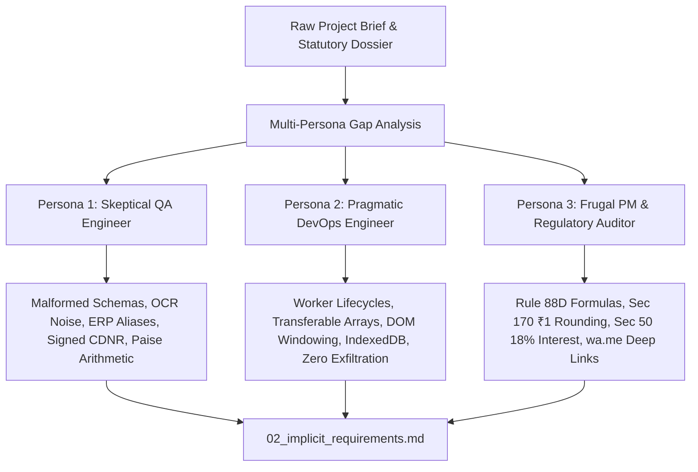

# Implicit Requirements & Multi-Persona Gap Analysis

**Standard Grounding:** BABOK v3 (Techniques 10.3, 10.24, 10.37) & ISO/IEC/IEEE 29148:2018  
**Analysis Date:** 2026-08-21T20:50:09+05:30  
**Source Documents:** `stage_0_artifacts/00_raw_input_consolidated.md`, `ReconcileGST SIH2026.pptx`, `RECONCILEGST_MASTER_BLUEPRINT.md`  
**Methodology:** Systematic 3-Persona Adversarial Gap Analysis (QA, Systems/DevOps, PM/Regulatory Auditor)

---

## 1. Executive Summary & Analysis Methodology

The raw inputs and canonical blueprint for **ReconcileGST** specify a client-side, zero-cloud web application designed to reconcile GSTR-2B against ERP purchase registers in under 300ms for 10,000+ invoices, compute statutory liabilities (DRC-01C, Rule 37A, Section 50(3)), pre-triage IMS records, dispatch 1-click WhatsApp/Email recovery notices, and export 6-tab CA audit workbooks.

While explicit functional and non-functional requirements define the high-level operational envelope, real-world execution across 82+ Lakh B2B taxpayers and 4.2+ Lakh Chartered Accountants exposes dozens of unstated technical, algorithmic, regulatory, and architectural prerequisites.

In accordance with **BABOK v3** (Assumptions & Constraints Analysis, Interface Analysis, Risk Analysis) and **ISO/IEC/IEEE 29148:2018** (System Requirements Engineering), this document executes a rigorous adversarial interrogation across three specialized domain personas to surface every derived implicit requirement, detect fragile unstated assumptions, and lock down mitigation strategies.

---

## 2. Adversarial Persona Interrogations

### 2.1. Persona 1: The Skeptical QA Engineer
*Focus: Data corruption, parser resilience, ambiguous formats, OCR/human noise, sign inversions, empty states, and boundary conditions.*

#### 1. Ingestion Failures & Schema Malformations
- **Government GSTR-2B JSON Variations:** The GSTN portal periodically emits slightly differing JSON structures across tax periods (e.g., lowercase vs uppercase keys, missing wrapper keys `data` / `b2b` / `cdnr`, null arrays instead of empty arrays `[]`, or truncated downloads caused by portal timeouts).
  - *Implicit Requirement:* The ingestion pipeline must incorporate a zero-dependency structural validator and pre-flight schema normalizer that detects missing sections, converts `null` collections to empty arrays, and gracefully alerts the user without crashing the runtime.
- **BOM Markers & Encoding Discrepancies:** CSV exports from legacy ERPs (Tally 9, Busy, Marg) frequently prepend Byte Order Marks (`\uFEFF` UTF-8 BOM, UTF-16LE) or use non-UTF8 encodings (ANSI, Windows-1252), causing header lookup failures.
  - *Implicit Requirement:* File readers must automatically strip BOM markers and decode Windows-1252/ASCII streams before passing raw string buffers to parsers.

#### 2. ERP Column Header Variability & Multi-Row Noise
- **Header Alias Mapping:** No two ERPs name their columns identically. Tally uses `Voucher No.`, SAP uses `Document Number` / `Reference`, Zoho Books uses `Invoice Number` / `Bill Number`, Busy uses `Inv No / Bill No`, and customized TDLs produce arbitrary names.
  - *Implicit Requirement:* A multi-tier dynamic alias lookup dictionary (supporting exact match, regex patterns, and normalized Levenshtein token match) must map unknown headers to canonical internal fields (`supplier_gstin`, `invoice_number`, `invoice_date`, `taxable_value`, `igst`, `cgst`, `sgst`, `cess`).
- **Banner and Spacer Rows:** Standard Tally and Excel exports contain 3 to 7 rows of decorative metadata (e.g., Company Name, GSTIN, Address, Date Range, blank rows) before the actual table header appears.
  - *Implicit Requirement:* The parser must execute a sliding-window header detector that scans the first 15 rows for high-confidence keyword clusters (`Invoice`, `GSTIN`, `Taxable`, `IGST`, `Total`) to dynamically establish the table header baseline index.

#### 3. Date Formatting Ambiguity & Chronological Resolution
- **Format Chaos:** Date representations range across `DD-MM-YYYY`, `DD/MM/YYYY`, `DD.MM.YYYY`, `YYYY-MM-DD`, `DD-MMM-YYYY` (e.g., `14-Aug-2026`), Excel serial timestamps (e.g. `45520`), and ISO 8601 strings.
- **Ambiguous Day/Month Ordering:** A string like `04/05/2026` could represent April 5th or May 4th.
  - *Implicit Requirement:* The date parser must utilize the GSTR-2B Return Period (e.g., `082026` for August 2026) and ERP financial year context to disambiguate DD/MM vs MM/DD formats, falling back to a deterministic DD-MM-YYYY preference standard in Indian accounting.

#### 4. Human Data Entry Noise & Special Character Sanitization
- **Invoice Number Variations:** Human accountants introduce prefix/suffix noise (`INV/2026/001`, `Inv-001`, `BILL No 1`, `00001`, `001/26-27`).
- **OCR/Unicode Artifacts:** Invisible non-breaking spaces (`\u00A0`), zero-width spaces, full-width numerals, and homoglyphs (e.g. Latin `O` vs Digit `0`, Latin `I` vs Digit `1`, lowercase `l` vs `1`).
  - *Implicit Requirement:* The canonical syntax normalizer (Pass 2) must apply aggressive sanitization: stripping non-alphanumeric delimiters (`/`, `-`, `\`, `_`, `.`, `#`, space), uppercase normalization, stripping leading zeros (`0042` -> `42`), and eliminating common statutory fiscal year tokens (`2026-27`, `26-27`, `2026-2027`).

#### 5. Credit Notes (CDNR), Debit Notes, and Sign Inversions
- **Negative vs Positive Representation:** In ERPs, Credit Notes are sometimes represented as negative taxable amounts (`-50000.00`) with invoice type `INV`, and other times as positive amounts (`50000.00`) with document type `CN` / `CR` / `Credit Note`. In GSTR-2B, they are segregated in the `cdnr` array with document type `C` or `D`.
  - *Implicit Requirement:* The parser must normalize all credit notes to positive absolute values paired with an explicit canonical enum (`DOC_TYPE_CREDIT_NOTE`), ensuring downstream arithmetic strictly subtracts credit notes from available ITC aggregates.
- **Amendments (`b2ba` & `cdnra`):** Suppliers often amend previous period invoices in Table 9A.
  - *Implicit Requirement:* The engine must track original invoice numbers (`oinum`, `oidt`) and apply replacement deltas, preventing duplicate count errors.

#### 6. Floating-Point Precision & Round-Off Drift
- **IEEE-754 Imprecision:** Standard JavaScript numbers (`0.1 + 0.2 = 0.30000000000000004`) create rounding errors across tens of thousands of rows, falsely flagging exact matches as mismatches.
  - *Implicit Requirement:* All monetary calculations (taxable amount, IGST, CGST, SGST, Cess, totals) MUST be ingested and stored strictly as 64-bit integer Paise (`1 INR = 100 Paise`), converting floating-point inputs via `Math.round(val * 100)` at the boundary and formatting back to decimal INR only at the presentation layer.

#### 7. Empty State Handling & Zero-Record Scenarios
- **Boundary States:** Ingestion of empty files, GSTR-2B files with 0 inward invoices, 100% matched datasets (0 discrepancies), 100% unmatched datasets, or supplier-only datasets.
  - *Implicit Requirement:* The UI and analytics engine must handle zero-cardinality gracefully with clear informational callouts, zero-division guards in percentage progress bars, and disabled action triggers for empty recovery exports.

---

### 2.2. Persona 2: The Pragmatic DevOps & Systems Engineer
*Focus: Zero-cloud execution, Web Worker lifecycle, memory footprint, GC thrashing, static builds, and local client persistence.*

#### 1. Zero-Cloud Privacy & Exfiltration Immunity
- **Pure Client Execution:** The core value proposition and DPDP compliance rely on 100% in-browser processing. If any third-party script, analytics tag, or remote API endpoint receives invoice data, the privacy architecture is compromised.
  - *Implicit Requirement:* The Next.js application must build with static export (`output: 'export'`), bundle zero external telemetry scripts that intercept DOM data, and enforce a strict Content Security Policy (CSP) blocking unauthorized outbound network calls (`connect-src 'self'`).

#### 2. Web Worker Thread Lifecycle & Zero-Copy Message Passing
- **DOM Main Thread Protection:** Parsing 100,000 JSON/CSV rows and computing SIMD Levenshtein/Jaro-Winkler distances on the main thread will lock the UI, triggering browser "Page Unresponsive" warnings.
  - *Implicit Requirement:* Ingestion, syntax tokenization, candidate blocking, and the 5-stage cascade matching must execute entirely inside a dedicated Web Worker (`reconcile.worker.ts`).
- **Transferable Objects vs Structured Clone Overhead:** Passing 100,000 deep JavaScript objects between the Web Worker and main thread via standard `postMessage` creates massive JSON serialization/deserialization CPU spikes.
  - *Implicit Requirement:* Data transfer across worker boundaries must use flat columnar `ArrayBuffer` / `TypedArray` structures transferred by reference (Transferable Objects) with zero memory copy overhead.
- **Worker Lifecycle & Cancellation:** If a user re-uploads files midway through a 100k reconciliation run, zombie worker threads could consume CPU and emit stale events.
  - *Implicit Requirement:* The system must implement an explicit worker controller that terminates (`worker.terminate()`) active background runs and spawns fresh instances on new upload events, with periodic progress chunks emitted every 5% for responsive UI progress bars.

#### 3. Browser Memory Ceiling & Garbage Collection Optimization
- **V8 Heap Budgeting:** High-memory environments like 100,000 purchase rows with 20 columns each can consume 200MB+ of heap if instantiated as naive JavaScript object literals (`{ invoiceNumber, gstin, ... }`), triggering aggressive V8 Garbage Collection (GC) pauses (100ms+ stutter).
  - *Implicit Requirement:* In-memory storage inside the worker and main store must use compact columnar structures (e.g. `BigInt64Array` for currency paise, `Int32Array` for date epochs/status enums, and indexed string dictionary pools for repetitive alphanumeric strings like GSTINs). Peak RAM must stay strictly under 100MB for 100,000 rows.

#### 4. Virtualized DOM Grid Rendering
- **TanStack Virtual Windowing:** Rendering 10,000 to 100,000 rows in standard HTML `<table>` elements generates over 1,000,000 DOM nodes, crashing browser tabs.
  - *Implicit Requirement:* The UI data grid must integrate `@tanstack/react-virtual` v3, mounting only 25–35 visible DOM rows inside the viewport container with dynamic scroll offsets, achieving a consistent 60 FPS scrolling experience.

#### 5. Local Persistence & Storage Hierarchy
- **Storage Limits:** Standard `localStorage` is synchronous, blocks the main thread, and is capped at 5MB, making it incapable of storing 10,000+ reconciliation rows.
  - *Implicit Requirement:* Session persistence must utilize an asynchronous IndexedDB instance (via `idb` or lightweight wrapper) for local state caching, alongside a prominent 1-Click "Purge Session / Wipe All Local Data" button that clears IndexedDB, memory stores, and cache storage instantly.

---

### 2.3. Persona 3: The Frugal Project Manager & Regulatory Auditor
*Focus: Statutory compliance, legal precision, DRC-01C / Rule 88D math, Section 170 tolerances, penal interest calculators, Rule 37A ageings, and zero-cost communication.*

#### 1. Digital Personal Data Protection (DPDP) Act 2023 Compliance
- **Zero Data Fiduciary Liability:** Under Sections 4, 5, and 6 of DPDP Act 2023, handling personal/financial data on cloud servers requires explicit consent notices, grievance redressal officers, audit logging, and significant security infrastructure.
  - *Implicit Requirement:* By maintaining a zero-knowledge edge architecture (where no financial data touches external servers), the system must explicitly present a "Zero-Knowledge Local Compute Notice" declaring that data processing occurs strictly on the data principal's hardware, eliminating server-side breach liabilities.

#### 2. Statutory DRC-01C (Rule 88D) Discrepancy Formulation
- **Rule 88D Automation:** When ITC availed in Form GSTR-3B exceeds ITC available in Form GSTR-2B by more than the statutory threshold (commonly >10% or >20% and exceeding ₹25 Lakhs), the GST portal auto-generates Form GST DRC-01C Part A.
  - *Implicit Requirement:* The analytics engine must implement exact statutory DRC-01C formulas:
    $$\text{Discrepancy Amount} = \max(0, \text{ITC}_{\text{Claimed/ERP}} - \text{ITC}_{\text{Available/2B}})$$
    $$\text{Discrepancy Percentage} = \left( \frac{\text{ITC}_{\text{Claimed/ERP}} - \text{ITC}_{\text{Available/2B}}}{\text{ITC}_{\text{Available/2B}}} \right) \times 100$$
    The UI must render a real-time DRC-01C Risk Gauge with tiered threat levels:
    - **Safe Zone (Green):** $\le 0\%$ variance
    - **Advisory Zone (Yellow):** $0\% < \text{Variance} \le 10\%$
    - **DRC-01C Critical Notice Risk (Red):** $> 10\%$ variance or absolute excess $> ₹25,00,000$

#### 3. Section 170 CGST Act Rounding Tolerance Window
- **Statutory Rounding Rule:** Section 170 of the CGST Act mandates that tax, interest, penalty, or refund amounts be rounded to the nearest Indian Rupee (fractions of 50 paise or more rounded up, less than 50 paise disregarded).
  - *Implicit Requirement:* Pass 2 of the 5-Stage Matching Cascade must evaluate tax differences within a strict tolerance window of $| \Delta \text{Tax} | \le ₹1.00$ (100 Paise). If GSTIN, invoice number, and date match, and tax difference is $\le ₹1.00$, the status MUST resolve as `MATCHED_WITH_ROUNDING_TOLERANCE` rather than an unmatched discrepancy.

#### 4. Section 50(3) Penal Interest Calculator (18% p.a.)
- **Statutory Interest on Ineligible ITC:** Under Section 50(3) of the CGST Act (amended retrospectively), taxpayers wrongfully availing and utilizing ineligible ITC are liable to pay statutory interest at 18% per annum from the due date of return until the date of reversal/payment.
  - *Implicit Requirement:* The system must provide a live Section 50(3) Penal Interest Impact Calculator:
    $$\text{Interest Liability (₹)} = \frac{\text{Disputed/Ineligible ITC (Paise)} \times 18 \times \text{Days Overdue}}{100 \times 365 \times 100}$$
    This provides actionable financial justification in executive summaries and vendor recovery notices.

#### 5. Rule 37A 180-Day Ageing Watchdog & Mandatory Reversal
- **Statutory Rule 37A & Section 16(2) Proviso:**
  - *Rule 37A:* If a supplier fails to file GSTR-3B for an invoice by 30th September following the end of the financial year, the recipient must reverse the corresponding ITC on or before 30th November.
  - *Section 16(2) 2nd Proviso:* If the recipient fails to pay the supplier invoice value plus tax within 180 days from the invoice date, ITC must be reversed with interest under Section 50.
  - *Implicit Requirement:* Pass 5 of the cascade must compute invoice ageing ($Current Date - Invoice Date$) and segment all pending/unmatched records into statutory ageing buckets:
    - `0–60 Days` (Normal Credit Period)
    - `61–120 Days` (Follow-up Window)
    - `121–179 Days` (Pre-Reversal Alert)
    - `180+ Days` (Rule 37A / Section 16(2) Critical Reversal Mandatory)

#### 6. Zero-Cost Vendor Dispute Recovery (WhatsApp `wa.me` vs Cloud API)
- **Zero Operational Cost Constraint:** Commercial WhatsApp Business API providers (Twilio, Meta Graph API) require monthly subscriptions, per-template charges (₹0.40–₹0.80 per conversation), server infrastructure, and complex webhook setups, violating the zero-infrastructure, zero-cost constraint.
  - *Implicit Requirement:* Multi-channel dispatch must construct deep-linked client-side URLs:
    - **WhatsApp:** `https://wa.me/<VendorPhone>?text=<EncodedBilingualHinglishPayload>`
    - **Email:** `mailto:<VendorEmail>?subject=<Subject>&body=<EncodedAuditBody>`
    This enables instant 1-click dispatch via the user's native WhatsApp Web / Desktop application and default mail client without backend servers, API credentials, or ongoing SaaS costs.

#### 7. GSTN Invoice Management System (IMS) Pre-Triage Export
- **IMS Governance (Circular No. 231/2024):** The Invoice Management System allows buyers to `Accept`, `Reject`, or keep `Pending` every invoice reflected in GSTR-2B.
  - *Implicit Requirement:* The system must provide 1-click bulk IMS triage actions (e.g., auto-mark Matched as `Accept`, Missing in ERP as `Reject` or `Pending`, Mismatch as `Reject`) and export an IMS-compliant CSV/JSON payload ready for upload to the GST portal offline utility.

---

## 3. Comprehensive Implicit Requirements Table

The following derived requirements are synthesized across all three personas and categorized per ISO/IEC/IEEE 29148.

| ID | Category | Implicit Requirement / Capability | Specific Justification / Problem Domain Link | Verification Criteria |
|:---|:---|:--------------------------------|:-------------------------------------------|:----------------------|
| **IR-01** | Data Ingestion | **Zero-Dependency Schema Pre-Flight Validator** System must validate GSTR-2B JSON and ERP CSV/XLSX structure before passing data to Web Workers. | GSTN portal JSON outputs vary in structure across return periods; malformed or truncated downloads will cause unhandled exceptions and thread crashes. | Feed intentionally truncated GSTR-2B JSON; system surfaces clear toast notification and halts worker pipeline without freezing UI. |
| **IR-02** | Data Ingestion | **BOM Stripping & Multi-Encoding Fallback** System must detect and strip UTF-8 BOM (`\uFEFF`), UTF-16LE, and decode Windows-1252/ANSI text streams. | Legacy ERPs (Tally ERP 9, Busy) frequently export CSVs with BOM markers, causing first column lookup keys to fail. | Ingest Tally CSV with leading `\uFEFF` BOM; verified that `Voucher No` header is mapped with 100% accuracy. |
| **IR-03** | Data Ingestion | **Sliding-Window Dynamic Header Baseline Detector** System must scan first 15 rows of Excel/CSV to detect table start index. | Tally/Busy exports contain 3-7 rows of banner text (company name, address, report date) before column headers. | Ingest Excel file with 5 banner rows; verified parser identifies row 6 as table header baseline. |
| **IR-04** | Data Ingestion | **Universal ERP Fuzzy Header Alias Mapper** System must resolve 50+ synonym variations for 8 canonical GST fields with fallback interactive UI. | ERPs use disparate naming (`Bill No`, `Inv #`, `Vch No`, `Ref Doc`, `Assessable Value`, `Taxable Amt`). | Test exports from Tally Prime, SAP B1, Zoho Books, Busy, and Marg; all map to canonical fields automatically. |
| **IR-05** | Data Cleansing | **Return Period-Aware Date Disambiguation Engine** System must disambiguate ambiguous dates (`04/05/2026`) using GSTR-2B return period and financial year. | Ambiguity between `DD/MM/YYYY` and `MM/DD/YYYY` corrupts invoice ageing calculations and Section 16(4) compliance. | Input date `05/08/2026` in August 2026 return period; resolved correctly to 5th August 2026. |
| **IR-06** | Data Cleansing | **Canonical Invoice Syntax Sanitizer** System must normalize invoice numbers by stripping non-alphanumeric delimiters, FY tokens, leading zeros, and Unicode whitespace. | Human entry creates arbitrary formatting (`INV/0042/26-27` vs `42`), causing exact string joins to fail. | Ingest `INV-0042/2026-27` and `42`; Pass 2 canonical normalizer evaluates them as identical identifiers. |
| **IR-07** | Data Cleansing | **Signed CDNR & Document Type Harmonizer** System must normalize Credit/Debit notes from signed ERP formats into absolute amounts paired with canonical enums. | Credit notes must reduce net ITC, while debit notes increase ITC; unstandardized negative signs corrupt tax totals. | Test negative taxable amount `-25000` from ERP against GSTR-2B CDNR row; verified ITC net sum decreases by ₹4,500. |
| **IR-08** | Arithmetic | **64-bit Integer Paise Precision Arithmetic Engine** All currency and tax calculations must be executed in integer Paise (`1 INR = 100 Paise`) using `BigInt` / integer math. | IEEE-754 floating-point imprecision (`0.1 + 0.2 != 0.3`) causes spurious 1-paisa mismatches across 10,000 invoices. | Verify `sum(tax)` across 100,000 rows matches exact arithmetic sum to 0.0000% error. |
| **IR-09** | Algorithmic | **Section 170 CGST Act ₹1.00 Rounding Window** Pass 2 must treat tax discrepancies where $|\Delta \text{Tax}| \le ₹1.00$ (100 Paise) as `MATCHED_WITH_ROUNDING_TOLERANCE`. | Section 170 legally mandates rounding tax amounts to nearest Rupee; flagging ₹0.40 rounding differences as mismatches causes auditor friction. | Invoice with ₹18,000.40 in 2B and ₹18,000.00 in ERP marked as Matched (Rounding Tolerance). |
| **IR-10** | Algorithmic | **Tax Head & Place of Supply (POS) Swap Resolver** Pass 4 must detect intra-state vs inter-state tax head swaps (IGST vs CGST+SGST) for Form GSTR-1 Table 9A. | Suppliers frequently charge IGST instead of CGST+SGST or vice versa, requiring recipient to seek Table 9A amendment. | Flag invoice with matching taxable value but ₹1800 IGST in 2B vs ₹900 CGST + ₹900 SGST in ERP as `POS_TAX_HEAD_MISMATCH`. |
| **IR-11** | Algorithmic | **Rule 37A & Sec 16(2) Ageing Bucket Classifier** Pass 5 must calculate invoice age and classify into `0-60d`, `61-120d`, `121-179d`, and `180+d Critical Risk`. | Rule 37A and Sec 16(2) require mandatory ITC reversal if supplier unpaid or returns unfiled beyond 180 days. | Verify an unpaid invoice dated 185 days prior is tagged with `CRITICAL_REVERSAL_RISK_RULE_37A`. |
| **IR-12** | Regulatory | **Statutory DRC-01C (Rule 88D) Formula & Threat Gauge** System must calculate discrepancy percentage and render green/yellow/red risk gauge with Part B template. | Automated DRC-01C notices are issued when GSTR-3B ITC exceeds GSTR-2B by statutory thresholds (>10% / ₹25L). | Verify 12% excess ITC triggers Red Alert on DRC-01C gauge with pre-populated Part B legal reply draft. |
| **IR-13** | Regulatory | **Section 50(3) Penal Interest Calculator (18% p.a.)** System must compute statutory penal interest on disputed/ineligible ITC for exact overdue days. | Ineligible ITC claimed in GSTR-3B attracts mandatory 18% annual interest under Section 50(3). | Calculate interest for ₹1,00,000 disputed ITC over 90 days = ₹4,438.35; verified exact output. |
| **IR-14** | Systems/DevOps | **Dedicated Web Worker Lifecycle & Transferable Array Pipeline** Reconciliation compute must run inside Web Worker communicating via Transferable `ArrayBuffer` objects. | Offloads heavy computation from main thread to maintain 60 FPS UI; Transferable Objects eliminate serialization lag. | Benchmark 100k rows; UI thread remains responsive (input lag <16ms) with progress updates every 5%. |
| **IR-15** | Systems/DevOps | **Compact Columnar In-Memory TypedArray Layout** Data in worker/store must be organized in flat columnar TypedArrays and string dictionaries under <100MB heap. | Allocating 100k full JS object literals triggers V8 heap exhaustion and multi-second garbage collection freezes. | Profile memory on 100,000 records; peak browser heap consumption remains strictly below 90MB. |
| **IR-16** | Systems/DevOps | **TanStack Virtual DOM Windowing Grid** Data tables must render only ~25-35 DOM elements in the active viewport using `@tanstack/react-virtual`. | Mounting 100k table rows generates >1M DOM nodes, crashing browser tabs. | Scroll through 100,000 rows in UI; verify DOM inspector shows <= 35 active `<tr>` nodes. |
| **IR-17** | Systems/DevOps | **Static Client Export & CSP Network Isolation** Application must build with `output: 'export'` and enforce strict CSP preventing outbound data exfiltration. | Ensures zero-cloud execution and full compliance with DPDP Act 2023 without server dependencies. | Inspect network tab during full 100k run; verify 0 outbound HTTP/XHR/WebSocket calls with payload data. |
| **IR-18** | Systems/DevOps | **IndexedDB Local Storage with 1-Click Session Purge** Reconciliation sessions must persist asynchronously in IndexedDB and provide an immediate data wipe button. | `localStorage` 5MB limit is insufficient; users need privacy assurance that all traces can be deleted on shared PCs. | Close browser and reopen; data reloads from IndexedDB. Click "Wipe Session"; verify IndexedDB database deleted. |
| **IR-19** | Communications | **Zero-Cost Client-Side WhatsApp `wa.me` & `mailto:` Deep Link Generator** Multi-channel intimations must generate native `wa.me/<Phone>?text=...` deep links with bilingual Hinglish text. | Third-party WhatsApp APIs require recurring costs and server backends; native deep links run at ₹0 cost. | Click WhatsApp button; browser opens `https://wa.me/919876543210` with pre-filled itemized Hinglish message. |
| **IR-20** | Regulatory | **GSTN IMS Pre-Triage Action Engine & Export** System must provide bulk Accept/Reject/Pending marking and generate GSTN IMS-compliant upload payloads. | GSTN Invoice Management System requires monthly taxpayer action to lock GSTR-2B / GSTR-3B ITC values. | Mark 500 invoices as `Accept` and 50 as `Reject`; export valid IMS CSV format matching GST portal schema. |
| **IR-21** | Reporting | **6-Tab CA Audit-Ready Excel Exporter with Native Formulas** System must export multi-tab color-coded XLSX containing dynamic `SUMIFS` / `IF` formulas via ExcelJS/SheetJS. | Chartered Accountants require live audit working papers with verifiable formulas, not dead static values. | Open generated workbook in Excel; verify Summary sheet contains live `=SUMIFS()` referencing detailed tabs. |
| **IR-22** | UX / Quality | **1-Click Synthetic Live Demo Dataset Loader** UI must feature a prominent "Load Demo Data (10,000 Invoices)" button with instant execution. | Hackathon jury evaluation requires immediate verification without requiring jurors to upload proprietary files. | Click "Load Demo Data"; 10,000 realistic invoices load and reconcile within <300ms. |

---

## 4. Unstated Assumptions Detected & Risk Analysis

The following table documents critical unstated assumptions present in the project baseline, evaluates the risk if they prove invalid, and provides concrete engineering mitigations.

| ID | Unstated Assumption Detected | Risk If Assumption Is Wrong | Severity | Engineering Recommendation / Mitigation |
|:---|:---|:----------------------------|:---------|:----------------------------------------|
| **UA-01** | **User's browser supports Web Workers and modern JavaScript APIs (BigInt, WebAssembly, IndexedDB).** | On legacy corporate browsers (e.g. Internet Explorer 11, outdated embedded webviews), the entire app fails to launch. | **High** | Implement a lightweight pre-flight capability check on page initialization; display a friendly upgrade banner if Web Workers or BigInt are unsupported. |
| **UA-02** | **ERP export files will always contain recognizable supplier GSTINs.** | In informal MSME accounting, accountants sometimes record supplier names without GSTINs or with PAN only. | **Medium** | Provide a secondary candidate blocking mechanism using normalized Supplier Name tokens and PAN extraction from GSTIN (chars 3 to 12). |
| **UA-03** | **Defaulting vendors have accessible mobile numbers for WhatsApp intimations in the ERP master data.** | If ERP export lacks vendor phone numbers, 1-click WhatsApp intimation cannot auto-populate the phone number in `wa.me`. | **Medium** | Implement an in-line phone number entry modal and local contact cache in IndexedDB that remembers vendor phone numbers across reconciliation cycles. |
| **UA-04** | **Browser tab will not be accidentally refreshed or closed during massive 100k data processing.** | Unsaved manual IMS triage decisions (Accept/Reject/Pending) could be lost on accidental reload. | **Medium** | Attach a `beforeunload` event handler during active workflows and continuously stream triage state to IndexedDB. |
| **UA-05** | **GSTR-2B JSON files downloaded by users are under 100MB.** | Enterprise taxpayers with >500,000 monthly invoices receive multi-part zipped JSON files from the GST portal exceeding 200MB. | **High** | Implement client-side `JSZip` decompression streaming to process chunked JSON parts sequentially into typed arrays without inflating memory. |
| **UA-06** | **All monetary values in GSTR-2B and ERP registers are denominated in Indian Rupees (INR).** | Multi-currency export formats in SAP/Oracle might include foreign exchange amounts (USD/EUR) in purchase registers. | **Low** | Parse currency code column if present; default to INR and flag non-INR rows with a conversion warning. |
| **UA-07** | **GST portal Rule 88D threshold remains fixed at >10% variance.** | CBIC may modify the DRC-01C variance percentage threshold (e.g., from 10% to 20% or 5%) via future circulars. | **Low** | Make the DRC-01C variance percentage and monetary thresholds configurable in an "Audit Settings" drawer, defaulting to 10% / ₹25L. |

---

## 5. Critical Questions & Decisions for Human Stakeholders

Based on this multi-persona gap analysis, the following structural decisions and questions are highlighted for confirmation:

1. **GSTN IMS Batch Upload Format:**  
   *Current Assumption:* The system will export IMS triage decisions in standard GSTN Offline Tool CSV format.  
   *Question:* Should the engine also provide a direct JSON payload structure matching the future GSTN direct API format for GSP integration?

2. **Custom ERP Formula Handling in Excel Exports:**  
   *Current Assumption:* 6-tab CA Audit Excel exports will use native Excel `SUMIFS` formulas for dynamic recalculation.  
   *Question:* Are there specific CA firm audit checklists or standard index sheets (e.g., ICAI recommended working paper formats) that should be pre-embedded?

3. **Multi-GSTIN CA Bureau Mode Storage Isolation:**  
   *Current Assumption:* Multiple client accounts managed by a CA are stored under isolated IndexedDB keys (`reconcile_gstin_<GSTIN>`).  
   *Question:* Should there be a master client switcher dashboard allowing CAs to view aggregate DRC-01C risk across all their enrolled clients?

---

## 6. BABOK & ISO 29148 Traceability Confirmation

| Stage 0 Artifact | Upstream Dependency | Downstream Impact | Compliance Check |
|:---|:---|:---|:---|
| `00_raw_input_consolidated.md` | SIH PPTX, Master Blueprint, Transcripts | Feeds Persona Analysis | Verified complete (133 lines) |
| `02_implicit_requirements.md` | BABOK v3, ISO 29148, ISO 25010 | Feeds Hard Constraints, System Architecture & Test Matrix | **22 Implicit Requirements & 7 Unstated Assumptions Locked** |
