# Stage 10: Production Deployment Manifest & Zero-Cloud Infrastructure Blueprint

**Project:** ReconcileGST (SIH 2026)  
**Team:** Binary Brains  
**Deployment Target:** Next.js 14 Static Export (`output: 'export'`)  
**Hosting Providers:** Vercel Static Edge / GitHub Pages / Local CA Workstation Runtime  
**Total Cloud Compute Cost:** **₹0.00 / Month ($0.00 USD)**  

---

## 1. Static Export Architecture

ReconcileGST is architected as an **Air-Gapped Client-Side Single-Page Application (SPA)** compiled via Next.js static HTML/JS export.

```mermaid
graph TD
    A[Static CDN Edge - Vercel / GitHub Pages] -->|Download HTML/JS Bundle Once| B[User Browser RAM]
    B -->|FileReader API| C[Local In-Memory Cache]
    C -->|Zero-Copy Transferable ArrayBuffer| D[Web Worker Kernel - SIMD WASM]
    D -->|Reconciliation Engine| C
    C -->|SheetJS In-Memory Compilation| E[6-Tab CA Audit Excel .xlsx]
    C -->|Client-Side wa.me Deep Link| F[WhatsApp Desktop / Web]
    
    style A fill:#1e293b,stroke:#3b82f6,stroke-width:2px
    style B fill:#020617,stroke:#10b981,stroke-width:2px
    style D fill:#0f172a,stroke:#06b6d4,stroke-width:2px
    style E fill:#064e3b,stroke:#10b981,stroke-width:2px
```



---

## 2. Infrastructure Cost Breakdown vs Cloud SaaS

| Infrastructure Component | Legacy Cloud SaaS (ClearTax / Masters India) | ReconcileGST Architecture | Cost Savings |
|:---|:---|:---|:---:|
| **Central Database (RDS/Postgres)** | ₹35,000 / month (AWS RDS Multi-AZ) | **₹0.00** (Zero database; runs in browser RAM) | **100%** |
| **Compute Cluster (ECS / EKS)** | ₹55,000 / month (8 vCPU / 32 GB RAM nodes) | **₹0.00** (Client device CPU via Web Workers) | **100%** |
| **API Gateway & Auth Servers** | ₹12,000 / month (Cognito / API Gateway) | **₹0.00** (Zero backend servers required) | **100%** |
| **Static CDN Bandwidth** | ₹8,000 / month | **₹0.00** (Within Vercel/Cloudflare 100GB Free Tier) | **100%** |
| **DPDP Compliance & Cyber Insurance**| ₹1,50,000 / year (Data Fiduciary audits) | **₹0.00** (Exempt under zero-knowledge airgap) | **100%** |
| **TOTAL TCO PER MONTH** | **₹1,10,000+ / month** | **₹0.00 / month** | **100% SAVINGS** |

---

## 3. Build & Static Export Command

```bash
# Build production static bundle
npm run build
# Output directory: ./out
```

The resulting `out/` bundle is 100% self-contained, requiring zero Node.js server runtimes. It can be opened directly as static assets or served via any static web server (`npx serve out` or GitHub Pages).
