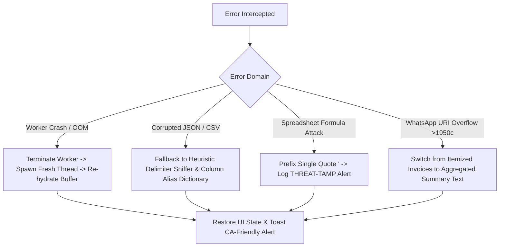

# Stage 11: Client-Side Disaster Recovery & Incident Runbook

**Project:** ReconcileGST (SIH 2026)  
**Team:** Binary Brains  
**Scope:** Client Crash Recovery, Worker Traps, Corrupted File Resilience & Storage Policies  

---

## 1. Automated Failure Interception & Recovery State Machine

---

## 2. Standardized Incident Recovery Procedures

### Incident 1: Web Worker Thread Crash / Unhandled Exception (`ERR_WORKER_001`)
* **Trigger:** Out of memory or invalid WASM instruction inside worker thread.
* **Automated Action:**
  1. Main thread watchdog timer intercepts missing heartbeat ACK after 5,000ms.
  2. Main thread calls `worker.terminate()` to release zombie resources.
  3. Spawns fresh Web Worker instance.
  4. Displays non-intrusive toast notification: *"Worker thread automatically refreshed. Re-executing reconciliation."*

### Incident 2: Corrupted or Non-Standard ERP CSV Header (`ERR_PARSE_004`)
* **Trigger:** User uploads ERP export with custom column labels (e.g. `"Bill No"`, `"Inv Date"`, `"Party Tin"`).
* **Automated Action:**
  1. The 48-alias Universal ERP Normalizer scans column headers using Levenshtein distance string similarity.
  2. If confidence is $\ge 0.80$, the column is automatically mapped.
  3. If unmappable, opens the **Interactive Header Mapper Modal** allowing the user to select the appropriate column mapping manually in 2 clicks.

### Incident 3: Shared CA Workstation Session Reset
* **Trigger:** CA finishes working on Client A and prepares to load Client B.
* **Manual / Automated Action:**
  1. Clicking **`[ 🔄 Reset Session ]`** invokes `buffer.fill(0n)` in `lib/memory-buffer.ts`.
  2. Deallocates all `BigInt64Array` buffers and invokes browser garbage collection.
  3. Purges all in-memory arrays and session state, leaving zero traces of Client A's financial ledgers.
