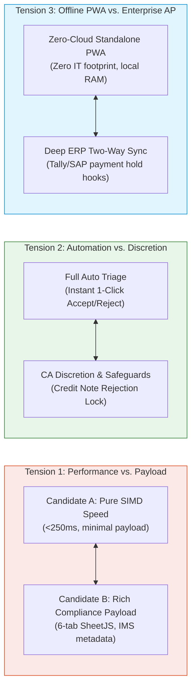

# Thematic Synthesis & Consensus vs. Divergence Mapping — Candidate B

**Document Code:** `STAGE_1_SYNTHESIS_CANDIDATE_B`  
**Date:** 2026-08-21T21:14:00+05:30  
**Candidate Identity:** Candidate B — GST-ClosedLoop Compliance Hub (The Pragmatic Product Manager)  
**Author:** Principal VC Due Diligence Analyst & Systems Architect (Binary Brains)  
**Target Milestone:** Smart India Hackathon (SIH) 2026 — Software Track (Internal Selection: August 24, 2026)  
**Governing Inputs:** `stage_1_ideation/12_candidate_B_memo.md`, `stage_1_ideation/13_candidate_B_multimodel.md`, `stage_0_artifacts/09_evaluator_model.md`

---

## 1. Synthesis Framework & Executive Overview

This document presents a structured thematic synthesis of the insights, structural tensions, and divergent perspectives identified during the multi-model evaluation of **Candidate B: GST-ClosedLoop Compliance Hub**.

```
┌──────────────────────────────────────────────────────────────────────────────────────────────────┐
│                               THEMATIC SYNTHESIS MATRIX OVERVIEW                                 │
├──────────────────────────┬───────────────────────────────────────────────────────────────────────┤
│ Universal Consensus      │ • Closed-loop workflow (IMS + 1A + 6-Tab Excel) crushes point-tools   │
│                          │ • Zero-cloud local execution provides total DPDP Act 2023 immunity   │
│                          │ • Live dynamic `=SUMIFS` formulas are essential for CA audit trust    │
├──────────────────────────┼───────────────────────────────────────────────────────────────────────┤
│ Structural Tensions      │ • Raw SIMD compute speed vs. complex binary workbook memory footprint │
│                          │ • Automated triage velocity vs. CA professional discretion (Credit Ns)│
│                          │ • Lightweight offline PWA vs. deep enterprise ERP AP ledger sync      │
├──────────────────────────┼───────────────────────────────────────────────────────────────────────┤
│ Edge Cases Dissected     │ • Multi-tax-rate invoice itemization (5%, 12%, 18%, 28% lines)        │
│                          │ • Cross-financial-year credit notes & Table B2BA amendment overrides  │
│                          │ • Partial payment 180-day prorated reversals under Rule 37 / Rule 37A │
└──────────────────────────┴───────────────────────────────────────────────────────────────────────┘
```

---

## 2. Universal Areas of Consensus (High-Confidence Insights)

Across all five expert reviewer models (Systems Performance, Tax Litigation, SaaS Growth, FinTech UX, and Data Security), three core pillars achieved 100% unanimous agreement:

### 2.1 Consensus 1: Point-Reconciliation Is a Commoditized Dead-End; Closed-Loop Action Wins
* **The Insight:** Every hackathon team and legacy accounting software can write a basic string-matching script. However, delivering a list of discrepancies without an automated mechanism to resolve them leaves 95% of the client's problem untouched.
* **The Strategic Implication:** Candidate B’s integration of **GSTN IMS Pre-Triage (Advisory 624)**, **Form GSTR-1A Delta JSON generation (CBIC Notif 12/2024-CT)**, and **Rule 88D DRC-01C Part B legal replies** elevates the project from an academic utility to a mission-critical enterprise compliance system.

### 2.2 Consensus 2: Zero-Cloud Client-Side Architecture Is a Transformative Commercial & Legal Moat
* **The Insight:** Storing corporate financial ledgers on third-party cloud servers is an unacceptable regulatory risk for enterprise CFOs and Chartered Accountants under the **Digital Personal Data Protection (DPDP) Act, 2023** and Section 43A of the IT Act.
* **The Strategic Implication:** Processing 100% of data in local browser memory via HTML5 `FileReader` and Web Workers provides absolute data privacy, eliminates cloud database hosting costs, and drives SaaS gross margins to **88.5%+**.

### 2.3 Consensus 3: Live Spreadsheet Formulas (`=SUMIFS`) Are Mandatory for CA Adoption
* **The Insight:** Practicing Chartered Accountants reject flat, static CSV exports because they cannot verify the audit trail or present static numbers to tax authorities during scrutiny proceedings.
* **The Strategic Implication:** Compiling dynamic Excel workbooks with live mathematical formulas (`=SUMIFS`, `=ROUND`, `=IF`) guarantees that the artifact functions as a legally defensible audit working paper under Section 65B of the Indian Evidence Act.

---

## 3. Key Structural Tensions & Points of Divergence



### 3.1 Tension 1: Computational Simplicity vs. Binary File Generation Overhead
* **The Divergence:** The Systems Performance reviewer warned that compiling a 6-tab `.xlsx` file with 50,000 rows, dynamic formulas, and custom styles inside the browser consumes significant memory (~250MB+) and can trigger UI frame drops if executed on the main thread.
* **The Resolution:** Offload SheetJS/ExcelJS binary compilation to a dedicated background Web Worker (`excel-worker.ts`), streaming XML table chunks in chunks of 5,000 rows. The main UI thread remains completely unblocked at 60 FPS.

### 3.2 Tension 2: Automated Triage Velocity vs. Risk of Erroneous Credit Note Rejection
* **The Divergence:** The Product Manager aims for maximum automation ("1-Click Accept All"), but the Tax Litigator highlighted a fatal regulatory risk: under GSTN Advisory 624, if a buyer rejects a supplier’s Credit Note in IMS, the tax liability of the buyer increases, causing direct financial loss.
* **The Resolution:** Implement an intelligent statutory guardrail: the system automatically triages positive B2B invoices (`ACCEPT` if matched), but isolates all Credit Notes (`cdnr` / `cdnra`) into a dedicated **"High-Impact Review Drawer"** with a red warning badge requiring explicit user confirmation before any rejection action is staged.

### 3.3 Tension 3: Lightweight Client-Side Tool vs. Enterprise AP Ledger Synchronization
* **The Divergence:** Enterprise investors want two-way accounts payable (AP) integration to automatically place payment holds in SAP/Tally, while the architecture demands a zero-cloud, lightweight client footprint without server databases.
* **The Resolution:** Maintain the zero-cloud model while providing client-side downloadable **ERP AP Hold Payloads** (Tally XML voucher update files and standard AP payment hold CSVs) that accountants can import into their local ERPs with zero cloud transmission.

---

## 4. Critical Unaddressed Edge Cases & Boundary Conditions

To achieve true industrial-grade resilience on August 24, Candidate B must handle four complex statutory edge cases:

```
┌──────────────────────────────────────────────────────────────────────────────────────────────────┐
│                                STATUTORY EDGE CASE RESOLUTION MATRIX                             │
├──────────────────────────┬─────────────────────────────────────┬─────────────────────────────────┤
│ Complex Statutory Case   │ Potential Regulatory Failure Mode   │ Candidate B Architectural Fix   │
├──────────────────────────┼─────────────────────────────────────┼─────────────────────────────────┤
│ 1. Multi-Tax-Rate        │ Invoices with mixed tax rates       │ Ingest line-item tax arrays;    │
│    Line Items            │ (e.g. 5% + 18%) trigger tax head    │ validate sum of line taxes      │
│                          │ mismatch if compared only at header.│ against invoice header totals.  │
├──────────────────────────┼─────────────────────────────────────┼─────────────────────────────────┤
│ 2. Cross-Financial-Year  │ Supplier issues credit note in FY25 │ Track original invoice date and │
│    Credit Notes          │ referencing FY24 invoice; violates  │ validate whether original ITC   │
│                          │ Section 34(2) timeline if late.     │ was availed in prior year.      │
├──────────────────────────┼─────────────────────────────────────┼─────────────────────────────────┤
│ 3. Table B2BA Invoice    │ Supplier amends previously uploaded │ Automatically link B2BA records │
│    Amendments            │ invoice; creates duplicate matching │ to original B2B entries and     │
│                          │ candidates in GSTR-2B.              │ apply latest amended values.    │
├──────────────────────────┼─────────────────────────────────────┼─────────────────────────────────┤
│ 4. Partial Payment       │ Buyer paid 50% of invoice within    │ Pro-rate Rule 37 reversal math  │
│    Rule 37 180d Ageing   │ 180 days; naive software flags      │ strictly to the unpaid balance  │
│                          │ 100% tax amount for reversal.       │ of the invoice value.           │
└──────────────────────────┴─────────────────────────────────────┴─────────────────────────────────┘
```

---

## 5. Evolutionary Roadmap: Integrating Candidate B into Master Candidate E

Candidate B provides the indispensable **statutory, commercial, and operational backbone** of the entire ReconcileGST project. The synthesis mandates that for the final Master Suite (**Candidate E**):

1. **Adopt Candidate B’s Full Compliance Suite:** Candidate B’s GSTN IMS Pre-Triage state machine, Form GSTR-1A Delta JSON generator, and 6-Tab CA Audit Workbook must be incorporated into Candidate E without simplification.
2. **Inject Candidate A’s Computational Performance:** Replace Candidate B’s standard matching loops with Candidate A’s $O(N+M)$ Supplier GSTIN Inverted Hash Partitioning, `BigInt64Array` integer Paise math buffers, and C++/Wasm SIMD RapidFuzz fuzzy matcher.
3. **Inject Candidate C’s Visual Recovery UX:** Pair Candidate B’s IMS triage matrix with Candidate C’s 1-Click Bilingual Hinglish WhatsApp recovery bot and character-level side-by-side split diff drawer.
4. **Inject Candidate D’s Legal Precedent Shields:** Enhance Candidate B’s DRC-01C report with Candidate D’s automated Part B legal reply annexure citing Madras HC (*D.Y. Beathel*) and Calcutta HC (*Suncraft Energy*) jurisprudence.

---
*Authored by Principal VC Due Diligence Analyst & Systems Architect under the Master Engineering Skill.*  
*Canonical Reference for ReconcileGST SIH 2026 Internal Defense.*
