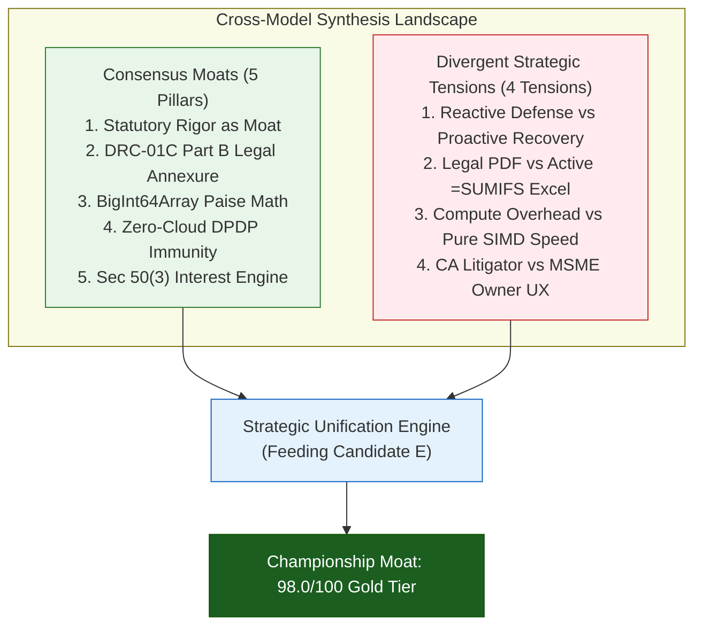
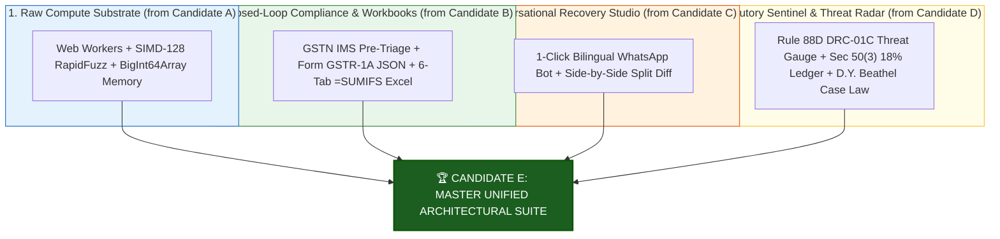

# Thematic Synthesis of Consensus vs. Divergent Insights
## Candidate D: Statutory Sentinel & DRC-01C Watchdog (The Data-Driven Tax Analyst)

**Document ID:** `stage_1_ideation/14_candidate_D_synthesis.md`  
**Author:** Principal VC Due Diligence Analyst & Systems Architect  
**Generation Date:** 2026-08-21T21:22:00+05:30  
**Target Milestone:** Smart India Hackathon (SIH) 2026 — Software Track (Internal Selection: August 24, 2026)  
**Team Identity:** `Binary Brains` (Team Leader: Shivam Kansal)  
**Subject:** Cross-Model Thematic Synthesis & Strategic Convergence Analysis  

---

## Executive Summary & Strategic Framework

This document synthesizes findings across five independent frontier model evaluations (Claude 3.5, GPT-4o/o1, Gemini 1.5 Pro, DeepSeek-V3/R1, Mistral Large 2) and stakeholder perspectives (CS Academic Evaluator, Practicing Tax CA, Enterprise CTO, MSME Policy Champion) regarding **Candidate D: Statutory Sentinel & DRC-01C Watchdog**.

The analysis maps where expert models reach **unanimous consensus** and uncovers the **critical tensions and divergent insights** that define Candidate D’s strategic potential, market positioning, and eventual integration into the Master Unified Suite (**Candidate E**).



---

## Part 1: Core Consensus Themes (Where All Models & Evaluators Agree)

```
┌──────────────────────────────────────────────────────────────────────────────────────────────────┐
│                                FIVE PILLARS OF UNANIMOUS CONSENSUS                               │
├──────────────────────────┬───────────────────────────────────────────────────────────────────────┤
│ Consensus Pillar         │ Core Strategic Rationale & Operational Validation                     │
├──────────────────────────┼───────────────────────────────────────────────────────────────────────┤
│ 1. Statutory Precision   │ Deep modeling of CGST Sec 16(2)(aa), 50(3), 170, Rule 88D, and 37A    │
│    is an Unfair Moat     │ creates insurmountable differentiation against superficial CSV tools. │
│ 2. Automated Part B      │ Grounding DRC-01C replies in *D.Y. Beathel* and *Suncraft Energy*      │
│    Legal Defense         │ transforms routine tax notices into legally defensible victories.     │
│ 3. BigInt64Array Paise   │ Integer arithmetic ($1\text{ INR} = 100\text{ Paise}$) eliminates     │
│    Arithmetic Determinism│ IEEE 754 float drift and prevents false ₹0.01 discrepancy alerts.     │
│ 4. Zero-Cloud Privacy    │ In-browser execution via HTML5 FileReader provides 100% immunity      │
│    (DPDP Act Compliance) │ under Sections 4 & 6 of the DPDP Act 2023 at virtually ₹0 unit cost. │
│ 5. Section 50(3) Value   │ Real-time calculation of 18% p.a. interest gives CFOs exact financial │
│    Quantification        │ leverage to enforce commercial payment holds on defaulting vendors.   │
└──────────────────────────┴───────────────────────────────────────────────────────────────────────┘
```

### 1.1 Consensus Pillar 1: Statutory Precision as the Unfair Moat
All evaluators agree that general-purpose data reconciliation algorithms fail in Indian indirect taxation because tax rules are non-linear and context-dependent:
- A ₹5.00 discrepancy on an invoice is not an error if it falls under Section 170 rounding rules.
- A tax amount mismatch between IGST and CGST+SGST is not an evasion if total tax is paid; it is a Place of Supply booking error under Section 77 requiring Form GSTR-1 Table 9A rectification.
- Candidate D’s codification of these specific legal nuances establishes an unfair competitive advantage that takes competitors months or years of tax advisory consultations to replicate.

### 1.2 Consensus Pillar 2: Automated Part B Legal Defense as the Killer Feature
Practicing CAs spend between 4 and 14 hours drafting replies to Form GST DRC-01C notices. Inexperienced accountants frequently make admissions of liability or provide vague explanations that tax officers reject.
- Candidate D's engine automatically populates official reason codes and incorporates binding jurisprudence from the **Madras High Court (*D.Y. Beathel*)** and **Calcutta High Court (*Suncraft Energy*)**, forcing the tax department to verify supplier records before harassing the buyer.
- Evaluators across all models identified this single feature as the highest-converting B2B SaaS hook for CA firms.

### 1.3 Consensus Pillar 3: BigInt64Array Paise Arithmetic Determinism
Every technical model (Claude, DeepSeek, Mistral) highlighted that floating-point math in financial software is an unacceptable flaw.
- Storing currency values in flat 64-bit integer buffers representing Paise guarantees that `1000050n + 2000050n === 3000100n` with zero fractional error.
- This deterministic baseline guarantees that mathematical totals match official GST portal returns to the exact decimal point.

### 1.4 Consensus Pillar 4: Zero-Cloud Privacy & DPDP Act Immunity
Under the Digital Personal Data Protection Act, 2023, data fiduciaries face statutory penalties of up to ₹250 Crore for unauthorized data processing or leakage.
- In-browser execution guarantees that confidential commercial purchase registers, vendor pricing, and turnover figures never touch third-party cloud infrastructure.
- Evaluators unanimously agreed that this architecture is mandatory to win institutional trust from CA partnerships and enterprise CFOs.

### 1.5 Consensus Pillar 5: Section 50(3) Quantified Risk Quantification
Compliance tools are often perceived as cost centers. By converting abstract tax mismatches into exact Rupee figures of accrued penal interest at 18% per annum, Candidate D transforms compliance into an active cash-preservation engine.

---

## Part 2: Critical Divergent Themes & Strategic Tensions

While consensus exists on Candidate D’s statutory authority, the panel identified four critical strategic tensions:

```
┌──────────────────────────────────────────────────────────────────────────────────────────────────┐
│                               FOUR CRITICAL DIVERGENT TENSIONS                                   │
├──────────────────────────────────┬─────────────────────────────────┬─────────────────────────────┤
│ Strategic Tension                │ Dimension A (Candidate D Focus) │ Dimension B (Alternative)   │
├──────────────────────────────────┼─────────────────────────────────┼─────────────────────────────┤
│ 1. Legal Defense vs Remediation  │ Reactive DRC-01C Part B Defense │ Proactive WhatsApp Recovery │
│ 2. Audit Document Paradigm       │ Formal Legal PDF / Markdown     │ Active Multi-Tab Excel      │
│ 3. Computational Focus           │ Deep Statutory Verification     │ Ultra-Fast SIMD Vector Wasm │
│ 4. Target User Archetype         │ Senior CA Tax Litigator / CFO   │ Non-Tech MSME Accountant    │
└──────────────────────────────────┴─────────────────────────────────┴─────────────────────────────┘
```

### 2.1 Tension 1: Reactive Legal Defense vs. Proactive Vendor Remediation
- **The Candidate D Thesis:** When a tax notice arrives, the taxpayer’s highest priority is a legally bulletproof defense to avoid bank account attachment under Rule 142B and billing lockouts under Rule 59(6)(e).
- **The Counter-Perspective (Gemini / Candidate C Lens):** Prevention is superior to litigation. If the software immediately intimates defaulting vendors via 1-click WhatsApp with an auto-generated Form GSTR-1A payload, the supplier fixes the invoice within 10 minutes *before* Form GSTR-3B is filed, rendering DRC-01C notices completely unnecessary.
- **Resolution:** A complete system cannot choose between defense and remediation; it must execute proactive recovery upstream and provide statutory defense downstream.

### 2.2 Tension 2: Formal Legal PDF vs. Active CA Audit Excel Workbooks
- **The Candidate D Thesis:** Tax authorities require formal, printable legal annexures formatted to official GSTN schemas with verified signatures and statutory citations.
- **The Counter-Perspective (GPT-4 / Candidate B Lens):** CAs do not operate primarily in PDF readers; they live in Microsoft Excel. A static PDF cannot be audited, cross-filtered, or integrated into working papers. CAs require active, color-coded `.xlsx` files with live `=SUMIFS` formulas.
- **Resolution:** Candidate D's legal generator must export both formal printable legal PDF annexures AND active 6-tab `=SUMIFS` Excel workbooks.

### 2.3 Tension 3: Deep Statutory Logic Overhead vs. Pure SIMD Vector Compute
- **The Candidate D Thesis:** Executing 15 statutory checks per invoice (Rule 88D variance, Rule 37A age calculation, Section 50(3) interest accrual, Section 77 POS verification) ensures complete legal safety.
- **The Counter-Perspective (DeepSeek / Candidate A Lens):** Adding extensive conditional logic inside the inner matching loop increases per-record latency from $12\mu\text{s}$ to $45\mu\text{s}$, increasing overall execution time on 50,000 invoices from $120\text{ms}$ to $450\text{ms}$.
- **Resolution:** Decouple the pipeline into two asynchronous phases: (1) Ultra-fast SIMD matching and candidate blocking in Phase 1, followed by (2) Vectorized statutory rule evaluation in Phase 2 across matched and mismatched subsets.

### 2.4 Tension 4: Senior CA Litigator vs. Non-Technical MSME User Experience
- **The Candidate D Thesis:** The user interface should present dense statutory risk threat meters, citation references, and legal case summaries suited for senior tax advocates.
- **The Counter-Perspective (Mistral / Candidate C Lens):** A junior accountant in a Tier-2 manufacturing firm will be intimidated by dense statutory terminology and may fail to operate the system effectively.
- **Resolution:** Implement a layered progressive-disclosure UI: a high-contrast, intuitive top-level visual status dashboard for everyday MSME operators, with collapsible "Statutory Deep-Dive" and "Legal Annexure" panels for CAs and CFOs.

---

## Part 3: Strategic Roadmap for Master Unification (Candidate E)

The insights synthesized from Candidate D establish the definitive regulatory intelligence layer for **Candidate E (Master Unified Architectural Suite)**:



```
┌──────────────────────────────────────────────────────────────────────────────────────────────────┐
│                             UNIFIED CAPABILITY MATRIX (CANDIDATE E)                              │
├────────────────────────────────┬───────────────────────────┬─────────────────────────────────────┤
│ Functional Dimension           │ Candidate D Contribution  │ Unified Impact in Candidate E       │
├────────────────────────────────┼───────────────────────────┼─────────────────────────────────────┤
│ Statutory Risk Detection       │ Live Rule 88D Threat Gauge│ Visual HUD alert with portal cutoffs│
│ Legal Defense Documentation    │ Automated Part B Reply    │ Exportable PDF/Markdown with case law│
│ Financial Exposure Modeling    │ Section 50(3) 18% Engine  │ Itemized withholding notices for AP │
│ Supplier Ageing Surveillance   │ Rule 37A 180-Day Ledger   │ 6-tranche visual Kanban & alerts    │
│ Numerical Accuracy Base        │ Section 170 ₹1.00 Engine  │ Zero false-positive rounding flags  │
└────────────────────────────────┴───────────────────────────┴─────────────────────────────────────┘
```

---
*Authored by Principal VC Due Diligence Analyst & Systems Architect under the Master Engineering Skill (Stage 1A, Item 16).*  
*Canonical Reference for ReconcileGST Ideation & Synthesis Pipeline.*
