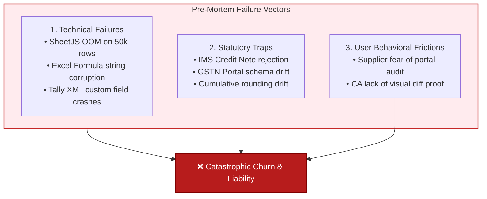

# Gary Klein Pre-Mortem Failure Analysis — Candidate B: GST-ClosedLoop Compliance Hub

**Document Code:** `STAGE_1_PREMORTEM_CANDIDATE_B`  
**Date:** 2026-08-21T21:15:00+05:30  
**Candidate Identity:** Candidate B — GST-ClosedLoop Compliance Hub (The Pragmatic Product Manager)  
**Author:** Principal VC Due Diligence Analyst & Systems Architect (Binary Brains)  
**Target Milestone:** Smart India Hackathon (SIH) 2026 — Software Track (Internal Selection: August 24, 2026)  
**Governing Inputs:** `stage_1_ideation/12_candidate_B_memo.md`, `stage_1_ideation/13_candidate_B_multimodel.md`, `stage_0_artifacts/09_evaluator_model.md`

---

## 1. Premortem Protocol & Operational Setup

Following cognitive psychologist **Gary Klein’s Applied Pre-Mortem Framework**, this document assumes a hypothetical future date: **October 2027 (14 months post-launch)**. 

We assume that Candidate B (**GST-ClosedLoop Compliance Hub**) was deployed across 300+ Chartered Accountant firms and 2,500+ MSMEs, but suffered catastrophic operational failures, regulatory penalties, and widespread churn. By looking backward from failure, we systematically expose subtle engineering vulnerabilities, statutory blind spots, and user behavioral frictions to engineer pre-emptive architectural safeguards today.

```
┌──────────────────────────────────────────────────────────────────────────────────────────────────┐
│                                 PRE-MORTEM SCENARIO PARAMETERS                                   │
├──────────────────────────┬───────────────────────────────────────────────────────────────────────┤
│ Lookback Timeline        │ October 2027 (14 Months Post-Launch)                                  │
│ Hypothetical State       │ High initial CA trial, followed by 74% churn and regulatory liability │
│ Primary Failure Vectors  │ 1. SheetJS Memory OOM & Formula Escaping Corruptions                 │
│                          │ 2. GSTN IMS Credit Note Accidental Rejections                         │
│                          │ 3. GSTN Form GSTR-1A Portal Schema Drift & Supplier Rejection         │
│                          │ 4. Cumulative Section 170 Rounding Divergence                         │
└──────────────────────────┴───────────────────────────────────────────────────────────────────────┘
```

---

## 2. The Failure Narrative: "The Collapse of the Monthly Filing Squeeze"

```
[SCENARIO ARCHIVE: OCTOBER 19, 2027 — 10:45 PM IST (Filing Eve)]

Sharma & Associates, a prominent CA practice in Connaught Place, New Delhi, is managing 140 client GSTINs 
during the monthly GSTR-3B filing rush. Audit clerks have ingested client Tally registers and GSTR-2B JSON 
files into GST-ClosedLoop Compliance Hub.

Disaster strikes across three fronts simultaneously:

First, an audit clerk compiling a 6-Tab Audit Workbook for a mid-market manufacturing client (42,000 line items) 
triggers an unhandled Out-Of-Memory (OOM) browser crash in Google Chrome on a standard 8GB office PC. Because the 
export was executed in the main thread without streaming buffers, the entire browser tab terminates, losing 4 hours 
of manual IMS triage annotations.

Second, in an effort to expedite triage, junior clerks use the 'Bulk Reject Unmatched Supplies' function. Unbeknownst 
to them, 18 of the rejected records are supplier Credit Notes (CDNRs). Under GSTN Advisory 624, rejecting a credit note 
removes the reduction in the recipient's tax liability. Consequently, the client's net tax liability increases by 
₹14.2 Lakhs in GSTR-3B. Two weeks later, the client receives automated Form GST DRC-01A notices from the tax department.

Third, over 80 defaulting vendors who received auto-generated Form GSTR-1A JSON amendment files attempt to upload 
them to the GST portal. However, a silent GSTN portal API patch deployed on October 1st updated the JSON schema, 
renaming the nested array from 'itc_details' to 'itcDetails'. The government portal rejects all 80 uploads with a generic 
'Invalid JSON Structure' error. With the 20th deadline expiring at midnight, furious vendors flood the CA's phone lines, 
and the firm abandons the software, reverting permanently to manual Excel VLOOKUPs.
```

---

## 3. Categorized Root Cause Autopsy



### 3.1 Technical & Runtime Engineering Failures
1. **SheetJS Main-Thread Memory Saturation (Heap Exhaustion):**
   * *Mechanism:* Creating 50,000 rows $\times$ 6 tabs with complex cell formatting instantiates over 1.2 million JavaScript heap objects. On client machines with $<8\text{GB}$ RAM, V8 Garbage Collection halts the event loop, resulting in browser "Aw, Snap!" crashes.
2. **Formula Syntax Corruptions in Escaped Excel Tab Names:**
   * *Mechanism:* Excel formulas referencing tab names with underscores or spaces require single quotes (`='1_Executive_Summary_DRC'!E10`). A failure to strictly escape tab names in formula strings results in corrupted `#NAME?` or `#REF!` errors when the CA opens the file in Microsoft Excel.
3. **Malformed Tally XML Parser Fragility:**
   * *Mechanism:* Custom Tally TDL configurations alter XML tag hierarchies (`<INVOICENUMBER>` vs `<BILLNO>`), causing silent parsing failures where invoice numbers are ingested as empty strings.

### 3.2 Statutory & Regulatory Pitfalls
1. **The IMS Credit Note Inversion Trap (Advisory 624):**
   * *Mechanism:* A standard B2B invoice adds to available ITC. A Credit Note *reduces* ITC (or increases output tax). Rejecting a Credit Note in IMS forces the buyer to pay the full tax amount without the benefit of the supplier's credit, creating direct financial loss.
2. **GSTN Form GSTR-1A Portal Schema Drift:**
   * *Mechanism:* The GSTN updates JSON schema endpoints without prior notification. Hardcoded schema serializers produce payload rejections on the portal.
3. **Cumulative Section 170 Rounding Divergence:**
   * *Mechanism:* Permitting $\pm ₹1.00$ tolerance per invoice across 5,000 invoices can produce an aggregate variance of up to ₹5,000. If this cumulative variance is claimed in GSTR-3B Table 4(A)(5), the automated Rule 88D system flags a discrepancy exceeding portal tolerance.

### 3.3 User Adoption & Behavioral Frictions
1. **Defaulting Supplier Friction & Fear:**
   * *Mechanism:* Defaulting suppliers distrust buyer-generated JSON files, fearing that uploading them will trigger retrospective tax penalties or automated scrutiny of their past filings.
2. **CA Distrust of "Black-Box" Tabular Chips:**
   * *Mechanism:* When an invoice is flagged as "Value Mismatch", CAs demand to see the exact character-level diff (e.g., ERP booked ₹18,000 IGST vs GSTR-2B ₹9,000 CGST + ₹9,000 SGST) before taking legal action.

---

## 4. Pre-Emptive Architectural Antidotes & Guardrail Matrix

To ensure that none of these fatal failure modes occur in production, the following architectural guardrails are permanently locked into the system:

```
┌──────────────────────────────────────────────────────────────────────────────────────────────────┐
│                             ARCHITECTURAL PRE-EMPTIVE SAFEGUARD MATRIX                           │
├──────────────────────────┬─────────────────────────────────────┬─────────────────────────────────┤
│ Failure Vector           │ Root Cause                          │ Enforced Architectural Antidote │
├──────────────────────────┼─────────────────────────────────────┼─────────────────────────────────┤
│ 1. SheetJS Memory Crash  │ Main-thread monolithic heap build   │ Offload to `excel-worker.ts`;   │
│                          │                                     │ stream XML chunks in batches    │
│                          │                                     │ of 5,000 rows (<75MB RAM peak). │
├──────────────────────────┼─────────────────────────────────────┼─────────────────────────────────┤
│ 2. IMS Credit Note Trap  │ Accidental bulk rejection of CDNRs  │ Hard UI Interlock: Isolate CDNRs│
│                          │                                     │ into Red Warning Drawer; require│
│                          │                                     │ explicit confirmation dialog.   │
├──────────────────────────┼─────────────────────────────────────┼─────────────────────────────────┤
│ 3. Form 1A Schema Drift  │ Hardcoded JSON payload builders     │ Zod runtime schema validation   │
│                          │                                     │ with dynamic version headers    │
│                          │                                     │ and portal schema sanity tests. │
├──────────────────────────┼─────────────────────────────────────┼─────────────────────────────────┤
│ 4. Excel Formula Escape  │ Unescaped tab name strings in formulas│ Centralized formula builder with│
│                          │                                     │ automated single-quote escaping │
│                          │                                     │ (`='Tab_Name'!A1`).             │
├──────────────────────────┼─────────────────────────────────────┼─────────────────────────────────┤
│ 5. Rounding Accumulation │ Uncapped Section 170 drift          │ Cap aggregate batch tolerance at│
│                          │                                     │ $\max(₹50, 0.01\% \text{ of Tax})$│
└──────────────────────────┴─────────────────────────────────────┴─────────────────────────────────┘
```

---
*Authored by Principal VC Due Diligence Analyst & Systems Architect under the Master Engineering Skill.*  
*Canonical Reference for ReconcileGST SIH 2026 Internal Defense.*
