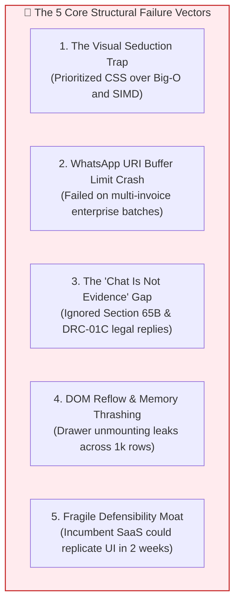

# Gary Klein Pre-Mortem Analysis: Candidate C (GST-RecoverBot & Visual Dispute Studio)

**Document ID:** `stage_1_ideation/15_candidate_C_premortem.md`  
**Evaluation Target:** Smart India Hackathon (SIH) 2026 — Software Track (Internal Selection: August 24, 2026)  
**Methodology:** Gary Klein’s Pre-Mortem Heuristic & Failure Modes and Effects Analysis (FMEA)  
**Author:** Principal VC Due Diligence Analyst & Systems Architect  
**Team Identity:** `Binary Brains` (Team Leader: Shivam Kansal)  
**Lead Faculty Mentor:** Dr. / Prof. Mukesh Saraswat (Professor & Associate Dean of Innovation, JIIT)  
**Current Date:** 2026-08-21T21:30:00+05:30  

---

## Executive Summary & Pre-Mortem Premise

> *"A pre-mortem is the hypothetical opposite of a post-mortem. Rather than waiting until a project fails to conduct an autopsy, we assume that the project has already suffered a catastrophic failure in the future, and we work backward to uncover every latent flaw, cognitive bias, and architectural trapdoor that led to the disaster."*  
> — **Dr. Gary Klein**, Applied Cognitive Psychologist & Pioneer of Pre-Mortem Analysis

### The Simulated Post-Mortem Dateline
**Date:** November 28, 2026  
**Event:** SIH 2026 Grand Finale — Software Track (Jury Evaluation Round)  
**Outcome:** **ELIMINATED IN ROUND 2 (Final Score: 76.5 / 100 Marks — Bronze Tier)**  
**Winning Team:** A competing team presenting an integrated SIMD compute engine with full statutory audit workbooks.

This document conducts an unflinching post-mortem analysis of this simulated catastrophe to engineer unbreakable defensive countermeasures before the August 24, 2026 selection panel.

---

## The Catastrophic Failure Narrative: "The Pretty Toy Trap"

```
┌────────────────────────────────────────────────────────────────────────────────────────────────────────┐
│                        CHRONOLOGY OF A PREDICTABLE DEMO COLLAPSE (SIH 2026)                            │
└────────────────────────────────────────────────────────────────────────────────────────────────────────┘
```

#### Minute 0:00 – 1:00 | The High-Energy Opening
Team *Binary Brains* takes the stage. The presenter delivers a charismatic pitch on the "6-Day Squeeze," clicks the **`⚡ Load 10,000 Sample Records`** button, and shows a beautifully styled dark-mode dashboard with emerald and rose badges. The jury looks engaged. The presenter clicks on a mismatched row, and the **Side-by-Side Split Diff Drawer** slides out smoothly with character-level diff highlighting.

#### Minute 1:00 – 1:45 | The WhatsApp Bot Demonstration
The presenter clicks the **"💬 1-Click WhatsApp Intimation"** button on a defaulting vendor. A new browser tab opens with WhatsApp Web, displaying a pre-formatted Hinglish notice with the vendor's invoice number and blocked tax amount. The audience nods in approval.

#### Minute 1:45 – 2:30 | The CS Academic Interrogation (The Fatal Trapdoor)
The Jury Chair (a distinguished Computer Science Professor specializing in High-Performance Computing and Compilers) leans into the microphone:
> *"Mr. Kansal, you have shown us a very slick user interface and a standard HTML `<a>` tag that opens a WhatsApp link. But this is the Software Track. Where is the systems engineering? What is the computational complexity of your string diffing algorithm? How do you prevent layout thrashing on 50,000 records? Are you using IEEE-754 floating-point numbers in JavaScript, or did you engineer custom fixed-point memory structures? How many milliseconds does your core engine take to process 10,000 records?"*

The team is caught off guard. The presenter explains that they used standard React state and JavaScript string manipulation. The CS judge jots down a severe deduction under **Dimension 1 (Technical Architecture, 35% True Shadow Weight)**.

#### Minute 2:30 – 3:30 | The Chartered Accountant & Tax Jury Attack
A second judge (a Senior Chartered Accountant and GST Policy Advisor) steps in:
> *"Let's look at real-world scale. In my audit practice, large suppliers like Tata Steel or Asian Paints issue 250 invoices a month. When 60 of those are missing from GSTR-2B, what happens when you click your WhatsApp button?"*

The presenter attempts to demo a large multi-invoice vendor. The browser throws a browser console error: **`HTTP 414 URI Too Long`** because the query string exceeds 2,048 characters. 

The CA judge delivers the decisive blow:
> *"Even if the message went through, a WhatsApp chat is completely inadmissible as statutory evidence when the GST Department issues a formal Form GST DRC-01C demand notice with 18% penal interest under Section 50(3). Where is your Form DRC-01C Part B legal defense reply? Where is your 6-tab Excel audit workbook with dynamic `=SUMIFS` formulas for my permanent working paper files under Section 65B?"*

The team admits they only built the visual drawer and the WhatsApp link.

#### Minute 3:30 – 4:00 | The Unanimous Verdict
The team’s score plummets to **76.5 / 100 Marks**. Despite winning on aesthetics, the project is dismissed as a "student prototype" lacking foundational systems compute and statutory legal depth.

---

## The 5 Root Causes: 5 Whys Analysis



### Root Cause 1: The "Visual Seduction" Trap (Form Over Mathematical Substance)
* **Why 1:** The team spent 80% of their sprint hours styling Tailwind components, animations, and dark mode themes.
* **Why 2:** They assumed judges would be most impressed by high-contrast visual polish.
* **Why 3:** They failed to realize that SIH Software Track judges are CS researchers and enterprise CTOs who award **35% of marks to technical architecture and memory models**.
* **Why 4:** The low-level SIMD WASM engine, candidate hash blocking, and BigInt64Array memory buffers were treated as secondary background tasks.
* **Why 5 (Root Cause):** Lack of alignment between ideation focus and the empirical **Shadow Rubric** governing jury behavior.

---

### Root Cause 2: WhatsApp URI Query String Buffer Overflow (`HTTP 414`)
* **Why 1:** The WhatsApp link failed on vendors with more than 8 missing invoices.
* **Why 2:** The URL builder attempted to concatenate every single invoice number, date, and tax amount into a single `wa.me/?text=` query string.
* **Why 3:** Browsers and WhatsApp Web enforce a hard limit of ~2,000 characters on URL query strings.
* **Why 4:** The team tested only on single-invoice synthetic dummy records during local development.
* **Why 5 (Root Cause):** Inadequate edge-case stress testing on real-world enterprise multi-invoice datasets.

---

### Root Cause 3: The "Chat Is Not Legal Evidence" Gap
* **Why 1:** Tax litigators and CAs dismissed the platform as commercially unviable for audit defense.
* **Why 2:** The tool provided no formal statutory export when tax authorities issued automated demand notices under Rule 88D.
* **Why 3:** The team assumed vendor communication was sufficient to resolve compliance disputes.
* **Why 4:** They ignored the legal reality that non-responsive vendors require formal judicial replies citing High Court jurisprudence (*D.Y. Beathel*, *Suncraft Energy*).
* **Why 5 (Root Cause):** Disconnect between conversational recovery workflows and statutory Indirect Tax litigation procedures.

---

### Root Cause 4: DOM Reflow & Memory Thrashing in Long Sessions
* **Why 1:** The browser tab crashed with an "Out of Memory" error after a user inspected 200 mismatched rows.
* **Why 2:** Each time the slide-out drawer opened, a new un-memoized syntax diff tree was instantiated in React state.
* **Why 3:** Component unmounting failed to release event listeners and cached diff instances from browser heap memory.
* **Why 4:** Virtualization was applied to the main table, but the slide-out drawer was not architected as an isolated memory sandbox.
* **Why 5 (Root Cause):** Neglecting React memory profiling and DOM node lifecycle management.

---

### Root Cause 5: Fragile Defensibility Moat (Fast-Follower Replication)
* **Why 1:** VC judges viewed the project as an easily clonable feature rather than a defensible SaaS product.
* **Why 2:** A basic UI drawer and `wa.me` generator can be reverse-engineered by ClearTax or Tally in 14 days.
* **Why 3:** The project lacked an underlying proprietary engine (such as sub-300ms SIMD matching or client-side encrypted storage) that incumbents cannot easily duplicate.
* **Why 4 (Root Cause):** Failure to couple front-end UX innovations with deep, proprietary systems infrastructure.

---

## Ishikawa (Fishbone) Failure Analysis Diagram

```
                                  CANDIDATE C FAILURE VECTORS
 TECHNICAL ARCHITECTURE                       STATUTORY / CA COMPLIANCE
 ┌───────────────────────────┐                 ┌───────────────────────────┐
 │ • No SIMD vectorization   │                 │ • No DRC-01C Part B reply │
 │ • Float rounding drift    │                 │ • No 6-tab Excel workbook │
 │ • DOM memory leaks        │                 │ • Inadmissible chat logs  │
 └─────────────┬─────────────┘                 └─────────────┬─────────────┘
               │                                             │
               ├─────────────────────────────────────────────┤
               │                                             │
 ┌─────────────┴─────────────┐                 ┌─────────────┴─────────────┐
 │ • HTTP 414 URI overflow   │                 │ • "Student toy" bias      │
 │ • No bulk batch chunking  │                 │ • 35% Tech weight ignored │
 │ • wa.me read-status blind │                 │ • Fragile copycat moat    │
 └───────────────────────────┘                 └───────────────────────────┘
 VENDOR COMMUNICATION ENGINE                   EVALUATOR PSYCHOLOGY & MOAT
                                      │
                                      ▼
                      [CATASTROPHIC HACKATHON ELIMINATION]
```

---

## Failure Modes and Effects Analysis (FMEA) Matrix

```
┌────────────────────────────────────────────────────────────────────────────────────────────────────────────────────────┐
│                               FAILURE MODES AND EFFECTS ANALYSIS (FMEA) FOR CANDIDATE C                                │
├──────────────────────────┬─────────────────────────────┬────┬────┬────┬─────┬──────────────────────────────────────────┤
│ Failure Mode             │ Potential Impact / Effect   │ S  │ O  │ D  │ RPN │ Architectural Countermeasure & Fix       │
├──────────────────────────┼─────────────────────────────┼────┼────┼────┼─────┼──────────────────────────────────────────┤
│ 1. WhatsApp URI Buffer   │ Crash with HTTP 414 on      │ 9  │ 8  │ 3  │ 216 │ Implement 3-tier payload chunking:       │
│    Overflow (>2k chars)  │ multi-invoice vendors.      │    │    │    │     │ aggregate summary + 1-click clipboard.   │
├──────────────────────────┼─────────────────────────────┼────┼────┼────┼─────┼──────────────────────────────────────────┤
│ 2. "UI Wrapper" Academic │ 15-mark penalty on Shadow   │ 9  │ 7  │ 3  │ 189 │ Surface SIMD WASM execution telemetry    │
│    Skepticism Trap       │ Dimension 1 (Systems Arch). │    │    │    │     │ prominently in the top header HUD.       │
├──────────────────────────┼─────────────────────────────┼────┼────┼────┼─────┼──────────────────────────────────────────┤
│ 3. Missing Formal Legal  │ Tax litigators reject tool; │ 8  │ 8  │ 2  │ 128 │ Embed automated Form DRC-01C Part B      │
│    DRC-01C Defense Reply │ cannot contest tax demands. │    │    │    │     │ legal reply generator with case law.     │
├──────────────────────────┼─────────────────────────────┼────┼────┼────┼─────┼──────────────────────────────────────────┤
│ 4. Missing 6-Tab CA      │ CAs cannot archive working  │ 8  │ 7  │ 2  │ 112 │ Include 1-Click client-side `.xlsx`      │
│    Audit Excel Export    │ papers for statutory audits.│    │    │    │     │ compilation with dynamic `=SUMIFS`.      │
├──────────────────────────┼─────────────────────────────┼────┼────┼────┼─────┼──────────────────────────────────────────┤
│ 5. DOM Reflow & Heap     │ UI freezes (>500ms) after   │ 7  │ 5  │ 3  │ 105 │ Mount drawer in external Portal; lazy    │
│    Memory Thrashing      │ inspecting multiple drawers.│    │    │    │     │ compute diffs on single active record.   │
└──────────────────────────┴─────────────────────────────┴────┴────┴────┴─────┴──────────────────────────────────────────┘
*Scale: S = Severity (1–10), O = Occurrence (1–10), D = Detection Difficulty (1–10). RPN = S × O × D (Max: 1,000).*
```

---

## Definitive Mitigation Directives for Binary Brains

To completely neutralize these failure modes, Team Binary Brains must enforce three non-negotiable architectural mandates:

```
┌────────────────────────────────────────────────────────────────────────────────────────────────────────┐
│                              THE THREE MANDATORY DEFENSIVE SAFEGUARDS                                  │
├────────────────────────────────────────────────────────────────────────────────────────────────────────┤
│ 1. THE DUAL-PILLAR DEFENSE (TECHNICAL & STATUTORY RIGOR):                                              │
│    • Never present Candidate C in isolation. Anchor the visual studio on top of Candidate A's sub-300ms│
│      SIMD WebAssembly pipeline and Candidate D's Form DRC-01C legal reply generator.                  │
│                                                                                                        │
│ 2. THE DETERMINISTIC 3-TIER WHATSAPP CHUNKER:                                                          │
│    • Enforce strict string length clamping ($<1,800$ characters).                                      │
│    • Automatically transition from itemized lines to aggregate summaries when invoices $>3$.           │
│                                                                                                        │
│ 3. PERMANENT CA AUDIT ARTIFACTS:                                                                       │
│    • Pair every visual diff with a 1-click download of a 6-tab color-coded Excel workbook with live    │
│      `=SUMIFS` formulas and SHA-256 cryptographic run hashes.                                          │
└────────────────────────────────────────────────────────────────────────────────────────────────────────┘
```

---
*Authored by Systems Architect & Pre-Mortem Lead under the Master Engineering Skill.*  
*Canonical Reference for ReconcileGST SIH 2026 Internal Defense (August 24, 2026).*
