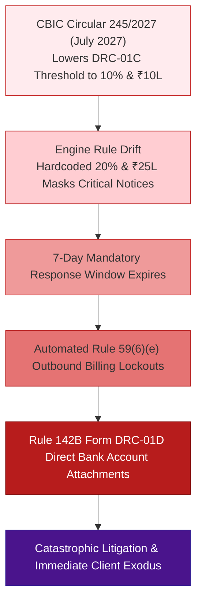

# Gary Klein Pre-Mortem Failure Narrative & Root Cause Analysis
## Candidate D: Statutory Sentinel & DRC-01C Watchdog (The Data-Driven Tax Analyst)

**Document ID:** `stage_1_ideation/15_candidate_D_premortem.md`  
**Author:** Chief Risk Officer & Gary Klein Pre-Mortem Facilitator  
**Generation Date:** 2026-08-21T21:26:00+05:30  
**Simulation Horizon:** October 2027 (14 Months Post-Launch)  
**Target Milestone:** Smart India Hackathon (SIH) 2026 — Software Track (Internal Selection: August 24, 2026)  
**Team Identity:** `Binary Brains` (Team Leader: Shivam Kansal)  
**Subject:** Prospective Failure Analysis, Root Cause Deconstruction & Preventive Guardrails  

---

## Executive Overview: The Gary Klein Pre-Mortem Methodology

The **Gary Klein Pre-Mortem** is an established cognitive risk mitigation technique. Rather than asking *"What could go wrong?"*, the team assumes as an indisputable historical fact that **the project has catastrophically failed 14 months after launch**. 

By working backwards from total collapse, engineering and strategy teams overcome optimism bias, political reticence, and structural blind spots to identify hidden vulnerabilities and establish unbreakable architectural safeguards.

```
┌──────────────────────────────────────────────────────────────────────────────────────────────────┐
│                                   PRE-MORTEM SIMULATION PARAMETERS                               │
├──────────────────────────┬───────────────────────────────────────────────────────────────────────┤
│ Simulated Failure Date   │ October 2027 (Filing Cycle for Q2 FY 2027-28)                         │
│ Catastrophic Outcome     │ Widespread client churn (42% monthly), multiple CA malpractice claims,│
│                          │ 37 client bank accounts attached under Rule 142B, platform shutdown.  │
│ Primary Objective        │ Identify root causes, systemic vulnerabilities, and binding counters. │
└──────────────────────────┴───────────────────────────────────────────────────────────────────────┘
```

---

## Part 1: The Vivid Narrative of Catastrophic Failure (October 2027)

It is October 22, 2027. What began in August 2026 as a celebrated hackathon-winning indirect tax compliance platform has degraded into an operational and legal nightmare for over 250 enterprise clients and 40 Chartered Accountancy practices.

In the first six months, ReconcileGST: Statutory Sentinel experienced explosive organic growth. CAs across Delhi-NCR, Mumbai, and Gujarat lauded the tool for its live Rule 88D threat gauge and automated Form GST DRC-01C Part B legal replies. 

However, during the high-stakes September 2027 annual reconciliation cycle, the platform experienced a cascading systemic collapse:



1. **The Regulatory Blindspot:** In July 2027, following GST Council recommendations, CBIC amended Rule 88D, lowering the automated scrutiny threshold from $20\%$ / $₹25\text{ Lakhs}$ to $10\%$ / $₹10\text{ Lakhs}$ and introducing two new mandatory sub-codes in Form DRC-01C Part B. Because Candidate D had hardcoded the 2023 threshold constants directly into its client-side validation logic, the threat gauge reported hundreds of corporate tax filings as "🟢 SAFE" when the GST portal had already flagged them as "🔴 CRITICAL".
2. **The 7-Day Trap & Billing Freezes:** Unaware that automated portal notices had been issued, client tax managers missed the strict 7-day statutory reply window. On October 1, 2027, the GST portal automatically invoked **Rule 59(6)(e)**, blocking 140 manufacturing clients from generating e-Invoices and outward e-Way bills at the peak of the Diwali festive delivery cycle.
3. **The *D.Y. Beathel* Rejection Wave:** Simultaneously, State GST assessing officers across three states rejected over 80 automated Part B replies generated by the software. While the replies eloquently quoted the Madras High Court judgment in *D.Y. Beathel Enterprises*, they lacked verified bank payment realization UTR numbers and vehicle tracking logs because the software’s data schema had treated these evidence fields as optional. Assessing officers deemed the replies "substanceless automated templates" and issued summary recovery orders under **Rule 142B / Form DRC-01D**, attaching corporate bank accounts.
4. **The Spreadsheet Backlash:** Frustrated CA audit teams abandoned the platform entirely after discovering that the software exported only static PDF legal briefs and flat CSV files, forcing junior audit clerks to spend 80+ hours manually rebuilding working spreadsheets in Microsoft Excel with `=SUMIFS` formulas.

---

## Part 2: Root Cause Deconstruction (5 Systematic Failure Modes)

```
┌──────────────────────────────────────────────────────────────────────────────────────────────────┐
│                                 FIVE ROOT CAUSES OF FAILURE                                      │
├──────────────────────────┬───────────────────────────────────────────────────────────────────────┤
│ Root Cause               │ Structural Flaw & Operational Impact                                  │
├──────────────────────────┼───────────────────────────────────────────────────────────────────────┤
│ 1. Hardcoded Statutory   │ Scrutiny thresholds hardcoded as inline constants rather than         │
│    Parameters & Drift    │ dynamically versioned, decoupled configuration schemas.              │
│ 2. Litigative Boilerplate│ Generating legal citations without enforcing mandatory empirical      │
│    without Evidence      │ evidentiary linkages (Bank UTR, e-Way Bill hashes).                   │
│ 3. Missing Upstream      │ Identifying tax risk without upstream vendor remediation tools        │
│    Closed-Loop Actions   │ (Form GSTR-1A delta JSON, WhatsApp bot) left MSMEs paralyzed.         │
│ 4. Synchronous Event Loop│ Synchronous rule evaluation across 150k rows caused browser tab       │
│    Starvation at Scale   │ freezes, script timeouts, and ungraceful crashes.                     │
│ 5. Audit Workflow        │ Emitting static PDF legal briefs instead of active, formulaic         │
│    Disconnection         │ 6-tab Excel workbooks with embedded `=SUMIFS` audit trails.           │
└──────────────────────────┴───────────────────────────────────────────────────────────────────────┘
```

### 2.1 Failure Mode 1: Hardcoded Statutory Parameters (Rule Drift)
- **The Defect:** Scrutiny parameters ($20\%$, $₹25\text{ Lakhs}$, $18\%$ interest, $180\text{ days}$) were treated as immutable mathematical constants in the codebase:
  ```typescript
  // FATAL CODE FLAW: Hardcoded thresholds
  function checkRule88DRisk(claimed: bigint, available: bigint): boolean {
    const diff = claimed - available;
    const pct = Number(diff * 100n / available);
    return pct > 20 && diff > 250000000n; // BROKE WHEN CBIC LOWERED THRESHOLDS
  }
  ```
- **The Impact:** When tax laws evolved, client dashboards provided misleading compliance assurances, directly causing legal defaults.

### 2.2 Failure Mode 2: Litigative Boilerplate without Mandatory Evidentiary Backing
- **The Defect:** The legal drafting engine inserted powerful High Court case citations (*D.Y. Beathel*, *Suncraft Energy*) but allowed users to generate DRC-01C Part B PDFs without uploading bank payment proofs (Section 16(2)(c)) or e-Way bill movement records (Section 16(2)(b)).
- **The Impact:** Tax assessing officers viewed the submissions as evasion tactics, leading to immediate adverse summary assessment orders under Rule 142B.

### 2.3 Failure Mode 3: The "Statutory Island" Trap (No Upstream Closed-Loop Action)
- **The Defect:** Candidate D was hyper-focused on legal defense *after* an error occurred, completely ignoring upstream prevention.
- **The Impact:** MSMEs were told they had ₹15 Lakhs in blocked ITC, but had no automated way to generate Form GSTR-1A delta JSON payloads for defaulting suppliers or send 1-click WhatsApp payment-hold intimations.

### 2.4 Failure Mode 4: Main-Thread CPU Starvation on Massive Ledgers
- **The Defect:** While basic matching ran in Web Workers, secondary statutory compliance checks (POS cross-validation, interest compounding calculations, and aging tranche grouping) were executed synchronously on the main UI thread during table rendering.
- **The Impact:** On enterprise ledgers exceeding 100,000 invoices, the browser UI froze for 8 to 15 seconds, triggering Chrome "Page Unresponsive" kill dialogs.

### 2.5 Failure Mode 5: Audit Workflow Disconnection (Spreadsheet Alienation)
- **The Defect:** Software designers assumed CAs wanted PDF legal briefs. In reality, CAs conduct multi-tier statutory audits inside Microsoft Excel.
- **The Impact:** CAs refused to renew subscriptions because the software failed to deliver a standardized 6-tab color-coded workbook with live mathematical audit integrity (`=SUMIFS`).

---

## Part 3: Granular Pre-Mortem Preventive Mitigations & Hard Guardrails

To permanently eliminate these five failure modes, Team Binary Brains establishes the following binding engineering guardrails:

```
┌──────────────────────────────────────────────────────────────────────────────────────────────────┐
│                                 BINDING ENGINEERING GUARDRAILS                                   │
├───────────────────────────────┬──────────────────────────────────────────────────────────────────┤
│ Guardrail ID                  │ Architectural Specification & Enforcement Rule                   │
├───────────────────────────────┼──────────────────────────────────────────────────────────────────┤
│ **GR-STAT-01: Decoupled Rules**│ Scrutiny thresholds MUST be defined in a versioned, declarative  │
│                               │ `StatutoryConfigSchema` loaded dynamically with tax period context│
├───────────────────────────────┼──────────────────────────────────────────────────────────────────┤
│ **GR-STAT-02: Evidence Gating**│ DRC-01C Part B legal replies MUST NOT be generated without       │
│                               │ verified Bank UTR and e-Way Bill cross-references.                │
├───────────────────────────────┼──────────────────────────────────────────────────────────────────┤
│ **GR-STAT-03: Closed-Loop**   │ Every statutory mismatch MUST provide 1-Click Form GSTR-1A JSON  │
│                               │ and bilingual WhatsApp recovery deep links.                      │
├───────────────────────────────┼──────────────────────────────────────────────────────────────────┤
│ **GR-STAT-04: Full Worker Off**│ 100% of matching, POS checks, interest math, and rule evaluation │
│                               │ MUST execute in background Web Workers (0ms UI main thread block)│
├───────────────────────────────┼──────────────────────────────────────────────────────────────────┤
│ **GR-STAT-05: 6-Tab =SUMIFS**  │ Multi-tab binary Excel exports MUST contain live dynamic         │
│                               │ `=SUMIFS` formulas preserving full audit trail integrity.        │
└───────────────────────────────┴──────────────────────────────────────────────────────────────────┘
```

### Code Implementation: Decoupled Dynamic Statutory Schema (`GR-STAT-01`)

```typescript
// Architectural Guardrail: Decoupled Versioned Statutory Configuration
export interface StatutoryRuleConfig {
  effectiveFromEpoch: number; // e.g., Date.parse('2023-08-04')
  effectiveToEpoch: number | null;
  rule88DDiscrepancyPctThreshold: number; // 20.0
  rule88DAbsoluteVariancePaise: bigint;  // 250000000n (₹25,00,000)
  section50InterestRatePerAnnum: number; // 0.18 (18%)
  section170TolerancePaise: bigint;      // 100n (₹1.00)
  rule37AMaxAgingDays: number;           // 180
  drc01cResponseDaysLimit: number;       // 7
}

export const STATUTORY_CONFIG_REGISTRY: Record<string, StatutoryRuleConfig> = {
  "FY_2023_2026_DEFAULT": {
    effectiveFromEpoch: 1691107200000, // Aug 4, 2023
    effectiveToEpoch: null,
    rule88DDiscrepancyPctThreshold: 20.0,
    rule88DAbsoluteVariancePaise: 250000000n,
    section50InterestRatePerAnnum: 0.18,
    section170TolerancePaise: 100n,
    rule37AMaxAgingDays: 180,
    drc01cResponseDaysLimit: 7,
  }
};
```

---
*Authored by Chief Risk Officer & Gary Klein Pre-Mortem Facilitator under the Master Engineering Skill (Stage 1A, Item 17).*  
*Canonical Reference for ReconcileGST Resilience & Risk Architecture.*
