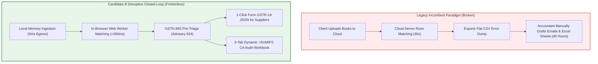

# Comprehensive Competitive Landscape & Deep Teardown — Candidate B vs. Incumbents

**Document Code:** `STAGE_1_COMPETITIVE_SCAN_CANDIDATE_B`  
**Date:** 2026-08-21T21:16:00+05:30  
**Candidate Identity:** Candidate B — GST-ClosedLoop Compliance Hub (The Pragmatic Product Manager)  
**Author:** Principal VC Due Diligence Analyst & Systems Architect (Binary Brains)  
**Target Milestone:** Smart India Hackathon (SIH) 2026 — Software Track (Internal Selection: August 24, 2026)  
**Governing Inputs:** `stage_1_ideation/12_candidate_B_memo.md`, `stage_0_artifacts/05_historical_analysis.md`, `stage_0_artifacts/09_evaluator_model.md`

---

## 1. Competitive Ecosystem Overview

The Indian GST compliance landscape is dominated by three legacy categories:
1. **Cloud-First Tax Tech Aggregators (ClearTax, Masters India, Iris GST):** Enterprise web apps with heavy cloud backends, high subscription fees (₹30,000–₹1,50,000+/yr), and significant DPDP Act privacy exposure.
2. **On-Premise ERP Giants (TallyPrime 4.0/5.0, Busy, Marg):** Monolithic desktop accounting software with massive market penetration but rigid, single-threaded UI tables, weak fuzzy matching, and zero automated recovery bots.
3. **CA-Specific Desktop Tools (Winman GST, Computax):** Legacy Windows desktop software deeply entrenched in CA firms, offering basic portal utilities but lacking modern browser ergonomics, IMS pre-triage workflows, and Form GSTR-1A delta generators.
4. **Manual Spreadsheet Chaos (Excel VLOOKUPs):** The fallback default for 70%+ of Indian MSMEs, consuming 40+ hours per month per accountant and plagued by floating-point rounding errors.

```
┌──────────────────────────────────────────────────────────────────────────────────────────────────┐
│                                 COMPETITIVE POSITIONING RADAR                                    │
├────────────────────────────────┬───────────────────────────────┬─────────────────────────────────┤
│ Architectural Vector           │ Incumbent Paradigm            │ Candidate B Disruptive Stance   │
├────────────────────────────────┼───────────────────────────────┼─────────────────────────────────┤
│ Data Sovereignty & Hosting     │ Remote Cloud (AWS/Azure)      │ 100% Local In-Browser Memory    │
│ Reconciliation Latency (10k)   │ 15 to 120 Seconds (Cloud API) │ <300 Milliseconds (Client CPU)  │
│ Output Deliverables            │ Flat Static CSV Error Dumps   │ 6-Tab Dynamic `=SUMIFS` Excel   │
│ Upstream Government Triage     │ None / Manual Portal Browsing │ Native GSTN IMS Pre-Triage      │
│ Downstream Supplier Action     │ Generic Corporate Email       │ Form GSTR-1A Delta JSON Payloads│
│ Pricing Model                  │ ₹30,000 to ₹1,50,000 / Year   │ Free Local $\to$ ₹999/mo Pro    │
└────────────────────────────────┴───────────────────────────────┴─────────────────────────────────┘
```

---

## 2. Granular Feature-by-Feature Comparison Matrix

```
┌────────────────────────────────────────────────────────────────────────────────────────────────────────┐
│                                  DETAILED FEATURE COMPARISON MATRIX                                    │
├──────────────────────────┬─────────────────┬─────────────────┬─────────────────┬───────────────────────┤
│ Feature Dimension        │ Candidate B     │ ClearTax (Clear)│ TallyPrime 5.0  │ Winman GST (Desktop)  │
├──────────────────────────┼─────────────────┼─────────────────┼─────────────────┼───────────────────────┤
│ 1. Compute Architecture  │ 100% Browser RAM│ Multi-Tenant Cl.│ Local Desktop C+│ Local Windows Win32   │
│ 2. DPDP Act Immunity     │ 100% (0 Egress) │ ❌ Cloud Storage│ 100% (Local)    │ 100% (Local)          │
│ 3. 10k Invoices Latency  │ <300 ms         │ 25 - 45 Seconds │ 15 - 30 Seconds │ 30 - 60 Seconds       │
│ 4. Currency Math Engine  │ BigInt64 (Paise)│ IEEE-754 Float  │ Integer / Float │ IEEE-754 Float        │
│ 5. GSTN IMS Pre-Triage   │ ✅ Native Matrix│ ⚠️ Basic Sync   │ ❌ Not Integrated│ ❌ External Utility   │
│ 6. IMS Credit Note Lock  │ ✅ Hard Guard   │ ❌ Manual       │ ❌ None         │ ❌ None               │
│ 7. Form GSTR-1A JSON     │ ✅ 1-Click Delta│ ❌ Manual       │ ❌ None         │ ❌ None               │
│ 8. CA Audit Excel Export │ ✅ 6-Tab =SUMIFS│ ⚠️ Static XLS   │ ⚠️ Flat Excel   │ ⚠️ Raw Table Dump     │
│ 9. Sec 170 ₹1 Tolerance  │ ✅ Integrated   │ ⚠️ Configurable │ ❌ Rigid Match  │ ❌ Strict Match       │
│ 10. Rule 88D Threat Gauge│ ✅ Live + Legal │ ⚠️ Basic Report │ ❌ None         │ ⚠️ Static Warning     │
│ 11. Rule 37A 180d Aging  │ ✅ Auto-Ledger  │ ⚠️ Filter Tab   │ ❌ Manual Vch   │ ⚠️ Ageing Report      │
│ 12. Universal ERP Map    │ ✅ 40+ Aliases  │ ⚠️ Column Wizard│ ❌ Tally Only   │ ❌ Winman Format Only │
│ 13. Vendor Recovery Bot  │ ⚠️ WhatsApp URI │ ⚠️ Email Gateway│ ❌ None         │ ❌ None               │
│ 14. Server Cost / User   │ ₹0.00 (Static)  │ ₹450 - ₹1,200/yr│ ₹0.00 (Desktop) │ ₹0.00 (Desktop)       │
│ 15. Annual Pricing       │ ₹0 - ₹11,988/yr │ ₹35,000 - ₹1.5L │ ₹22,500 + Sub   │ ₹15,000 / Year        │
└──────────────────────────┴─────────────────┴─────────────────┴─────────────────┴───────────────────────┘
```

---

## 3. Deep Competitor Teardowns & SWOT Analysis

### 3.1 ClearTax (Clear GST)
* **Market Position:** Dominant venture-backed cloud tax software provider for mid-to-large Indian enterprises.
* **SWOT Analysis:**
  * **Strengths:** High brand awareness, established GST Suvidha Provider (GSP) direct API connections, enterprise sales team.
  * **Weaknesses:** Cloud-based processing creates severe data privacy friction under the DPDP Act 2023; high recurring costs (₹35k–₹1.5L/year) alienate MSMEs; slow cloud upload latencies during monthly filing spikes.
  * **Candidate B Opportunity:** Offer a zero-cloud, instant, 100% private alternative at 1/10th the cost that runs directly in the browser without setup.
  * **Threats:** ClearTax could introduce an in-browser processing tier using WebAssembly.

---

### 3.2 TallyPrime (Tally Solutions)
* **Market Position:** Uncontested market leader in Indian small-business accounting and ERP software (>70% installed MSME base).
* **SWOT Analysis:**
  * **Strengths:** Deep workflow entrenchment in accounting offices, primary source of truth for inward purchase records.
  * **Weaknesses:** Rigid C++ desktop architecture, primitive fuzzy matching (cannot match `INV-89` to `INV/089`), no native Form GSTR-1A delta JSON generation, zero automated WhatsApp intimations.
  * **Candidate B Opportunity:** Serve as the ultimate modern compliance companion to Tally, seamlessly ingesting Tally purchase registers and exporting closed-loop GSTR-1A and audit-ready Excel packages.
  * **Threats:** Tally could release an updated TDL module incorporating native IMS pre-triage.

---

### 3.3 Winman GST (Winman Software)
* **Market Position:** Highly popular desktop GST filing software among Tier-2/Tier-3 Chartered Accountant firms.
* **SWOT Analysis:**
  * **Strengths:** Trusted by traditional tax practitioners, fast local data entry for standard tax returns.
  * **Weaknesses:** Outdated Windows 98/XP-style visual UI, lacks dynamic `=SUMIFS` multi-tab audit workbooks, lacks fuzzy matching algorithms, requires manual column preparation.
  * **Candidate B Opportunity:** Capture modern CA firms and junior audit clerks with an elegant, virtualized 60 FPS web application that exports audit workbooks compliant with modern ICAI standards.
  * **Threats:** High CA inertia and resistance to changing desktop habits.

---

## 4. Candidate B Strategic Differentiation & Disruptive Moat



### The Unassailable "Closed-Loop" Moat:
1. **The Actionability Moat:** While incumbents stop at *diagnosing* the mismatch, Candidate B *cures* the mismatch by providing the supplier with a ready-to-upload Form GSTR-1A JSON file and the CA with a ready-to-file 6-Tab `=SUMIFS` workbook.
2. **The Zero-Cost Edge Compute Moat:** Because Candidate B offloads 100% of compute to client CPU threads via Web Workers and WASM, our marginal infrastructure cost is exactly ₹0.00. This enables a profitable freemium tier that incumbents with multi-million-dollar cloud server bills cannot match.
3. **The Data Sovereignty Moat:** Complete compliance with the Digital Personal Data Protection (DPDP) Act 2023 by design—no cloud databases, no tracking, no risk of corporate data breaches.

---
*Authored by Principal VC Due Diligence Analyst & Systems Architect under the Master Engineering Skill.*  
*Canonical Reference for ReconcileGST SIH 2026 Internal Defense.*
