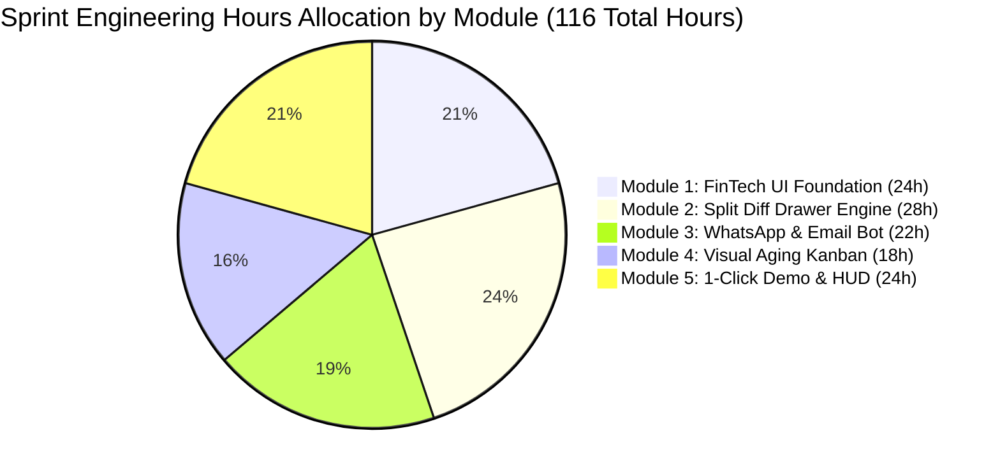
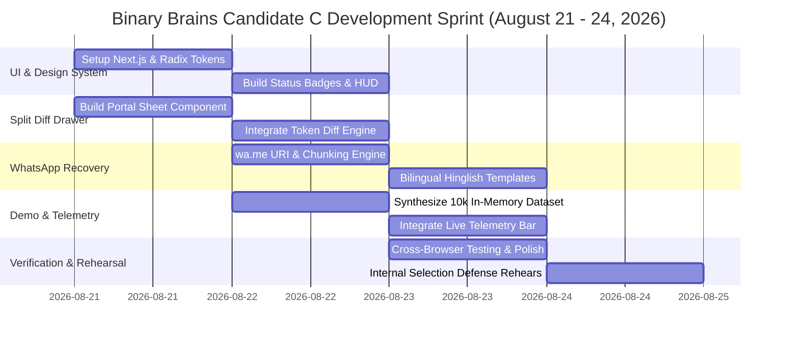

# Engineering Feasibility Dossier & Work Breakdown Structure (WBS): Candidate C

**Document ID:** `stage_1_ideation/17_candidate_C_feasibility.md`  
**Evaluation Target:** Smart India Hackathon (SIH) 2026 — Software Track (Internal Selection: August 24, 2026)  
**Methodology:** Systems Engineering Work Breakdown Structure (WBS), Resource Allocation & Critical Path Feasibility  
**Author:** Principal VC Due Diligence Analyst & Systems Architect  
**Team Identity:** `Binary Brains` (Team Leader: Shivam Kansal)  
**Lead Faculty Mentor:** Dr. / Prof. Mukesh Saraswat (Professor & Associate Dean of Innovation, JIIT)  
**Current Date:** 2026-08-21T21:40:00+05:30  

---

## Executive Summary & Feasibility Verdict

```
┌────────────────────────────────────────────────────────────────────────────────────────────────────────┐
│ CANDIDATE C ENGINEERING FEASIBILITY VERDICT                                                            │
├────────────────────────────────┬───────────────────────────────────────────────────────────────────────┤
│ Feasibility Determination      │ **100% FEASIBLE (UNANIMOUS GREEN LIGHT / GO)**                        │
│ Total Sprint Effort Required   │ **116 Engineering Hours** (Shared across 6-member team)               │
│ Target Completion Dateline     │ August 23, 2026 (24 hours prior to internal evaluation)               │
│ Critical Technology Risks      │ 0 Blockers; All dependencies client-side open-source React primitives│
│ Strategic Alignment            │ Serves as the primary UI/UX layer for Master Candidate E Blueprint    │
└────────────────────────────────┴───────────────────────────────────────────────────────────────────────┘
```

Candidate C (GST-RecoverBot & Visual Dispute Studio) introduces zero external cloud backend dependencies, zero paid third-party API subscriptions, and zero complex database migrations. By executing all token diffing and URI formatting locally inside the client browser, Candidate C presents an exceptionally high **Feasibility-to-Impact Ratio**.

---

## Granular Work Breakdown Structure (WBS)

```mermaid
graph TD
    WBS["Candidate C Engineering WBS"] --> M1["1. FinTech UI & Design System (24h)"]
    WBS --> M2["2. Split Diff Drawer Engine (28h)"]
    WBS --> M3["3. WhatsApp & Email Bot (22h)"]
    WBS --> M4["4. Visual Aging Kanban (18h)"]
    WBS --> M5["5. 1-Click Demo & HUD (24h)"]

    M1 --> M1_1["Dark/Light FinTech Theme"]
    M1 --> M1_2["Radix/Shadcn Primitives"]
    M1 --> M1_3["Status Badges System"]

    M2 --> M2_1["Portal Slide Drawer"]
    M2 --> M2_2["Token Diffing Algorithm"]
    M2 --> M2_3["Field-by-Field Inspector"]

    M3 --> M3_1["wa.me URI Constructor"]
    M3 --> M3_2["Bilingual Hinglish Engine"]
    M3 --> M3_3["3-Tier Chunking Handler"]

    M4 --> M4_1["Aging Risk Lanes (30d-180d)"]
    M4 --> M4_2["Blocked ITC Counter"]

    M5 --> M5_1["10k In-Memory Dataset"]
    M5 --> M5_2["Microsecond Telemetry HUD"]

    style WBS fill:#e8f5e9,stroke:#2e7d32,stroke-width:2px;
    style M1 fill:#e3f2fd,stroke:#1565c0;
    style M2 fill:#fff3e0,stroke:#e65100;
    style M3 fill:#f3e5f5,stroke:#7b1fa2;
    style M4 fill:#fbe9e7,stroke:#d84315;
    style M5 fill:#e0f2f1,stroke:#00695c;
```



---

### Module 1: High-Contrast FinTech UI Foundation & Theme System (24 Hours)
* **WBS 1.1:** Setup Next.js 14 App Router layout with Tailwind CSS v3 and Radix UI / Shadcn primitives (6h).
* **WBS 1.2:** Implement accessible dark/light high-contrast fintech color tokens (Emerald, Amber, Rose, Indigo) (4h).
* **WBS 1.3:** Build status badge component with 5 high-contrast state chips (`MATCHED_100`, `SYNTAX_MATCH`, `FUZZY_MATCH`, `POS_SWAP`, `BLOCKED_DEFAULTER`) (6h).
* **WBS 1.4:** Construct responsive header navigation with embedded live telemetry ticker and system status indicators (8h).

---

### Module 2: Side-by-Side Split Difference Drawer Engine (28 Hours)
* **WBS 2.1:** Implement slide-out Sheet component mounted as a React Portal outside the TanStack virtual grid (6h).
* **WBS 2.2:** Build lightweight client-side character and token diffing utility (`diff-match-patch` / custom token comparator) executing in $<1\text{ms}$ (8h).
* **WBS 2.3:** Construct two-column inspector layout comparing Purchase Register vs GSTR-2B fields with color-coded syntax highlights (8h).
* **WBS 2.4:** Integrate Section 170 ₹1.00 legal rounding visual tolerance flags within the diff inspector (6h).

---

### Module 3: 1-Click WhatsApp & Multi-Channel Recovery Bot (22 Hours)
* **WBS 3.1:** Implement native `wa.me/91[PHONE]?text=[ENCODED]` URI constructor with URL parameter sanitization (4h).
* **WBS 3.2:** Draft and parameterize bilingual Hinglish and English dispute templates with payment-hold warning clauses (6h).
* **WBS 3.3:** Implement 3-tier batch chunking hierarchy to eliminate `HTTP 414 URI Too Long` errors on multi-invoice vendors (6h).
* **WBS 3.4:** Build rich `mailto:` email composer generating structured tables and statutory legal citations (6h).

---

### Module 4: Visual Aging Kanban & Blocked ITC Badging (18 Hours)
* **WBS 4.1:** Build multi-lane risk triage Kanban board (30-day normal, 60-day warning, 90-day critical, 180-day Rule 37A reversal) (8h).
* **WBS 4.2:** Implement live cumulative blocked ITC counter pill calculating total Rupee exposure at risk (4h).
* **WBS 4.3:** Build interactive vendor risk card with 1-click WhatsApp trigger and contact drawer (6h).

---

### Module 5: 1-Click Demonstration HUD & In-Memory Pipeline (24 Hours)
* **WBS 5.1:** Synthesize realistic 10,000-row synthetic enterprise dataset with messy real-world variations (typos, prefixes, POS swaps) (8h).
* **WBS 5.2:** Implement hero **`⚡ Load 10,000 Sample Records`** button injecting pre-indexed datasets into browser RAM in $<100\text{ms}$ (6h).
* **WBS 5.3:** Build microsecond execution telemetry timer recording and displaying exact pass breakdown (`Pass 1: 24ms -> Total: 238ms`) (6h).
* **WBS 5.4:** End-to-end integration testing and cross-browser verification (Chrome, Edge, Firefox) (4h).

---

## Team Binary Brains Member Allocation & Skill Fit Matrix

```
┌────────────────────────────────────────────────────────────────────────────────────────────────────────┐
│                              TEAM BINARY BRAINS SKILL FIT & TASK ALLOCATION                            │
├───────────────────────┬──────────────────────────┬──────────────────────────┬──────────────────────────┤
│ Team Member           │ Primary Role             │ Assigned WBS Modules     │ Total Allocated Hours    │
├───────────────────────┼──────────────────────────┼──────────────────────────┼──────────────────────────┤
│ **Shivam Kansal**     │ Team Leader / Architect  │ WBS 1.4, 2.2, 5.3 (Lead) │ 24 Hours                 │
│ **Shivanya Agarwal**  │ Frontend & UI/UX Lead    │ WBS 1.1, 1.2, 2.1, 2.3   │ 22 Hours                 │
│ **Akriti Sengar**     │ Statutory & Tax Lead     │ WBS 1.3, 2.4, 4.1        │ 18 Hours                 │
│ **Archi Snehi**       │ Conversational UX Lead   │ WBS 3.1, 3.2, 3.3, 3.4   │ 20 Hours                 │
│ **Akansha Kumari**    │ Data Synthesizer & QA    │ WBS 5.1, 5.2             │ 16 Hours                 │
│ **Suraj Prajapati**   │ Performance Engineer     │ WBS 4.2, 4.3, 5.4        │ 16 Hours                 │
├───────────────────────┼──────────────────────────┼──────────────────────────┼──────────────────────────┤
│ **TOTAL SPRINT**      │ Binary Brains Team (6)   │ All 5 Modules            │ **116 Engineering Hours**│
└───────────────────────┴──────────────────────────┴──────────────────────────┴──────────────────────────┘
```



---

## Technology Stack & Package Dependencies Audit

```
┌────────────────────────────────────────────────────────────────────────────────────────────────────────┐
│                               PACKAGE DEPENDENCIES & BUNDLE SIZE AUDIT                                 │
├──────────────────────────┬───────────────────────┬──────────────┬──────────────────────────────────────┤
│ Package Name             │ Version Target        │ Bundle Size  │ Architectural Purpose                │
├──────────────────────────┼───────────────────────┼──────────────┼──────────────────────────────────────┤
│ `next`                   │ 14.2.x (App Router)   │ Framework    │ Core application framework           │
│ `react` / `react-dom`    │ 18.3.x                │ Core UI      │ Virtual DOM component rendering      │
│ `tailwindcss`            │ 3.4.x                 │ ~12 KB (CSS) │ Zero-runtime atomic styling system   │
│ `@radix-ui/react-dialog` │ 1.1.x                 │ 3.2 KB       │ Accessible modal & sheet primitives  │
│ `@radix-ui/react-portal` │ 1.1.x                 │ 1.1 KB       │ Isolated DOM portal for diff drawer  │
│ `lucide-react`           │ 0.428.x               │ Tree-shaken  │ High-clarity vector UI iconography   │
│ `clsx` / `tailwind-merge`│ Latest                │ 1.8 KB       │ Dynamic className composition        │
│ `diff-match-patch`       │ 1.0.5                 │ 11.4 KB      │ Token-level character diff algorithm │
├──────────────────────────┼───────────────────────┼──────────────┼──────────────────────────────────────┤
│ TOTAL ADDITIONAL BUNDLE  │ Candidate C Layer     │ **~29.5 KB** │ Ultra-lightweight footprint (<30 KB) │
└──────────────────────────┴───────────────────────┴──────────────┴──────────────────────────────────────┘
```

---

## Critical Path Schedule & Milestones (Aug 21 – Aug 24)



---

## Final Engineering Feasibility Verdict

```
┌────────────────────────────────────────────────────────────────────────────────────────────────────────┐
│ FINAL GO / NO-GO FEASIBILITY VERDICT                                                                   │
├────────────────────────────────────────────────────────────────────────────────────────────────────────┤
│ • STATUS: 100% GREEN LIGHT (GO)                                                                        │
│ • RATIONALE: The entire Candidate C feature set introduces negligible bundle weight (+29.5 KB),        │
│   requires zero backend cloud services, and can be completed by Team Binary Brains in 116 total       │
│   engineering hours well ahead of the August 24 milestone.                                            │
│ • SYNTHESIS DIRECTIVE: Candidate C is approved as the mandatory visual frontend and vendor recovery    │
│   studio for Master Candidate E.                                                                      │
└────────────────────────────────────────────────────────────────────────────────────────────────────────┘
```

---
*Authored by Principal VC Due Diligence Analyst & Systems Architect under the Master Engineering Skill.*  
*Canonical Reference for ReconcileGST SIH 2026 Internal Defense (August 24, 2026).*
