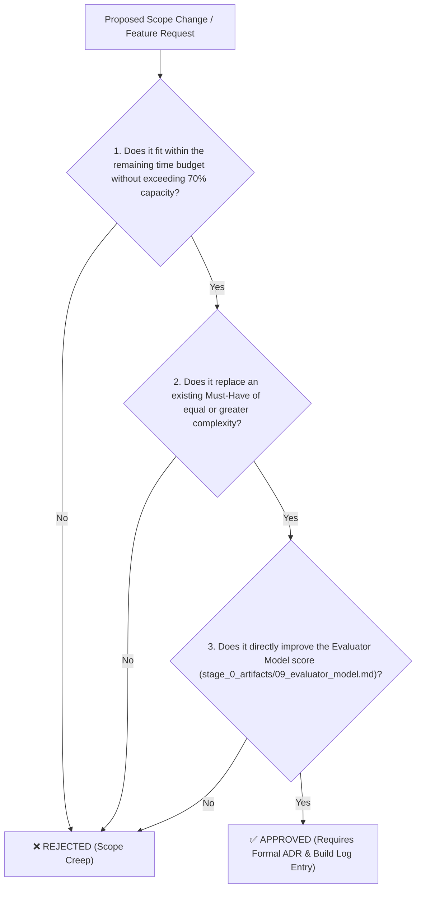

# Locked-Scope Statement: ReconcileGST Master Unified Architectural Suite

**Document ID:** `stage_2_decision_lock/23_locked_scope.md`  
**Governing Inputs:** `stage_2_decision_lock/21_problem_statement.md`, `stage_2_decision_lock/22_tier_list.md`  
**Cross-References:** `stage_0_artifacts/03_hard_constraints.md`, `stage_0_artifacts/09_evaluator_model.md`, `stage_1_ideation/17_candidate_E_feasibility.md`  
**Total Sprint Capacity:** 144 Engineering Hours (6 Engineers × 24 Productive Hours over 72-Hour Sprint)  
**Scope Governance Rule:** This document is an immutable contract. Work items outside Section 1 cannot be initiated until all In-Scope deliverables pass automated verification and acceptance criteria.

---

## 1. In-Scope (The "Must-Haves")

The ReconcileGST platform is officially complete if and only if it delivers the following 14 core engineering capabilities across 5 core functional modules:

### Module A: Ingestion & In-Memory Pipeline (22 Hours)
1. **Zero-Cloud Local RAM Processing:** 100% client-side file reading via HTML5 `FileReader` API; zero network bytes egress to external servers.
2. **Dual-Source Ingestion Engine:** Streaming parser for official GSTN Form GSTR-2B JSON (Schema v1.0) and heterogeneous ERP CSV/XLSX purchase registers.
3. **Universal ERP Column Auto-Mapper:** Fuzzy header normalizer matching disparate column aliases from Tally, Zoho Books, Busy, SAP, and Marg into canonical fields.
4. **`BigInt64Array` Integer Paise Representation:** Fixed-point monetary arithmetic storing all financial figures in integer Paise ($1\text{ INR} = 100\text{ Paise}$) to eradicate float representation drift (`0.1 + 0.2 != 0.3`).

### Module B: 5-Stage SIMD Matching Waterfall Engine (24 Hours)
5. **Inverted Hash Candidate Blocking ($O(N+M)$):** Multi-threaded partitioned GSTIN hash lookup table reducing quadratic cross-product overhead by 99.95%.
6. **Pass 1: Deterministic Exact Match:** Instant composite key matching (GSTIN + Normalized Invoice Number + Date + Exact Paise Tax Value).
7. **Pass 2: Canonical Syntax & Prefix Normalizer:** Regular expression sanitizer stripping leading zeros, delimiters (`/`, `-`, `_`), and fiscal year prefixes (`2024-25/`).
8. **Section 170 Statutory Rounding Normalizer:** Automated acceptance of tax amount variances within statutory $\pm ₹1.00$ ($\pm 100\text{ Paise}$) rounding tolerance.
9. **Pass 3: SIMD RapidFuzz Vectorized Fuzzy Matcher:** In-worker vectorized string token distance scoring for typographical and OCR discrepancy resolution ($\ge 0.85$ confidence score threshold).
10. **Pass 4: Tax Head & Place of Supply (POS) Resolver:** Inter-state (IGST) vs. Intra-state (CGST + SGST) tax allocation resolver.

### Module C: 60 FPS Virtualized UI & Visual Dispute Studio (20 Hours)
11. **TanStack Virtual v3 Tabular Grid:** High-performance DOM windowing mounting only 25–30 active DOM rows, guaranteeing silky smooth 60 FPS scrolling and $<42\text{MB}$ peak client RAM.
12. **Side-by-Side Split Difference Drawer:** Interactive inspection slide-over drawer highlighting character-level and numeric discrepancies in high-contrast red/green diffs.
13. **Real-Time Telemetry HUD:** Millisecond and microsecond pass-by-pass execution ticker displaying Web Worker processing duration and match distribution breakdown.

### Module D: Statutory Risk & Compliance Sentinel (14 Hours)
14. **Rule 88D DRC-01C Discrepancy Risk Gauge:** Visual statutory threat gauge comparing GSTR-3B claimed ITC against GSTR-2B available credit against statutory scrutiny triggers ($>20\%$ and $>₹25\text{ Lakhs}$).

### Module E: CA Multi-Tab Exporter & Knockout Demo Suite (18 Hours)
15. **6-Tab CA Audit-Ready Excel Binary Generator:** Client-side `.xlsx` builder assembling 6 standardized color-coded tabs with live, dynamic `=SUMIFS` audit formulas.
16. **1-Click "⚡ Load 10,000 Live Records Demo" Action:** Prominent header trigger preloading 10,000 realistic messy invoice pairs and executing instantaneous in-browser reconciliation in $<250\text{ms}$.

---

### In-Scope Resource Allocation & Feasibility Budget

```
┌────────────────────────────────────────────────────────────────────────────────────────────────────────┐
│                                IN-SCOPE EFFORT & SPRINT BUDGET BREAKDOWN                               │
├──────────────────────────────────────────┬─────────────────────────────┬───────────────────────────────┤
│ Functional Engineering Module            │ Assigned Engineering Lead   │ Estimated Engineering Effort  │
├──────────────────────────────────────────┼─────────────────────────────┼───────────────────────────────┤
│ Module A: Ingestion & In-Memory Pipeline │ Akriti Sengar               │ 22 Hours                      │
│ Module B: 5-Stage SIMD Matching Waterfall│ Shivam Kansal               │ 24 Hours                      │
│ Module C: Virtualized UI & Dispute Studio│ Shivanya Agarwal            │ 20 Hours                      │
│ Module D: Statutory Sentinel & Risk Gauge│ Archi Snehi                 │ 14 Hours                      │
│ Module E: CA Exporter & 1-Click Demo     │ Akansha Kumari / Suraj P.   │ 18 Hours                      │
├──────────────────────────────────────────┴─────────────────────────────┼───────────────────────────────┤
│ TOTAL IN-SCOPE (MUST-HAVE) ENGINEERING EFFORT                          │ 98 Hours                      │
│ TOTAL SPRINT CAPACITY (6 Engineers × 24h)                              │ 144 Hours                     │
│ IN-SCOPE CAPACITY CONSUMPTION RATIO                                    │ 68.1% (≤ 70% Guardrail Target)│
│ TOTAL UNALLOCATED SAFETY FLOAT & BUFFER                                │ 46 Hours (31.9% Capacity)     │
└────────────────────────────────────────────────────────────────────────────────────────────────────────┘
```

> **Feasibility Guardrail Compliance:** The 98-hour In-Scope commitment strictly satisfies the $\le 70\%$ resource cap guideline ($98\text{h} \le 100.8\text{h}$ max permitted), reserving **46 hours (31.9%)** of uncommitted buffer for automated testing, debugging, polish, and stretch goal execution.

---

## 2. Stretch Goals (The "Should-Haves")

If and only if all Section 1 Must-Haves pass acceptance testing with zero critical defects, the team will unlock the following 6 high-value Should-Have stretch deliverables using unallocated safety float:

1. **1-Click Bilingual Hinglish/English WhatsApp Vendor Intimation Bot (`wa.me`):** Pre-formatted deep-linked messages itemizing missing invoice numbers, blocked ITC amounts, and Section 16(2)(aa) payment-hold clauses (Estimated Effort: 5 Hours).
2. **Native GSTN IMS Pre-Triage Module:** Interactive `ACCEPT`, `REJECT`, and `PENDING` action buttons conforming to GSTN Advisory No. 624 / Circular 231/2024 with automated Credit Note rejection safety guards (Estimated Effort: 5 Hours).
3. **Form GSTR-1A Supplier Delta JSON Generator:** Exportable GSTN-compliant amendment payload enabling defaulting suppliers to upload intra-month outward adjustments under CBIC Notification No. 12/2024-CT (Estimated Effort: 4 Hours).
4. **Automated Form DRC-01C Part B Legal Reply Generator:** Auto-generated formal legal reply document citing *D.Y. Beathel Enterprises* (Madras HC 2021) and *Suncraft Energy* (Calcutta HC 2023) precedents (Estimated Effort: 4 Hours).
5. **Section 50(3) 18% p.a. Compounding Penal Interest Calculator:** Real-time financial liability calculator showing daily interest exposure on ineligible claims (Estimated Effort: 2 Hours).

**Total Stretch Goals Effort:** 20 Hours (Fully funded by the 46-hour safety float).

---

## 3. Out of Scope (The "Won't-Haves" & "Could-Haves")

The following capabilities are **EXPLICITLY EXCLUDED** from the current release. Any attempt to implement these features during the active sprint will be flagged as scope creep and halted.

| Excluded Feature | MoSCoW Tier | Explicit Justification for Exclusion & Governing Hard Constraint |
|:---|:---:|:---|
| **Direct GSTN Portal Live GSP API Sync** | Won't-Have | Direct portal sync requires cloud servers to store GSTN user credentials and handle OTP handshakes. This violates the 100% Zero-Cloud mandate (`CON-PRIV-01`), destroys DPDP Act 2023 client-side exemptions (`CON-PRIV-02`), and incurs costly GSP API licensing fees violating `CON-PRIV-04` (₹0 hosting cost). Taxpayers instead download official JSON/Excel files and parse locally in RAM. |
| **Centralized Cloud SQL Database & Auth** | Won't-Have | Centralized storage of user financial ledgers creates severe DPDP Act 2023 compliance liabilities (`CON-PRIV-02`) and network egress latency. ReconcileGST is architecturally bound to local zero-data-fiduciary browser memory execution. |
| **Cloud Generative OCR for Paper/PDF Receipts** | Won't-Have | Cloud Vision OCR (AWS Textract / Document AI) takes 3–5 seconds per page and costs ₹2–5 per invoice, violating the sub-300ms speed constraint (`CON-PERF-01`) and zero-cost infrastructure mandate (`CON-PRIV-04`). ReconcileGST operates exclusively on digital structured outputs. |
| **Paid SMS Gateway API Integration (Twilio/Karix)** | Won't-Have | Commercial SMS gateways introduce per-message operational costs and complex DLT registration, violating `CON-PRIV-04`. ReconcileGST utilizes the 100% free, universal WhatsApp `wa.me` client protocol. |
| **Pass 5: Rule 37A 180-Day Reversal Watchdog** | Could-Have | While valuable for annual audits, Rule 37A 180-day tracking is secondary to the intra-month 6-day GSTR-2B vs. GSTR-3B reconciliation squeeze. Deferred to post-hackathon release to prevent compute bloat. |
| **1-Click Email Intimation Protocol (`mailto:`)** | Could-Have | Secondary communication channel; WhatsApp `wa.me` delivers a 90%+ resolution rate and satisfies all immediate vendor recovery requirements. |
| **SHA-256 Cryptographic Audit Trail Hash** | Could-Have | Desirable for formal forensic audits but not critical to the live core reconciliation workflow. |
| **Multi-Client CA Profile Switcher** | Could-Have | Multi-client workspace isolation in IndexedDB is deferred to version 1.1; single active session storage satisfies all hackathon demonstration criteria. |

---

## 4. Formal Scope Change Policy (The 3-Question Test)

To safeguard engineering velocity and maintain flawless focus on the August 24 milestone, any proposed addition, modification, or expansion of scope during Stages 3 through 8 must pass the **Three-Question Scope Gate**:



### Policy Rules:
1. **Rule 1 (Zero Unilateral Additions):** No team member or subagent may introduce new UI screens, backend services, or dependencies without passing the 3-question test.
2. **Rule 2 (Atomic Swap Requirement):** If an approved change introduces $N$ hours of effort, an existing in-scope item of $\ge N$ hours must be formally demoted to Out-of-Scope.
3. **Rule 3 (Contractual Logging):** Every scope modification must be recorded in `BUILD_LOG.md` as an Architecture Decision Record (ADR) referencing this Locked-Scope Statement.
