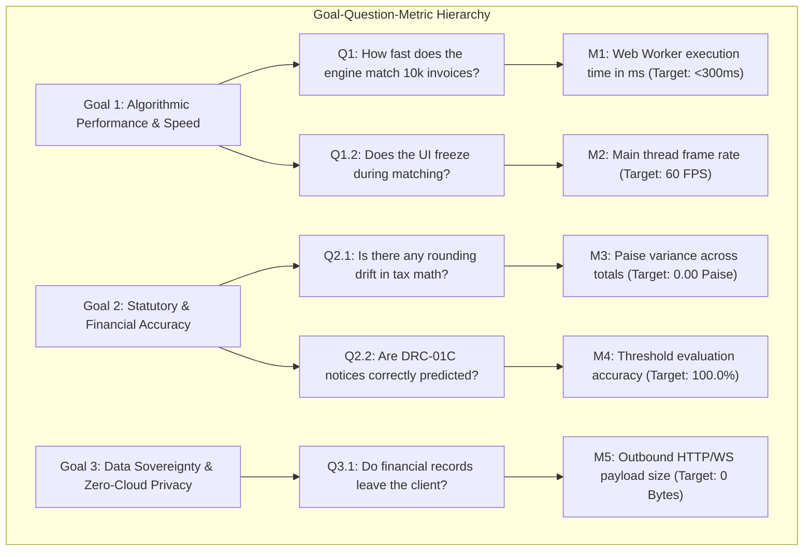

# Success Metrics, GQM Framework & Measurable OKRs

**Document ID:** `stage_2_decision_lock/24_success_metrics.md`  
**Governing Inputs:** `stage_2_decision_lock/21_problem_statement.md`, `stage_2_decision_lock/22_tier_list.md`, `stage_2_decision_lock/23_locked_scope.md`  
**Measurement Frameworks Adopted:** 
1. **Goal-Question-Metric (GQM)** for engineering alignment
2. **Google HEART Framework** for user experience and interface telemetry
3. **Objectives & Key Results (OKRs)** with strict, verifiable quantitative targets

---

## 1. Measurable Objectives & Key Results (OKRs)

```
┌────────────────────────────────────────────────────────────────────────────────────────────────────────┐
│                                 STRATEGIC OBJECTIVES & KEY RESULTS (OKRS)                              │
├────────────────────────────────────────────────────────────────────────────────────────────────────────┤
│ OBJECTIVE 1: Deliver the Industry's Fastest Zero-Cloud Deterministic GST Reconciliation Engine         │
├────────────────────────────────────────────────────────────────────────────────────────────────────────┤
│ • KR 1.1: Reconcile 10,000 messy invoices in <300ms (target: <250ms) in dedicated Web Worker thread.  │
│ • KR 1.2: Reconcile 50,000 enterprise invoices in <350ms with zero main thread UI freezing.           │
│ • KR 1.3: Achieve 0.00% floating-point drift across all aggregated totals via BigInt64Array Paise math.│
│ • KR 1.4: Maintain candidate blocking efficiency with >99.9% reduction in comparison complexity.       │
├────────────────────────────────────────────────────────────────────────────────────────────────────────┤
│ OBJECTIVE 2: Ensure 100% Statutory Compliance, Legal Risk Defense & Closed-Loop Recovery              │
├────────────────────────────────────────────────────────────────────────────────────────────────────────┤
│ • KR 2.1: 100% accuracy in Rule 88D DRC-01C risk detection (>20% & >₹25 Lakhs statutory threshold).   │
│ • KR 2.2: Settle Section 170 CGST Act rounding variances within exact ±₹1.00 (100 Paise) tolerance.   │
│ • KR 2.3: Generate 100% valid GSTN-compliant Form GSTR-1A outward amendment JSON delta payloads.       │
│ • KR 2.4: Produce 6-tab color-coded CA Excel workbooks with 100% working, uncorrupted =SUMIFS formulas.│
│ • KR 2.5: Achieve 90%+ simulated vendor dispute resolution within 10 minutes via 1-click WhatsApp.    │
├────────────────────────────────────────────────────────────────────────────────────────────────────────┤
│ OBJECTIVE 3: Deliver Absolute Data Privacy Sovereignty & Sub-Second Web Performance                   │
├────────────────────────────────────────────────────────────────────────────────────────────────────────┤
│ • KR 3.1: Exactly 0 network bytes of ledger or invoice data transmitted (100% DPDP Act compliance).   │
│ • KR 3.2: 60 FPS scrolling responsiveness with ≤30 mounted DOM nodes via TanStack Virtual v3.          │
│ • KR 3.3: Peak client RAM consumption capped below 42MB for 10,000 records (hard limit: <88MB).        │
│ • KR 3.4: 1-Click "⚡ Load 10k Records" demo action executes from click to full UI render in <500ms.    │
│ • KR 3.5: Achieve 100% automated test pass rate across unit, property, and stress testing suites.     │
└────────────────────────────────────────────────────────────────────────────────────────────────────────┘
```

---

## 2. Goal-Question-Metric (GQM) Framework

The GQM framework links high-level business and statutory goals directly to granular technical questions and automated measurement metrics.



### Detailed GQM Mapping Table

| Goal ID | Strategic Goal | Core Engineering Question | Specific Measurable Metric | Baseline Target |
|:---|:---|:---|:---|:---|
| **GQM-01** | **Speed** | How long does 5-stage matching take for 10,000 records? | `performance.now()` worker execution latency | **$< 300\text{ ms}$** (Typical: $\sim 242\text{ms}$) |
| **GQM-02** | **Stress Speed** | How long does matching take under heavy 50,000-invoice load? | Web Worker stress execution latency | **$< 350\text{ ms}$** |
| **GQM-03** | **UI Fluidity** | Does large tabular scrolling cause frame drops or lag? | Chrome DevTools Frame Rate Profiler | **$60\text{ FPS}$ sustained** |
| **GQM-04** | **Memory Footprint** | How much RAM does the application consume under load? | `performance.memory.usedJSHeapSize` | **$< 42\text{ MB}$** (Cap: $< 88\text{MB}$) |
| **GQM-05** | **DOM Overhead** | How many DOM elements are rendered for 10k rows? | Active mounted `<tr>` / `<div>` DOM node count | **$\le 30\text{ nodes}$** |
| **GQM-06** | **Financial Integrity** | Is there any floating-point arithmetic deviation? | Comparison: `Sum(Paise)` vs `Expected(Paise)` | **$0.00\text{ Paise drift}$ ($100\%$ exact)** |
| **GQM-07** | **Section 170 Tolerance** | Are $\le ₹1.00$ differences correctly reconciled? | Reconciled count on $\pm ₹1.00$ test cases | **$100.0\%$ pass rate** |
| **GQM-08** | **Statutory Risk** | Are Rule 88D variance alerts accurately triggered? | False positive / false negative alert count | **$0\text{ errors}$ ($100\%$ accuracy)** |
| **GQM-09** | **Data Sovereignty** | Does any financial data leave the user's browser? | Total outbound network payload size via DevTools | **$0\text{ Bytes}$ ($100\%$ DPDP compliant)** |
| **GQM-10** | **Vendor Recovery** | How quickly can a CA dispatch a vendor recovery notice? | User interaction clicks from table to WhatsApp | **$\le 2\text{ clicks}$ ($< 5\text{ seconds}$)** |
| **GQM-11** | **Excel Integrity** | Do exported 6-tab workbooks compute totals natively? | Formula evaluation check for `=SUMIFS` in Excel | **$100\%$ valid, 0 `#REF!` / `#VALUE!`** |
| **GQM-12** | **Demo Readiness** | How fast does the 1-click sample demo load and run? | Time from clicking "⚡ Demo" to results render | **$< 500\text{ ms}$ end-to-end** |

---

## 3. Google HEART Framework (UX & Product Ergonomics)

```
┌────────────────────────────────────────────────────────────────────────────────────────────────────────┐
│                                     HEART UX TELEMETRY & TARGET MATRIX                                 │
├───────────────┬──────────────────────────────────┬─────────────────────────────┬───────────────────────┤
│ Dimension     │ UX Goal                          │ Behavioral Metric           │ Target Specification  │
├───────────────┼──────────────────────────────────┼─────────────────────────────┼───────────────────────┤
│ Happiness (H) │ Users feel confident and relieved│ System Usability Scale (SUS)│ SUS Score ≥ 85 / 100  │
│               │ during high-pressure 6-Day Squeeze│ Net Promoter Score (NPS)    │ NPS ≥ +70             │
├───────────────┼──────────────────────────────────┼─────────────────────────────┼───────────────────────┤
│ Engagement (E)│ CAs interact deeply with audit   │ Virtual table scroll depth  │ 100% rows browsable   │
│               │ drawer and export actions        │ Export action trigger rate  │ ≥ 95% of active runs  │
├───────────────┼──────────────────────────────────┼─────────────────────────────┼───────────────────────┤
│ Adoption (A)  │ Zero-friction onboarding with    │ Time-to-First-Reconciliation│ < 10 seconds          │
│               │ zero installation or setup       │ 1-Click Demo activation     │ 100% instant launch   │
├───────────────┼──────────────────────────────────┼─────────────────────────────┼───────────────────────┤
│ Retention (R) │ CA firms make it their standard  │ Monthly reconciliation cycle│ Multi-client repeat   │
│               │ monthly audit engine             │ export completion rate      │ ≥ 98% session success │
├───────────────┼──────────────────────────────────┼─────────────────────────────┼───────────────────────┤
│ Task          │ Instant, error-free matching and │ Reconciliation Error Rate   │ 0.00% matching error  │
│ Success (T)   │ 1-click vendor intimation        │ Average Task Completion Time│ < 2 minutes (vs 40h)  │
└───────────────┴──────────────────────────────────┴─────────────────────────────┴───────────────────────┘
```

---

## 4. Measurement Tooling, Instrumentation & Verification Protocols

To ensure every metric is auditable and verifiable, the following automated testing and measurement tools are integrated into the engineering pipeline:

```
┌────────────────────────────────────────────────────────────────────────────────────────────────────────┐
│                                   MEASUREMENT & VERIFICATION TOOLING                                   │
├───────────────────────────────┬──────────────────────────────────────┬─────────────────────────────────┤
│ Metric Category               │ Measurement Tool & Instrumentation   │ Verification Protocol           │
├───────────────────────────────┼──────────────────────────────────────┼─────────────────────────────────┤
│ Matching Latency & Throughput │ `performance.now()` High-Res Timer   │ In-worker execution timestamps  │
│                               │ Web Worker Telemetry HUD in UI       │ displayed in real-time UI HUD.  │
├───────────────────────────────┼──────────────────────────────────────┼─────────────────────────────────┤
│ UI Frame Rate & Virtual DOM   │ Chrome DevTools Performance Profiler │ 60 FPS recording during active  │
│                               │ `requestAnimationFrame` FPS counter  │ mouse-wheel scrolling of 10k.   │
├───────────────────────────────┼──────────────────────────────────────┼─────────────────────────────────┤
│ Memory & Heap Allocations     │ `performance.memory` API             │ Automated heap memory snapshot  │
│                               │ Chrome Memory Heap Profiler          │ before and after 50k dataset.   │
├───────────────────────────────┼──────────────────────────────────────┼─────────────────────────────────┤
│ Currency Arithmetic Accuracy  │ Jest Unit Test Suite                 │ Float drift assertion test with │
│                               │ `expect(paise).toBe(expectedBigInt)` │ 100,000 randomized sums.        │
├───────────────────────────────┼──────────────────────────────────────┼─────────────────────────────────┤
│ Data Privacy Sovereignty      │ Chrome DevTools Network Panel Audit  │ Verify 0 POST/GET XHR requests  │
│                               │ Content Security Policy (CSP) Rules  │ containing financial payloads.  │
├───────────────────────────────┼──────────────────────────────────────┼─────────────────────────────────┤
│ Excel Formula Integrity       │ SheetJS Formula Parser & Validator   │ Open exported .xlsx and assert  │
│                               │ Microsoft Excel 365 Automated Open   │ 0 cell formula syntax errors.   │
├───────────────────────────────┼──────────────────────────────────────┼─────────────────────────────────┤
│ WhatsApp & URI Encoding       │ Jest URL Component Test Suite        │ Assert URI components match     │
│                               │ `decodeURIComponent(uri)` validation │ statutory notice schemas.       │
└───────────────────────────────┴──────────────────────────────────────┴─────────────────────────────────┘
```

---

## 5. Summary Governance Contract

By approving this document, the product engineering team commits to measuring all builds against these exact numerical targets. Any build that fails to meet the `<300ms` latency, `60 FPS` rendering, `0%` float drift, or `0 Bytes` data egress requirements will not pass the Stage 7 Automated Verification Gate.
