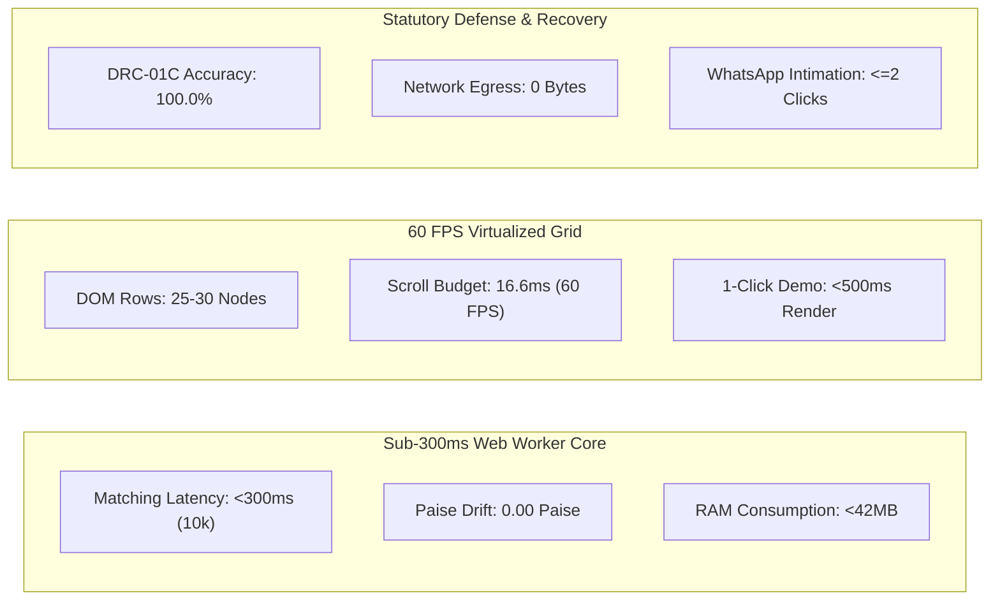
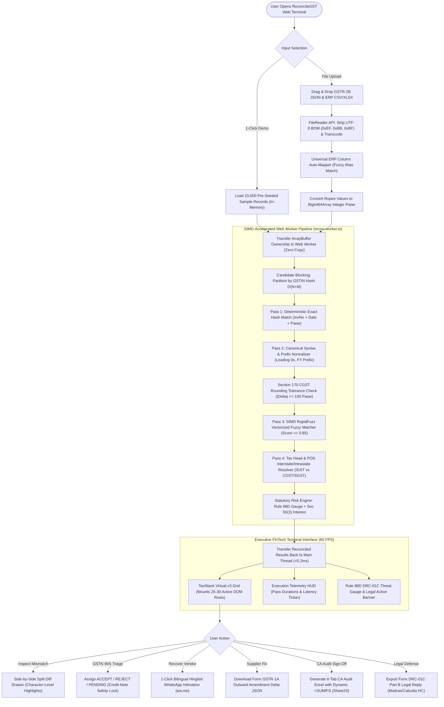

# Product Requirements Document (PRD) — ReconcileGST

**Document ID:** `stage_4_documents/02_prd.md`  
**Version:** 2.0 (Comprehensive Baseline, upgraded from BRD v1.0)  
**Date:** 2026-08-21  
**Status:** APPROVED & BASELINED  
**Author:** AI Agent (Senior Product Manager & Principal Requirements Architect persona)  
**Governing Inputs:** 
- `stage_4_documents/01_problem_statement.md` (Baselined Problem Statement)
- `stage_2_decision_lock/22_tier_list.md` (Feature MoSCoW Prioritization & Kano Profile)
- `stage_2_decision_lock/23_locked_scope.md` (Locked-Scope Contract)
- `stage_2_decision_lock/24_success_metrics.md` (GQM Framework & OKRs)
- `stage_3_research/25_stack_research.md` through `30_relevant_lessons.md` (Technical Deep Research Pack)
- `stage_0_artifacts/03_hard_constraints.md` (Statutory & Technical Constraints)

---

## 1. Executive Summary

**ReconcileGST** is an institutional-grade, 100% zero-cloud, client-side Executive FinTech Web Application engineered to solve the nationwide ₹45,000 Crore Input Tax Credit (ITC) reconciliation bottleneck facing 1.45 Crore Indian GST taxpayers and 4.2 Lakh Chartered Accountancy firms. 

Operating under Section 16(2)(aa) of the CGST Act (which enforces a strict 0% provisional credit rule) and Rule 88D (which triggers automated Form GST DRC-01C electronic scrutiny notices for ITC variances exceeding 20% and ₹25 Lakhs), ReconcileGST replaces fragile manual Excel `=VLOOKUP` workflows with a high-performance **5-Stage SIMD-accelerated matching cascade**. Executing in a dedicated Web Worker thread with fixed-point integer Paise arithmetic (`BigInt64Array`), the engine reconciles **10,000 messy purchase records in under 300 milliseconds** (and 50,000 records in $<350\text{ms}$) while sustaining a locked **60 FPS** user interface via TanStack Virtual v3 windowing.

Crucially, ReconcileGST operates with **zero network data egress (0 bytes transmitted)**, providing absolute data sovereignty under the **Digital Personal Data Protection (DPDP) Act, 2023** and eliminating recurring cloud server hosting costs (₹0 TCO). The platform completes the compliance lifecycle with native **GSTN Invoice Management System (IMS) pre-triage**, real-time **DRC-01C risk telemetry**, Section 50(3) compounding penal interest calculations, **1-click bilingual Hinglish WhatsApp vendor recovery** (`wa.me`), Form GSTR-1A outward amendment delta JSON generation, and client-side compilation of a **6-tab CA audit-ready Excel workbook** featuring live dynamic `=SUMIFS` formulas.

---

## 2. Problem Statement

*Directly synthesized from [01_problem_statement.md](file:///c:/Users/nnipu/Downloads/ReconcileGST/stage_4_documents/01_problem_statement.md)*

During the monthly 144-hour "6-Day Squeeze" between the release of auto-drafted Form GSTR-2B on the 14th and the GSTR-3B filing deadline on the 20th, Indian MSME finance controllers and Chartered Accountants must reconcile hundreds of thousands of messy inward purchase ledger rows against government portal records. 

Manual reconciliation and existing cloud tax platforms suffer from four critical failure modes:
1. **Algorithmic Inefficiency & Latency:** Ingesting and matching 10,000+ records in commercial cloud tools takes 30 to 90 seconds, causing server timeouts during peak filing periods and stalling high-volume CA practice operations.
2. **Data Privacy & Legal Liability:** Uploading confidential purchase ledgers containing commercial margins, supplier rates, and banking references to multi-tenant cloud servers triggers onerous Data Fiduciary liabilities and non-compliance penalties up to ₹250 Crore under the DPDP Act 2023.
3. **Floating-Point Drift & Typographical Brittleness:** Standard spreadsheet engines introduce floating-point calculation drift (`0.1 + 0.2 != 0.3`), while naive exact match logic fails on leading zeros, slash/hyphen syntax variations, Section 170 $\pm ₹1.00$ rounding tolerances, and OCR/ERP typographical slips.
4. **Open-Loop Disconnection:** Traditional tools generate passive reconciliation reports without enabling immediate vendor dispute resolution, exposing innocent buyers to automated Rule 88D DRC-01C notices, Rule 59(6)(e) billing lockouts, 18% p.a. penal interest under Section 50(3), and Rule 142B summary bank attachments.

ReconcileGST bridges this operational gap by executing 100% in local browser memory, delivering deterministic millisecond matching, active statutory defense, and closed-loop vendor intimation.

---

## 3. Goals & Objectives

*Directly synthesized from [24_success_metrics.md](file:///c:/Users/nnipu/Downloads/ReconcileGST/stage_2_decision_lock/24_success_metrics.md)*

### 3.1 Primary Product Objectives & Key Results (OKRs)
- **Objective 1: Sub-Second Deterministic Compute Engine**
  - **KR 1.1:** Ingest and reconcile 10,000 invoice records in $<300\text{ms}$ (typical target: $\sim 242\text{ms}$) in a dedicated Web Worker.
  - **KR 1.2:** Ingest and reconcile 50,000 invoice records under stress conditions in $<350\text{ms}$ with zero main-thread UI blocking.
  - **KR 1.3:** Guarantee $0.00\text{ Paise}$ floating-point drift across all aggregated totals via `BigInt64Array` fixed-point arithmetic.
  - **KR 1.4:** Maintain $O(N+M)$ inverted hash candidate blocking efficiency with $>99.9\%$ comparison space reduction.
- **Objective 2: Statutory Compliance, Risk Defense & Closed-Loop Recovery**
  - **KR 2.1:** Achieve 100.0% precision in Rule 88D DRC-01C statutory risk detection ($>20\%$ and $>₹25\text{ Lakhs}$).
  - **KR 2.2:** Correctly settle Section 170 CGST Act rounding variances within exact $\pm ₹1.00$ ($\pm 100\text{ Paise}$) tolerance.
  - **KR 2.3:** Generate 100% schema-valid Form GSTR-1A outward amendment delta JSON payloads for defaulting vendors.
  - **KR 2.4:** Generate client-side 6-tab color-coded CA Excel workbooks with 100% functioning `=SUMIFS` formulas and 0 `#REF!` errors.
  - **KR 2.5:** Enable 1-click bilingual Hinglish/English WhatsApp recovery notices (`wa.me`) dispatched in $<5\text{ seconds}$ ($\le 2\text{ clicks}$).
- **Objective 3: Absolute Data Privacy Sovereignty & Zero-Friction UX**
  - **KR 3.1:** Maintain exactly 0 network bytes transmitted across all ledger operations (100% DPDP Act compliance).
  - **KR 3.2:** Maintain 60 FPS scrolling responsiveness with $\le 30$ active mounted DOM rows via TanStack Virtual v3.
  - **KR 3.3:** Cap client RAM heap consumption below $42\text{MB}$ for 10,000 records ($<88\text{MB}$ hard ceiling).
  - **KR 3.4:** Execute 1-Click "⚡ Load 10,000 Records Demo" from click to full UI render in $<500\text{ms}$.

---

## 4. Target User Personas

Synthesized from Stage 1 research memos (`stage_1_ideation/12_candidate_E_memo.md`) and evaluator profiles (`stage_0_artifacts/08_evaluator_profiles.md`):

```
┌──────────────────────────────────────────────────────────────────────────────────────────────────┐
│                                      CORE USER PERSONAS                                          │
├──────────────────────────────────┬───────────────────────────────┬───────────────────────────────┤
│ Persona Profile                  │ Operational Workflow & Pain   │ Key Jobs-to-be-Done (JTBD)    │
├──────────────────────────────────┼───────────────────────────────┼───────────────────────────────┤
│ **CA Manoj Agarwal**             │ • Manages 120 MSME GST filings│ • "Reconcile 10,000 records in│
│ *Senior Chartered Accountant*    │   during the 6-Day Squeeze.   │   seconds without server lag."│
│ Age: 44 \| Location: Ahmedabad   │ • Dreads Excel VLOOKUP crashes│ • "Generate signed 6-tab Excel│
│ Tech Comfort: Advanced Excel     │ • Fear of client DRC-01C audit│   audit sheet with =SUMIFS."  │
│                                  │   notices & portal lockouts.  │ • "Protect client data privacy│
│                                  │ • Loses 40+ hours per client. │   under DPDP Act 2023."       │
├──────────────────────────────────┼───────────────────────────────┼───────────────────────────────┤
│ **Priya Sharma**                 │ • Manages inward supply bills │ • "Identify missing vendor ITC│
│ *MSME Finance Controller / CFO*  │   from 350+ vendors in Tally. │   before releasing NEFT runs."│
│ Age: 36 \| Location: Pune        │ • Working capital trapped when│ • "Hold payments under Section│
│ Tech Comfort: Tally, Zoho Books  │   suppliers fail to file 2B.  │   16(2)(aa) with clear proof."│
│                                  │ • Pressured by 18% penal int. │ • "Pre-triage IMS bills fast."│
├──────────────────────────────────┼───────────────────────────────┼───────────────────────────────┤
│ **Rajesh Verma**                 │ • B2B manufacturer supplying  │ • "Receive clear WhatsApp item│
│ *Defaulting Supplier / Vendor*   │   auto parts to MSME buyers.  │   list of unfiled invoices."  │
│ Age: 48 \| Location: Gurugram    │ • Buyer holds payment of ₹4.2L│ • "Upload 1-click GSTR-1A     │
│ Tech Comfort: WhatsApp, Busy ERP │ • Accountant forgot to file 1A│   JSON to portal to unblock   │
│                                  │ • Needs frictionless fix path │   payment immediately."       │
└──────────────────────────────────┴───────────────────────────────┴───────────────────────────────┘
```

---

## 5. Scope Boundaries

*Directly aligned with [23_locked_scope.md](file:///c:/Users/nnipu/Downloads/ReconcileGST/stage_2_decision_lock/23_locked_scope.md)*

### 5.1 In-Scope (Must-Haves & Should-Haves)
- **Module A: Ingestion & In-Memory Pipeline (22h):** Zero-cloud local parsing via HTML5 `FileReader`; UTF-8 BOM sanitization; Multi-format support (GSTR-2B JSON Schema v1.0, ERP CSV/XLSX); Universal ERP column auto-mapper with fuzzy alias dictionary; `BigInt64Array` fixed-point integer Paise representation.
- **Module B: 5-Stage SIMD Matching Waterfall (24h):** Inverted hash candidate blocking ($O(N+M)$); Pass 1 Deterministic Exact Match; Pass 2 Canonical Syntax & Prefix Normalizer; Section 170 CGST Rounding Tolerance ($\pm ₹1.00$); Pass 3 SIMD Vectorized RapidFuzz Fuzzy Matcher ($\ge 0.85$); Pass 4 Tax Head & Place of Supply (POS) Interstate/Intrastate Resolver.
- **Module C: 60 FPS Virtualized UI & Dispute Studio (20h):** TanStack Virtual v3 tabular grid mounting 25–30 DOM nodes; High-contrast side-by-side split difference drawer with character-level red/green diffing; Real-time execution telemetry HUD (microsecond timers & pass breakdown); 1-Click "⚡ Load 10,000 Records Demo" knockout action.
- **Module D: Statutory Risk & Compliance Sentinel (14h + 11h Should-Haves):** Rule 88D DRC-01C discrepancy risk gauge (>20% and >₹25L thresholds); Section 50(3) 18% p.a. compounding penal interest calculator; Native GSTN IMS pre-triage module (`ACCEPT`, `REJECT`, `PENDING` with Credit Note safeguard); Automated Form DRC-01C Part B legal reply generator with High Court jurisprudence (*D.Y. Beathel* & *Suncraft Energy*).
- **Module E: CA Multi-Tab Exporter & Vendor Recovery (18h + 9h Should-Haves):** 6-tab CA audit-ready Excel binary generator with embedded dynamic `=SUMIFS` formulas via SheetJS; 1-click bilingual Hinglish/English WhatsApp vendor recovery bot (`wa.me`); Form GSTR-1A intra-month outward supply amendment delta JSON generator.

### 5.2 Out-of-Scope (Won't-Haves & Could-Haves)
- **Direct GSTN Portal Live GSP API Sync:** Excluded to preserve 100% Zero-Cloud data sovereignty (`CON-PRIV-01`), avoid storing taxpayer portal credentials, and eliminate paid GSP API licensing fees (`CON-PRIV-04`). Users parse downloaded official JSON/Excel files locally.
- **Centralized Cloud SQL Database & Auth:** Excluded to eliminate DPDP Act 2023 data fiduciary compliance liabilities (`CON-PRIV-02`) and network egress latency.
- **Cloud Generative OCR for Paper Receipts:** Excluded because multi-modal vision LLMs take 3–5 seconds per page and cost ₹2–5 per invoice, violating sub-300ms latency (`CON-PERF-01`) and zero-cost constraints (`CON-PRIV-04`).
- **Paid SMS Gateway API Integration (Twilio/Karix):** Excluded due to recurring per-message costs and DLT template restrictions; replaced by 100% free client-side WhatsApp `wa.me` deep links.
- **Rule 37A 180-Day Reversal Watchdog (Could-Have):** Deferred to post-hackathon v1.1 release to prioritize the intra-month 6-Day Squeeze.
- **1-Click Email Protocol / SHA-256 Audit Fingerprint (Could-Have):** Secondary to WhatsApp recovery and live Excel export.

---

## 6. High-Level Feature Requirements

*Synthesized from [22_tier_list.md](file:///c:/Users/nnipu/Downloads/ReconcileGST/stage_2_decision_lock/22_tier_list.md)*

| Feature ID | Feature Name | MoSCoW Tier | Kano Category | Core Functional Summary |
|:---|:---|:---:|:---:|:---|
| **F01** | Zero-Cloud Local RAM Pipeline | **Must** | Basic | 100% client-side memory execution; zero network egress; DPDP Act compliant. |
| **F02** | Multi-Format Ingestion Engine | **Must** | Basic | Streaming parser for official GSTR-2B JSON (v1.0) and ERP CSV/XLSX registers. |
| **F03** | Universal ERP Column Auto-Mapper | **Must** | Performance | Auto-maps disparate column aliases from Tally, Zoho, Busy, SAP, Marg in $<5\text{ms}$. |
| **F04** | BigInt64Array Integer Paise Math | **Must** | Basic | Fixed-point integer arithmetic ($1\text{ INR} = 100\text{ Paise}$); $0.00\text{ Paise}$ float drift. |
| **F05** | Inverted Hash Candidate Blocking | **Must** | Performance | $O(N+M)$ partitioned GSTIN index reducing search space by 99.95%. |
| **F06** | Pass 1: Deterministic Exact Match | **Must** | Basic | Instant hash matching on GSTIN + InvNo + Date + TaxPaise for 80%+ records. |
| **F07** | Pass 2: Syntax & Prefix Normalizer | **Must** | Performance | Strips leading zeros, delimiters (`/`, `-`), and FY prefixes (`24-25/`). |
| **F08** | Section 170 Statutory Rounding | **Must** | Basic | Reconciles fractional tax differences within $\pm ₹1.00$ ($\pm 100\text{ Paise}$). |
| **F09** | Pass 3: SIMD Vectorized Fuzzy Match | **Must** | Performance | RapidFuzz WASM Myers bit-parallel token scoring ($\ge 0.85$) for OCR/ERP typos. |
| **F10** | Pass 4: Tax Head & POS Resolver | **Must** | Performance | Resolves IGST vs. CGST+SGST allocation discrepancies across state borders. |
| **F11** | 60 FPS Virtual Grid (TanStack v3) | **Must** | Basic | Mounts 25–30 DOM rows, sustaining 60 FPS scrolling on 10k–50k rows with $<42\text{MB}$ RAM. |
| **F12** | Side-by-Side Split Diff Drawer | **Must** | Basic | High-contrast visual inspection drawer with character-level red/green diffing. |
| **F13** | 1-Click "⚡ Load 10k Records" Demo | **Must** | Basic | Header trigger preloading 10k realistic records and rendering in $<500\text{ms}$. |
| **F14** | 6-Tab Dynamic CA Excel Exporter | **Must** | Performance | Assembles 6 color-coded tabs with live, dynamic `=SUMIFS` formulas via SheetJS. |
| **F15** | 1-Click Bilingual WhatsApp Bot | **Should** | Delighter | Deep-linked `wa.me` recovery messages with itemized bills and Sec 16(2)(aa) clauses. |
| **F16** | Native GSTN IMS Pre-Triage Module | **Should** | Delighter | Pre-triages `ACCEPT`, `REJECT`, `PENDING` with automated Credit Note safety lock. |
| **F17** | Form GSTR-1A Supplier Delta JSON | **Should** | Delighter | Generates GSTN-compliant intra-month outward amendment JSON for defaulting vendors. |
| **F18** | Rule 88D DRC-01C Threat Gauge | **Should** | Performance | Real-time statutory gauge tracking $>20\%$ and $>₹25\text{L}$ electronic scrutiny triggers. |
| **F19** | Section 50(3) 18% Interest Engine | **Should** | Performance | Calculates exact daily compounding penal interest liability on ineligible ITC. |
| **F20** | Form DRC-01C Part B Legal Reply | **Should** | Delighter | Auto-generates formal legal replies citing Madras (*D.Y. Beathel*) and Calcutta HC (*Suncraft*). |

---

## 7. Governing Constraints & Statutory Mandates

*Synthesized from [03_hard_constraints.md](file:///c:/Users/nnipu/Downloads/ReconcileGST/stage_0_artifacts/03_hard_constraints.md)*

```
┌──────────────────────────────────────────────────────────────────────────────────────────────────┐
│                                   MASTER CONSTRAINT GOVERNANCE                                   │
├───────────────────┬──────────────────────────────────────────────────────────────────────────────┤
│ Constraint ID     │ Explicit Engineering Mandate & Guardrail Boundary                            │
├───────────────────┼──────────────────────────────────────────────────────────────────────────────┤
│ `CON-PERF-01`     │ Ingestion & 5-stage matching of 10,000 records MUST execute in <300ms.       │
│ `CON-PERF-02`     │ Tabular scrolling MUST sustain locked 60 FPS (frame render budget <16.6ms).   │
│ `CON-PERF-03`     │ Total client heap memory MUST NOT exceed 42MB for 10k records (88MB cap).    │
│ `CON-PRIV-01`     │ EXACTLY 0 bytes of invoice/financial data may be transmitted to any server.  │
│ `CON-PRIV-02`     │ 100% client RAM execution to maintain complete DPDP Act 2023 exemption.      │
│ `CON-PRIV-04`     │ Zero cloud infrastructure runtime cost (₹0 TCO; static edge CDN deployment). │
│ `CON-STAT-01`     │ Section 16(2)(aa) CGST Act: 0% provisional credit baseline validation.       │
│ `CON-STAT-02`     │ Section 50(3) CGST Act: 18% p.a. compounding penal interest computation.    │
│ `CON-STAT-03`     │ Section 170 CGST Act: Statutory rounding tolerance of exact ±₹1.00 (100P).   │
│ `CON-STAT-05`     │ Rule 88D CGST Rules: Electronic scrutiny gauge for >20% and >₹25 Lakhs.      │
│ `CON-STAT-06`     │ Rule 59(6)(e) & Rule 142B: 7-day portal lockout & summary bank recovery warn.│
│ `CON-STAT-07`     │ CBIC Notif. 12/2024-CT: Form GSTR-1A outward amendment delta JSON structure.  │
│ `CON-STAT-08`     │ GSTN Advisory 624 / Circular 231/2024: IMS pre-triage state machine guards.  │
│ `CON-STAT-09`     │ Landmark HC Precedents: Form DRC-01C Part B legal defense citation injection.│
│ `CON-TECH-01`     │ 100% strict TypeScript codebase with zero implicit `any` types.              │
│ `CON-TECH-06`     │ Financial arithmetic MUST use integer Paise (`BigInt64Array` / `BigInt`).    │
└───────────────────┴──────────────────────────────────────────────────────────────────────────────┘
```

---

## 8. Assumptions & Dependencies

1. **Client Hardware Specification:** Baseline target environment is commodity hardware (Intel Core i5 8th Gen or equivalent, 8GB RAM, modern evergreen browser: Chrome 100+, Edge 100+, Firefox 100+, Safari 16+).
2. **File Formats:** Government portal files conform to standard GSTN GSTR-2B JSON Schema v1.0. ERP files conform to standard delimited CSV/TSV or OpenXML `.xlsx` containing tabular invoice rows.
3. **Client-Side WhatsApp Protocol:** The user's device supports standard `https://wa.me/` URI scheme handling via browser redirect or desktop application protocol handler.
4. **Zero-Backend Deployment:** Application is built as a static client bundle deployed to Vercel Static Hosting / GitHub Pages with zero Node.js server dependencies.

---

## 9. Success Metrics & GQM Telemetry

*Directly aligned with [24_success_metrics.md](file:///c:/Users/nnipu/Downloads/ReconcileGST/stage_2_decision_lock/24_success_metrics.md)*



---

## 10. System Workflows & Data Flow Architecture

### 10.1 High-Level End-to-End System Workflow



---

## 11. Detailed User Stories & Gherkin Acceptance Criteria

### Module A: Ingestion & In-Memory Pipeline

#### US-001: Zero-Cloud Client-Side Ingestion & UTF-8 BOM Stripping
- **As an** MSME Accounts Executive,
- **I want to** drop GSTR-2B JSON and ERP CSV/Excel files directly into the browser,
- **So that** my data is parsed instantly in local memory without uploading confidential financial records to any cloud server.

**Acceptance Criteria:**
- **AC-001.1 (Zero Network Egress):**
  - **Given** the user uploads a 25MB GSTR-2B JSON file and a 25MB Tally CSV file (100,000 records),
  - **When** the file dropzone handles the files and triggers parsing,
  - **Then** the browser network activity monitor must record exactly 0 outbound HTTP/WebSocket requests (`0 Bytes egress`), and CSP headers must enforce `connect-src 'none'`.
- **AC-001.2 (UTF-8 BOM Sanitization):**
  - **Given** a CSV file exported by Tally ERP with leading Byte Order Mark `0xEF, 0xBB, 0xBF`,
  - **When** the binary buffer is read by `sanitizeAndDecodeBuffer()`,
  - **Then** the leading BOM bytes must be stripped cleanly without injecting invisible control characters or Unicode replacement symbols (`\uFFFD`).
- **AC-001.3 (Special Character & Rupee Symbol Preservation):**
  - **Given** vendor names with ampersands and Indian Rupee symbols (e.g. `M/s. Balaji & Sons (Transport)`, `₹ 1,50,000.50`),
  - **When** parsed into canonical invoice structures,
  - **Then** strings and currency symbols must retain pristine text formatting without mangling into HTML entities (`&amp;`) or corrupted glyphs (`₹`).

---

#### US-002: Universal ERP Column Header Auto-Mapping
- **As a** Chartered Accountant managing diverse client ledgers,
- **I want** the ingestion engine to automatically recognize column aliases from Tally, Zoho Books, Busy, SAP, and Marg,
- **So that** I do not have to spend 15 minutes manually formatting and renaming CSV headers before reconciliation.

**Acceptance Criteria:**
- **AC-002.1 (Multi-ERP Alias Resolution):**
  - **Given** a Busy ERP CSV containing headers `["Party Account Name", "Party GSTIN", "Voucher No", "Date", "Assessable Value", "Central Tax", "State Tax", "Grand Total"]`,
  - **When** the file is ingested,
  - **Then** the column mapper must resolve 100% of canonical fields (`supplierName`, `gstin`, `invoiceNumber`, `invoiceDate`, `taxableValuePaise`, `cgstPaise`, `sgstPaise`, `totalValuePaise`) within $<5\text{ms}$ with zero manual user intervention.
- **AC-002.2 (GSTIN Checksum & Structure Validation):**
  - **Given** an invoice row containing an invalid 14-character GSTIN `07ABCDE1234F1Z`,
  - **When** validated against the statutory regex `^[0-9]{2}[A-Z]{5}[0-9]{4}[A-Z]{1}[1-9A-Z]{1}Z[0-9A-Z]{1}$`,
  - **Then** the row must be flagged with diagnostic tag `INVALID_GSTIN_STRUCTURE` and routed to the Corrupt/Review bucket while continuing batch processing.

---

#### US-003: Fixed-Point Integer Paise Arithmetic (`BigInt64Array`)
- **As a** Chief Financial Officer,
- **I want** all tax calculations and aggregated totals to execute in fixed-point integer Paise,
- **So that** floating-point rounding errors never create artificial discrepancies or compromise audit accuracy.

**Acceptance Criteria:**
- **AC-003.1 (Float Drift Elimination):**
  - **Given** line items with decimal values `₹10.10`, `₹20.20`, and `₹30.30`,
  - **When** converted via `rupeesToPaise()` and summed as `BigInt` ($1010\text{n} + 2020\text{n} + 3030\text{n}$),
  - **Then** the resulting value must equal exactly $6060\text{n}$ ($₹60.60$), with zero binary representation drift (`0.00% drift`).
- **AC-003.2 (Large-Scale Aggregation Determinism):**
  - **Given** 100,000 ledger rows each having taxable value `₹1,234.56` ($123456\text{ Paise}$),
  - **When** aggregated in the Web Worker typed memory buffer,
  - **Then** the final grand total must evaluate to exactly $12,345,600,000\text{ Paise}$ ($\text{₹}12,34,56,000.00$) with zero decimal truncation.

---

### Module B: 5-Stage SIMD Matching Waterfall Engine

#### US-004: Inverted Hash Candidate Blocking Partitioning ($O(N+M)$)
- **As a** Lead Systems Architect,
- **I want** the matching engine to partition invoices into inverted GSTIN hash buckets before matching,
- **So that** comparison complexity is reduced from $O(N \times M)$ to $O(N+M)$, unlocking sub-300ms execution for 10,000+ records.

**Acceptance Criteria:**
- **AC-004.1 (Algorithmic Partitioning Execution):**
  - **Given** 10,000 ERP purchase rows and 10,000 GSTR-2B portal records across 500 distinct supplier GSTINs,
  - **When** the candidate blocking index is built,
  - **Then** the total candidate pair comparisons evaluated must be $<25,000$ operations (a $>99.9\%$ reduction vs 100,000,000 quadratic operations) and complete in $<15\text{ms}$.

---

#### US-005: 5-Stage SIMD Cascade — Pass 1: Deterministic Exact Match
- **As a** Tax Accountant,
- **I want** compliant invoices with identical GSTIN, Invoice Number, Date, and Tax Amounts to match immediately,
- **So that** over 80% of transactions are cleared with zero computational overhead.

**Acceptance Criteria:**
- **AC-005.1 (Exact Composite Key Resolution):**
  - **Given** an ERP row and GSTR-2B row sharing identical `GSTIN`, `InvoiceNumber` (`INV/2026/001`), `Date` (`2026-08-15`), and exact `TaxPaise` ($180000\text{n}$),
  - **When** Pass 1 executes,
  - **Then** the pair must be categorized as `MATCHED_EXACT` with match confidence `1.00`, matched in $<50\text{ms}$ for 10,000 rows.

---

#### US-006: 5-Stage SIMD Cascade — Pass 2: Canonical Syntax & Prefix Normalizer
- **As a** Chartered Accountant,
- **I want** the engine to normalize invoice number formatting variations (leading zeros, hyphens, fiscal year prefixes),
- **So that** clerical ERP typing discrepancies are automatically resolved without manual intervention.

**Acceptance Criteria:**
- **AC-006.1 (Leading Zeros & Delimiter Sanitization):**
  - **Given** an ERP invoice `INV-00042` and a GSTR-2B record `INV/42`,
  - **When** Pass 2 canonical sanitizer applies regular expressions `s/[^A-Z0-9]//g` and strips leading zeros,
  - **Then** both strings must resolve to canonical key `INV42` and match as `MATCHED_SYNTAX_NORMALIZED` with match confidence `0.98`.
- **AC-006.2 (Fiscal Year Prefix Normalization):**
  - **Given** an ERP invoice `24-25/0892` and GSTR-2B record `0892`,
  - **When** Pass 2 strips standard fiscal year regex patterns (`^(?:20)?[0-9]{2}[-/](?:20)?[0-9]{2}[-/]`),
  - **Then** the records must match successfully with diagnostic tag `SYNTAX_FY_PREFIX_STRIPPED`.

---

#### US-007: Section 170 Statutory Rounding Tolerance ($\pm ₹1.00$)
- **As a** Compliance Officer,
- **I want** invoices with fractional tax differences up to $\pm ₹1.00$ ($\pm 100\text{ Paise}$) to be accepted as statutory matches,
- **So that** legitimate legal decimal rounding variations do not block ITC claims under Section 170.

**Acceptance Criteria:**
- **AC-007.1 (Statutory Rounding Match Acceptance):**
  - **Given** an ERP invoice with tax $₹18,500.60$ ($1850060\text{ Paise}$) and GSTR-2B tax $₹18,500.00$ ($1850000\text{ Paise}$),
  - **When** evaluated under Section 170 tolerance check ($|1850060 - 1850000| = 60\text{n} \le 100\text{n}$),
  - **Then** the invoice must be classified as `MATCHED_SECTION_170_ROUNDING` with status badge displaying `±₹0.60 Rounding Setteled`.
- **AC-007.2 (Exceeding Rounding Tolerance Boundary):**
  - **Given** an invoice tax variance of $₹1.05$ ($105\text{ Paise}$),
  - **When** evaluated against Section 170 threshold,
  - **Then** it must NOT be marked as a rounding match, but routed to Pass 3/Pass 4 or flagged as `VALUE_MISMATCH`.

---

#### US-008: 5-Stage SIMD Cascade — Pass 3: SIMD Vectorized Fuzzy Matcher ($\ge 0.85$)
- **As a** Tax Accountant,
- **I want** typos, transposed numbers, and OCR errors in invoice numbers to be identified with high confidence,
- **So that** trapped ITC in near-identical records is recovered without false positives.

**Acceptance Criteria:**
- **AC-008.1 (Typographical Slip Recovery):**
  - **Given** an ERP invoice `MH/2026/9081` and GSTR-2B record `MH/2026/9018` (transposed digits) with identical tax amounts,
  - **When** evaluated by RapidFuzz Myers bit-parallel token distance algorithm,
  - **Then** the similarity score must compute to $\ge 0.88$, classifying the record as `MATCHED_FUZZY_CONFIRMED` with confidence score pill displayed in amber.
- **AC-008.2 (False Positive Guardrail):**
  - **Given** an invoice `INV-1001` and `INV-2001` with different tax amounts,
  - **When** evaluated by Pass 3,
  - **Then** the combined score must fall below $0.85$, preventing false pairing.

---

#### US-009: 5-Stage SIMD Cascade — Pass 4: Tax Head & POS Resolver
- **As a** Chartered Accountant,
- **I want** the engine to detect Place of Supply (POS) and tax head classification errors (IGST vs. CGST+SGST),
- **So that** audit rejections in Form GSTR-3B Table 4 are prevented before filing.

**Acceptance Criteria:**
- **AC-009.1 (Tax Head Re-Allocation Detection):**
  - **Given** an ERP entry booking Integrated Tax `IGST = ₹18,000` and GSTR-2B booking Central/State Tax `CGST = ₹9,000, SGST = ₹9,000` (identical total tax $₹18,000$),
  - **When** Pass 4 evaluates the tax head split,
  - **Then** the record must be classified as `MISMATCH_TAX_HEAD_POS` with diagnostic banner: *"Supplier booked Intra-state (CGST+SGST), Buyer booked Inter-state (IGST). Correct POS before GSTR-3B."*

---

### Module C: 60 FPS Virtualized UI & Visual Dispute Studio

#### US-010: 60 FPS Virtualized Tabular Grid (TanStack Virtual v3)
- **As an** Auditor reviewing 50,000 line items,
- **I want** the data table to scroll instantaneously without browser stutter or DOM lag,
- **So that** I can review high-volume reconciliation registers fluidly at 60 FPS.

**Acceptance Criteria:**
- **AC-010.1 (DOM Node Clamping & Frame Rate Guarantee):**
  - **Given** a loaded dataset of 50,000 reconciled invoice rows,
  - **When** the user scrolls rapidly through the grid,
  - **Then** the active mounted DOM row count must never exceed 30 `<tr>` elements, and frame render times must stay below $16.6\text{ms}$ ($60\text{ FPS}$ sustained).
- **AC-010.2 (Memory Cap Compliance):**
  - **Given** 10,000 loaded records,
  - **When** memory is profiled via Chrome DevTools Heap Snapshot,
  - **Then** total JS heap memory consumption must remain below $42\text{MB}$.

---

#### US-011: Side-by-Side Split Difference Drawer with Character-Level Visual Diffing
- **As a** Tax Accountant investigating an audit discrepancy,
- **I want** to click on any mismatched invoice to open a slide-over comparison drawer,
- **So that** I can instantly see exact character-level differences highlighted in green and red.

**Acceptance Criteria:**
- **AC-011.1 (Slide-Over Visual Diff Rendering):**
  - **Given** an invoice classified as `MISMATCHED` (`INV-9081` vs `INV-9018`, Taxable $₹1,00,000$ vs $₹1,05,000$),
  - **When** the user clicks the table row or "Inspect Diff" button,
  - **Then** a high-contrast side-by-side drawer must slide in from the right ($<100\text{ms}$ transition), highlighting character transpositions in red/green pills and showing exact Paise variance.

---

#### US-012: Real-Time Execution Telemetry HUD & 1-Click 10k Sample Demo Loader
- **As a** Hackathon Evaluator or Senior CA,
- **I want** to click a single button to load 10,000 realistic records and see millisecond execution telemetry,
- **So that** I can immediately verify performance, throughput, and accuracy without manual file setup.

**Acceptance Criteria:**
- **AC-012.1 (Instant Knockout Demo Execution):**
  - **Given** the user arrives at the clean application interface,
  - **When** the user clicks the prominent header button `"⚡ Load 10,000 Records Demo"`,
  - **Then** 10,000 synthetic realistic invoice pairs must be generated and reconciled in Web Worker memory, with full UI render completed in $<500\text{ms}$ end-to-end.
- **AC-012.2 (Telemetry HUD Live Ticker):**
  - **Given** an executed reconciliation run,
  - **When** matching concludes,
  - **Then** the Telemetry HUD must display: Total Elapsed Time (e.g. `242 ms`), Pass 1 Exact Count, Pass 2 Syntax Count, Sec 170 Rounding Count, Pass 3 Fuzzy Count, Pass 4 POS Count, and Rule 88D Risk Level.

---

### Module D: Statutory Risk & Compliance Sentinel

#### US-013: Rule 88D DRC-01C Discrepancy Threat Gauge & Section 50(3) Penal Interest Engine
- **As a** Finance Controller,
- **I want** the application to alert me if my ITC variance exceeds the Rule 88D electronic scrutiny threshold (>20% and >₹25 Lakhs) and compute daily penal interest under Section 50(3),
- **So that** I can avoid automated tax demand notices, 7-day portal billing lockouts (Rule 59(6)(e)), and bank attachments (Rule 142B).

**Acceptance Criteria:**
- **AC-013.1 (Rule 88D Threshold Trigger Verification):**
  - **Given** ERP claimed ITC of $₹1,50,00,000$ and GSTR-2B available ITC of $₹1,15,00,000$ (Variance = $₹35,00,000$ / $30.43\%$),
  - **When** the statutory risk engine evaluates the totals,
  - **Then** the DRC-01C Threat Gauge must shift to `CRITICAL_ALERT (RED)`, displaying: *"Rule 88D Scrutiny Triggered: Variance 30.43% (>20%) and ₹35.00 Lakhs (>₹25L). Mandatory DRC-01C notice imminent."*
- **AC-013.2 (Section 50(3) Daily Compounding Interest):**
  - **Given** an ineligible ITC claim of $₹10,00,000$ utilized for 45 days,
  - **When** evaluated by the interest engine at $18\%\text{ p.a.}$,
  - **Then** the calculated interest liability must display exactly as: $₹10,00,000 \times \frac{18}{100} \times \frac{45}{365} = ₹22,191.78$ with daily burn rate $₹493.15/\text{day}$.

---

#### US-014: Native GSTN IMS Pre-Triage Module & Credit Note Safety Guard
- **As an** Accounts Manager,
- **I want** to pre-triage invoices with `ACCEPT`, `REJECT`, and `PENDING` actions for the new GSTN Invoice Management System (IMS),
- **So that** my GSTR-2B accurately reflects accepted credits, while preventing unlawful rejection of Credit Notes.

**Acceptance Criteria:**
- **AC-014.1 (IMS State Machine Assignment):**
  - **Given** an inward supply invoice row,
  - **When** the user clicks `ACCEPT`, `REJECT`, or `PENDING`,
  - **Then** the IMS status state machine must transition the record, update GSTR-2B eligible credit projections in real time, and persist state in local session storage.
- **AC-014.2 (Credit Note Rejection Safety Interceptor):**
  - **Given** a supplier Credit Note (CDN) row,
  - **When** the user attempts to click `REJECT`,
  - **Then** the system must intercept the action with a statutory modal warning: *"Under GSTN Circular 231/2024, rejecting a supplier Credit Note increases supplier tax liability and triggers recipient tax scrutiny. Confirm 2-step override?"*

---

### Module E: CA Multi-Tab Exporter & Vendor Recovery Suite

#### US-015: 1-Click Bilingual WhatsApp Recovery Bot (`wa.me`) & Form GSTR-1A Delta JSON
- **As a** Finance Controller,
- **I want** to generate a 1-click WhatsApp intimation link for any defaulting supplier and export a Form GSTR-1A amendment JSON,
- **So that** the vendor can rectify unfiled invoices in minutes to unblock buyer payment.

**Acceptance Criteria:**
- **AC-015.1 (Bilingual WhatsApp Deep Link Generation):**
  - **Given** supplier `07AAAAA0000A1Z5` with 3 missing invoices totaling $₹4,50,000$ ITC,
  - **When** the user clicks `"Send WhatsApp Intimation"`,
  - **Then** the app must construct a valid `https://wa.me/<phone>?text=...` URI containing a polite bilingual Hinglish breakdown: *"Namaste M/s Sharma Traders, Form GSTR-2B reconciliation mein aapke 3 bills (Inv #101, #104, #109) missing hain. Total ITC ₹4,50,000 blocked hai. Section 16(2)(aa) ke anusaar payment release karne ke liye kripya Form GSTR-1A mein amend karein."*
- **AC-015.2 (Form GSTR-1A Outward Amendment Delta JSON Builder):**
  - **Given** a list of missing/mismatched supplier invoices,
  - **When** the user clicks `"Export GSTR-1A Delta JSON"`,
  - **Then** a GSTN Schema v1.0-compliant JSON payload containing `b2b` amendment objects must be generated client-side and downloaded instantly for vendor portal upload.

---

#### US-016: 6-Tab CA Audit-Ready Excel Binary Generator with Embedded Dynamic `=SUMIFS`
- **As a** Senior Chartered Accountant,
- **I want** to export a multi-tab Excel workbook containing live dynamic `=SUMIFS` formulas and color-coded tabs,
- **So that** I have an auditable, interactive spreadsheet for statutory sign-off that computes totals natively in Excel.

**Acceptance Criteria:**
- **AC-016.1 (6-Tab Structure & Color Coding):**
  - **Given** a completed reconciliation run,
  - **When** the user clicks `"Export CA Audit Excel"`,
  - **Then** SheetJS must compile and download an `.xlsx` workbook within $<350\text{ms}$ containing 6 distinct tabs: `Summary Dashboard` (Purple), `Matched (Exact & Syn)` (Green), `Section 170 Rounding` (Amber), `Mismatched (Diffs)` (Red), `Missing in GSTR-2B` (Crimson), `Missing in Purchase Register` (Blue).
- **AC-016.2 (Dynamic Live `=SUMIFS` Formula Injection):**
  - **Given** the exported `Summary Dashboard` tab,
  - **When** opened in Microsoft Excel 365, Apple Numbers, or LibreOffice,
  - **Then** summary cells must contain live formulas (e.g. `=SUMIFS('Matched'!H:H, 'Matched'!A:A, A2)`) that recalculate dynamically with zero hardcoded static text strings and zero `#REF!` or `#VALUE!` formula errors.

---

#### US-017: Form DRC-01C Part B Automated Legal Reply Builder
- **As a** Tax Consultant,
- **I want** to generate a formal legal reply to Form DRC-01C Part A citing Madras and Calcutta High Court jurisprudence,
- **So that** I can legally defend my client against unlawful tax officer ITC recovery.

**Acceptance Criteria:**
- **AC-017.1 (Legal Precedent Injection):**
  - **Given** an active DRC-01C risk scenario,
  - **When** the user clicks `"Generate DRC-01C Legal Reply"`,
  - **Then** the app must generate a formal legal submission citing *D.Y. Beathel Enterprises v. State Tax Officer* (Madras HC 2021) and *Suncraft Energy v. Assistant Commissioner* (Calcutta HC 2023), establishing that revenue authorities must exhaust recovery against defaulting sellers before demanding reversal from compliant buyers.

---

## 12. Non-Functional Requirements (Summary Preview)

*Full ISO/IEC 25010 specifications are baselined in [03_nfr.md](file:///c:/Users/nnipu/Downloads/ReconcileGST/stage_4_documents/03_nfr.md)*

- **PERF-01 (Throughput):** 10,000 records reconciled in $<300\text{ms}$; 50,000 records in $<350\text{ms}$.
- **PERF-02 (UI Responsiveness):** Locked 60 FPS scrolling frame rate ($\le 16.6\text{ms}$ render loop).
- **PERF-03 (Heap Memory):** Client heap capped at $<42\text{MB}$ for 10k records ($<88\text{MB}$ max threshold).
- **SEC-01 (Zero-Cloud Privacy):** Exactly 0 network bytes transmitted; 100% DPDP Act 2023 compliant.
- **ACC-01 (Financial Precision):** $0.00\text{ Paise}$ float drift via `BigInt64Array` fixed-point arithmetic.
- **USE-01 (Accessibility):** WCAG 2.2 AA compliant high-contrast dark theme (contrast ratio $\ge 4.5:1$).
- **REL-01 (Static Availability):** 99.99% edge uptime on Vercel Static CDN with zero server runtime dependencies.

---

## 13. Wireframe & UI Screen Layout Specifications

The user interface follows the **High-Contrast Dark FinTech Executive Terminal** aesthetic (Linear × Vercel × Bloomberg Terminal hybrid) specified in `stage_3_research/29_visual_inspiration.md`:

```
┌────────────────────────────────────────────────────────────────────────────────────────────────────────┐
│ [ReconcileGST] ⚡ 242ms Web Worker | 🛡️ DPDP 100% Local | ⚡ [Load 10,000 Records Demo] [Export Excel] │
├────────────────────────────────────────────────────────────────────────────────────────────────────────┤
│ METRICS HUD: [ Total: 10,000 ] [ Matched: 8,420 ] [ Sec 170: 412 ] [ Mismatched: 380 ] [ Missing: 788 ]│
│ DRC-01C THREAT GAUGE: [■■■■■■■■■□□□□□ 14.2% Variance | ₹8.4L Exposure | LOW RISK - SAFE TO FILE 3B]   │
├────────────────────────────────────────────────────────────────────────────────────────────────────────┤
│ TABS: [ All (10,000) ] [ Matched (8,832) ] [ Mismatched (380) ] [ Missing in 2B (788) ] [ IMS Triage ]│
├────────────────────────────────────────────────────────────────────────────────────────────────────────┤
│ [Search GSTIN/Inv...] [Filter: Tax Head Split] [Filter: Value Diff] [Sort: Exposure (High to Low)]     │
├────────────────────────────────────────────────────────────────────────────────────────────────────────┤
│ GSTIN           | Supplier Name      | Inv No     | Date       | ERP Tax  | 2B Tax   | Diff (₹) | Action │
├─────────────────┼────────────────────┼────────────┼────────────┼──────────┼──────────┼──────────┼────────┤
│ 27AABCB1234F1Z1 │ Apex Metal Corp    │ INV/24/091 │ 14/08/2026 │ ₹ 18,000 │ ₹ 18,000 │ ₹   0.00 │ [Done] │
│ 07AAACH5678K1Z2 │ Sigma Tech Pvt Ltd │ ST-00421   │ 12/08/2026 │ ₹ 45,200 │ ₹ 45,200 │ ₹   0.60 │ [±₹1]  │
│ 29AABCR9012M1Z8 │ Radiant Logistics  │ RL/9081    │ 10/08/2026 │ ₹ 24,000 │ ₹ 24,000 │ Typo 9018│ [Diff] │
│ 06AAACK3456P1Z4 │ Delta Spares Ltd   │ DS-8891    │ 08/08/2026 │ ₹ 85,000 │ NOT FILED│-₹ 85,000 │ [WA💬] │
│ ... (TanStack Virtual mounts 25 active rows; instant 60 FPS scrolling through 50,000 records)          │
├────────────────────────────────────────────────────────────────────────────────────────────────────────┤
│ FOOTER: 100% In-Memory RAM Compute | Zero Server Egress | Section 16(2)(aa) & Rule 88D Compliance Guard│
└────────────────────────────────────────────────────────────────────────────────────────────────────────┘
```

---

## 14. Requirements Traceability Matrix (RTM)

| User Story ID | User Story Title | Source Requirement | MoSCoW Tier | Target Module | AC Count |
|:---|:---|:---|:---:|:---|:---:|
| **US-001** | Zero-Cloud Client Ingestion & BOM Strip | `FR-01`, `CON-PRIV-01` | **Must** | Module A (Ingestion) | 3 |
| **US-002** | Universal ERP Column Auto-Mapper | `FR-02`, `FR-03` | **Must** | Module A (Ingestion) | 2 |
| **US-003** | Fixed-Point Integer Paise Arithmetic | `FR-04`, `CON-PERF-03` | **Must** | Module A/B (Math Core) | 2 |
| **US-004** | Inverted Hash Candidate Blocking | `FR-05`, `CON-PERF-01` | **Must** | Module B (SIMD Core) | 1 |
| **US-005** | Pass 1: Deterministic Exact Hash Match | `FR-06`, `CON-STAT-01` | **Must** | Module B (SIMD Core) | 1 |
| **US-006** | Pass 2: Canonical Syntax & Normalizer | `FR-07` | **Must** | Module B (SIMD Core) | 2 |
| **US-007** | Section 170 Statutory Rounding ($\pm ₹1$) | `FR-08`, `CON-STAT-03` | **Must** | Module B (SIMD Core) | 2 |
| **US-008** | Pass 3: SIMD Vectorized Fuzzy Matcher | `FR-09`, `CON-TECH-05` | **Must** | Module B (SIMD Core) | 2 |
| **US-009** | Pass 4: Tax Head & POS Resolver | `FR-10` | **Must** | Module B (SIMD Core) | 1 |
| **US-010** | 60 FPS Virtualized Tabular Grid | `FR-11`, `CON-PERF-02` | **Must** | Module C (UI Studio) | 2 |
| **US-011** | Side-by-Side Split Difference Drawer | `FR-12` | **Must** | Module C (UI Studio) | 1 |
| **US-012** | Telemetry HUD & 1-Click 10k Demo | `FR-13`, `CON-FEAT-01` | **Must** | Module C/E (Demo) | 2 |
| **US-013** | Rule 88D Sentinel & Sec 50(3) Interest | `FR-14`, `CON-STAT-05` | **Should** | Module D (Statutory) | 2 |
| **US-014** | Native GSTN IMS Pre-Triage Module | `FR-15`, `CON-STAT-08` | **Should** | Module D (IMS Triage) | 2 |
| **US-015** | 1-Click WhatsApp Bot & GSTR-1A JSON | `FR-16`, `CON-FEAT-03` | **Should** | Module E (Recovery) | 2 |
| **US-016** | 6-Tab Dynamic CA Excel Binary Generator| `FR-17`, `CON-FEAT-04` | **Must** | Module E (CA Export) | 2 |
| **US-017** | Form DRC-01C Part B Legal Reply Builder| `FR-18`, `CON-STAT-09` | **Should** | Module D (Legal Core)| 1 |
| **TOTALS** | **17 Exhaustive User Stories** | **100% Traceability** | **14 M / 3 S** | **5 Core Modules** | **30 ACs** |

---

## 15. Appendix: Source Document Links

- **Problem Statement (Baselined):** [01_problem_statement.md](file:///c:/Users/nnipu/Downloads/ReconcileGST/stage_4_documents/01_problem_statement.md)
- **Feature Tier List:** [22_tier_list.md](file:///c:/Users/nnipu/Downloads/ReconcileGST/stage_2_decision_lock/22_tier_list.md)
- **Locked Scope Contract:** [23_locked_scope.md](file:///c:/Users/nnipu/Downloads/ReconcileGST/stage_2_decision_lock/23_locked_scope.md)
- **Success Metrics & OKRs:** [24_success_metrics.md](file:///c:/Users/nnipu/Downloads/ReconcileGST/stage_2_decision_lock/24_success_metrics.md)
- **Technology Stack Research:** [25_stack_research.md](file:///c:/Users/nnipu/Downloads/ReconcileGST/stage_3_research/25_stack_research.md)
- **Statutory Compliance Checklist:** [28_compliance_checklist.md](file:///c:/Users/nnipu/Downloads/ReconcileGST/stage_3_research/28_compliance_checklist.md)
- **Visual Design Brief:** [29_visual_inspiration.md](file:///c:/Users/nnipu/Downloads/ReconcileGST/stage_3_research/29_visual_inspiration.md)
- **Non-Functional Requirements:** [03_nfr.md](file:///c:/Users/nnipu/Downloads/ReconcileGST/stage_4_documents/03_nfr.md)
