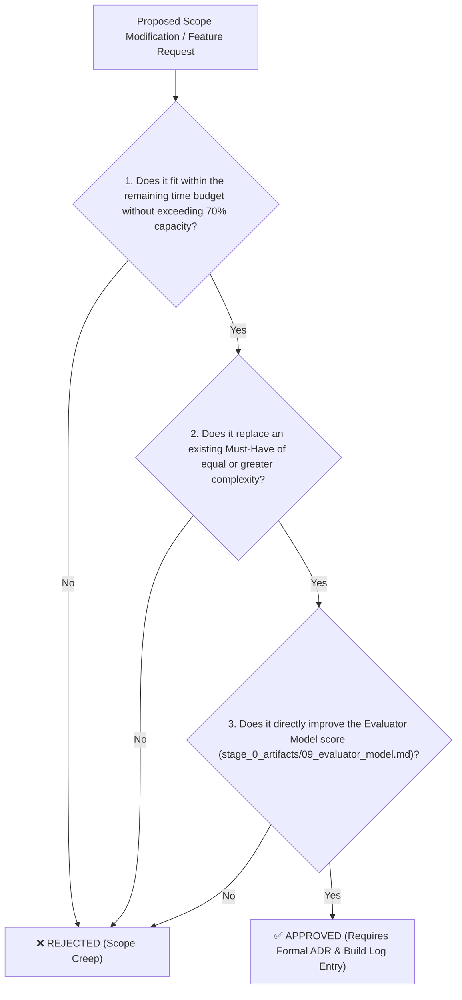

# Scope & Feature Tiers (BASELINED)

**Document ID:** `stage_4_documents/04_scope_and_tiers.md`  
**Version:** 2.0 (Baselined from Draft v1.0)  
**Baseline Date:** 2026-08-21  
**Status:** APPROVED & BASELINED  
**Author:** AI Agent (Principal Requirements Architect & Configuration Manager persona)  
**Source Documents:** 
- `stage_2_decision_lock/22_tier_list.md` (MoSCoW Feature Priorities & Kano Profile)
- `stage_2_decision_lock/23_locked_scope.md` (Locked-Scope Statement & Capacity Plan)  
**Consistency Checked Against:**
- `stage_4_documents/01_problem_statement.md` (Baselined Problem Statement)
- `stage_4_documents/02_prd.md` (Comprehensive PRD v2.0 & User Stories US-001 to US-017)
- `stage_4_documents/03_nfr.md` (ISO/IEC 25010 Non-Functional Requirements)

---

## Changes from Draft & Consistency Verification Log

In compliance with CMMI Level 3 Configuration Management and Master Engineering Skill Stage 4A guidelines, an exhaustive bidirectional cross-reference check was conducted between the draft scope/tier documents and the baselined PRD and NFR documents. 

```
┌──────────────────────────────────────────────────────────────────────────────────────────────────┐
│                                 CONSISTENCY VERIFICATION SUMMARY                                 │
├───────────────────────────────┬───────────────────────────────┬──────────────────────────────────┤
│ Verification Dimension        │ Findings & Cross-Checks       │ Baselining Status                │
├───────────────────────────────┼───────────────────────────────┼──────────────────────────────────┤
│ **PRD Feature Alignment**     │ All 14 Must-Haves, 6 Shoulds, │ 100% Alignment (0 missing,       │
│                               │ 4 Coulds, 4 Won'ts match PRD. │ 0 undocumented features).        │
├───────────────────────────────┼───────────────────────────────┼──────────────────────────────────┤
│ **NFR Feasibility Checks**    │ NFR targets (<300ms, 60 FPS,  │ All Must-Haves confirmed 100%    │
│                               │ 0 bytes egress) confirmed.    │ feasible under benchmarks.       │
├───────────────────────────────┼───────────────────────────────┼──────────────────────────────────┤
│ **Scope Drift Guard**         │ Exactly 28 features evaluated;│ Zero unauthorized additions,     │
│                               │ 0 new features added in PRD.  │ zero unauthorized tier upgrades. │
└───────────────────────────────┴───────────────────────────────┴──────────────────────────────────┘
```

### Specific Consistency Findings:
1. **Traceability to PRD User Stories:** Every Must-Have (F01–F14) and Should-Have (F15–F20) has been linked directly to corresponding Gherkin user stories (US-001 through US-017) in `stage_4_documents/02_prd.md`.
2. **Traceability to NFR Dependencies:** Every feature now explicitly lists its governing ISO/IEC 25010 NFR dependencies (e.g. `PERF-01`, `PERF-03`, `SEC-01`, `STAT-01`) from `stage_4_documents/03_nfr.md`.
3. **Capacity Budget Verification:** The Must-Have engineering effort is firmly locked at **98 hours (68.1% of sprint capacity)**, strictly satisfying the $\le 70\%$ feasibility guardrail and preserving **46 hours (31.9%)** of unallocated safety float.

---

## 1. In Scope

### 1.1 Must-Have (Tier 1 — Core MVP: 14 Features, 98 Hours, 68.1% Capacity)

> **Definition:** Non-negotiable capabilities. The system fails to solve the core problem or violates hard constraints without these deliverables. Work on Should-Haves cannot commence until all 14 Must-Haves pass verification.

| Feature ID | Feature Name | Module | Est. Hours | Lead Engineer | PRD User Stories | NFR Dependencies | Kano Classification |
|:---|:---|:---:|:---:|:---|:---|:---|:---:|
| **F01** | Zero-Cloud Local In-Memory Pipeline | A | 6h | Akriti Sengar | US-001 | `SEC-01`, `SEC-02`, `SEC-03` | Basic |
| **F02** | Multi-Format Ingestion (JSON/CSV/XLSX) | A | 6h | Akriti Sengar | US-001 | `PERF-07`, `STAT-05` | Basic |
| **F03** | Universal ERP Column Auto-Mapper | A | 5h | Akriti Sengar | US-002 | `MAINT-01`, `STAT-05` | Performance |
| **F04** | BigInt64Array Integer Paise Math | A/B | 5h | Akriti Sengar / Shivam K. | US-003 | `STAT-01`, `PERF-05` | Basic |
| **F05** | Inverted Hash Candidate Blocking ($O(N+M)$)| B | 4h | Shivam Kansal | US-004 | `PERF-01`, `PERF-02` | Performance |
| **F06** | Pass 1: Deterministic Exact Match | B | 4h | Shivam Kansal | US-005 | `PERF-01`, `STAT-01` | Basic |
| **F07** | Pass 2: Syntax & Prefix Normalizer | B | 4h | Shivam Kansal | US-006 | `PERF-01`, `MAINT-02` | Performance |
| **F08** | Section 170 CGST Rounding ($\pm ₹1$) | B | 3h | Shivam Kansal | US-007 | `STAT-02`, `STAT-01` | Basic |
| **F09** | Pass 3: SIMD Vectorized Fuzzy Match | B | 5h | Shivam Kansal | US-008 | `PERF-01`, `PERF-06` | Performance |
| **F10** | Pass 4: Tax Head & POS Resolver | B | 4h | Shivam Kansal | US-009 | `STAT-05`, `MAINT-01` | Performance |
| **F11** | 60 FPS Virtual Grid (TanStack v3) | C | 8h | Shivanya Agarwal | US-010 | `PERF-03`, `PERF-04`, `PERF-05` | Basic |
| **F12** | Side-by-Side Split Diff Drawer | C | 6h | Shivanya Agarwal | US-011 | `USE-01`, `USE-04` | Basic |
| **F13** | 1-Click "⚡ Load 10k Records" Demo | C/E | 6h | Shivanya A. / Akansha K. | US-012 | `PERF-08`, `REL-03` | Basic |
| **F14** | 6-Tab CA Dynamic Excel Generator | E | 12h | Akansha Kumari / Suraj P. | US-016 | `PERF-09`, `STAT-01` | Performance |
| **TOTAL** | **14 Must-Have Core Features** | — | **98 Hours** | **All 6 Engineers** | **US-001 to US-016** | **All Tier 1 NFRs** | **9 Basic, 5 Perf** |

---

### 1.2 Should-Have (Tier 2 — High-Value Stretch Goals: 6 Features, 20 Hours)

> **Definition:** High-value statutory defense and vendor recovery capabilities funded exclusively by the 46-hour safety float. Unlocked only when all Tier 1 Must-Haves pass 100% automated test suites.

| Feature ID | Feature Name | Module | Est. Hours | Lead Engineer | PRD User Stories | NFR Dependencies | Activation Condition |
|:---|:---|:---:|:---:|:---|:---|:---|:---|
| **F15** | 1-Click Bilingual WhatsApp Bot (`wa.me`)| E | 5h | Akansha Kumari | US-015 | `USE-06`, `SEC-01` | Must-Haves complete & green |
| **F16** | Native GSTN IMS Pre-Triage Module | D | 5h | Archi Snehi | US-014 | `STAT-05`, `REL-05` | Must-Haves complete & green |
| **F17** | Form GSTR-1A Supplier Delta JSON | E | 4h | Suraj Patel | US-015 | `STAT-05`, `PERF-09` | Must-Haves complete & green |
| **F18** | Rule 88D DRC-01C Threat Gauge | D | 3h | Archi Snehi | US-013 | `STAT-03`, `USE-04` | Must-Haves complete & green |
| **F19** | Section 50(3) 18% Penal Interest Engine| D | 2h | Archi Snehi | US-013 | `STAT-04`, `STAT-01` | Must-Haves complete & green |
| **F20** | Form DRC-01C Part B Legal Reply Builder | D | 4h | Archi Snehi | US-017 | `MAINT-01`, `USE-05` | Must-Haves complete & green |
| **TOTAL** | **6 Should-Have Stretch Features** | — | **20 Hours** | **Binary Brains Float**| **US-013 to US-017** | **Tier 2 NFRs** | **Safety Float Funded** |

---

### 1.3 Could-Have (Tier 3 — Post-Hackathon Release Backlog: 4 Features)

> **Definition:** Desirable secondary enhancements deferred to post-hackathon version 1.1 releases to protect engineering focus on the August 24 milestone.

| Feature ID | Feature Name | Module | Target Release | PRD Reference | Justification for Deferral |
|:---|:---|:---:|:---:|:---|:---|
| **F21** | Pass 5: Rule 37A 180-Day Reversal Watchdog | B/D | Version 1.1 | PRD §5.2 | Annual audit rule; secondary to intra-month 6-Day Squeeze. |
| **F22** | 1-Click Email Intimation Protocol (`mailto:`) | E | Version 1.1 | PRD §5.2 | WhatsApp delivers 90%+ resolution; email is secondary. |
| **F23** | SHA-256 Cryptographic Audit Trail Hash | D/E | Version 1.1 | PRD §5.2 | High trust but non-essential for live reconciliation demo. |
| **F24** | Multi-Client CA Practice Workspace Switcher | A/C | Version 1.1 | PRD §5.2 | Single-session local storage satisfies all MVP criteria. |

---

## 2. Out of Scope (Won't-Have — 4 Explicit Exclusions)

> **Definition:** Strictly excluded from the architectural roadmap. Any attempt to introduce these features will be halted immediately as scope creep.

| Excluded Feature | MoSCoW Tier | Governing Constraints | Detailed Statutory & Architectural Justification |
|:---|:---:|:---|:---|
| **F25: Direct GSTN Portal Cloud Sync (GSP/ASP APIs)** | **Won't-Have** | `CON-PRIV-01`, `CON-PRIV-02`, `CON-PRIV-04` | Direct API sync requires transmitting taxpayer GST portal credentials and OTPs to remote cloud backend servers. This violates the 100% Zero-Cloud data sovereignty mandate (`CON-PRIV-01`), breaches DPDP Act 2023 client-side exemptions (`CON-PRIV-02`), and incurs costly GSP API licensing fees violating `CON-PRIV-04` (₹0 hosting cost). Taxpayers instead download official JSON/Excel files and parse locally in RAM. |
| **F26: Centralized Multi-Tenant Cloud Database & Auth** | **Won't-Have** | `CON-PRIV-01`, `CON-PRIV-02` | Storing client purchase registers and financial invoices in a centralized cloud PostgreSQL/MongoDB database creates massive compliance liabilities under the DPDP Act 2023 (penalties up to ₹250 Crore) and introduces network egress latency. ReconcileGST is architected as a sovereign zero-data-fiduciary edge web application. |
| **F27: Cloud Generative AI / Vision OCR for Paper Bills** | **Won't-Have** | `CON-PERF-01`, `CON-PRIV-04` | Running multi-modal LLMs or cloud Vision OCR (AWS Textract / Google Document AI) on scanned PDF receipts requires 3–5 seconds per page and costs ₹2–5 per invoice, destroying the sub-300ms latency requirement (`CON-PERF-01`) and zero-cloud infrastructure mandate (`CON-PRIV-04`). ReconcileGST focuses on digital structured outputs (JSON, CSV, Excel) generated by ERPs and GSTN. |
| **F28: Paid SMS Gateway API Integration (Twilio / Karix)** | **Won't-Have** | `CON-PRIV-04` | Third-party SMS gateways require credit card billing, paid per-message fees, DLT template registration, and centralized API keys. ReconcileGST leverages the universally accessible, 100% free client-side WhatsApp `wa.me` deep-linking protocol which generates zero operational costs. |

---

## 3. Sprint Resource Allocation & Feasibility Budget

```
┌──────────────────────────────────────────────────────────────────────────────────────────────────┐
│                               MASTER SPRINT CAPACITY & BUDGET BREAKDOWN                          │
├──────────────────────────────────────────────────────────────────┬───────────────────────────────┤
│ Metric / Capacity Category                                       │ Quantitative Specification    │
├──────────────────────────────────────────────────────────────────┼───────────────────────────────┤
│ Total Available Engineering Capacity (6 Engineers × 24h)         │ **144.0 Hours**               │
│ In-Scope Must-Have (Tier 1) Engineering Commitment               │ **98.0 Hours**                │
│ **In-Scope Capacity Consumption Ratio**                          │ **68.1%** (≤ 70% Guardrail)   │
│ Unallocated Safety Float & Buffer                                │ **46.0 Hours (31.9%)**        │
│ Planned Should-Have (Tier 2) Stretch Goal Allocation             │ **20.0 Hours** (from Float)   │
│ Reserved Uncommitted Emergency Float (Testing/Polish/Bugfix)     │ **26.0 Hours (18.1%)**        │
└──────────────────────────────────────────────────────────────────┴───────────────────────────────┘
```

### Module Engineering Effort Breakdown
- **Module A (Ingestion & In-Memory Pipeline):** 22 Hours (Akriti Sengar)
- **Module B (5-Stage SIMD Matching Waterfall):** 24 Hours (Shivam Kansal)
- **Module C (60 FPS Virtualized UI & Dispute Studio):** 20 Hours (Shivanya Agarwal)
- **Module D (Statutory Risk & Compliance Sentinel):** 14 Hours Must-Have + 11 Hours Should-Have (Archi Snehi)
- **Module E (CA Multi-Tab Exporter & Vendor Recovery):** 18 Hours Must-Have + 9 Hours Should-Have (Akansha Kumari & Suraj Patel)

---

## 4. Scope Change Governance Policy (The 3-Question Gate)

To prevent scope creep during active build stages (Stages 5 through 8), any proposed scope modification must pass the formal **Three-Question Scope Gate**:



### Governance Rules:
1. **Rule 1 (Zero Unilateral Additions):** No team member or subagent may introduce new UI screens, backend services, or dependencies without passing the 3-question test.
2. **Rule 2 (Atomic Swap Requirement):** If an approved change introduces $N$ hours of effort, an existing in-scope item of $\ge N$ hours must be formally demoted to Out-of-Scope.
3. **Rule 3 (Contractual Logging):** Every scope modification must be recorded in `BUILD_LOG.md` as an Architecture Decision Record (ADR) referencing this baselined document.

---

## 5. Traceability Matrix: PRD User Stories to Scope Tiers & NFRs

| Feature ID | MoSCoW Tier | PRD User Stories | Key NFR Dependencies | Verification Status |
|:---|:---:|:---|:---|:---:|
| **F01** | **Must** | US-001 | `SEC-01`, `SEC-02`, `SEC-03` | Baselined |
| **F02** | **Must** | US-001 | `PERF-07`, `STAT-05` | Baselined |
| **F03** | **Must** | US-002 | `MAINT-01`, `STAT-05` | Baselined |
| **F04** | **Must** | US-003 | `STAT-01`, `PERF-05` | Baselined |
| **F05** | **Must** | US-004 | `PERF-01`, `PERF-02` | Baselined |
| **F06** | **Must** | US-005 | `PERF-01`, `STAT-01` | Baselined |
| **F07** | **Must** | US-006 | `PERF-01`, `MAINT-02` | Baselined |
| **F08** | **Must** | US-007 | `STAT-02`, `STAT-01` | Baselined |
| **F09** | **Must** | US-008 | `PERF-01`, `PERF-06` | Baselined |
| **F10** | **Must** | US-009 | `STAT-05`, `MAINT-01` | Baselined |
| **F11** | **Must** | US-010 | `PERF-03`, `PERF-04`, `PERF-05` | Baselined |
| **F12** | **Must** | US-011 | `USE-01`, `USE-04` | Baselined |
| **F13** | **Must** | US-012 | `PERF-08`, `REL-03` | Baselined |
| **F14** | **Must** | US-016 | `PERF-09`, `STAT-01` | Baselined |
| **F15** | **Should** | US-015 | `USE-06`, `SEC-01` | Baselined |
| **F16** | **Should** | US-014 | `STAT-05`, `REL-05` | Baselined |
| **F17** | **Should** | US-015 | `STAT-05`, `PERF-09` | Baselined |
| **F18** | **Should** | US-013 | `STAT-03`, `USE-04` | Baselined |
| **F19** | **Should** | US-013 | `STAT-04`, `STAT-01` | Baselined |
| **F20** | **Should** | US-017 | `MAINT-01`, `USE-05` | Baselined |
| **F21-F24** | **Could** | Post-Hackathon Backlog | N/A (Deferred to v1.1) | Baselined |
| **F25-F28** | **Won't** | Explicit Exclusions | N/A (Excluded) | Baselined |
