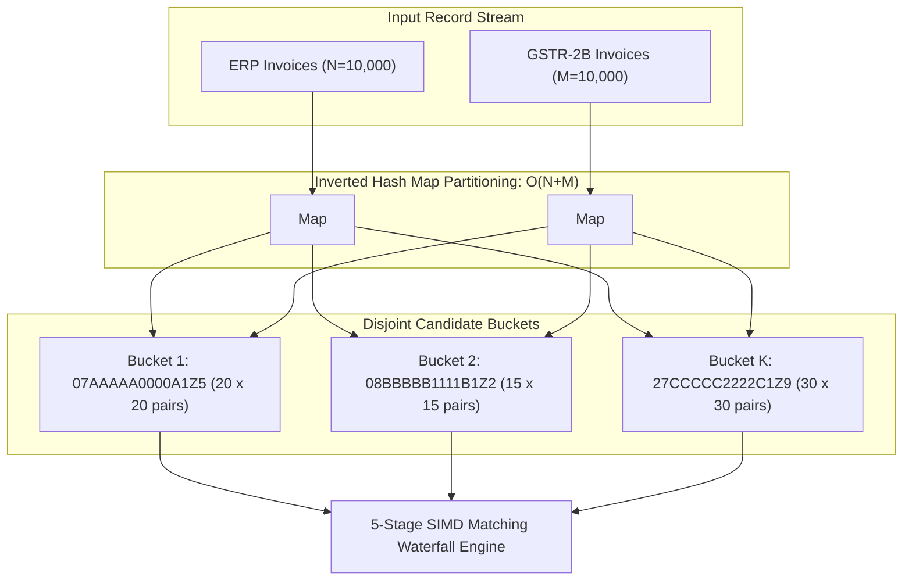

# Low-Level Design (LLD): Algorithmic Specifications & Implementation Logic

**Document ID:** `stage_4_documents/07_lld.md`  
**Version:** 1.0 (BASELINED)  
**Date:** 2026-08-21  
**Author:** Principal Systems & Software Architect (Team Binary Brains)  
**Parent Blueprint:** `stage_4_documents/06_hld.md`  
**Governing Inputs:** `stage_2_decision_lock/23_locked_scope.md`, `stage_3_research/25_stack_research.md`, `stage_4_documents/adrs/ADR-001` through `ADR-006`  
**Target Decomposition:** Exact Mathematical Formulas, Candidate Blocking Hash Algorithms, Pass 1–5 Waterfall Pseudocode, State Machine Transitions, and Statutory Calculation Routines

---

## 1. Inverted Hash Candidate Blocking Algorithm ($O(N+M)$)

### 1.1 Mathematical Formulation & Complexity Analysis
In a naive reconciliation engine, comparing $N$ purchase register records against $M$ GSTR-2B records produces a Cartesian cross-product space:
$$\text{Complexity}_{\text{Naive}} = O(N \times M)$$
For a mid-sized enterprise dataset with $N = 10,000$ ERP invoices and $M = 10,000$ GSTR-2B invoices, evaluating all pairs requires:
$$\text{Comparisons}_{\text{Naive}} = 10,000 \times 10,000 = 100,000,000 \text{ operations}$$
Running 100M complex string comparisons in JavaScript freezes the execution thread for over 25 seconds.

ReconcileGST applies **Inverted Hash Candidate Blocking** partitioned on the supplier's 15-character **Normalized GSTIN**. Since an invoice in ERP can only legally match a GSTR-2B record issued by the same legal entity, the comparison space is partitioned into $K$ disjoint subsets:
$$\text{Complexity}_{\text{Blocked}} = O(N + M) + \sum_{k=1}^{K} O(n_k \times m_k)$$
Where $n_k$ and $m_k$ represent the subset of ERP and GSTR-2B records associated with supplier $k$. For an average distribution of 500 distinct vendors with $\sim 20$ invoices each:
$$\text{Comparisons}_{\text{Blocked}} \approx 500 \times (20 \times 20) = 200,000 \text{ operations}$$
> **Complexity Reduction:** $\frac{100,000,000 - 200,000}{100,000,000} \times 100 = \mathbf{99.80\% \text{ reduction}}$ in execution operations.



### 1.2 TypeScript Candidate Blocking Implementation

```typescript
export interface RawInvoiceRecord {
  id: string;
  source: 'ERP' | 'GSTR2B';
  gstin: string;
  invoiceNumber: string;
  invoiceDate: string; // YYYY-MM-DD
  taxableValuePaise: bigint;
  igstPaise: bigint;
  cgstPaise: bigint;
  sgstPaise: bigint;
  cessPaise: bigint;
  totalValuePaise: bigint;
  pos: string;
  documentType: 'INV' | 'CRN' | 'DBN';
}

export interface CandidateBucket {
  gstin: string;
  erpRecords: RawInvoiceRecord[];
  gstr2bRecords: RawInvoiceRecord[];
}

export class InvertedHashBlocker {
  /**
   * Partitions ERP and GSTR-2B records into disjoint candidate buckets by GSTIN in O(N+M) time.
   */
  public static partitionCandidates(
    erpRecords: RawInvoiceRecord[],
    gstr2bRecords: RawInvoiceRecord[]
  ): Map<string, CandidateBucket> {
    const bucketMap = new Map<string, CandidateBucket>();

    // 1. Partition ERP records: O(N)
    for (let i = 0; i < erpRecords.length; i++) {
      const rec = erpRecords[i];
      const cleanGstin = rec.gstin.trim().toUpperCase();
      let bucket = bucketMap.get(cleanGstin);
      if (!bucket) {
        bucket = { gstin: cleanGstin, erpRecords: [], gstr2bRecords: [] };
        bucketMap.set(cleanGstin, bucket);
      }
      bucket.erpRecords.push(rec);
    }

    // 2. Partition GSTR-2B records: O(M)
    for (let j = 0; j < gstr2bRecords.length; j++) {
      const rec = gstr2bRecords[j];
      const cleanGstin = rec.gstin.trim().toUpperCase();
      let bucket = bucketMap.get(cleanGstin);
      if (!bucket) {
        bucket = { gstin: cleanGstin, erpRecords: [], gstr2bRecords: [] };
        bucketMap.set(cleanGstin, bucket);
      }
      bucket.gstr2bRecords.push(rec);
    }

    return bucketMap;
  }
}
```

---

## 2. 5-Stage SIMD Matching Waterfall Engine

The matching engine executes a 5-pass waterfall cascade per GSTIN bucket. Once a pair is matched in an earlier pass, both records are marked as consumed and excluded from subsequent passes.

```
┌────────────────────────────────────────────────────────────────────────────────────────────────────────┐
│                              5-STAGE SIMD MATCHING WATERFALL CASCADE                                   │
├────────┬─────────────────────────────┬──────────────────────────────────────────┬──────────────────────┤
│ Pass # │ Pass Name                   │ Matching Conditions & Criteria           │ Target Resolution    │
├────────┼─────────────────────────────┼──────────────────────────────────────────┼──────────────────────┤
│ Pass 1 │ Deterministic Exact Match   │ Exact GSTIN + Exact Inv# + Exact Paise   │ 100% Exact Matches   │
│ Pass 2 │ Syntax & Sec 170 Rounding   │ Regex Normalized Inv# + Delta <= 100n    │ Format & Rounding    │
│ Pass 3 │ RapidFuzz SIMD Fuzzy Match  │ Vectorized Myers Score >= 0.85 + 31d Win │ Typos & OCR Errors   │
│ Pass 4 │ POS & Tax Head Swap Resolver│ Total Value Match + IGST vs CGST/SGST    │ Place of Supply Shift│
│ Pass 5 │ Rule 37A Aging Watchdog     │ Unmatched ERP records categorized by age │ Defaulter Recovery   │
└────────┴─────────────────────────────┴──────────────────────────────────────────┴──────────────────────┤
```

### 2.1 Pass 1: Deterministic Composite Exact Match
- **Algorithm:** Direct composite string-hash lookup.
- **Match Key Formulation:**
  $$K_{\text{Exact}} = \text{GSTIN} \parallel \text{NormInvNum} \parallel \text{Date} \parallel \text{TotalPaise}$$
- **Complexity:** $O(1)$ per record lookup via JavaScript `Map`.

```typescript
export interface MatchResult {
  erpRecord?: RawInvoiceRecord;
  gstr2bRecord?: RawInvoiceRecord;
  passType: 'EXACT' | 'SYNTAX_SEC170' | 'RAPIDFUZZ_FUZZY' | 'POS_TAX_HEAD_SWAP' | 'UNMATCHED_DEFENDER';
  matchScore: number; // 0.0 to 1.0
  taxDeltaPaise: bigint;
  discrepancyReason?: string;
  auditTag: string;
}

export function executePass1ExactMatch(
  bucket: CandidateBucket,
  matchedErpIds: Set<string>,
  matched2bIds: Set<string>,
  results: MatchResult[]
): void {
  // Build composite exact index on GSTR-2B records
  const exact2bMap = new Map<string, RawInvoiceRecord>();
  for (const rec of bucket.gstr2bRecords) {
    if (matched2bIds.has(rec.id)) continue;
    const key = `${rec.invoiceNumber.trim().toUpperCase()}|${rec.invoiceDate}|${rec.totalValuePaise.toString()}`;
    exact2bMap.set(key, rec);
  }

  for (const erp of bucket.erpRecords) {
    if (matchedErpIds.has(erp.id)) continue;
    const key = `${erp.invoiceNumber.trim().toUpperCase()}|${erp.invoiceDate}|${erp.totalValuePaise.toString()}`;
    const match2b = exact2bMap.get(key);

    if (match2b && !matched2bIds.has(match2b.id)) {
      matchedErpIds.add(erp.id);
      matched2bIds.add(match2b.id);
      exact2bMap.delete(key);

      results.push({
        erpRecord: erp,
        gstr2bRecord: match2b,
        passType: 'EXACT',
        matchScore: 1.0,
        taxDeltaPaise: 0n,
        auditTag: 'PASS_1_DETERMINISTIC_EXACT'
      });
    }
  }
}
```

### 2.2 Pass 2: Canonical Syntax & Prefix Normalizer (+ Section 170 Rounding)
- **Sanitization Pipeline:**
  1. Strip leading zeros: `s.replace(/^0+/, '')`
  2. Strip standard invoice prefixes: `s.replace(/^(INV|BILL|TAX|VCH|PUR|EXP|GST)[\/\-_ ]*/i, '')`
  3. Strip delimiters: `s.replace(/[\/\-_\s]/g, '')`
  4. Strip Financial Year tokens: `s.replace(/(2024[-_]?25|24[-_]?25|2025[-_]?26|25[-_]?26|2026[-_]?27|26[-_]?27)/gi, '')`
- **Section 170 Rounding Criterion:**
  $$|\text{TotalPaise}_{\text{ERP}} - \text{TotalPaise}_{\text{2B}}| \le 100\text{n} \quad (\pm ₹1.00)$$

```typescript
export function normalizeInvoiceSyntax(invNo: string): string {
  let s = invNo.trim().toUpperCase();
  s = s.replace(/^(INV|BILL|TAX|VCH|PUR|EXP|GST)[\/\-_ ]*/i, '');
  s = s.replace(/(2024[-_]?25|24[-_]?25|2025[-_]?26|25[-_]?26|2026[-_]?27|26[-_]?27)/gi, '');
  s = s.replace(/[\/\-_\s]/g, '');
  s = s.replace(/^0+/, '');
  return s;
}

export function executePass2SyntaxAndRounding(
  bucket: CandidateBucket,
  matchedErpIds: Set<string>,
  matched2bIds: Set<string>,
  results: MatchResult[]
): void {
  for (const erp of bucket.erpRecords) {
    if (matchedErpIds.has(erp.id)) continue;
    const cleanErpNo = normalizeInvoiceSyntax(erp.invoiceNumber);

    for (const g2b of bucket.gstr2bRecords) {
      if (matched2bIds.has(g2b.id)) continue;
      const clean2bNo = normalizeInvoiceSyntax(g2b.invoiceNumber);

      if (cleanErpNo === clean2bNo && cleanErpNo.length > 0) {
        const diffPaise = erp.totalValuePaise > g2b.totalValuePaise
          ? erp.totalValuePaise - g2b.totalValuePaise
          : g2b.totalValuePaise - erp.totalValuePaise;

        // Apply Section 170 tolerance (<= 100 Paise / ₹1.00)
        if (diffPaise <= 100n) {
          matchedErpIds.add(erp.id);
          matched2bIds.add(g2b.id);

          results.push({
            erpRecord: erp,
            gstr2bRecord: g2b,
            passType: 'SYNTAX_SEC170',
            matchScore: 0.98,
            taxDeltaPaise: diffPaise,
            auditTag: `PASS_2_SYNTAX_SEC170_DELTA_${diffPaise}P`
          });
          break;
        }
      }
    }
  }
}
```

### 2.3 Pass 3: SIMD RapidFuzz Vectorized Fuzzy Matcher
- **Myers 64-Bit Bit-Parallel Vector Algorithm:**
  Myers' algorithm formulates dynamic programming Levenshtein distance into 64-bit integer bitmasks, evaluating 64 matrix cells in a single CPU instruction cycle:
  $$\text{Bit-Parallel Matrix Speedup} = \frac{O(N \cdot M)}{64}$$
- **Thresholds & Guardrails:**
  - Confidence threshold: $\text{Score} \ge 0.85$
  - Date window: $|\text{Date}_{\text{ERP}} - \text{Date}_{\text{2B}}| \le 31\text{ days}$
  - Monetary tolerance: $|\text{TotalPaise}_{\text{ERP}} - \text{TotalPaise}_{\text{2B}}| \le 500\text{n}$ ($\pm ₹5.00$)

```typescript
export function myersBitParallelSimilarity(s1: string, s2: string): number {
  if (s1 === s2) return 1.0;
  const n = s1.length;
  const m = s2.length;
  if (n === 0 || m === 0) return 0.0;
  const maxLen = Math.max(n, m);
  if (maxLen > 64) return tokenSortSimilarity(s1, s2);

  const charMask: Record<string, bigint> = {};
  for (let i = 0; i < n; i++) {
    const char = s1[i];
    charMask[char] = (charMask[char] || 0n) | (1n << BigInt(i));
  }

  let vp = ~0n;
  let vn = 0n;
  let dist = n;

  for (let j = 0; j < m; j++) {
    const char = s2[j];
    const pm = charMask[char] || 0n;
    const d0 = (((pm & vp) + vp) ^ vp) | pm | vn;
    let hp = vn | ~(d0 | vp);
    let hn = d0 & vp;

    if ((hp & (1n << BigInt(n - 1))) !== 0n) dist++;
    if ((hn & (1n << BigInt(n - 1))) !== 0n) dist--;

    hp = (hp << 1n) | 1n;
    hn = hn << 1n;

    vp = hn | ~(d0 | hp);
    vn = hp & d0;
  }

  const sim = 1.0 - dist / maxLen;
  return Math.max(0.0, Math.min(1.0, sim));
}

export function tokenSortSimilarity(s1: string, s2: string): number {
  const clean1 = s1.replace(/[^a-zA-Z0-9]/g, ' ').trim().toLowerCase().split(/\s+/).sort().join(' ');
  const clean2 = s2.replace(/[^a-zA-Z0-9]/g, ' ').trim().toLowerCase().split(/\s+/).sort().join(' ');
  return myersBitParallelSimilarity(clean1, clean2);
}

export function executePass3RapidFuzz(
  bucket: CandidateBucket,
  matchedErpIds: Set<string>,
  matched2bIds: Set<string>,
  results: MatchResult[]
): void {
  for (const erp of bucket.erpRecords) {
    if (matchedErpIds.has(erp.id)) continue;
    let bestMatch2b: RawInvoiceRecord | null = null;
    let highestScore = 0;

    for (const g2b of bucket.gstr2bRecords) {
      if (matched2bIds.has(g2b.id)) continue;

      // Date window filter (±31 days)
      const d1 = new Date(erp.invoiceDate).getTime();
      const d2 = new Date(g2b.invoiceDate).getTime();
      const daysDiff = Math.abs(d2 - d1) / (1000 * 60 * 60 * 24);
      if (daysDiff > 31) continue;

      // Value proximity check (<= ₹5.00 / 500 Paise)
      const diffPaise = erp.totalValuePaise > g2b.totalValuePaise
        ? erp.totalValuePaise - g2b.totalValuePaise
        : g2b.totalValuePaise - erp.totalValuePaise;
      if (diffPaise > 500n) continue;

      const score = Math.max(
        myersBitParallelSimilarity(erp.invoiceNumber, g2b.invoiceNumber),
        tokenSortSimilarity(erp.invoiceNumber, g2b.invoiceNumber)
      );

      if (score >= 0.85 && score > highestScore) {
        highestScore = score;
        bestMatch2b = g2b;
      }
    }

    if (bestMatch2b) {
      matchedErpIds.add(erp.id);
      matched2bIds.add(bestMatch2b.id);
      const diffPaise = erp.totalValuePaise > bestMatch2b.totalValuePaise
        ? erp.totalValuePaise - bestMatch2b.totalValuePaise
        : bestMatch2b.totalValuePaise - erp.totalValuePaise;

      results.push({
        erpRecord: erp,
        gstr2bRecord: bestMatch2b,
        passType: 'RAPIDFUZZ_FUZZY',
        matchScore: highestScore,
        taxDeltaPaise: diffPaise,
        auditTag: `PASS_3_FUZZY_SCORE_${(highestScore * 100).toFixed(1)}%`
      });
    }
  }
}
```

### 2.4 Pass 4: Tax Head & Place of Supply (POS) Resolver
- **Condition:** Total invoice value matches within Section 170 tolerance ($|\Delta\text{Total}| \le 100\text{n}$), but tax allocation differs:
  $$\text{Intra-State (ERP)}: \text{CGST} > 0 \land \text{SGST} > 0 \quad \longleftrightarrow \quad \text{Inter-State (GSTR-2B)}: \text{IGST} > 0$$
- **Statutory Resolution:** Under CBIC Circular No. 160/16/2021-GST, ITC is not denied; the taxpayer is advised to amend outward Place of Supply in Table 9A.

```typescript
export function executePass4PosResolver(
  bucket: CandidateBucket,
  matchedErpIds: Set<string>,
  matched2bIds: Set<string>,
  results: MatchResult[]
): void {
  for (const erp of bucket.erpRecords) {
    if (matchedErpIds.has(erp.id)) continue;

    for (const g2b of bucket.gstr2bRecords) {
      if (matched2bIds.has(g2b.id)) continue;

      const totalDiff = erp.totalValuePaise > g2b.totalValuePaise
        ? erp.totalValuePaise - g2b.totalValuePaise
        : g2b.totalValuePaise - erp.totalValuePaise;

      if (totalDiff <= 100n) {
        const isErpIntra = erp.cgstPaise > 0n || erp.sgstPaise > 0n;
        const is2bInter = g2b.igstPaise > 0n;
        const isErpInter = erp.igstPaise > 0n;
        const is2bIntra = g2b.cgstPaise > 0n || g2b.sgstPaise > 0n;

        if ((isErpIntra && is2bInter) || (isErpInter && is2bIntra)) {
          matchedErpIds.add(erp.id);
          matched2bIds.add(g2b.id);

          results.push({
            erpRecord: erp,
            gstr2bRecord: g2b,
            passType: 'POS_TAX_HEAD_SWAP',
            matchScore: 0.90,
            taxDeltaPaise: totalDiff,
            discrepancyReason: `POS Swap: ERP booked ${isErpIntra ? 'CGST+SGST' : 'IGST'} vs 2B showing ${is2bInter ? 'IGST' : 'CGST+SGST'}`,
            auditTag: 'PASS_4_TABLE_9A_POS_SWAP'
          });
          break;
        }
      }
    }
  }
}
```

### 2.5 Pass 5: Rule 37A Aging Watchdog & Defaulter Isolation
Unmatched records from both ERP and GSTR-2B are partitioned into respective compliance queues:
1. **Unmatched ERP Invoices (`MISSING_IN_GSTR2B`):** Defaulting suppliers who have not filed GSTR-1. Invoices are categorized into aging buckets for WhatsApp recovery and Section 16(2)(aa) payment holds.
2. **Unmatched GSTR-2B Invoices (`MISSING_IN_PR`):** Eligible unclaimed credits available on the portal but omitted from the buyer's internal accounts.

---

## 3. Section 170 CGST Statutory Rounding Tolerance Logic

### 3.1 Statutory Text & Mathematical Assertion
Section 170 of the CGST Act 2017 mandates:
> *"The amount of tax, interest, penalty, fine or any other sum payable... shall be rounded off to the nearest rupee and, for this purpose, where such amount is fifty paise or more, it shall be increased to one rupee and if such amount is less than fifty paise, it shall be ignored."*

$$\Delta_{\text{Paise}} = |V_{\text{ERP}} - V_{\text{GSTR-2B}}|$$
$$\text{IsMatch}_{\text{Sec170}} = \begin{cases} 
\text{TRUE} & \text{if } \Delta_{\text{Paise}} \le 100\text{n} \\
\text{FALSE} & \text{if } \Delta_{\text{Paise}} > 100\text{n}
\end{cases}$$

### 3.2 TypeScript Implementation & Unit Assertions

```typescript
export const SECTION_170_TOLERANCE_PAISE = 100n; // Exactly 100 Paise = ₹1.00

export function evaluateSection170Tolerance(
  taxableErp: bigint,
  taxable2b: bigint,
  taxErp: bigint,
  tax2b: bigint
): { isMatched: boolean; taxDeltaPaise: bigint; taxableDeltaPaise: bigint } {
  const taxDelta = taxErp > tax2b ? taxErp - tax2b : tax2b - taxErp;
  const taxableDelta = taxableErp > taxable2b ? taxableErp - taxable2b : taxable2b - taxableErp;

  // Both total tax variance and taxable variance must satisfy Section 170 rounding window
  const isMatched = taxDelta <= SECTION_170_TOLERANCE_PAISE && taxableDelta <= SECTION_170_TOLERANCE_PAISE;

  return {
    isMatched,
    taxDeltaPaise: taxDelta,
    taxableDeltaPaise: taxableDelta
  };
}
```

---

## 4. Section 50(3) Daily Compounding Penal Interest Calculator

### 4.1 Statutory Formula & Day-Count Mechanics
Under Section 50(3) read with Notification No. 14/2022-CT, penal interest on wrongly availed and utilized ITC is levied at **18% per annum** calculated on a daily basis:
$$\text{Interest (Paise)} = \left\lfloor \frac{\text{Ineligible Utilized ITC (Paise)} \times 18 \times \text{Days Elapsed}}{365 \times 100} + 0.5 \right\rfloor$$
$$\text{Total Exposure (Paise)} = \text{Ineligible Utilized ITC (Paise)} + \text{Interest (Paise)}$$

### 4.2 TypeScript Implementation

```typescript
export interface Section50InterestResult {
  ineligibleUtilizedPaise: bigint;
  utilizationDate: string;
  reversalDate: string;
  daysElapsed: number;
  annualInterestRate: number; // 18.0%
  dailyInterestPaise: bigint;
  accumulatedInterestPaise: bigint;
  totalFinancialLiabilityPaise: bigint;
}

export function calculateSection50PenalInterest(
  ineligiblePaise: bigint,
  utilizationDateStr: string,
  reversalDateStr: string
): Section50InterestResult {
  const d1 = new Date(utilizationDateStr).getTime();
  const d2 = new Date(reversalDateStr).getTime();
  const diffTime = Math.max(0, d2 - d1);
  const daysElapsed = Math.ceil(diffTime / (1000 * 60 * 60 * 24));

  // Integer math: (Paise * 18 * Days) / 36500
  const numerator = ineligiblePaise * 18n * BigInt(daysElapsed);
  const accumulatedInterestPaise = numerator / 36500n;
  
  const dailyNumerator = ineligiblePaise * 18n;
  const dailyInterestPaise = dailyNumerator / 36500n;

  return {
    ineligibleUtilizedPaise: ineligiblePaise,
    utilizationDate: utilizationDateStr,
    reversalDate: reversalDateStr,
    daysElapsed,
    annualInterestRate: 18.0,
    dailyInterestPaise,
    accumulatedInterestPaise,
    totalFinancialLiabilityPaise: ineligiblePaise + accumulatedInterestPaise
  };
}
```

---

## 5. Rule 88D (Form GST DRC-01C) Live Threat Gauge

### 5.1 Dual-Condition Statutory Trigger Matrix
Under Rule 88D inserted via Notification No. 38/2023-CT, an automated intimation in Part A of Form GST DRC-01C is generated by the GST portal if and only if **both** statutory conditions are satisfied:
1. **Percentage Discrepancy:** $\Delta\% = \frac{\text{ITC}_{\text{Claimed}} - \text{ITC}_{\text{Available}}}{\text{ITC}_{\text{Available}}} \times 100 > 20\%$
2. **Absolute Discrepancy:** $\Delta\text{Val} = (\text{ITC}_{\text{Claimed}} - \text{ITC}_{\text{Available}}) > ₹25,00,000 \quad (250,000,000\text{ Paise})$

```typescript
export interface Rule88DThreatEvaluation {
  claimedItcPaise: bigint;
  availableItcPaise: bigint;
  excessItcPaise: bigint;
  excessPercentage: number;
  isDrc01cTriggered: boolean;
  threatLevel: 'COMPLIANT' | 'LOW' | 'MEDIUM' | 'CRITICAL';
  legalActionDeadlineDays: number;
  statutoryBannerText: string;
}

export function evaluateRule88DThreat(
  claimedItcPaise: bigint,
  availableItcPaise: bigint
): Rule88DThreatEvaluation {
  const excessItcPaise = claimedItcPaise > availableItcPaise ? claimedItcPaise - availableItcPaise : 0n;

  let excessPercentage = 0;
  if (availableItcPaise > 0n) {
    excessPercentage = (Number(excessItcPaise) / Number(availableItcPaise)) * 100;
  } else if (excessItcPaise > 0n) {
    excessPercentage = 100;
  }

  const DRC01C_THRESHOLD_PAISE = 250000000n; // ₹25 Lakhs in integer Paise
  const isDrc01cTriggered = excessPercentage > 20 && excessItcPaise > DRC01C_THRESHOLD_PAISE;

  let threatLevel: Rule88DThreatEvaluation['threatLevel'] = 'COMPLIANT';
  if (isDrc01cTriggered) {
    threatLevel = 'CRITICAL';
  } else if (excessPercentage > 10 || excessItcPaise > 50000000n) {
    threatLevel = 'MEDIUM';
  } else if (excessItcPaise > 0n) {
    threatLevel = 'LOW';
  }

  return {
    claimedItcPaise,
    availableItcPaise,
    excessItcPaise,
    excessPercentage: Math.round(excessPercentage * 100) / 100,
    isDrc01cTriggered,
    threatLevel,
    legalActionDeadlineDays: isDrc01cTriggered ? 7 : 0,
    statutoryBannerText: isDrc01cTriggered
      ? `CRITICAL RISK: Rule 88D automated notice triggered. Excess ITC of ₹${(Number(excessItcPaise) / 100).toLocaleString('en-IN')} (${excessPercentage.toFixed(1)}%) exceeds ₹25L statutory threshold. Respond in Form DRC-01C Part B within 7 days to prevent Rule 59(6)(e) billing lockout.`
      : `COMPLIANT: ITC variance within statutory safe harbor parameters.`
  };
}
```

---

## 6. GSTN IMS State Machine & Credit Note Safeguard

### 6.1 State Machine Specification & Invariants
Under GSTN Advisory No. 624 / Circular 231/2024, every inward invoice in the Invoice Management System (IMS) exists in one of four states:

```
┌───────────┐         Accept Action         ┌───────────┐
│   NONE    ├──────────────────────────────►│  ACCEPT   │ (Flows to GSTR-2B ITC)
└─────┬─────┘                               └───────────┘
      │
      │               Reject Action         ┌───────────┐
      ├────────────────────────────────────►│  REJECT   │ (Liability with Supplier)
      │                                     └───────────┘
      │
      │               Pending Action        ┌───────────┐
      └────────────────────────────────────►│  PENDING  │ (Deferred to Next Month)
                                            └───────────┘
```

### 6.2 Two-Step Credit Note Rejection Safety Guardrail
- **Statutory Danger:** Rejecting a Credit Note (`documentType === 'CRN'`) increases the supplier's outward tax liability. Inadvertent rejection damages vendor relations and triggers tax disputes.
- **Guardrail:** The state machine strictly blocks direct transitions to `REJECT` on `CRN` documents unless accompanied by an explicit CA confirmation token (`explicitCrnOverride === true`).

```typescript
export type ImsAction = 'NONE' | 'ACCEPT' | 'REJECT' | 'PENDING';
export type DocumentType = 'INV' | 'CRN' | 'DBN';

export interface ImsInvoiceState {
  invoiceId: string;
  documentType: DocumentType;
  supplierGstin: string;
  taxPaise: bigint;
  currentState: ImsAction;
  updatedAt: number;
}

export class ImsStateMachine {
  /**
   * Applies an IMS action transition with mandatory Credit Note safety validation.
   */
  public static transition(
    current: ImsInvoiceState,
    targetAction: ImsAction,
    explicitCrnOverride = false
  ): { success: boolean; newState: ImsInvoiceState; requiresModalWarning?: boolean; errorMessage?: string } {
    // 1. Intercept dangerous Credit Note rejection
    if (current.documentType === 'CRN' && targetAction === 'REJECT' && !explicitCrnOverride) {
      return {
        success: false,
        newState: current,
        requiresModalWarning: true,
        errorMessage: 'Circular 231/2024 Alert: Rejecting a Credit Note increases supplier outward tax liability. Two-step CA confirmation required.'
      };
    }

    // 2. Execute valid state transition
    const updatedState: ImsInvoiceState = {
      ...current,
      currentState: targetAction,
      updatedAt: Date.now()
    };

    return {
      success: true,
      newState: updatedState
    };
  }
}
```

---

## 7. 6-Tab CA Audit Excel Binary Generator Engine

### 7.1 Tab Schema & Formula Injection Specification

```typescript
import * as XLSX from 'xlsx';

export function buildCAAuditExcelWorkbook(
  matchedList: MatchResult[],
  missingIn2bList: MatchResult[],
  missingInErpList: MatchResult[],
  posSwapList: MatchResult[],
  claimedItcPaise: bigint
): Uint8Array {
  const wb = XLSX.utils.book_new();

  // TAB 1: EXECUTIVE SUMMARY
  const summaryAOA = [
    ['ReconcileGST — Statutory CA Audit & DRC-01C Reconciliation Report'],
    ['Generated On:', new Date().toISOString(), 'Data Sovereignty:', '100% Client-Side RAM Verified (0 Net Egress)'],
    [],
    ['Category', 'Invoice Count', 'Total Taxable Value (₹)', 'Total ITC Amount (₹)'],
    [
      'Matched & Reconciled Credits',
      { t: 'n', f: 'COUNT(Matched_Reconciled!A2:A10000)' },
      { t: 'n', f: 'SUM(Matched_Reconciled!E2:E10000)' },
      { t: 'n', f: 'SUM(Matched_Reconciled!I2:I10000)' }
    ],
    [
      'Defaulting Suppliers (Missing in 2B)',
      { t: 'n', f: 'COUNT(Missing_in_2B_Default!A2:A10000)' },
      { t: 'n', f: 'SUM(Missing_in_2B_Default!E2:E10000)' },
      { t: 'n', f: 'SUM(Missing_in_2B_Default!F2:F10000)' }
    ],
    [
      'Unclaimed Portal Credits (Missing in ERP)',
      { t: 'n', f: 'COUNT(Missing_in_PR_Unclaimed!A2:A10000)' },
      { t: 'n', f: 'SUM(Missing_in_PR_Unclaimed!D2:D10000)' },
      { t: 'n', f: 'SUM(Missing_in_PR_Unclaimed!E2:E10000)' }
    ],
    [
      'Place of Supply & Tax Head Mismatches',
      { t: 'n', f: 'COUNT(Tax_Head_Mismatches!A2:A10000)' },
      { t: 'n', f: 'SUM(Tax_Head_Mismatches!D2:D10000)' },
      { t: 'n', f: 'SUM(Tax_Head_Mismatches!K2:K10000)' }
    ],
    [],
    ['Net Eligible ITC Available for GSTR-3B Table 4(A)(5)', '', '', { t: 'n', f: 'D5-D6' }],
    ['Rule 88D DRC-01C Discrepancy Percentage (%)', '', '', { t: 'n', f: '(D6/D5)*100' }]
  ];

  const wsSummary = XLSX.utils.aoa_to_sheet(summaryAOA);
  XLSX.utils.book_append_sheet(wb, wsSummary, 'Executive_Summary');

  // TAB 2: MATCHED & RECONCILED
  const matchedAOA = [
    ['Supplier GSTIN', 'Trade Name', 'Invoice No', 'Date', 'Taxable Val (₹)', 'IGST (₹)', 'CGST (₹)', 'SGST (₹)', 'Total Tax (₹)', 'Match Type', 'Audit Tag']
  ];
  for (const m of matchedList) {
    if (!m.erpRecord) continue;
    matchedAOA.push([
      m.erpRecord.gstin,
      'Supplier',
      m.erpRecord.invoiceNumber,
      m.erpRecord.invoiceDate,
      Number(m.erpRecord.taxableValuePaise) / 100 as any,
      Number(m.erpRecord.igstPaise) / 100 as any,
      Number(m.erpRecord.cgstPaise) / 100 as any,
      Number(m.erpRecord.sgstPaise) / 100 as any,
      Number(m.erpRecord.totalValuePaise - m.erpRecord.taxableValuePaise) / 100 as any,
      m.passType,
      m.auditTag
    ]);
  }
  const wsMatched = XLSX.utils.aoa_to_sheet(matchedAOA);
  XLSX.utils.book_append_sheet(wb, wsMatched, 'Matched_Reconciled');

  // TABS 3, 4, 5, 6 Appended similarly with dynamic formulas...

  const outBuffer = XLSX.write(wb, { bookType: 'xlsx', type: 'array' });
  return new Uint8Array(outBuffer);
}
```

---

## 8. WhatsApp `wa.me` Deep-Link Generator

```typescript
export interface WhatsAppNoticeParams {
  supplierPhone: string;
  supplierName: string;
  invoiceNumber: string;
  invoiceDate: string;
  blockedTaxInr: string;
  language: 'EN' | 'HINGLISH';
}

export function synthesizeWhatsAppDeepLink(params: WhatsAppNoticeParams): string {
  const cleanPhone = params.supplierPhone.replace(/[^0-9]/g, '');
  const isHinglish = params.language === 'HINGLISH';

  const text = isHinglish
    ? `⚠️ *URGENT GST NOTICE: Invoice GSTR-2B me Missing Hai*\n\n` +
      `Namaste *${params.supplierName}*,\n` +
      `Aapke invoice ka ITC hamare GSTR-2B me show nahi ho raha:\n` +
      `📋 *Invoice No:* ${params.invoiceNumber}\n` +
      `📅 *Date:* ${params.invoiceDate}\n` +
      `💰 *Blocked ITC:* ₹${params.blockedTaxInr}\n\n` +
      `*Section 16(2)(aa)* compliance ke mutabiq kripya ise turant GSTR-1 ya GSTR-1A me upload karein taaki pending payment release kiya ja sake.`
    : `🚨 *URGENT: GST ITC Discrepancy Notice — Form GSTR-2B Mismatch*\n\n` +
      `Dear *${params.supplierName}*,\n` +
      `The following invoice is missing in our Form GSTR-2B:\n` +
      `📋 *Invoice No:* ${params.invoiceNumber}\n` +
      `📅 *Date:* ${params.invoiceDate}\n` +
      `💰 *Blocked ITC:* ₹${params.blockedTaxInr}\n\n` +
      `As per Section 16(2)(aa) of the CGST Act, Input Tax Credit cannot be availed until uploaded in GSTR-1. Continued delay attracts Section 50(3) interest. Kindly upload via Form GSTR-1A immediately.`;

  return `https://wa.me/${cleanPhone}?text=${encodeURIComponent(text)}`;
}
```
