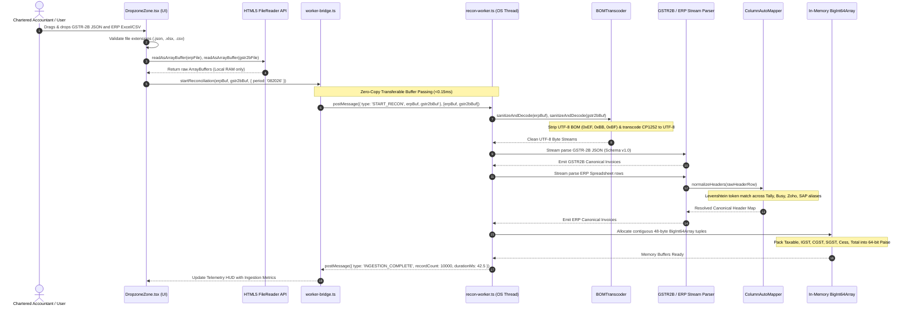
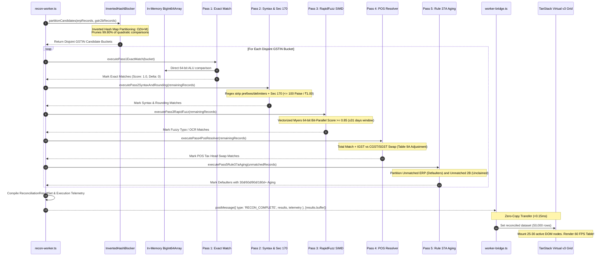
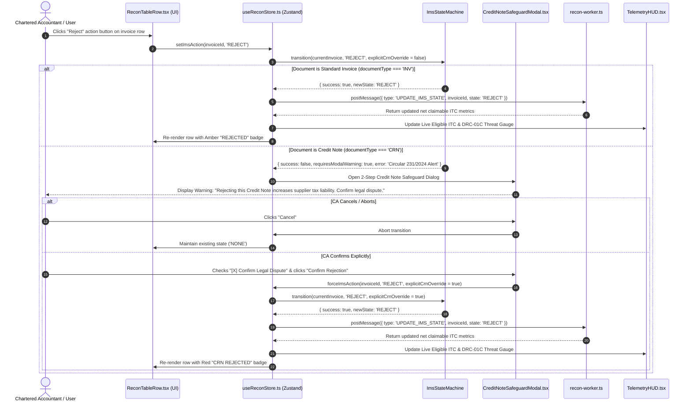
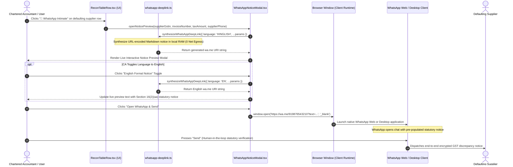
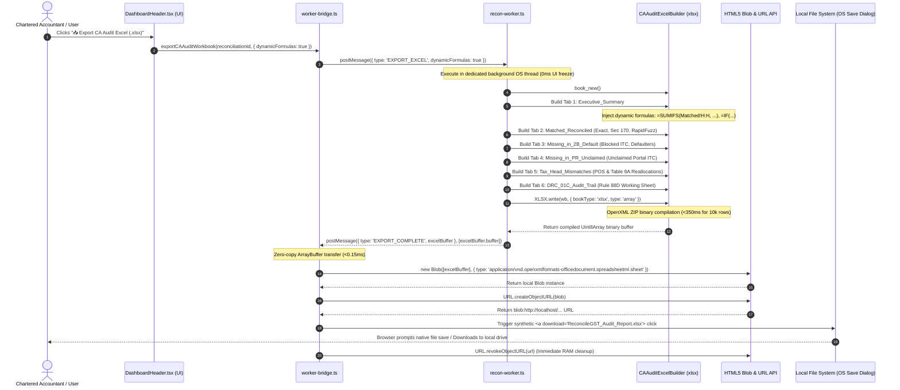

# Master Architectural Data Flow & Interaction Sequences

**Document ID:** `stage_4_documents/08_data_flow_sequences.md`  
**Version:** 1.0 (BASELINED)  
**Date:** 2026-08-21  
**Author:** Principal Systems & Software Architect (Team Binary Brains)  
**Parent Blueprints:** `stage_4_documents/05_architecture_plan.md`, `stage_4_documents/06_hld.md`, `stage_4_documents/07_lld.md`  
**Governing Inputs:** `stage_2_decision_lock/23_locked_scope.md`, `stage_3_research/25_stack_research.md`, `stage_4_documents/adrs/ADR-001` through `ADR-006`  
**Target Scope:** Comprehensive Mermaid Sequence Diagrams modeling the 5 primary runtime flows of the ReconcileGST edge suite

---

## 1. Sequence 1: Dual-Source Ingestion & Zero-Copy Worker Parsing Flow

This sequence models the zero-cloud file ingestion workflow where raw GSTR-2B JSON and heterogeneous ERP Excel/CSV registers are read into browser memory via HTML5 `FileReader` and transferred to the background Web Worker for UTF-8 BOM transcoding, fuzzy column normalization, and contiguous typed memory buffer allocation.

---

## 2. Sequence 2: 5-Stage SIMD Matching Waterfall Execution Pipeline

This sequence illustrates the end-to-end execution of the multi-pass reconciliation waterfall inside `recon-worker.ts`, including inverted hash candidate blocking ($O(N+M)$), exact composite matching, syntax & Section 170 statutory rounding normalization, SIMD RapidFuzz fuzzy scoring, Place of Supply (POS) tax head resolution, and zero-copy transfer of the result payload to the main UI thread.

---

## 3. Sequence 3: GSTN IMS Action Triage & Credit Note Safety Interceptor

This sequence models the user interaction flow for GSTN Invoice Management System (IMS) action declarations (`ACCEPT`, `REJECT`, `PENDING`) under GSTN Advisory No. 624 / Circular 231/2024, demonstrating the mandatory two-step confirmation interceptor whenever a user attempts to reject a Credit Note (`documentType === 'CRN'`).

---

## 4. Sequence 4: 1-Click WhatsApp Vendor Recovery Deep-Link Generation

This sequence details the vendor intimation workflow where a CA initiates communication with a defaulting supplier whose invoices are missing from Form GSTR-2B. The client-side deep link engine synthesizes pre-formatted bilingual (English/Hinglish) statutory recovery notices and hands off execution to the native WhatsApp client via `wa.me` URI protocols with zero cloud data egress and ₹0 operational cost.

---

## 5. Sequence 5: 6-Tab CA Audit-Ready Excel Binary Construction & Download

This sequence shows the generation of the standardized 6-tab CA Audit Workbook containing live, dynamic `=SUMIFS`, `=COUNTIF`, and `=IF` formulas. The workbook binary is compiled in Web Worker RAM using SheetJS, packaged into an OpenXML `.xlsx` byte buffer, and saved directly to the local filesystem via HTML5 Blob URL without touching an external server.

