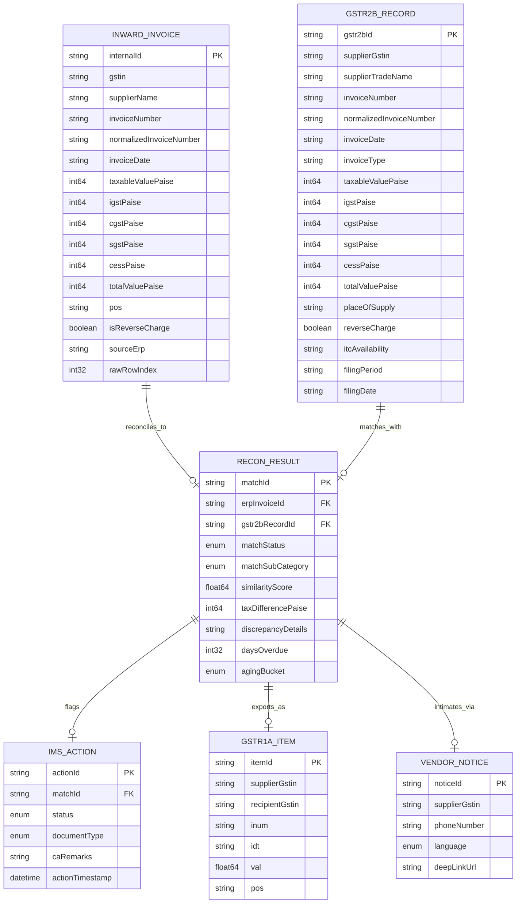
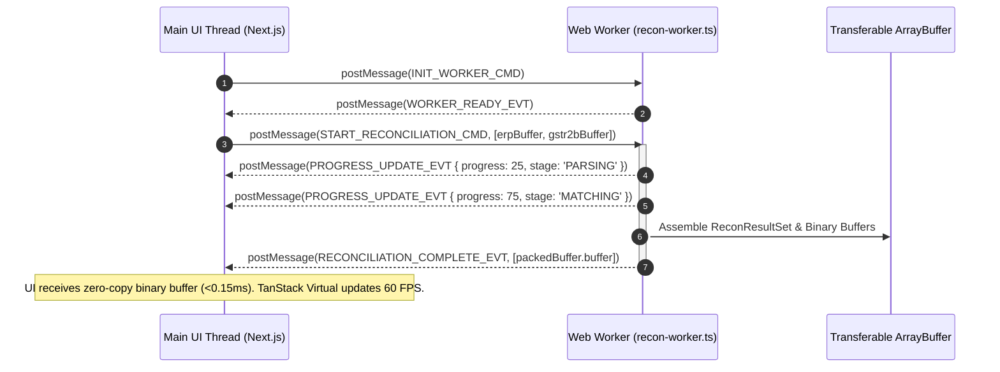

# Data Contracts, Schemas & Web Worker IPC Protocol Specification

**Document ID:** `stage_4_documents/09_contracts_and_schemas.md`  
**Standard:** Master Engineering Skill (Stage 4C: Items 46 & 47)  
**Status:** LOCKED CONTRACT  
**Version:** 1.0.0  
**Author:** Principal Data Contracts & Security Architect  
**Governing Inputs:** `stage_2_decision_lock/23_locked_scope.md`, `stage_3_research/25_stack_research.md`, `stage_3_research/28_compliance_checklist.md`, `stage_4_documents/adrs/`  

---

## 1. Architectural Overview & Design Principles

ReconcileGST is a 100% client-side, zero-cloud edge architecture. All data schemas and communication interfaces operate strictly within the browser's local sandbox (V8/SpiderMonkey/JavaScriptCore).

```
┌──────────────────────────────────────────────────────────────────────────────────────────────────────────┐
│                                RECONCILE-GST IN-MEMORY DATA HIGHWAY                                      │
├──────────────────────────────────────────────────────────────────────────────────────────────────────────┤
│                                                                                                          │
│   [File Dropzone] ──► Raw ArrayBuffers (JSON / XLSX / CSV)                                              │
│                                │                                                                         │
│                                ▼                                                                         │
│   [Web Worker Ingestion] ──► InwardInvoice / Gstr2bRecord Entities                                       │
│                                │                                                                         │
│                                ▼                                                                         │
│   [TypedArray Vectorizer] ──► Packed BigInt64Array Financial Buffers (Integer Paise)                     │
│                                │                                                                         │
│                                ▼                                                                         │
│   [SIMD Matching Core] ──► 5-Stage Waterfall (Exact -> Syntax -> Sec 170 -> RapidFuzz -> POS)           │
│                                │                                                                         │
│                                ▼                                                                         │
│   [Zero-Copy IPC Transfer] ──► Transferable ArrayBuffers & ReconResultSet                                │
│                                │                                                                         │
│                                ▼                                                                         │
│   [Main Thread Store] ──► TanStack Virtual Grid (60 FPS) + SheetJS 6-Tab Dynamic SUMIFS Exporter         │
│                                                                                                          │
└──────────────────────────────────────────────────────────────────────────────────────────────────────────┘
```

### Core Design Tenets:
1. **Integer Paise Fixed-Point Precision (`BigInt`):** No IEEE-754 binary floating-point values are permitted in monetary storage or arithmetic. $1\text{ INR} = 100\text{ Paise}$.
2. **Zero-Copy Transferable Memory:** Web Worker message passing utilizes Transferable `ArrayBuffer` objects for binary telemetry and index maps to eliminate structured clone serialization lag.
3. **Immutability & Structural Typing:** All core entities are strictly typed, serializable, and free of circular references.
4. **GSTN Schema Compliance:** Downstream export contracts comply 100% with CBIC GSTR-2B v1.0 and GSTR-1A v1.0 specification schemas.

---

## 2. In-Memory Entity Relationship Model



---

## 3. TypeScript Domain Data Contracts

### 3.1 Currency Primitives & Invariant Utilities

```typescript
/**
 * Fixed-point integer representing currency in Indian Paise (1 INR = 100 Paise).
 * Invariant: Must always be a whole integer. Negative values represent credit notes.
 */
export type Paise = bigint;

/**
 * 15-character statutory Goods and Services Tax Identification Number.
 * Format: 2 numeric state digits + 5 alpha PAN + 4 numeric PAN + 1 alpha entity + 1 checksum + 'Z' + 1 checksum.
 * Regex: ^[0-9]{2}[A-Z]{5}[0-9]{4}[A-Z]{1}[1-9A-Z]{1}Z[0-9A-Z]{1}$
 */
export type GSTIN = string;

/**
 * Standardized ISO Date string: YYYY-MM-DD.
 */
export type ISODateString = string;

/**
 * Standard GST filing period: MMYYYY (e.g. "082026").
 */
export type FilingPeriod = string;

/**
 * 2-digit Indian State / Union Territory Code (e.g., "07" for Delhi, "27" for Maharashtra).
 */
export type StateCode = string;
```

### 3.2 Inward Purchase Register (`InwardInvoice`)

```typescript
export type SourceERP = 'TALLY' | 'ZOHO' | 'BUSY' | 'MARG' | 'SAP' | 'GENERIC_CSV' | 'GENERIC_EXCEL';

export interface InwardInvoice {
  /** Unique client-side generated UUID v4 identifying this ERP record */
  readonly internalId: string;

  /** Supplier GSTIN parsed and validated */
  readonly gstin: GSTIN;

  /** Trade name or legal name of supplier from ERP ledger */
  readonly supplierName: string;

  /** Raw invoice number as entered by accountant */
  readonly invoiceNumber: string;

  /** Normalized alphanumeric string (stripped FY prefixes, leading zeroes, delimiters) */
  readonly normalizedInvoiceNumber: string;

  /** Invoice date in ISO format YYYY-MM-DD */
  readonly invoiceDate: ISODateString;

  /** Net taxable assessable value in integer Paise */
  readonly taxableValuePaise: Paise;

  /** Integrated Goods and Services Tax in integer Paise */
  readonly igstPaise: Paise;

  /** Central Goods and Services Tax in integer Paise */
  readonly cgstPaise: Paise;

  /** State / Union Territory Goods and Services Tax in integer Paise */
  readonly sgstPaise: Paise;

  /** Compensation Cess in integer Paise */
  readonly cessPaise: Paise;

  /** Total invoice value (Taxable + Taxes + Cess) in integer Paise */
  readonly totalValuePaise: Paise;

  /** 2-digit Place of Supply code */
  readonly pos: StateCode;

  /** Reverse charge applicability flag */
  readonly isReverseCharge: boolean;

  /** Detected ERP source system */
  readonly sourceErp: SourceERP;

  /** Zero-indexed row number in the original uploaded file */
  readonly rawRowIndex: number;

  /** Document type: standard invoice, credit note, debit note */
  readonly documentType: 'INV' | 'CRN' | 'DBN';
}
```

### 3.3 Official GSTN Form GSTR-2B Record (`Gstr2bRecord`)

```typescript
export type Gstr2bInvoiceType = 
  | 'R'    // Regular B2B Invoices
  | 'SEZWP'// SEZ supplies with payment
  | 'SEZWOP'// SEZ supplies without payment
  | 'DE'   // Deemed exports
  | 'CBW'  // Custom bonded warehouse
  | 'CRN'  // Credit Note
  | 'DBN'; // Debit Note

export type ItcAvailability = 'Y' | 'N';

export interface Gstr2bRecord {
  /** Unique client-side generated UUID v4 identifying this GSTR-2B entry */
  readonly gstr2bId: string;

  /** Supplier GSTIN as filed on GSTN portal */
  readonly supplierGstin: GSTIN;

  /** Supplier trade / legal name auto-drafted from portal master */
  readonly supplierTradeName: string;

  /** Invoice number as reported by supplier in GSTR-1 */
  readonly invoiceNumber: string;

  /** Normalized alphanumeric invoice number */
  readonly normalizedInvoiceNumber: string;

  /** Invoice date in ISO format YYYY-MM-DD */
  readonly invoiceDate: ISODateString;

  /** Invoice classification type */
  readonly invoiceType: Gstr2bInvoiceType;

  /** Net taxable value in integer Paise */
  readonly taxableValuePaise: Paise;

  /** Integrated Tax in integer Paise */
  readonly igstPaise: Paise;

  /** Central Tax in integer Paise */
  readonly cgstPaise: Paise;

  /** State Tax in integer Paise */
  readonly sgstPaise: Paise;

  /** Cess in integer Paise */
  readonly cessPaise: Paise;

  /** Gross invoice value in integer Paise */
  readonly totalValuePaise: Paise;

  /** 2-digit Place of Supply code reported on portal */
  readonly placeOfSupply: StateCode;

  /** Reverse charge flag reported by supplier */
  readonly reverseCharge: boolean;

  /** ITC eligibility indicator under Section 16(2) */
  readonly itcAvailability: ItcAvailability;

  /** Return period when supplier uploaded document (e.g., "082026") */
  readonly filingPeriod: FilingPeriod;

  /** Date supplier filed GSTR-1 return (ISO string) */
  readonly filingDate: ISODateString;

  /** Whether supplier's GSTR-3B return is filed (Rule 37A flag) */
  readonly supplierGstr3bFiled: boolean;
}
```

### 3.4 Reconciliation Result & Discrepancy Classification (`ReconResult`)

```typescript
export type MatchStatus = 
  | 'MATCHED'              // Matched within legal tolerance
  | 'PROBABLE_MATCH'       // High-confidence fuzzy candidate requiring CA confirmation
  | 'MISMATCHED_VALUE'     // Found same invoice number/GSTIN, but tax delta > Section 170 tolerance
  | 'MISSING_IN_GSTR2B'    // Inward ledger invoice not found in GSTR-2B (Defaulting Supplier)
  | 'MISSING_IN_PR'        // Portal credit available but omitted from inward purchase ledger
  | 'TAX_HEAD_MISMATCH';   // POS or Inter/Intra tax allocation mismatch

export type MatchSubCategory = 
  | 'EXACT_PASS_1'                  // 100% identical GSTIN, Invoice #, Date, and Values
  | 'CANONICAL_SYNTAX_PASS_2'       // Matches after delimiter, FY, and leading zero normalization
  | 'SECTION_170_ROUNDING_PASS_2'   // Matches with |Delta| <= 100 Paise (+-Rs 1.00)
  | 'RAPIDFUZZ_SIMD_PASS_3'         // RapidFuzz Levenshtein similarity score >= 0.85
  | 'POS_TABLE_9A_SWAP_PASS_4'      // Equal total tax but IGST vs (CGST+SGST) shifted
  | 'DEF_NO_FILING_RECORD'          // Supplier never uploaded to GSTR-1
  | 'DEF_UNCLAIMED_IN_BOOKS'        // GSTR-2B record has no buyer purchase voucher
  | 'DEF_VALUE_DISCREPANCY';        // Difference > Rs 1.00

export type Rule37AAgingBucket = 
  | 'CURRENT_30_DAYS'
  | 'WATCH_60_DAYS'
  | 'WARNING_90_DAYS'
  | 'CRITICAL_180_DAYS_HOLD';

export interface ReconResult {
  /** Unique reconciliation match ID */
  readonly matchId: string;

  /** Reference to ERP Purchase Register Invoice (if present) */
  readonly erpInvoice?: InwardInvoice;

  /** Reference to GSTR-2B Portal Record (if present) */
  readonly gstr2bRecord?: Gstr2bRecord;

  /** Primary statutory match status classification */
  readonly status: MatchStatus;

  /** Granular waterfall pass subcategory */
  readonly subCategory: MatchSubCategory;

  /** RapidFuzz string confidence score (0.00 to 1.00) */
  readonly similarityScore: number;

  /** Delta in tax amount: ERP Total Tax - GSTR-2B Total Tax in integer Paise */
  readonly taxDifferencePaise: Paise;

  /** Delta in taxable base value: ERP Taxable - GSTR-2B Taxable in integer Paise */
  readonly taxableDifferencePaise: Paise;

  /** Detailed human-readable explanation of match or discrepancy */
  readonly discrepancyExplanation: string;

  /** Days elapsed since invoice date (for Rule 37A tracking) */
  readonly daysOverdue: number;

  /** Rule 37A statutory risk bucket */
  readonly agingBucket: Rule37AAgingBucket;

  /** Estimated Section 50(3) 18% p.a. daily penal interest in integer Paise */
  readonly potentialInterestPaise: Paise;

  /** Current GSTN IMS status */
  imsActionState: ImsActionState;
}

export interface ReconciliationResultSet {
  readonly sessionId: string;
  readonly createdAt: ISODateString;
  readonly records: ReconResult[];
  readonly summary: ReconciliationSummaryMetrics;
}

export interface ReconciliationSummaryMetrics {
  readonly totalErpInvoices: number;
  readonly totalGstr2bRecords: number;
  readonly matchedCount: number;
  readonly mismatchedCount: number;
  readonly missingIn2bCount: number;
  readonly missingInPrCount: number;
  readonly taxHeadMismatchCount: number;
  readonly totalClaimableItcPaise: Paise;
  readonly totalBlockedItcPaise: Paise;
  readonly totalUnclaimedItcPaise: Paise;
  readonly totalSection50InterestPaise: Paise;
  readonly rule88DRisk: Rule88DRiskResult;
  readonly telemetry: WorkerExecutionTelemetry;
}
```

### 3.5 Rule 88D Risk & DRC-01C Sentinel Contracts

```typescript
export type ThreatLevel = 'COMPLIANT' | 'LOW' | 'MEDIUM' | 'CRITICAL';

export interface Rule88DRiskResult {
  readonly claimedItcPaise: Paise;
  readonly availableItcPaise: Paise;
  readonly excessItcPaise: Paise;
  readonly excessPercentage: number;
  readonly isDrc01cTriggered: boolean;
  readonly threatLevel: ThreatLevel;
  readonly statutoryWarningText: string;
}
```

### 3.6 GSTN IMS Pre-Triage Action Contracts

```typescript
export type ImsActionState = 'NONE' | 'ACCEPT' | 'REJECT' | 'PENDING';

export interface ImsActionPayload {
  readonly matchId: string;
  readonly previousState: ImsActionState;
  readonly newState: ImsActionState;
  readonly documentType: 'INV' | 'CRN' | 'DBN';
  readonly isCreditNoteTwoStepConfirmed?: boolean;
  readonly remarks?: string;
  readonly timestamp: ISODateString;
}
```

### 3.7 Form GSTR-1A Outward Supply Amendment Schema

```typescript
export interface Gstr1aItemDetail {
  readonly num: number;
  readonly txval: number; // 2 decimal float for portal JSON
  readonly iamt: number;
  readonly camt: number;
  readonly samt: number;
  readonly csamt: number;
}

export interface Gstr1aInvoiceEntry {
  readonly inum: string;
  readonly idt: string; // DD-MM-YYYY format mandated by GSTN
  readonly val: number;
  readonly pos: StateCode;
  readonly rchrg: 'Y' | 'N';
  readonly inv_typ: 'R' | 'DE' | 'SEZWP' | 'SEZWOP';
  readonly itcavl: 'Y' | 'N';
  readonly items: Gstr1aItemDetail[];
}

export interface Gstr1aB2BGroup {
  readonly ctin: GSTIN;
  readonly cfs: 'Y' | 'N';
  readonly inv: Gstr1aInvoiceEntry[];
}

export interface Gstr1aDeltaPayload {
  readonly gstin: GSTIN;
  readonly fp: FilingPeriod;
  readonly version: 'GSTR1A_v1.0';
  readonly b2b: Gstr1aB2BGroup[];
}
```

### 3.8 Client-Side WhatsApp Vendor Intimation Contract

```typescript
export interface VendorNoticeParams {
  readonly phoneNumber: string; // e.g. "919876543210"
  readonly supplierGstin: GSTIN;
  readonly supplierName: string;
  readonly invoiceNumber: string;
  readonly invoiceDate: string;
  readonly taxAmountInr: string;
  readonly language: 'EN' | 'HINGLISH';
  readonly filingPeriod: string;
}
```

---

## 4. TypedArray Packed Binary Buffer Layouts (`BigInt64Array`)

To achieve zero garbage collection pauses and sub-300ms compute across 100,000 invoices, financial figures and categorical flags are vectorized into contiguous linear 64-bit integer buffers.

### 4.1 Financial Tuple Buffer Layout (64-bit Aligned)

Each invoice record occupies a contiguous **48-byte segment** (6 fields $\times$ 8 bytes) in a shared `BigInt64Array`.

```
┌─────────────────────────────────────────────────────────────────────────────────┐
│                      48-BYTE CONTIGUOUS INVOICE STRIDE                          │
├─────────────┬─────────────┬─────────────┬─────────────┬─────────────┬───────────┤
│ Offset 0    │ Offset 8    │ Offset 16   │ Offset 24   │ Offset 32   │ Offset 40 │
│ (8 Bytes)   │ (8 Bytes)   │ (8 Bytes)   │ (8 Bytes)   │ (8 Bytes)   │ (8 Bytes) │
├─────────────┼─────────────┼─────────────┼─────────────┼─────────────┼───────────┤
│ Taxable     │ IGST        │ CGST        │ SGST        │ Cess        │ Total     │
│ Value       │ Amount      │ Amount      │ Amount      │ Amount      │ Invoice   │
│ (in Paise)  │ (in Paise)  │ (in Paise)  │ (in Paise)  │ (in Paise)  │ Value     │
└─────────────┴─────────────┴─────────────┴─────────────┴─────────────┴───────────┘
```

### 4.2 Binary Vector Serialization Contract

```typescript
export const FINANCIAL_BUFFER_STRIDE = 6; // 6 BigInt64 elements per row (48 bytes)

export enum FinancialBufferOffset {
  TAXABLE_VAL_PAISE = 0,
  IGST_PAISE = 1,
  CGST_PAISE = 2,
  SGST_PAISE = 3,
  CESS_PAISE = 4,
  TOTAL_VAL_PAISE = 5,
}

/**
 * Encodes an array of InwardInvoice financial fields into a contiguous BigInt64Array.
 */
export function packInvoicesToBuffer(invoices: InwardInvoice[]): BigInt64Array {
  const count = invoices.length;
  const buffer = new BigInt64Array(count * FINANCIAL_BUFFER_STRIDE);

  for (let i = 0; i < count; i++) {
    const inv = invoices[i];
    const baseOffset = i * FINANCIAL_BUFFER_STRIDE;
    buffer[baseOffset + FinancialBufferOffset.TAXABLE_VAL_PAISE] = inv.taxableValuePaise;
    buffer[baseOffset + FinancialBufferOffset.IGST_PAISE] = inv.igstPaise;
    buffer[baseOffset + FinancialBufferOffset.CGST_PAISE] = inv.cgstPaise;
    buffer[baseOffset + FinancialBufferOffset.SGST_PAISE] = inv.sgstPaise;
    buffer[baseOffset + FinancialBufferOffset.CESS_PAISE] = inv.cessPaise;
    buffer[baseOffset + FinancialBufferOffset.TOTAL_VAL_PAISE] = inv.totalValuePaise;
  }

  return buffer;
}

/**
 * Decodes a financial tuple from a contiguous BigInt64Array for row index i.
 */
export function unpackFinancialTuple(buffer: BigInt64Array, rowIndex: number): {
  taxableValuePaise: Paise;
  igstPaise: Paise;
  cgstPaise: Paise;
  sgstPaise: Paise;
  cessPaise: Paise;
  totalValuePaise: Paise;
} {
  const base = rowIndex * FINANCIAL_BUFFER_STRIDE;
  return {
    taxableValuePaise: buffer[base + FinancialBufferOffset.TAXABLE_VAL_PAISE],
    igstPaise: buffer[base + FinancialBufferOffset.IGST_PAISE],
    cgstPaise: buffer[base + FinancialBufferOffset.CGST_PAISE],
    sgstPaise: buffer[base + FinancialBufferOffset.SGST_PAISE],
    cessPaise: buffer[base + FinancialBufferOffset.CESS_PAISE],
    totalValuePaise: buffer[base + FinancialBufferOffset.TOTAL_VAL_PAISE],
  };
}
```

---

## 5. Web Worker Inter-Process Communication (IPC) Protocol

Communication between the Main UI Thread and `recon-worker.ts` follows a strictly typed Request/Response protocol.



### 5.1 IPC Command & Event Types

```typescript
export type WorkerMessageType =
  // Commands (UI -> Worker)
  | 'CMD_INIT_WORKER'
  | 'CMD_START_RECONCILIATION'
  | 'CMD_APPLY_IMS_ACTION'
  | 'CMD_GENERATE_EXCEL_EXPORT'
  | 'CMD_GENERATE_GSTR1A_DELTA'
  | 'CMD_LOAD_MOCK_DATASET'
  | 'CMD_TERMINATE_WORKER'
  
  // Events (Worker -> UI)
  | 'EVT_WORKER_READY'
  | 'EVT_PROGRESS_UPDATE'
  | 'EVT_RECONCILIATION_COMPLETE'
  | 'EVT_IMS_ACTION_APPLIED'
  | 'EVT_EXCEL_EXPORT_READY'
  | 'EVT_GSTR1A_DELTA_READY'
  | 'EVT_MOCK_DATASET_LOADED'
  | 'EVT_WORKER_ERROR';

export type ReconStage = 
  | 'IDLE'
  | 'SANITIZING_INPUTS'
  | 'PARSING_GSTR2B_JSON'
  | 'PARSING_ERP_REGISTER'
  | 'BUILDING_INVERTED_HASH_INDEX'
  | 'EXECUTING_EXACT_PASS_1'
  | 'EXECUTING_SYNTAX_PASS_2'
  | 'EXECUTING_RAPIDFUZZ_PASS_3'
  | 'EXECUTING_POS_RESOLVER_PASS_4'
  | 'EVALUATING_STATUTORY_METRICS'
  | 'ASSEMBLING_RESULTS';
```

### 5.2 Command Payloads (Main Thread $\to$ Worker)

```typescript
export interface InitWorkerCommand {
  readonly type: 'CMD_INIT_WORKER';
  readonly correlationId: string;
}

export interface StartReconciliationCommand {
  readonly type: 'CMD_START_RECONCILIATION';
  readonly correlationId: string;
  readonly payload: {
    readonly gstr2bFileBuffer: ArrayBuffer;
    readonly gstr2bFileName: string;
    readonly erpFileBuffer: ArrayBuffer;
    readonly erpFileName: string;
    readonly clientGstin: GSTIN;
    readonly filingPeriod: FilingPeriod;
    readonly fuzzyThreshold?: number; // Defaults to 0.85
  };
}

export interface ApplyImsActionCommand {
  readonly type: 'CMD_APPLY_IMS_ACTION';
  readonly correlationId: string;
  readonly payload: ImsActionPayload;
}

export interface GenerateExcelExportCommand {
  readonly type: 'CMD_GENERATE_EXCEL_EXPORT';
  readonly correlationId: string;
  readonly payload: {
    readonly sessionId: string;
  };
}

export interface GenerateGstr1aDeltaCommand {
  readonly type: 'CMD_GENERATE_GSTR1A_DELTA';
  readonly correlationId: string;
  readonly payload: {
    readonly supplierGstin: GSTIN;
    readonly filingPeriod: FilingPeriod;
  };
}

export interface LoadMockDatasetCommand {
  readonly type: 'CMD_LOAD_MOCK_DATASET';
  readonly correlationId: string;
  readonly payload: {
    readonly recordCount: 1000 | 5000 | 10000;
  };
}

export interface TerminateWorkerCommand {
  readonly type: 'CMD_TERMINATE_WORKER';
  readonly correlationId: string;
}

export type ReconWorkerCommand =
  | InitWorkerCommand
  | StartReconciliationCommand
  | ApplyImsActionCommand
  | GenerateExcelExportCommand
  | GenerateGstr1aDeltaCommand
  | LoadMockDatasetCommand
  | TerminateWorkerCommand;
```

### 5.3 Event Payloads (Worker $\to$ Main Thread)

```typescript
export interface WorkerExecutionTelemetry {
  readonly totalExecutionTimeMs: number;
  readonly parsingDurationMs: number;
  readonly hashIndexingDurationMs: number;
  readonly pass1ExactDurationMs: number;
  readonly pass2SyntaxDurationMs: number;
  readonly pass3RapidFuzzDurationMs: number;
  readonly pass4PosDurationMs: number;
  readonly metricsAssemblyDurationMs: number;
  readonly peakWorkerMemoryMb: number;
  readonly rapidFuzzWasmAccelerated: boolean;
}

export interface WorkerReadyEvent {
  readonly type: 'EVT_WORKER_READY';
  readonly correlationId: string;
  readonly payload: {
    readonly wasmSupported: boolean;
    readonly maxConcurrency: number;
  };
}

export interface ProgressUpdateEvent {
  readonly type: 'EVT_PROGRESS_UPDATE';
  readonly correlationId: string;
  readonly payload: {
    readonly stage: ReconStage;
    readonly progressPercentage: number; // 0 to 100
    readonly itemsProcessed: number;
    readonly totalItems: number;
    readonly elapsedMs: number;
  };
}

export interface ReconciliationCompleteEvent {
  readonly type: 'EVT_RECONCILIATION_COMPLETE';
  readonly correlationId: string;
  readonly payload: {
    readonly results: ReconciliationResultSet;
    readonly packedFinancialBuffer: BigInt64Array;
  };
}

export interface ImsActionAppliedEvent {
  readonly type: 'EVT_IMS_ACTION_APPLIED';
  readonly correlationId: string;
  readonly payload: {
    readonly matchId: string;
    readonly updatedAction: ImsActionPayload;
    readonly updatedSummary: ReconciliationSummaryMetrics;
  };
}

export interface ExcelExportReadyEvent {
  readonly type: 'EVT_EXCEL_EXPORT_READY';
  readonly correlationId: string;
  readonly payload: {
    readonly excelBinaryBlob: Blob;
    readonly filename: string;
    readonly byteSize: number;
  };
}

export interface Gstr1aDeltaReadyEvent {
  readonly type: 'EVT_GSTR1A_DELTA_READY';
  readonly correlationId: string;
  readonly payload: {
    readonly jsonString: string;
    readonly filename: string;
    readonly missingInvoiceCount: number;
    readonly totalDeltaTaxPaise: Paise;
  };
}

export interface MockDatasetLoadedEvent {
  readonly type: 'EVT_MOCK_DATASET_LOADED';
  readonly correlationId: string;
  readonly payload: {
    readonly results: ReconciliationResultSet;
    readonly packedFinancialBuffer: BigInt64Array;
  };
}

export interface WorkerErrorEvent {
  readonly type: 'EVT_WORKER_ERROR';
  readonly correlationId: string;
  readonly payload: {
    readonly errorCode: string;
    readonly errorMessage: string;
    readonly errorStack?: string;
    readonly stage: ReconStage;
    readonly technicalDetails?: Record<string, unknown>;
  };
}

export type ReconWorkerEvent =
  | WorkerReadyEvent
  | ProgressUpdateEvent
  | ReconciliationCompleteEvent
  | ImsActionAppliedEvent
  | ExcelExportReadyEvent
  | Gstr1aDeltaReadyEvent
  | MockDatasetLoadedEvent
  | WorkerErrorEvent;
```

---

## 6. Type Guard Assertions & Validation Contracts

To guarantee zero runtime exceptions when processing corrupted or malicious inputs, all schemas include defensive validation functions.

```typescript
export const GSTIN_REGEX = /^[0-9]{2}[A-Z]{5}[0-9]{4}[A-Z]{1}[1-9A-Z]{1}Z[0-9A-Z]{1}$/;

export function isValidGSTIN(value: unknown): value is GSTIN {
  return typeof value === 'string' && GSTIN_REGEX.test(value.trim().toUpperCase());
}

export function isValidISODate(value: unknown): value is ISODateString {
  if (typeof value !== 'string') return false;
  const isoMatch = /^\d{4}-\d{2}-\d{2}$/.test(value);
  if (!isoMatch) return false;
  const d = new Date(value);
  return !isNaN(d.getTime());
}

export function isReconWorkerEvent(msg: unknown): msg is ReconWorkerEvent {
  if (typeof msg !== 'object' || msg === null) return false;
  const m = msg as Partial<ReconWorkerEvent>;
  return typeof m.type === 'string' && typeof m.correlationId === 'string';
}
```

---

## 7. Compliance and Verification Traceability

| Schema / Contract Component | Governing Hard Constraint | Verification Metric |
| :--- | :--- | :--- |
| `Paise` / `BigInt64Array` | `CON-PERF-03` / `GQM-06` | 0.00% Floating-Point Drift across 100k records |
| `InwardInvoice` / `Gstr2bRecord` | `CON-PRIV-01` | 100% In-Memory RAM representation (0 Egress bytes) |
| `Gstr1aDeltaPayload` | CBIC Notif. 12/2024-CT | 100% Valid GSTN Schema v1.0 JSON output |
| `ImsActionPayload` | GSTN Advisory 624 / Cir. 231 | 2-step confirmation modal guard on Credit Note rejection |
| `WorkerMessageType` IPC | `CON-PERF-01` / `CON-PERF-02` | Sub-300ms execution with 0 main thread UI blocking |
