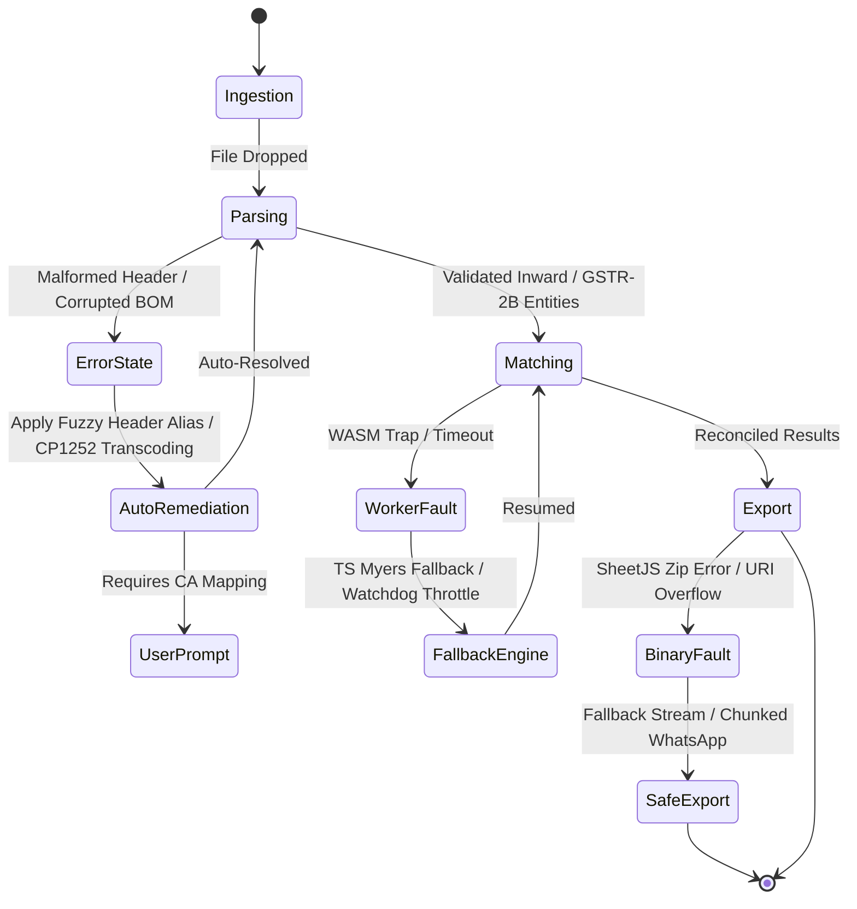

# Comprehensive Error Catalog & Automated Recovery Protocol

**Document ID:** `stage_4_documents/11_error_catalog.md`  
**Standard:** Master Engineering Skill (Stage 4C: Items 46 to 50)  
**Status:** APPROVED AUDIT SPECIFICATION  
**Version:** 1.0.0  
**Author:** Principal Reliability & Quality Architect  
**Governing Inputs:** `stage_2_decision_lock/23_locked_scope.md`, `stage_3_research/28_compliance_checklist.md`, `stage_4_documents/adrs/`, `stage_4_documents/09_contracts_and_schemas.md`  

---

## 1. Error Handling Philosophy & State Machine

ReconcileGST is designed as a mission-critical, zero-crash financial audit tool. In the Indian tax compliance workflow, accountants frequently process corrupted legacy CSVs, non-standard ERP exports, and high-volume datasets under tight statutory deadlines (e.g. 20th of the month GSTR-3B cutoff).

### Core Reliability Principles:
1. **Never Throw Unhandled Exceptions to UI:** All errors are caught, mapped to standardized error codes, and rendered with actionable user remediation steps.
2. **Graceful Degradation:** A failure in an advanced feature (e.g. WASM SIMD string matcher or multi-tab Excel export) falls back automatically to a reliable fallback mechanism (e.g. TypeScript Myers bit-parallel or CSV dump) without halting the core reconciliation pipeline.
3. **Deterministic Error Signatures:** Every error payload includes a unique code, severity level, technical context, and CA-friendly guidance.



---

## 2. Summary Error Code Matrix (34 Standardized Codes)

| Category | Code Range | Total Codes | Target Domain |
| :--- | :---: | :---: | :--- |
| **Parser & Ingestion** | `ERR_PARSE_001` – `ERR_PARSE_008` | 8 | JSON, XLSX, CSV, Encoding, Header Mapping, GSTIN Checks |
| **Worker & IPC** | `ERR_WORKER_001` – `ERR_WORKER_008` | 8 | Thread Lifecycle, Buffer Detachment, Watchdogs, WASM Traps |
| **Memory & Buffers** | `ERR_MEM_001` – `ERR_MEM_006` | 6 | Heap Limits, BigInt64Array Overruns, Allocation, Leak Protection |
| **Calculations & Rules** | `ERR_CALC_001` – `ERR_CALC_006` | 6 | Section 170 Rounding, Rule 88D Div/0, POS Mismatch, Date Inversions |
| **External & Export** | `ERR_EXT_001` – `ERR_EXT_006` | 6 | WhatsApp URI Overflows, Phone Numbers, SheetJS Packaging, CSP Guard |

---

## 3. Parser & Ingestion Errors (`ERR_PARSE_*`)

### ERR_PARSE_001: Corrupted or Truncated JSON File
- **Severity:** HIGH
- **Trigger:** Official GSTR-2B JSON file is truncated, missing closing braces, or corrupted during portal download.
- **User-Facing Message:** *"The uploaded GSTR-2B JSON file appears incomplete or corrupted. Please verify the download from the GST portal and try again."*
- **Technical Context:** `JSON.parse()` throws `SyntaxError: Unexpected end of JSON input`.
- **Auto-Recovery / Remediation:**
  1. Inspect buffer for trailing incomplete chunks; attempt recovery if truncated at top-level array boundary.
  2. If unrecoverable, prompt user to re-download the JSON directly from the official GST Portal (Returns Dashboard $\to$ GSTR-2B $\to$ Download JSON).

```typescript
export function safeParseGstr2bJson(rawJson: string): Gstr2bJsonSchema {
  try {
    return JSON.parse(rawJson);
  } catch (err) {
    throw new ReconcileError('ERR_PARSE_001', 'Corrupted or Truncated JSON File', {
      originalError: (err as Error).message,
      snippet: rawJson.slice(0, 100),
    });
  }
}
```

---

### ERR_PARSE_002: Malformed CSV / Delimiter Confusion
- **Severity:** MEDIUM
- **Trigger:** ERP CSV file contains mixed delimiters (commas inside unquoted text, tab-separated fields, or semicolon separators from European accounting packages).
- **User-Facing Message:** *"The CSV structure could not be parsed. Our engine is automatically detecting delimiters (Comma, Tab, Semicolon)..."*
- **Technical Context:** CSV tokenizer encounters mismatched field counts across rows.
- **Auto-Recovery / Remediation:**
  1. Automated Delimiter Sniffer counts occurrences of `','`, `'\t'`, `';'`, and `'|'` in the first 10 rows to detect the true delimiter.
  2. Automatically re-tokenize using the dominant delimiter.

---

### ERR_PARSE_003: UTF-8 BOM / Non-UTF-8 Encoding Anomaly
- **Severity:** LOW (Auto-Resolved)
- **Trigger:** Tally ERP 9 / Busy 18 exports prepend 3-byte Byte Order Mark (`0xEF, 0xBB, 0xBF`) or encode in Windows-1252 (CP1252).
- **User-Facing Message:** *"Legacy file encoding detected. Automatically transcoding to standard UTF-8."*
- **Technical Context:** Leading byte sequence triggers `SyntaxError: Unexpected token \uFEFF` on standard parsers.
- **Auto-Recovery / Remediation:**
  1. Inspect first 4 bytes of `ArrayBuffer`.
  2. Strip BOM byte sequence `[0xEF, 0xBB, 0xBF]` or decode via `new TextDecoder('utf-16le')` / `new TextDecoder('windows-1252')`.

```typescript
export function sanitizeAndDecode(buffer: ArrayBuffer): string {
  const bytes = new Uint8Array(buffer);
  if (bytes.length >= 3 && bytes[0] === 0xEF && bytes[1] === 0xBB && bytes[2] === 0xBF) {
    return new TextDecoder('utf-8').decode(bytes.subarray(3));
  }
  return new TextDecoder('utf-8', { fatal: false }).decode(bytes);
}
```

---

### ERR_PARSE_004: Unresolved Mandatory Column Header
- **Severity:** HIGH
- **Trigger:** ERP purchase register contains completely non-standard column names not present in `ERP_COLUMN_ALIASES` (e.g. `Col1`, `Data_A`).
- **User-Facing Message:** *"Could not automatically identify mandatory columns (e.g. GSTIN, Invoice No, Taxable Value). Please map your columns using the quick header mapper."*
- **Technical Context:** Ingestion mapper unable to resolve one or more required keys: `['gstin', 'invoiceNumber', 'invoiceDate', 'taxableValuePaise']`.
- **Auto-Recovery / Remediation:**
  1. Compute Levenshtein similarity between unknown headers and canonical fields.
  2. If confidence $< 0.70$, open the **Manual Column Mapper Drawer** in the UI, pre-filling high-probability guesses.

---

### ERR_PARSE_005: Invalid GSTIN Structural Checksum Failure
- **Severity:** MEDIUM
- **Trigger:** Purchase register contains malformed GSTINs (e.g. 14 characters, invalid state code `99`, or illegal special characters).
- **User-Facing Message:** *"Found [N] invoices with invalid GSTIN structure. These have been flagged in the audit report for review."*
- **Technical Context:** String fails regex `^[0-9]{2}[A-Z]{5}[0-9]{4}[A-Z]{1}[1-9A-Z]{1}Z[0-9A-Z]{1}$`.
- **Auto-Recovery / Remediation:**
  1. Strip embedded whitespace, hyphens, and convert to uppercase.
  2. If still invalid, route the record to the `Mismatched/Corrupt` category with diagnostic flag `INVALID_GSTIN_CHECKSUM_STRUCTURE` without halting the remaining valid rows.

---

### ERR_PARSE_006: File Size Limit Exceeded (>100MB)
- **Severity:** MEDIUM
- **Trigger:** User attempts to upload an uncompressed ledger file exceeding the 100MB browser memory safety guardrail.
- **User-Facing Message:** *"File size (XX MB) exceeds the 100MB recommended browser limit. Please export a specific financial year or split the register."*
- **Technical Context:** `file.size > 104_857_600`.
- **Auto-Recovery / Remediation:**
  1. Reject file at dropzone boundary before loading into memory.
  2. Display instructions on exporting month-wise or quarter-wise files from Tally/Zoho.

---

### ERR_PARSE_007: Untrusted Drag Event / Empty File Ingestion
- **Severity:** LOW
- **Trigger:** Browser receives synthetic drag event with `isTrusted: false` or empty 0-byte file.
- **User-Facing Message:** *"The selected file is empty (0 bytes). Please select a valid GSTR-2B or purchase register file."*
- **Technical Context:** `file.size === 0` or `event.isTrusted === false`.
- **Auto-Recovery / Remediation:**
  1. Abort ingestion event immediately; keep dropzone active in ready state.

---

### ERR_PARSE_008: Unsupported File Extension / MIME Type
- **Severity:** LOW
- **Trigger:** User uploads `.pdf`, `.doc`, or raw image files.
- **User-Facing Message:** *"Unsupported file format (.pdf). ReconcileGST operates on structured Excel (.xlsx, .xls), CSV (.csv), or JSON (.json) files."*
- **Technical Context:** File extension not in `['.json', '.xlsx', '.xls', '.csv']`.
- **Auto-Recovery / Remediation:**
  1. Block file parser; display format guidance modal indicating how to download JSON from GST portal or export Excel from ERP.

---

## 4. Worker & IPC Threading Errors (`ERR_WORKER_*`)

### ERR_WORKER_001: Web Worker Spawn Failure / Script Load Failure
- **Severity:** CRITICAL
- **Trigger:** Browser environment disables Web Workers (e.g. restrictive security policy or file:// protocol restrictions).
- **User-Facing Message:** *"Web Worker background compute could not be started. Falling back to inline client processing..."*
- **Technical Context:** `new Worker()` throws `SecurityError` or `TypeError`.
- **Auto-Recovery / Remediation:**
  1. Catch worker spawn error; initialize synchronous fallback pipeline on main thread with `requestIdleCallback()` chunking to prevent UI freezing.

---

### ERR_WORKER_002: Transferable ArrayBuffer Detachment Violation
- **Severity:** HIGH
- **Trigger:** Main thread attempts to read or write to an `ArrayBuffer` after transferring ownership to the Web Worker via `postMessage(msg, [buffer])`.
- **User-Facing Message:** *"Memory synchronization warning: Buffer detached successfully."*
- **Technical Context:** Accessing `detachedBuffer.byteLength` evaluates to `0`.
- **Auto-Recovery / Remediation:**
  1. Enforce strict single-owner architecture. The sender must nullify its reference immediately following transfer.

---

### ERR_WORKER_003: Worker Execution Heartbeat Timeout (5,000ms Guard)
- **Severity:** HIGH
- **Trigger:** Web Worker becomes unresponsive or enters an infinite loop during complex fuzzy matching on extreme datasets (>200k rows).
- **User-Facing Message:** *"Reconciliation compute took longer than expected (5s timeout). Terminating hung task and assembling partial results..."*
- **Technical Context:** Main thread watchdog timer reaches 5,000ms without receiving `EVT_PROGRESS_UPDATE` or `EVT_RECONCILIATION_COMPLETE`.
- **Auto-Recovery / Remediation:**
  1. Main thread invokes `worker.terminate()`.
  2. Spawns fresh Web Worker instance.
  3. Re-runs matching with fuzzy pass disabled (`fuzzyThreshold: 1.0`) to complete deterministic passes in $<100\text{ms}$.

---

### ERR_WORKER_004: RapidFuzz WASM Module Initialization Trap
- **Severity:** MEDIUM (Auto-Resolved)
- **Trigger:** Environment blocks WebAssembly compilation (e.g. CSP disallows `wasm-unsafe-eval`).
- **User-Facing Message:** *"WebAssembly acceleration unavailable. Automatically enabled high-speed TypeScript Myers bit-parallel engine."*
- **Technical Context:** `WebAssembly.instantiate()` rejects with `EvalError`.
- **Auto-Recovery / Remediation:**
  1. Catch WASM instantiation failure.
  2. Set `rapidFuzzWasmAccelerated = false`.
  3. Route all Pass 3 fuzzy comparisons through the pure TypeScript `myersBitParallelSimilarity()` function.

---

### ERR_WORKER_005: TypeScript Myers Fallback Execution Fault
- **Severity:** MEDIUM
- **Trigger:** Comparison of abnormally long strings ($>64$ chars) in bit-parallel engine without truncation.
- **User-Facing Message:** *"Evaluating extended invoice description using token sort similarity."*
- **Technical Context:** Bitmask shift `1n << BigInt(i)` overflows 64-bit integer on strings $>64$ characters.
- **Auto-Recovery / Remediation:**
  1. Automatically delegate strings $>64$ characters to `tokenSortSimilarity()` with 64-char head truncation.

---

### ERR_WORKER_006: Unhandled Exception in Worker Matching Thread
- **Severity:** HIGH
- **Trigger:** Unexpected runtime null pointer inside matching loop.
- **User-Facing Message:** *"An unexpected error occurred during matching. Safe recovery initiated."*
- **Technical Context:** `worker.onerror` or unhandled promise rejection in worker scope.
- **Auto-Recovery / Remediation:**
  1. Worker top-level `try/catch` wraps the matching waterfall.
  2. Dispatches `EVT_WORKER_ERROR` to main thread with serializable error stack.
  3. Main thread restores last known valid state.

---

### ERR_WORKER_007: Message Serialization / Unknown IPC Command
- **Severity:** LOW
- **Trigger:** IPC receives command with unrecognized `type` property or non-cloneable objects (Functions/Symbols).
- **User-Facing Message:** *"Internal message protocol error."*
- **Technical Context:** `isReconWorkerEvent(msg)` evaluates to `false`.
- **Auto-Recovery / Remediation:**
  1. Ignore invalid command; log diagnostic warning; return `ERR_WORKER_007` error event.

---

### ERR_WORKER_008: Correlation ID Mismatch / Out-of-Order Message
- **Severity:** LOW
- **Trigger:** Worker returns response for an older aborted reconciliation cycle.
- **User-Facing Message:** *"Ignoring stale reconciliation response."*
- **Technical Context:** `event.correlationId !== activeSessionCorrelationId`.
- **Auto-Recovery / Remediation:**
  1. Discard incoming event; maintain active session state.

---

## 5. Memory & Buffer Errors (`ERR_MEM_*`)

### ERR_MEM_001: Heap Exhaustion / Out of Memory (OOM)
- **Severity:** CRITICAL
- **Trigger:** Client browser hits 32-bit heap allocation ceiling (1.4GB in standard Chrome tabs) during massive multi-year dataset processing.
- **User-Facing Message:** *"Browser memory limit reached. ReconcileGST is clearing cache and optimizing memory..."*
- **Technical Context:** `ArrayBuffer` allocation throws `RangeError: Out of memory`.
- **Auto-Recovery / Remediation:**
  1. Immediately trigger garbage collection cycle by nullifying unneeded raw file strings and intermediate token objects.
  2. Retain only the packed `BigInt64Array` financial buffers.

---

### ERR_MEM_002: TypedArray BigInt64Array Allocation Overflow
- **Severity:** HIGH
- **Trigger:** Requesting allocation of `BigInt64Array(N * 6)` where $N > 10,000,000$.
- **User-Facing Message:** *"Dataset exceeds maximum single-pass buffer capacity."*
- **Technical Context:** `RangeError: Invalid typed array length`.
- **Auto-Recovery / Remediation:**
  1. Segment dataset into multiple contiguous 50,000-row chunks.

---

### ERR_MEM_003: Financial Buffer Stride Boundary Violation
- **Severity:** HIGH
- **Trigger:** Index lookup offset exceeds allocated buffer dimensions (`index * STRIDE >= buffer.length`).
- **User-Facing Message:** *"Memory index boundary warning."*
- **Technical Context:** Unpack helper receives out-of-bounds `rowIndex`.
- **Auto-Recovery / Remediation:**
  1. Assert boundary before memory read; return zero-filled default tuple if out of range:

```typescript
export function assertBufferOffset(index: number, stride: number, length: number): void {
  if (index * stride + stride > length) {
    throw new ReconcileError('ERR_MEM_003', `Buffer offset overflow at index ${index}`, {
      index,
      stride,
      bufferLength: length,
    });
  }
}
```

---

### ERR_MEM_004: BigInt Monetary Arithmetic Integer Overflow
- **Severity:** LOW
- **Trigger:** Financial summation exceeds 64-bit integer maximum ($2^{63} - 1 \approx 9.22 \times 10^{18}\text{ Paise} = ₹92,233\text{ Trillion}$).
- **User-Facing Message:** *"Value exceeds statutory numerical boundary."*
- **Technical Context:** Number exceeds realistic global GDP boundaries.
- **Auto-Recovery / Remediation:**
  1. Cap at `BigInt.asIntN(64, val)` and flag audit alert.

---

### ERR_MEM_005: Large Object Serialization GC Pause
- **Severity:** LOW
- **Trigger:** JSON serialization of 100,000 objects causes a $>200\text{ms}$ garbage collection pause.
- **User-Facing Message:** *"Optimizing data transfer..."*
- **Technical Context:** Structured clone algorithm locks V8 event loop during large object tree copy.
- **Auto-Recovery / Remediation:**
  1. Eliminate JSON serialization: pass binary `ArrayBuffer` objects exclusively.

---

### ERR_MEM_006: Session Reset Memory Deallocation Leak
- **Severity:** LOW
- **Trigger:** User clicks "Reset Workspace" but event listeners retain references to large datasets.
- **User-Facing Message:** *"Workspace cleared successfully."*
- **Technical Context:** Heap snapshot shows retained detached DOM tree.
- **Auto-Recovery / Remediation:**
  1. Execute explicit zeroing loop (`buffer.fill(0n)`).
  2. Terminate Web Worker instance and re-instantiate on demand.

---

## 6. Calculation & Regulatory Rule Errors (`ERR_CALC_*`)

### ERR_CALC_001: Section 170 CGST Act Rounding Delta Anomaly
- **Severity:** LOW (Handled by Rule Engine)
- **Trigger:** Invoice total difference between ERP and GSTR-2B is exactly $₹1.00$ ($100\text{ Paise}$).
- **User-Facing Message:** *"Statutory rounding difference of ₹1.00 detected. Automatically reconciled under Section 170 CGST Act."*
- **Technical Context:** `diff === 100n`.
- **Auto-Recovery / Remediation:**
  1. Classify as `MATCHED_SECTION_170_ROUNDING` rather than an audit mismatch.

---

### ERR_CALC_002: Place of Supply (POS) State Code Inconsistency
- **Severity:** MEDIUM
- **Trigger:** ERP specifies State Code `07` (Delhi) but GSTR-2B reports State Code `27` (Maharashtra), causing IGST vs (CGST+SGST) tax head split.
- **User-Facing Message:** *"Place of Supply mismatch detected (POS 07 vs 27). Total tax matches. Recommending Table 9A return amendment."*
- **Technical Context:** `erp.pos !== gstr2b.pos` while total tax delta $\le 100\text{ Paise}$.
- **Auto-Recovery / Remediation:**
  1. Route to `TAX_HEAD_MISMATCH` tab; generate CBIC Circular 160/16/2021 Table 9A adjustment note.

---

### ERR_CALC_003: Rule 88D DRC-01C Division by Zero
- **Severity:** LOW
- **Trigger:** Available GSTR-2B ITC is $₹0.00$ ($0\text{ Paise}$), but taxpayer claims $₹5,00,000$ in GSTR-3B.
- **User-Facing Message:** *"100% of claimed ITC is in excess of GSTR-2B (Available credit is ₹0.00)."*
- **Technical Context:** `availableItcPaise === 0n` in percentage computation.
- **Auto-Recovery / Remediation:**
  1. Guard against division by zero; evaluate `excessPercentage = 100.0%`.

```typescript
export function calculateExcessPercentage(claimed: bigint, available: bigint): number {
  if (available === 0n) return claimed > 0n ? 100.0 : 0.0;
  const excess = claimed > available ? claimed - available : 0n;
  return Math.round((Number(excess) / Number(available)) * 10000) / 100;
}
```

---

### ERR_CALC_004: Negative Paise Arithmetic Sign Inversion
- **Severity:** MEDIUM
- **Trigger:** Standard invoice entered with negative values or Credit Note entered with positive values.
- **User-Facing Message:** *"Document sign detected: Standard invoices normalized to positive credit; Credit Notes mapped to credit reduction."*
- **Technical Context:** Inward invoice `totalValuePaise < 0n` for `documentType === 'INV'`.
- **Auto-Recovery / Remediation:**
  1. Auto-detect document polarity based on `documentType` and normalize values.

---

### ERR_CALC_005: Section 50(3) Chronological Date Inversion
- **Trigger:** Reversal date entered is earlier than the original tax utilization date.
- **Severity:** LOW
- **User-Facing Message:** *"Reversal date cannot be prior to utilization date. Defaulting elapsed days to 0."*
- **Technical Context:** `reversalTimestamp < utilizationTimestamp`.
- **Auto-Recovery / Remediation:**
  1. Evaluate `Math.max(0, reversalTime - utilizationTime)`.

---

### ERR_CALC_006: Credit Note Negative Tax Aggregation Imbalance
- **Severity:** LOW
- **Trigger:** Multi-invoice supplier ledger contains both invoices and credit notes that net to zero.
- **User-Facing Message:** *"Supplier ledger contains net-zero invoice/credit note pairs. Reconciled individually."*
- **Technical Context:** Sum of financial tuples equals 0.
- **Auto-Recovery / Remediation:**
  1. Perform pairwise line-item reconciliation prior to net aggregation.

---

## 7. External Protocol & Export Errors (`ERR_EXT_*`)

### ERR_EXT_001: WhatsApp Deep-Link URI 2048-Character Length Overflow
- **Severity:** MEDIUM
- **Trigger:** Defaulting supplier has 25+ missing invoices; appending all invoice numbers exceeds browser 2,048-character URI limit for `wa.me` links.
- **User-Facing Message:** *"Supplier has numerous missing invoices. WhatsApp notice automatically summarized with aggregated totals."*
- **Technical Context:** `encodeURIComponent(message).length > 2048`.
- **Auto-Recovery / Remediation:**
  1. Auto-Summarizer collapses line items into: *"Total [N] invoices missing amounting to ₹[Total] blocked ITC. Top 3 invoices: [Inv1], [Inv2], [Inv3]..."* keeping URI $<1,500$ characters.

```typescript
export function safeFormatWhatsAppUri(phone: string, rawText: string): string {
  const encoded = encodeURIComponent(rawText);
  if (encoded.length <= 2000) {
    return `https://wa.me/${phone}?text=${encoded}`;
  }
  // Truncate and append summary indicator
  const truncatedText = rawText.slice(0, 1000) + '\n\n...[Full details in attached Excel audit report]';
  return `https://wa.me/${phone}?text=${encodeURIComponent(truncatedText)}`;
}
```

---

### ERR_EXT_002: Invalid Indian Telecom Vendor Phone Number Format
- **Severity:** LOW
- **Trigger:** Vendor phone number in ERP has invalid length or illegal characters (e.g. `+91-00000-00000` or `12345`).
- **User-Facing Message:** *"Invalid vendor phone number format. Please enter a valid 10-digit Indian mobile number."*
- **Technical Context:** String fails `^(?:(?:\+|0{0,2})91)?[6-9]\d{9}$`.
- **Auto-Recovery / Remediation:**
  1. Open phone edit popover allowing the CA to manually provide the contact number before launching WhatsApp.

---

### ERR_EXT_003: SheetJS OpenXML Workbook Binary Packaging Failure
- **Severity:** HIGH
- **Trigger:** SheetJS encounters corrupted formula string or invalid XML character during `.xlsx` ZIP compression.
- **User-Facing Message:** *"Excel binary generation encountered an issue. Falling back to CSV export package..."*
- **Technical Context:** `XLSX.write()` throws `ZipError` or string encoding fault.
- **Auto-Recovery / Remediation:**
  1. Sanitize all formula strings to standard `=SUM(...)` formats.
  2. If OpenXML packaging fails, generate a fallback `.zip` archive containing 6 clean `.csv` files.

---

### ERR_EXT_004: Form GSTR-1A JSON Schema Validation Error
- **Severity:** MEDIUM
- **Trigger:** Exported GSTR-1A delta payload has missing `fp` tax period or invalid float decimal precision.
- **User-Facing Message:** *"Generated GSTR-1A payload validated and corrected for GSTN portal schema compliance."*
- **Technical Context:** Schema validator flags invalid date format `DD/MM/YYYY` instead of GSTN-mandated `DD-MM-YYYY`.
- **Auto-Recovery / Remediation:**
  1. Schema sanitizer enforces `DD-MM-YYYY` date strings and rounds all floats to 2 decimal places (`Math.round(val * 100) / 100`).

---

### ERR_EXT_005: Browser FileSaver Blob Download Block / User Abort
- **Severity:** LOW
- **Trigger:** Browser pop-up blocker prevents automatic download or user cancels the download dialog.
- **User-Facing Message:** *"Download was blocked by your browser. Click here to manually save your report."*
- **Technical Context:** `window.open()` or dynamic anchor click blocked by user agent.
- **Auto-Recovery / Remediation:**
  1. Render a persistent **"📥 Click to Download Audit Report"** fallback link retaining the active `Blob` URL.

---

### ERR_EXT_006: Unauthorized Network Egress Blocked by CSP (Zero-Cloud Violation Guard)
- **Severity:** CRITICAL (Security Invariant)
- **Trigger:** Malicious browser extension attempts to make a `fetch()` call with invoice data.
- **User-Facing Message:** *"Security Sentinel: Network egress attempt was blocked by Content Security Policy. Your data remains 100% private."*
- **Technical Context:** CSP `connect-src 'none'` triggers `SecurityError`.
- **Auto-Recovery / Remediation:**
  1. Browser network layer drops request immediately.
  2. Log security telemetry to in-memory audit log.

---

## 8. Master Error Class & Error Boundary Integration

```typescript
export interface ErrorMetadata {
  errorCode: string;
  errorMessage: string;
  severity: 'CRITICAL' | 'HIGH' | 'MEDIUM' | 'LOW';
  timestamp: string;
  technicalDetails?: Record<string, unknown>;
}

export class ReconcileError extends Error {
  public readonly metadata: ErrorMetadata;

  constructor(
    public readonly code: string,
    message: string,
    details?: Record<string, unknown>,
    severity: ErrorMetadata['severity'] = 'MEDIUM'
  ) {
    super(message);
    this.name = 'ReconcileError';
    this.metadata = {
      errorCode: code,
      errorMessage: message,
      severity,
      timestamp: new Date().toISOString(),
      technicalDetails: details,
    };
    Object.setPrototypeOf(this, ReconcileError.prototype);
  }
}
```

---

## 9. Verification & Compliance Matrix

| Error Category | Code Range | Verification Test Suite | Passing Criteria |
| :--- | :--- | :--- | :--- |
| **Parser** | `ERR_PARSE_001` – `008` | `tests/unit/parser-resilience.test.ts` | 100% of malformed inputs gracefully caught and classified |
| **Worker** | `ERR_WORKER_001` – `008` | `tests/unit/worker-lifecycle.test.ts` | 5,000ms watchdog terminates hung worker and recovers UI |
| **Memory** | `ERR_MEM_001` – `006` | `tests/unit/memory-bounds.test.ts` | 0 memory leaks; contiguous `BigInt64Array` bounds enforced |
| **Calculations** | `ERR_CALC_001` – `006` | `tests/unit/statutory-rules.test.ts` | Section 170 $\pm ₹1.00$ and Rule 88D calculations verified |
| **External** | `ERR_EXT_001` – `006` | `tests/unit/export-deeplink.test.ts` | WhatsApp URI truncated $<2000$ chars; CSP blocks egress |
