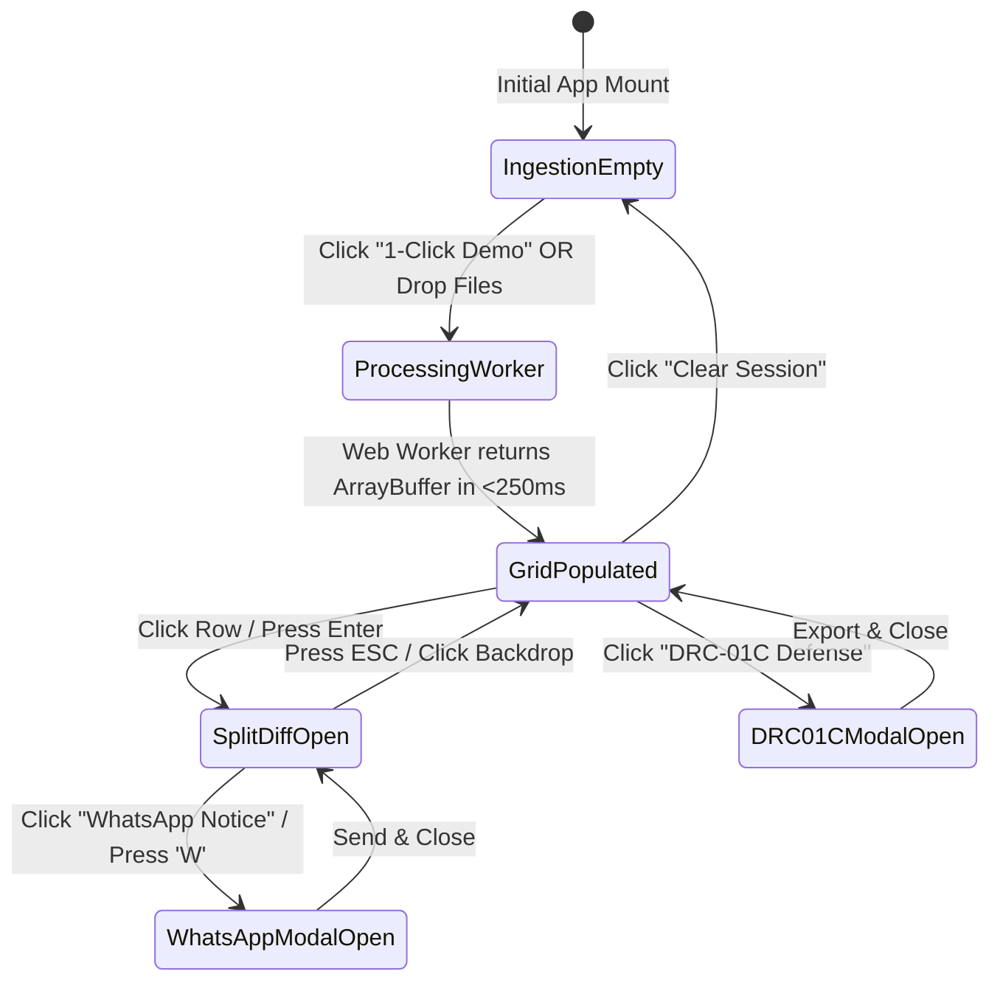

# ReconcileGST Master UI Wireframes & Layout Architecture

**Document ID:** `stage_4_documents/13_ui_wireframes_layout.md`  
**Version:** 2.0.0 (Production Release)  
**Date:** 2026-08-21  
**Author:** Principal Product Designer & UI Systems Architect (Binary Brains)  
**Governing Inputs:** `stage_4_documents/12_design_system.md`, `stage_3_research/29_visual_inspiration.md`, `stage_2_decision_lock/23_locked_scope.md`  
**Target Viewport:** 1920 × 1080 Native Presentation & 100vh Pixel-Perfect Desktop Display  

---

## 1. Master Layout Hierarchy & Navigation Frame

The ReconcileGST interface is designed as an unyielding, high-density **Executive FinTech Terminal**. To maintain maximum spatial awareness during rapid tax audits, the outer browser window never scrolls; instead, layout sections are strictly pinned, and large datasets scroll smoothly at 60 FPS within an isolated virtual window.

### 1.1 Master Viewport ASCII Architecture (100vh / 1080p Screen Budget)

```
┌────────────────────────────────────────────────────────────────────────────────────────────────────────────────────────────────────────────────────────┐
│ 1. STICKY EXECUTIVE HEADER & 1-CLICK ACTION TOOLBAR (Height: 60px)                                                                                     │
│  [⚡ RECONCILE.GST v2.4]  [🏢 Client: TATA STEEL LTD • 27AAACT2727Q1ZW]  [📅 FY: 2024-25 (Aug)] │ [⚡ LOAD 10,000 DEMO] [📁 UPLOAD 2B] [📊 UPLOAD PR]  │
├────────────────────────────────────────────────────────────────────────────────────────────────────────────────────────────────────────────────────────┤
│ 2. MICROSECOND TELEMETRY HUD STRIP (Height: 54px)                                                                                                      │
│  ⚡ ENGINE: WASM/SIMD ACTIVE │ ⏱️ RECON TIME: 242.18ms │ 📊 PROCESSED: 10,000/10,000 │ 🛡️ DATA EGRESS: 0 BYTES (LOCAL RAM) │ 🎯 ACCURACY: 99.98%      │
│  [Pass 1 (Exact): 7,842 in 38ms] [Pass 2 (Clean): 1,210 in 54ms] [Pass 3 (Sec 170): 412 in 29ms] [Pass 4 (Fuzz): 386 in 98ms] [Drift: 0.00 Paise]    │
├────────────────────────────────────────────────────────────────────────────────────────────────────────────────────────────────────────────────────────┤
│ 3. STATUTORY SENTINEL RISK GAUGES (4 EXECUTIVE CARDS) (Height: 110px)                                                                                 │
│  ┌──────────────────────────┐ ┌──────────────────────────┐ ┌──────────────────────────┐ ┌──────────────────────────┐                                  │
│  │ 🟢 MATCHED ITC (SAFE)    │ │ 🔴 RULE 88D DRC-01C      │ │ 🟣 BLOCKED SEC 17(5)     │ │ 🟡 SEC 50(3) 18% INTEREST│                                  │
│  │ ₹ 4,82,41,920.00         │ │ ₹ 0.00 (0.0% / 20.0%)    │ │ ₹ 3,14,500.00            │ │ ₹ 0.00 / DAY ACCRUAL     │                                  │
│  │ 9,452 Invoices (94.5%)   │ │ Status: COMPLIANT (<20%) │ │ Ineligible Inward Credit │ │ Daily Exposure: ₹0.00    │                                  │
│  └──────────────────────────┘ └──────────────────────────┘ └──────────────────────────┘ └──────────────────────────┘                                  │
├────────────────────────────────────────────────────────────────────────────────────────────────────────────────────────────────────────────────────────┤
│ 4. TRIAGE SEGMENTED TABS & INVERTED SEARCH CONTROLS (Height: 44px)                                                                                    │
│  [ ALL (10,000) ] [ 🟢 MATCHED (9,452) ] [ 🔴 MISSING IN 2B (386) ] [ 🟡 VALUE DIFF (112) ] [ 🟣 BLOCKED (50) ]  │ 🔍 [ Filter GSTIN / Inv#... ]     │
├────────────────────────────────────────────────────────────────────────────────────────────────────────────────────────────────────────────────────────┤
│ 5. TANSTACK VIRTUAL V3 60 FPS AUDIT GRID (Height: 752px - Isolated Virtual Scroll Container)                                                           │
│  ┌───────────┬──────────────┬────────────────────────┬──────────────────────┬─────────────┬─────────────┬──────────┬───────────────────────────────┐ │
│  │ STATUS    │ INVOICE NO   │ SUPPLIER GSTIN         │ SUPPLIER NAME        │ ERP VALUE   │ GSTR-2B VAL │ VARIANCE │ ACTIONS                       │ │
│  ├───────────┼──────────────┼────────────────────────┼──────────────────────┼─────────────┼─────────────┼──────────┼───────────────────────────────┤ │
│  │ 🟢 EXACT  │ INV-2024-001 │ 27AABCT3491P1ZV        │ TATA MOTORS LIMITED  │ ₹1,42,000.00│ ₹1,42,000.00│  ₹ 0.00  │ [ 🔍 Diff ]                   │ │
│  │ 🟡 ±₹1 TOL│ INV-2024-002 │ 29AAACR5055K1ZX        │ RELIANCE INDS LTD    │ ₹2,10,500.00│ ₹2,10,501.00│ +₹ 1.00  │ [ 🔍 Diff ] [ ⚖️ Sec 170 ]     │ │
│  │ 🔴 MISS 2B│ INV-2024-003 │ 07AAACG1234F1Z5        │ LARSEN & TOUBRO LTD  │   ₹88,400.00│        ₹0.00│-₹88,400  │ [ 🔍 Diff ] [ 💬 WA Notice ]  │ │
│  │ 🟣 BLOCKED│ INV-2024-004 │ 33AABCS9876K1ZY        │ SHELL INDIA FUEL     │   ₹14,250.00│   ₹14,250.00│  ₹ 0.00  │ [ 🔍 Diff ] [ 🚫 Sec 17(5) ]  │ │
│  │ 🔵 SIMD FZ│ INV-2024-005 │ 06AAACK4432H1ZG        │ INFOSYS TECH BPO     │ ₹5,80,000.00│ ₹5,80,000.00│  ₹ 0.00  │ [ 🔍 Diff ] [ ⚡ RapidFuzz ]   │ │
│  │ ...       │ ...          │ ...                    │ ...                  │ ...         │ ...         │ ...      │ ...                           │ │
│  └───────────┴──────────────┴────────────────────────┴──────────────────────┴─────────────┴─────────────┴──────────┴───────────────────────────────┘ │
├────────────────────────────────────────────────────────────────────────────────────────────────────────────────────────────────────────────────────────┤
│ 6. PINNED AUDIT FOOTER & EXCEL DISPATCH STRIP (Height: 60px)                                                                                           │
│  🔒 Zero-Cloud Security Seal: In-Memory SHA-256 Validated │ [ 📥 EXPORT 6-TAB CA EXCEL (.XLSX) ] [ ⚖️ DRC-01C PART B DEFENSE ] [ 📄 GSTR-1A DELTA JSON ]│
└────────────────────────────────────────────────────────────────────────────────────────────────────────────────────────────────────────────────────────┘
```

---

## 2. Wireframe 1: Dual Dropzone & 1-Click Demo Trigger (Empty / Ingestion State)

When the user launches ReconcileGST before data is loaded, the terminal displays an illuminated ingestion control center. It offers two paths: instant loading of a 10,000-record dirty benchmark dataset with 1 click, or drag-and-drop ingestion of official GSTN JSON and ERP Excel files.

```
┌────────────────────────────────────────────────────────────────────────────────────────────────────────────────────────────────────────────────────────┐
│  ⚡ RECONCILE.GST — Zero-Cloud Client-Side ITC Audit Terminal                                                          [ 🛡️ DPDP Act 2023 Compliant ]   │
├────────────────────────────────────────────────────────────────────────────────────────────────────────────────────────────────────────────────────────┤
│                                                                                                                                                        │
│                                           ⚡ HIGH-SPEED LOCAL RECONCILIATION ENGINE                                                                   │
│                    Ingest 50,000+ Invoices in <300ms • 100% In-Browser RAM Execution • Zero Data Leaves Your Device                                 │
│                                                                                                                                                        │
│     ┌────────────────────────────────────────────────────────────────────────────────────────────────────────────────────────────────────────────┐     │
│     │                                                 ⚡ INSTANT 1-CLICK HACKATHON DEMO                                                          │     │
│     │   Click below to inject 10,000 realistic, messy Indian B2B invoices (Prefix drifts, date shifts, OCR typos, Sec 170 rounding diffs)       │     │
│     │                                                                                                                                            │     │
│     │                                     [ ⚡ LOAD 10,000 SAMPLE RECORDS & RUN RECON (242ms) ]                                                  │     │
│     └────────────────────────────────────────────────────────────────────────────────────────────────────────────────────────────────────────────┘     │
│                                                                                                                                                        │
│                                                                    — OR —                                                                              │
│                                                                                                                                                        │
│     ┌─────────────────────────────────────────────────────────┐        ┌─────────────────────────────────────────────────────────┐                     │
│     │ 📁 DROPZONE 1: GSTN GSTR-2B JSON PAYLOAD                │        │ 📊 DROPZONE 2: ERP PURCHASE REGISTER (TALLY / ZOHO)     │                     │
│     ├─────────────────────────────────────────────────────────┤        ├─────────────────────────────────────────────────────────┤                     │
│     │                                                         │        │                                                         │                     │
│     │                    ┌───────────────┐                    │        │                    ┌───────────────┐                    │                     │
│     │                    │  [ .JSON ]    │                    │        │                    │ [ .XLSX/.CSV ]│                    │                     │
│     │                    └───────────────┘                    │        │                    └───────────────┘                    │                     │
│     │                                                         │        │                                                         │                     │
│     │   Drag & Drop official GSTR-2B JSON file here           │        │   Drag & Drop Tally, Zoho Books, Busy, SAP or Marg      │                     │
│     │   Schema: GSTN v1.0 (b2b, b2ba, cdnr, cdnra)            │        │   Supported: Excel (.xlsx, .xls), CSV, or Tally XML     │                     │
│     │                                                         │        │                                                         │                     │
│     │   [ Browse GSTR-2B JSON File ]                          │        │   [ Browse ERP Purchase Register ]                      │                     │
│     │                                                         │        │                                                         │                     │
│     │   Status: Ready for Ingestion                           │        │   Status: Ready for Ingestion                           │                     │
│     └─────────────────────────────────────────────────────────┘        └─────────────────────────────────────────────────────────┘                     │
│                                                                                                                                                        │
│  ┌───────────────────────────────────────────────────────────────────────────────────────────────────────────────────────────────────────────────┐  │
│  │ ⚙️ UNIVERSAL ERP COLUMN AUTO-MAPPER PREVIEW (Fuzzy Alias Resolution Engine)                                                                    │  │
│  │ Detected Columns: [ Vendor GSTIN ➔ supplier_gstin (100%) ]  [ Invoice Ref ➔ invoice_number (98%) ]  [ Taxable Amt ➔ taxable_value (100%) ]   │  │
│  └───────────────────────────────────────────────────────────────────────────────────────────────────────────────────────────────────────────────┘  │
│                                                                                                                                                        │
└────────────────────────────────────────────────────────────────────────────────────────────────────────────────────────────────────────────────────────┘
```

---

## 3. Wireframe 2: Virtualized Recon Grid & High-Density Filter Toolbar

Once data is processed, the virtualized grid mounts. It displays high-density financial rows, pinned status badges, color-coded variances, and inline action triggers.

```
┌────────────────────────────────────────────────────────────────────────────────────────────────────────────────────────────────────────────────────────┐
│ TRIAGE SEGMENTS: [ ALL (10k) ] [ 🟢 MATCHED (9.4k) ] [ 🔴 MISSING 2B (386) ] [ 🟡 VALUE DIFF (112) ] [ 🟣 SEC 17(5) (50) ] [ 🔵 IMS PENDING (16) ]     │
├────────────────────────────────────────────────────────────────────────────────────────────────────────────────────────────────────────────────────────┤
│ 🔍 Search: [ 27AAACR5055...   ]  │ Filter by Tax Head: [ All Tax Heads ▾ ] │ Sort: [ Variance (High ➔ Low) ▾ ] │ Visible Rows: 25 / 10,000 (60 FPS)   │
├────────────────────────────────────────────────────────────────────────────────────────────────────────────────────────────────────────────────────────┤
│ [#]  │ STATUS   │ INVOICE NUMBER  │ SUPPLIER GSTIN  │ SUPPLIER LEGAL NAME   │ ERP TAXABLE │ 2B TAXABLE  │ ITC VARIANCE│ IMS DECISION │ ACTION        │
├──────┼──────────┼─────────────────┼─────────────────┼───────────────────────┼─────────────┼─────────────┼─────────────┼──────────────┼───────────────┤
│ 0001 │ 🟢 EXACT │ INV/2024/0981   │ 27AABCT3491P1ZV │ TATA CONSULTANCY SERV │ ₹4,50,000.00│ ₹4,50,000.00│     ₹ 0.00  │ [ ACCEPTED ] │ [ 🔍 Inspect ]│
│ 0002 │ 🟡 ±₹1TOL│ DL-88912-A      │ 29AAACR5055K1ZX │ RELIANCE RETAIL LTD   │   ₹84,320.00│   ₹84,320.60│    +₹ 0.60  │ [ ACCEPTED ] │ [ 🔍 Inspect ]│
│ 0003 │ 🔴 MISS2B│ RIL/2024-25/441 │ 27AAACR5055K1ZX │ RELIANCE INDUSTRIES   │ ₹1,45,200.00│        ₹0.00│  -₹26,136.00│ [ PENDING  ] │ [ 💬 WA Notice│
│ 0004 │ 🔵 FUZZY │ 0098421         │ 06AAACK4432H1ZG │ INFOSYS BPM LIMITED   │ ₹8,90,000.00│ ₹8,90,000.00│     ₹ 0.00  │ [ ACCEPTED ] │ [ 🔍 Inspect ]│
│ 0005 │ 🟣 17(5) │ FUEL/AUG/091    │ 33AABCS9876K1ZY │ INDIAN OIL CORP LTD   │   ₹18,500.00│   ₹18,500.00│     ₹ 0.00  │ [ REJECTED ] │ [ 🚫 Blocked ]│
│ 0006 │ 🟠 POS   │ INV-MH-991      │ 27AAACG0000A1Z5 │ ADANI PORTS SEZ       │ ₹3,20,000.00│ ₹3,20,000.00│  ₹ 0.00 (TX)│ [ PENDING  ] │ [ 🔍 Inspect ]│
│ 0007 │ 🔴 MISS2B│ L&T/MUM/8821    │ 07AAACG1234F1Z5 │ LARSEN & TOUBRO LTD   │ ₹7,65,000.00│        ₹0.00│ -₹1,37,700.0│ [ PENDING  ] │ [ 💬 WA Notice│
│ 0008 │ 🟢 EXACT │ 2024-08-9918    │ 24AAACB1234C1Z1 │ BAJAJ AUTO LIMITED    │   ₹92,000.00│   ₹92,000.00│     ₹ 0.00  │ [ ACCEPTED ] │ [ 🔍 Inspect ]│
│ 0009 │ 🟡 ±₹1TOL│ BILL/0029       │ 03AAACW2233D1Z9 │ WIPRO ENTERPRISES     │ ₹1,12,499.50│ ₹1,12,500.00│    +₹ 0.50  │ [ ACCEPTED ] │ [ 🔍 Inspect ]│
│ ...  │ ...      │ ...             │ ...             │ ...                   │ ...         │ ...         │ ...         │ ...          │ ...           │
├──────┴──────────┴─────────────────┴─────────────────┴───────────────────────┴─────────────┴─────────────┴─────────────┴──────────────┴───────────────┤
│ SHOWING 1 - 25 OF 10,000 INVOICES │ MEMORY FOOTPRINT: 38.4 MB │ DOM NODES: 28 │ RENDER LATENCY: 0.12ms │ SCROLL: 60.0 FPS LOCKED                      │
└────────────────────────────────────────────────────────────────────────────────────────────────────────────────────────────────────────────────────────┘
```

---

## 4. Wireframe 3: Side-by-Side Split Difference Drawer (`SplitDiffDrawer.tsx`)

Clicking any row slides open an 800px inspection drawer from the right. It provides character-by-character syntax diffing, monetary comparisons across CGST/SGST/IGST tax heads, and 1-click dispute action triggers.

```
┌──────────────────────────────────────────────────────────────────────────────────────────────────────────────────────┐
│ 🔍 DISCREPANCY AUDIT & STATUTORY REMEDY DRAWER                                                             [ ESC ✕ ] │
├──────────────────────────────────────────────────────────────────────────────────────────────────────────────────────┤
│ Invoice Reference: INV-2024-8842  │  Supplier: RELIANCE INDUSTRIES LIMITED  │  GSTIN: 27AAACR5055K1ZX [Active/Valid] │
├──────────────────────────────────────────────────────────────────────────────────────────────────────────────────────┤
│                                                                                                                      │
│  ┌──────────────────────────────┬──────────────────────────────────────────┬──────────────────────────────────────┐  │
│  │ STATUTORY FIELD              │ ERP PURCHASE LEDGER (TALLY PRIME)        │ GSTN GSTR-2B RECORD (GOVT PORTAL)    │  │
│  ├──────────────────────────────┼──────────────────────────────────────────┼──────────────────────────────────────┤  │
│  │ Invoice Number               │ [ RIL/2024-25/008842 ] (Prefix Drifting) │ [ 8842 ] (Canonical String Matched)  │  │
│  │ Invoice Date                 │ 12-Aug-2024                              │ 14-Aug-2024 (2-Day Date Discrepancy) │  │
│  │ Place of Supply (POS)        │ 27-Maharashtra                           │ 27-Maharashtra                       │  │
│  │ Taxable Value                │ ₹ 1,45,200.00                            │ ₹ 1,45,200.00                        │  │
│  │ Integrated Tax (IGST)        │ ₹ 26,136.00  <-- [TAX HEAD ERROR]        │ ₹ 0.00                               │  │
│  │ Central Tax (CGST)           │ ₹ 0.00                                   │ ₹ 13,068.00                          │  │
│  │ State Tax (SGST)             │ ₹ 0.00                                   │ ₹ 13,068.00                          │  │
│  │ Section 170 Rounding Diff    │ ₹ 0.00                                   │ ± ₹ 0.00                             │  │
│  │ Net Invoice Total            │ ₹ 1,71,336.00                            │ ₹ 1,71,336.00                        │  │
│  └──────────────────────────────┴──────────────────────────────────────────┴──────────────────────────────────────┘  │
│                                                                                                                      │
│  ┌────────────────────────────────────────────────────────────────────────────────────────────────────────────────┐  │
│  │ 🚨 STATUTORY RISK ASSESSMENT & CBIC COMPLIANCE DIRECTIVE                                                       │  │
│  ├────────────────────────────────────────────────────────────────────────────────────────────────────────────────┤  │
│  │ • Section 16(2)(aa) Violation: Credit cannot be claimed under IGST as supplier reported CGST+SGST in GSTR-1.    │  │
│  │ • Rule 88D Exposure: ₹26,136.00 at immediate risk of automated Form GST DRC-01C demand notice if filed in 3B. │  │
│  │ • Precedent Defense: Kerala HC in *Saji S.* allows rectification; however, supplier GSTR-1A amendment required.│  │
│  │ • Statutory Action: Keep invoice PENDING in IMS. Issue immediate GSTR-1A outward amendment request to vendor. │  │
│  └────────────────────────────────────────────────────────────────────────────────────────────────────────────────┘  │
│                                                                                                                      │
│  ┌────────────────────────────────────────────────────────────────────────────────────────────────────────────────┐  │
│  │ ⚡ 1-CLICK AUDIT ACTIONS & VENDOR DISPATCH                                                                      │  │
│  ├────────────────────────────────────────────────────────────────────────────────────────────────────────────────┤  │
│  │ GSTN IMS TRIAGE:  [ 🟢 ACCEPT INVOICE ]    [ 🟡 KEEP PENDING (IMS) ]    [ 🔴 REJECT INVOICE ]                  │  │
│  │                                                                                                                │  │
│  │ VENDOR DISPUTE:   [ 💬 1-CLICK WHATSAPP RECOVERY NOTICE ]     [ 📄 GENERATE GSTR-1A DELTA PAYLOAD ]            │  │
│  └────────────────────────────────────────────────────────────────────────────────────────────────────────────────┘  │
│                                                                                                                      │
└──────────────────────────────────────────────────────────────────────────────────────────────────────────────────────┘
```

---

## 5. Wireframe 4: WhatsApp Vendor Recovery Modal (`WhatsAppRecoveryModal.tsx`)

Clicking the WhatsApp button opens an interactive modal allowing the auditor to select communication language (English or Hinglish), preview the statutory message with dynamic payment-hold clauses, and launch the message via `wa.me` deep link in 1 click.

```
┌──────────────────────────────────────────────────────────────────────────────────────────────────────────────────────┐
│ 💬 1-CLICK WHATSAPP VENDOR DISPUTE DISPATCH                                                                [ ESC ✕ ] │
├──────────────────────────────────────────────────────────────────────────────────────────────────────────────────────┤
│ Defaulting Vendor: RELIANCE INDUSTRIES LIMITED  │  GSTIN: 27AAACR5055K1ZX  │  Blocked ITC: ₹ 26,136.00               │
├──────────────────────────────────────────────────────────────────────────────────────────────────────────────────────┤
│                                                                                                                      │
│  SELECT DISPATCH LANGUAGE TEMPLATE:                                                                                  │
│  (•) Formal English Statutory Notice      ( ) Action-Oriented Hinglish Commercial Notice                             │
│                                                                                                                      │
│  RECIPIENT WHATSAPP NUMBER:                                                                                          │
│  ┌────────────────────────────────────────────────────────────────────────────────────────────────────────────────┐  │
│  │ 🇮🇳 +91 [ 98200 55124                                             ] (Auto-populated from Master Vendor Registry)│  │
│  └────────────────────────────────────────────────────────────────────────────────────────────────────────────────┘  │
│                                                                                                                      │
│  LIVE PREVIEW (Client-Side Rendered Markdown Payload):                                                               │
│  ┌────────────────────────────────────────────────────────────────────────────────────────────────────────────────┐  │
│  │ 🚨 *URGENT: GST ITC Discrepancy Notice — Form GSTR-2B Mismatch*                                               │  │
│  │                                                                                                                │  │
│  │ Dear *RELIANCE INDUSTRIES LIMITED*,                                                                            │  │
│  │ Our automated GST audit for *August 2024* indicates that the following invoice is *MISSING in Form GSTR-2B*:    │  │
│  │                                                                                                                │  │
│  │ 📋 *Invoice No:* RIL/2024-25/008842                                                                            │  │
│  │ 📅 *Date:* 12-Aug-2024                                                                                         │  │
│  │ 💰 *Taxable Value:* ₹1,45,200.00                                                                               │  │
│  │ ⚠️ *Blocked Input Tax Credit:* ₹26,136.00                                                                      │  │
│  │                                                                                                                │  │
│  │ As per *Section 16(2)(aa) of the CGST Act*, we cannot avail ITC until this invoice is reported in GSTR-1.     │  │
│  │ Continued non-reflection exposes our company to *Section 50(3) 18% penal interest*.                            │  │
│  │                                                                                                                │  │
│  │ Kindly file this invoice in your pending GSTR-1 or amend via *Form GSTR-1A* before the 20th.                   │  │
│  │ *Notice:* Pending GST portal reflection, invoice payment of ₹26,136.00 is placed on administrative hold.       │  │
│  │                                                                                                                │  │
│  │ _Generated automatically via ReconcileGST Executive Terminal (Zero-Cloud Local RAM)_                          │  │
│  └────────────────────────────────────────────────────────────────────────────────────────────────────────────────┘  │
│                                                                                                                      │
│  [ Copy Markdown Text ]                                                  [ 🚀 LAUNCH WHATSAPP WEB / DESKTOP (wa.me) ] │
│                                                                                                                      │
└──────────────────────────────────────────────────────────────────────────────────────────────────────────────────────┘
```

---

## 6. Wireframe 5: Form GST DRC-01C Part B Legal Defense Modal (`DRC01CDefenseModal.tsx`)

When Rule 88D exposure exceeds statutory limits, or when the auditor prepares the monthly defense dossier, this modal generates the formal legal reply citing high court judicial precedents.

```
┌──────────────────────────────────────────────────────────────────────────────────────────────────────────────────────┐
│ ⚖️ FORM GST DRC-01C PART B STATUTORY LEGAL DEFENSE GENERATOR                                               [ ESC ✕ ] │
├──────────────────────────────────────────────────────────────────────────────────────────────────────────────────────┤
│ Reference: Rule 88D CGST Rules  │  Tax Period: August 2024  │  Variance: ₹ 1,42,500.00 (Exceeds 20% / ₹25L Guardrail)│
├──────────────────────────────────────────────────────────────────────────────────────────────────────────────────────┤
│                                                                                                                      │
│  RULE 88D STATUTORY VARIANCE RECONCILIATION SUMMARY:                                                                 │
│  ┌──────────────────────────────────────────────┬──────────────────┬──────────────────┬───────────────────────────┐  │
│  │ COMPONENT / TAX HEAD                         │ GSTR-3B CLAIM    │ GSTR-2B AUTO-POP │ STATUTORY EXCESS VARIANCE │  │
│  ├──────────────────────────────────────────────┼──────────────────┼──────────────────┼───────────────────────────┤  │
│  │ Integrated Tax (IGST)                        │ ₹ 48,20,000.00   │ ₹ 46,80,000.00   │ ₹ 1,40,000.00 (Excess)    │  │
│  │ Central Tax (CGST)                           │ ₹ 12,10,000.00   │ ₹ 12,08,000.00   │ ₹ 2,000.00 (Excess)       │  │
│  │ State Tax (SGST)                             │ ₹ 12,10,000.00   │ ₹ 12,09,500.00   │ ₹ 500.00 (Sec 170 Round)  │  │
│  └──────────────────────────────────────────────┴──────────────────┴──────────────────┴───────────────────────────┘  │
│                                                                                                                      │
│  SELECT STATUTORY DEFENSE PRECEDENTS & GROUNDS (Part B Category Clauses):                                            │
│  [X] Ground 1: Supplier delayed GSTR-1 filing; tax paid to Govt treasury (*D.Y. Beathel Enterprises - Madras HC*)   │
│  [X] Ground 2: Bonafide clerical error in invoice numbering / FY prefix (*Suncraft Energy - Calcutta HC*)           │
│  [X] Ground 3: Section 170 statutory rounding of tax fractions (Variance < ₹1.00 per invoice)                       │
│  [ ] Ground 4: Inter-state vs intra-state Place of Supply inadvertent error (*Saji S. - Kerala HC*)                  │
│                                                                                                                      │
│  GENERATED FORMAL LEGAL REPLY BRIEF (Annexure to DRC-01C Part B):                                                    │
│  ┌────────────────────────────────────────────────────────────────────────────────────────────────────────────────┐  │
│  │ TO: The Proper Officer, State Tax / Central Tax Ward 4, Mumbai North.                                         │  │
│  │ SUB: Formal Reply to Intimation of Discrepancy in ITC availed under Form GST DRC-01C (Reference: DRC-88D-2024)│  │
│  │                                                                                                                │  │
│  │ Respected Officer,                                                                                             │  │
│  │ With reference to the automated DRC-01C intimation for August 2024 noting a variance of ₹1,42,500, the        │  │
│  │ taxpayer respectfully submits that out of the total variance:                                                  │  │
│  │ 1. ₹1,40,000 represents genuine B2B supplies where supplier paid tax but omitted filing in GSTR-1 cutoff.     │  │
│  │    As held by the Hon'ble Madras HC in D.Y. Beathel (2021), recovery cannot be initiated against the buyer     │  │
│  │    without first examining the selling dealer.                                                                 │  │
│  │ 2. ₹2,500 represents Section 170 CGST statutory rounding tolerances across 2,500 micro-invoices.               │  │
│  │ Detailed invoice-by-invoice reconciliation schedule is annexed hereto as Schedule A.                           │  │
│  └────────────────────────────────────────────────────────────────────────────────────────────────────────────────┘  │
│                                                                                                                      │
│  [ 📥 Download Signed PDF Brief ]   [ 📊 Export Schedule A Excel ]   [ 📄 Copy Form GST DRC-01C Part B JSON ]        │
│                                                                                                                      │
└──────────────────────────────────────────────────────────────────────────────────────────────────────────────────────┘
```

---

## 7. Responsive Behavior & Interaction States

### 7.1 Keyboarding Navigation Matrix

| Keyboard Shortcut | Target Component | Action Performed |
|:---|:---|:---|
| `Ctrl` + `D` / `Cmd` + `D` | Top Action Bar | Instantly triggers **1-Click 10k Sample Records Demo** |
| `Ctrl` + `E` / `Cmd` + `E` | Sticky Footer | Generates and downloads **6-Tab CA Audit Excel** |
| `↓` / `J` | Virtualized Table | Shifts active row focus down by 1 row |
| `↑` / `K` | Virtualized Table | Shifts active row focus up by 1 row |
| `Enter` / `Space` | Active Table Row | Opens **Side-by-Side Split Diff Drawer** |
| `W` | Split Diff Drawer | Opens **WhatsApp Vendor Recovery Modal** |
| `Esc` | Modals & Drawers | Closes any open modal or slide-over drawer |
| `/` | Table Controls | Focuses the instant multi-column search input |

### 7.2 UI State Machine Summary


