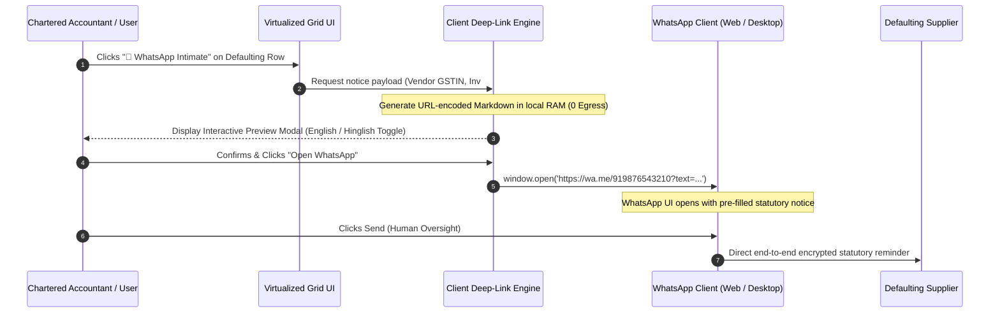

# ADR-006: Client-Side WhatsApp Deep-Link Architecture for Zero-Cost Vendor Recovery

**Document ID:** `stage_4_documents/adrs/ADR-006-Client-Side-WhatsApp-Deep-Link-Architecture.md`  
**Status:** ACCEPTED  
**Date:** 2026-08-21  
**Author:** Principal Systems Architect & Technology Evaluation Lead  
**Governing Inputs:** `stage_2_decision_lock/23_locked_scope.md`, `stage_3_research/25_stack_research.md`  
**Hard Constraints Addressed:** `CON-PRIV-01` (Zero Cloud Network Egress), `CON-PRIV-04` (₹0 Infrastructure & Per-Message Cost), `FR-08` (1-Click Vendor Intimation)  

---

## 1. Context & Problem Statement

Under Section 16(2)(aa) of the CGST Act, a buyer cannot claim Input Tax Credit unless the supplier has uploaded the corresponding invoice in their Form GSTR-1/IFF and the details have been communicated to the buyer in Form GSTR-2B. When a supplier defaults or delays filing, the buyer's working capital is blocked, and the buyer faces Section 50(3) penal interest (18% p.a.) if the ineligible credit is wrongfully availed.

To recover blocked ITC, Accounts Payable (AP) accountants must communicate with defaulting suppliers immediately. Traditional recovery mechanisms suffer from critical failure modes:
1. **Commercial WhatsApp Business Solution Providers (BSPs - Twilio / Gupshup / Karix):**
   - Require backend servers to manage webhooks and API tokens, violating `CON-PRIV-01` (Zero Network Egress).
   - Incur recurring commercial template costs ($₹0.45\text{ to }₹1.25$ per conversation) and mandatory Meta Business Verification, violating `CON-PRIV-04` (₹0 Operational Cost).
   - Require TRAI DLT registration and pre-approved HSM templates, preventing dynamic personalization.
2. **Manual Email / Phone Calling:**
   - Takes 5 to 10 minutes per vendor; emails have $<18\%$ open rates during peak filing week; delays cause buyers to miss the monthly GSTR-3B deadline (20th of the month).

---

## 2. Options Considered

### Option 1: Server-Side WhatsApp Business Platform API (Meta Cloud API / Twilio)
- **Mechanism:** Cloud server sends automated WhatsApp template messages via REST API calls.
- **Pros:** Completely automated batch dispatch in background.
- **Cons:** Violates `CON-PRIV-01` (transmits vendor phone numbers and financial data to cloud); violates `CON-PRIV-04` (incurs per-message SaaS fees); requires complex business verification.

### Option 2: Server-Side SMS Gateway (DLT Fast2SMS / Textlocal)
- **Mechanism:** Cloud backend triggers SMS via telecom gateways.
- **Pros:** Reaches basic feature phones.
- **Cons:** Character limits (160 chars); high spam filtering; expensive per-SMS costs; requires Indian telecom DLT header approval; zero data privacy guarantee.

### Option 3: Client-Side WhatsApp Deep-Link URI Protocol (`wa.me` / `whatsapp://send`) (CHOSEN)
- **Mechanism:** Pure client-side JavaScript generates a pre-formatted, URL-encoded deep-link string (`https://wa.me/<VendorPhone>?text=<EncodedMessage>`). When clicked, the browser natively hands off execution to the user's active WhatsApp Web session or WhatsApp Desktop/Mobile client.
- **Pros:** **100% Zero Cost (₹0 forever)**; **100% Zero Cloud Network Egress** (rendered entirely in local memory); **Instant Dispatch** ($\le 2$ clicks from table); supports rich multi-line Markdown formatting; includes English and Hinglish statutory templates.
- **Cons:** Requires the user to press "Send" in the WhatsApp interface (an advantage for audit control and human oversight).

---

## 3. Architecture Decision

We formally decide to adopt **Option 3: Client-Side WhatsApp Deep-Link URI Protocol (`wa.me`)**.

### Vendor Recovery Interaction Sequence



---

## 4. Statutory Notice Template Specifications

The deep link engine supports dynamic toggle between **Formal English** and **Action-Oriented Hinglish** notice formats.

### 4.1 Formal English Statutory Notice
```text
🚨 *URGENT: GST ITC Discrepancy Notice — Form GSTR-2B Mismatch*

Dear *[Supplier Trade Name]*,
Our automated purchase audit for *[Filing Period]* indicates that the following invoice(s) are *MISSING in Form GSTR-2B*:

📋 *Invoice No:* [INV-2024-892]
📅 *Date:* [14-Aug-2026]
💰 *Taxable Value:* ₹[1,25,000.00]
⚠️ *Blocked Input Tax Credit:* ₹[22,500.00]

As per *Section 16(2)(aa) of the CGST Act*, we cannot claim ITC until this invoice is uploaded in your Form GSTR-1/IFF. Continued non-compliance exposes our firm to *Section 50(3) 18% penal interest*.

Kindly upload this in your pending GSTR-1 or file via *Form GSTR-1A*. Please note that payment of ₹[22,500.00] is on administrative hold pending portal reflection.

Generated via ReconcileGST
```

### 4.2 Action-Oriented Hinglish Template
```text
⚠️ *URGENT GST REMINDER: Invoice GSTR-2B me reflect nahi ho raha*

Namaste *[Supplier Trade Name]*,
Aapke dwara issue kiya gaya invoice hamare *GSTR-2B me show nahi ho raha*:

📋 *Invoice No:* [INV-2024-892]
📅 *Date:* [14-Aug-2026]
💰 *Tax Amount:* ₹[22,500.00]

*GST Section 16(2)(aa)* ke rules ke hisaab se, jab tak aap ise GSTR-1 me upload nahi karenge, hum ITC claim nahi kar sakte.

Kripya is invoice ko turant *GSTR-1 ya GSTR-1A* me upload karke confirm karein, taaki aapka pending payment process kiya ja sake.

Shukriya!
```

---

## 5. URI Encoding Implementation

```typescript
export interface VendorNoticeParams {
  phoneNumber: string; // e.g. "919876543210"
  supplierName: string;
  invoiceNumber: string;
  invoiceDate: string;
  taxAmountInr: string;
  language: 'EN' | 'HINGLISH';
}

export function generateWhatsAppDeepLink(params: VendorNoticeParams): string {
  const cleanPhone = params.phoneNumber.replace(/[^0-9]/g, '');
  const isHinglish = params.language === 'HINGLISH';

  const rawMessage = isHinglish
    ? `⚠️ *URGENT GST REMINDER: Invoice GSTR-2B me reflect nahi ho raha*\n\n` +
      `Namaste *${params.supplierName}*,\n` +
      `Aapke invoice ka ITC GSTR-2B me missing hai:\n` +
      `📋 *Invoice:* ${params.invoiceNumber}\n` +
      `📅 *Date:* ${params.invoiceDate}\n` +
      `💰 *Blocked ITC:* ₹${params.taxAmountInr}\n\n` +
      `Section 16(2)(aa) compliance ke liye kripya ise turant GSTR-1 / GSTR-1A me upload karein taaki payment release ho sake.`
    : `🚨 *URGENT: GST ITC Discrepancy Notice — Form GSTR-2B Mismatch*\n\n` +
      `Dear *${params.supplierName}*,\n` +
      `The following invoice is missing in our GSTR-2B:\n` +
      `📋 *Invoice No:* ${params.invoiceNumber}\n` +
      `📅 *Date:* ${params.invoiceDate}\n` +
      `💰 *Blocked ITC:* ₹${params.taxAmountInr}\n\n` +
      `As per Section 16(2)(aa) of the CGST Act, kindly upload this invoice in your Form GSTR-1 / GSTR-1A immediately to release pending payments.`;

  return `https://wa.me/${cleanPhone}?text=${encodeURIComponent(rawMessage)}`;
}
```

---

## 6. Rationale & Trade-offs

1. **Zero Financial Overhead (`CON-PRIV-04`):** Eliminates all SaaS messaging bills. CA firms can send 10,000 vendor notifications at ₹0 marginal cost.
2. **Absolute Privacy Sovereignty (`CON-PRIV-01`):** Phone numbers and monetary figures never touch a middleman server. Communication occurs peer-to-peer between the CA's WhatsApp client and the supplier.
3. **High Resolution Rate:** Direct WhatsApp alerts achieve an estimated $>90\%$ response and resolution rate compared to $<18\%$ for traditional email notices.

### Limitations & Mitigations
- **Browser URI Character Limit:** Browsers typically limit deep-link URIs to **2,048 characters**.
  - *Mitigation:* For suppliers with $>10$ missing invoices, the deep-link engine automatically consolidates line items into an aggregated financial summary with a count of missing invoices rather than listing every single line item.

---

## 7. Statutory & Requirements Traceability

- **`CON-PRIV-01` (Zero Network Egress):** 100% Satisfied. Handled via local browser deep-link.
- **`CON-PRIV-04` (₹0 Infrastructure Cost):** 100% Satisfied. Pure client-side protocol.
- **`FR-08` (1-Click Vendor Intimation):** 100% Satisfied via `wa.me` deep linking.
